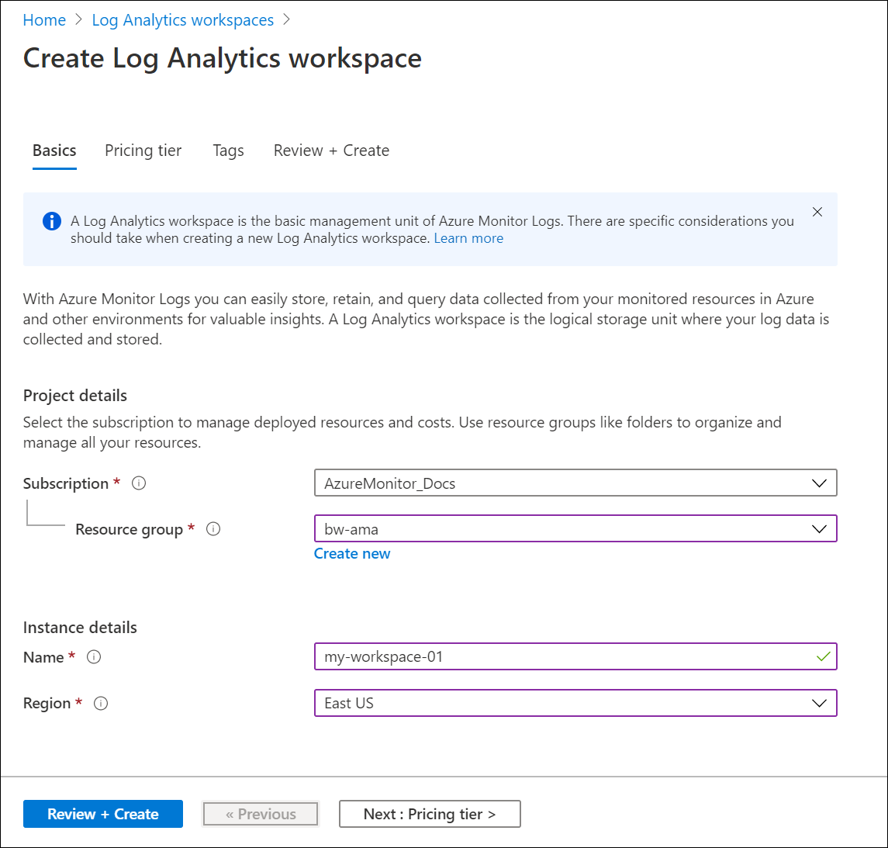
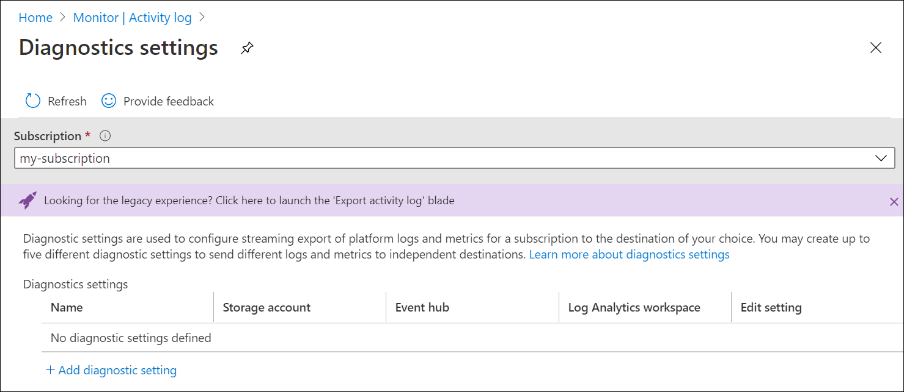
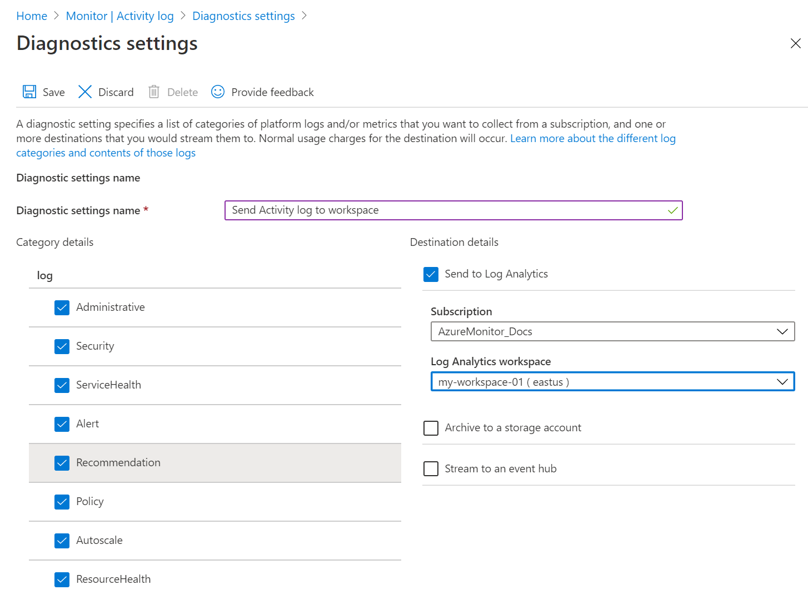

# Send Azure Activity log to Log Analytics workspace using Azure portal
The Activity log is a platform log in Azure that provides insight into subscription-level events. This includes such information as when a resource is modified or when a virtual machine is started. You can view the Activity log in the Azure portal or retrieve entries with PowerShell and CLI. This quickstart shows how to use the Azure portal to create a Log Analytics workspace and a diagnostic setting to send the Activity log to Azure Monitor Logs where you can analyze it using [log queries](../log-query/log-query-overview.md) and enable other features such as [log alerts](../platform/alerts-log-query.md) and [workbooks](../platform/workbooks-overview.md). 

## Sign in to Azure portal
Sign in to the Azure portal at [https://portal.azure.com](https://portal.azure.com). 

## Create a Log Analytics workspace
In the Azure portal, search for and then select **Log Analytics workspaces**. 

  
Click **Add**, and then provide values for the **Resource group**, workspace **Name**, and **Location**. The workspace name must be unique across all Azure subscriptions.

Click **Review + create** to review the settings and then **Create** to create the workspace. This will select a default pricing tier of **Pay-as-you-go** which will not incur any changes until you start collecting a sufficient amount of data. There is no charge for collecting the Activity log.

## Create diagnostic setting
In the Azure portal, search for and then select **Monitor**. 

Select **Activity log**. You should see recent events for the current subscription. Click **Diagnostic settings** to view diagnostic settings for the subscription.

Click **Add diagnostic setting** to create a new setting. 

Type in a name such as *Send Activity log to workspace*. Select each of the categories. Select **Send to Log Analytics** as the only destination and then specify the workspace that you created. Click **Save** to create the diagnostic setting and then close the page.

## Generate log data
Only new Activity log entries will be sent to the Log Analytics workspace, so perform some actions in your subscription that will be logged such as starting or stopping a virtual machine or creating or modifying another resource. You may need to wait a few minutes for the diagnostic setting to be created and for data to initially be written to the workspace. After this delay, all events written to the Activity log will be sent to the workspace within a few seconds.

## Retrieve data with a log query

Select **Logs** in the **Azure Monitor** menu. Close the **Example queries** page. If the scope isn't set to the workspace you created, then click **Select scope** and locate it.

In the query window, type `AzureActivity` and click **Run**. This is a simple query that returns all records in the *AzureActivity* table, which contains all the records sent from the Activity log.

Expand one of the records to view its detailed properties.

Try a more complex query such as `AzureActivity | summarize count() by CategoryValue` which gives a count of events summarized by category.

## Next steps
In this quickstart, you configured the Activity log to be sent to a Log Analytics workspace. You can now configure other data to be collected into the workspace where you can analyze it together using [log queries](../log-query/log-query-overview.md) in Azure Monitor and leverage features such as [log alerts](../platform/alerts-log-query.md) and [workbooks](../platform/workbooks-overview.md). You should next gather [resource logs](../platform/resource-logs.md) from your Azure resources which compliment the data in the Activity log providing insight into the operations that were performed within each resource.

> [!div class="nextstepaction"]
> [Collect and analyze resource logs with Azure Monitor](tutorial-resource-logs.md)
