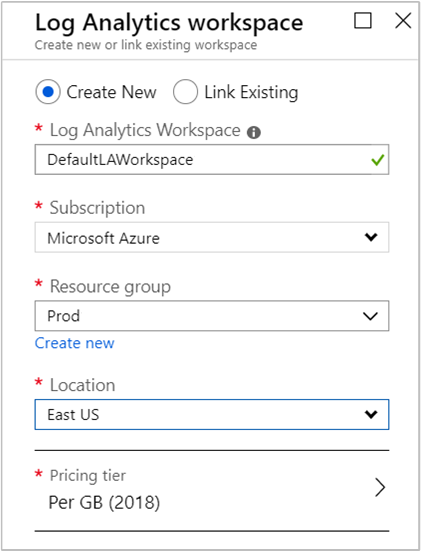
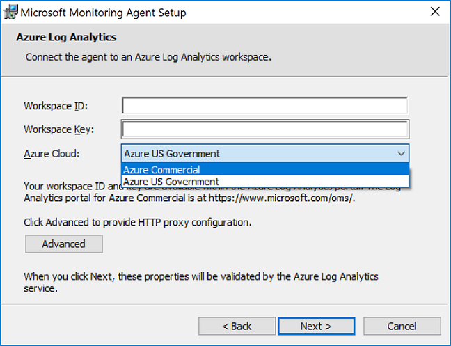
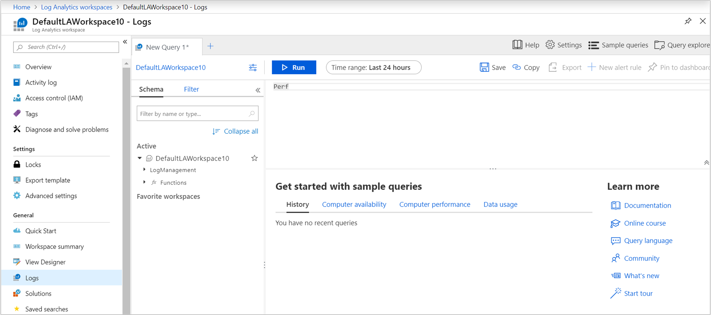
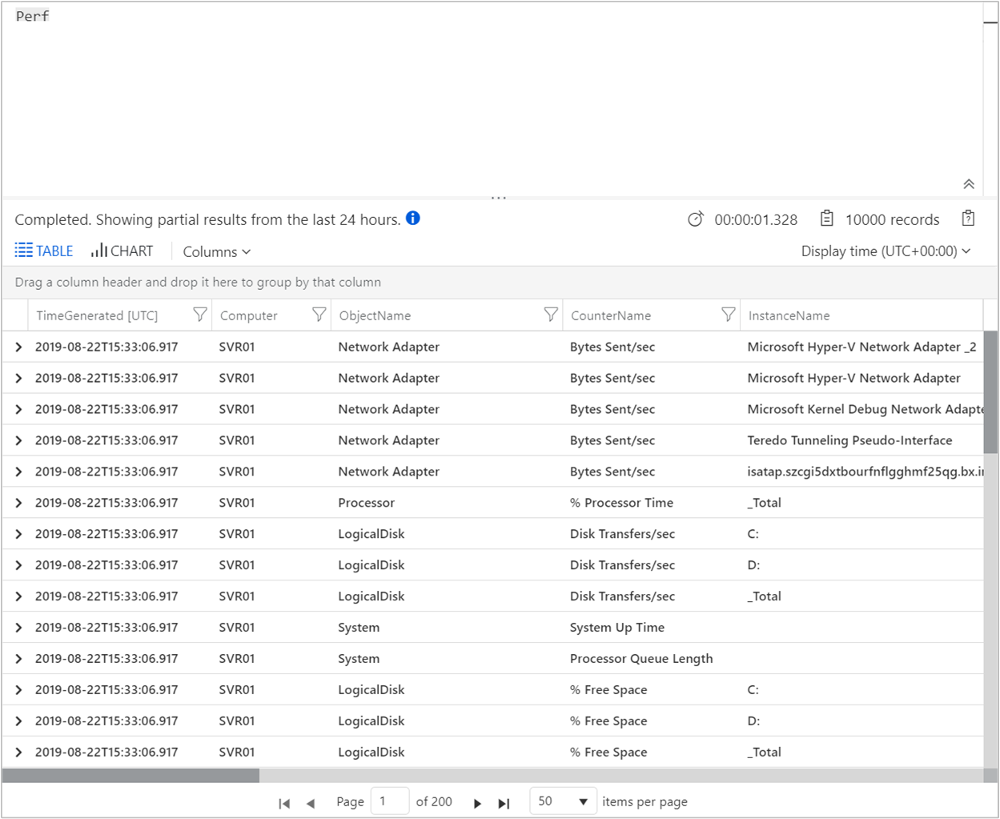
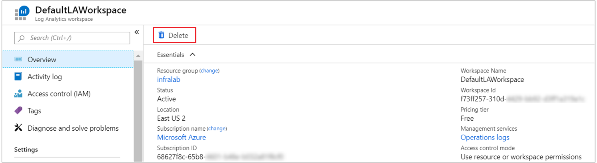

# Collect data from a Windows computer in a hybrid environment with Azure Monitor

[Azure Monitor](../overview.md) can collect data directly from your your physical or virtual Windows computers in your environment into a Log Analytics workspace for detailed analysis and correlation. Installing the [Log Analytics agent](../platform/log-analytics-agent.md) allows Azure Monitor to collect data from a datacenter or other cloud environment. This quickstart shows you how to configure and collect data from your Windows computer with a few easy steps. For information about Azure Windows VMs, see [Collect data about Azure virtual machines](../../azure-monitor/learn/quick-collect-azurevm.md).  

To understand the supported configuration, see [Supported Windows operating systems](../../azure-monitor/platform/log-analytics-agent.md#supported-windows-operating-systems) and [Network firewall configuration](../../azure-monitor/platform/log-analytics-agent.md#network-requirements).
 
If you don't have an Azure subscription, create a [free account](https://azure.microsoft.com/free/?WT.mc_id=A261C142F) before you begin.

## Sign in to Azure portal

Sign in to the Azure portal at [https://portal.azure.com](https://portal.azure.com). 

## Create a workspace

1. In the Azure portal, select **All services**. In the list of resources, type **Log Analytics**. As you begin typing, the list filters based on your input. Select **Log Analytics workspaces**.

       

2. Select **Create**, and then select choices for the following items:

   * Provide a name for the new **Log Analytics workspace**, such as *DefaultLAWorkspace*.  
   * Select a **Subscription** to link to by selecting from the drop-down list if the default selected is not appropriate.
   * For **Resource Group**, select an existing resource group that contains one or more Azure virtual machines.  
   * Select the **Location** your VMs are deployed to.  For additional information, see which [regions Log Analytics is available in](https://azure.microsoft.com/regions/services/).
   * If you are creating a workspace in a new subscription created after April 2, 2018, it will automatically use the *Per GB* pricing plan and the option to select a pricing tier will not be available.  If you are creating a workspace for an existing subscription created before April 2, or to subscription that was tied to an existing EA enrollment, select your preferred pricing tier.  For additional information about the particular tiers, see [Log Analytics Pricing Details](https://azure.microsoft.com/pricing/details/log-analytics/).
  
         

3. After providing the required information on the **Log Analytics workspace** pane, select **OK**.  

While the information is verified and the workspace is created, you can track its progress under **Notifications** from the menu. 

## Get the workspace ID and key

Before you install the Log Analytics agent for Windows (also referred to as the Microsoft Monitoring Agent (MMA)), you need the workspace ID and key for your Log Analytics workspace. The setup wizard needs this information to properly configure the agent and ensure it can communicate with Azure Monitor.  

1. In the upper-left corner of the Azure portal, select **All services**. In the search box, enter **Log Analytics**. As you type, the list filters based on your input. Select **Log Analytics workspaces**.

2. In your list of Log Analytics workspaces, select the workspace you created earlier. (You might have named it **DefaultLAWorkspace**.)

3. Select **Advanced settings**:

    
  
4. Select **Connected Sources**, and then select **Windows Servers**.

5. Copy the values to the right of **Workspace ID** and **Primary Key**. Paste them into your favorite editor.

## Install the agent for Windows

The following steps install and configure the agent for Log Analytics in Azure and Azure Government. You'll use the Microsoft Monitoring Agent Setup program to install the agent on your computer.

1. Continuing from the previous set of steps, on the **Windows Servers** page, select the **Download Windows Agent** version that you want to download. Select the appropriate version for the processor architecture of your Windows operating system.

2. Run Setup to install the agent on your computer.

3. On the **Welcome** page, select **Next**.

4. On the **License Terms** page, read the license and then select **I Agree**.

5. On the **Destination Folder** page, change or keep the default installation folder and then select **Next**.

6. On the **Agent Setup Options** page, connect the agent to Azure Log Analytics and then select **Next**.

7. On the **Azure Log Analytics** page, complete these steps:

   1. Paste in the **Workspace ID** and **Workspace Key (Primary Key)** that you copied earlier. If the computer should report to a Log Analytics workspace in Azure Government, select **Azure US Government** in the **Azure Cloud** list.  
   2. If the computer needs to communicate through a proxy server to the Log Analytics service, select **Advanced** and provide the URL and port number of the proxy server. If your proxy server requires authentication, enter the user name and password for authentication with the proxy server and then select **Next**.  

8. Select **Next** after you've added the configuration settings:

    

9. On the **Ready to Install** page, review your choices and then select **Install**.

10. On the **Configuration completed successfully** page, select **Finish**.

When the installation and setup is finished, Microsoft Monitoring Agent appears in Control Panel. You can review your configuration and verify that the agent is connected to the Log Analytics workspace. When connected, on the **Azure Log Analytics** tab, the agent displays this message: **The Microsoft Monitoring Agent has successfully connected to the Microsoft Log Analytics service.**   

## Collect event and performance data

Azure Monitor can collect events that you specify from the Windows event log and performance counters for longer term analysis and reporting. It can also take action when it detects a particular condition. Follow these steps to configure collection of events from the Windows event log, and several common performance counters to start with.  

1. In the lower-left corner of the Azure portal, select **More services**. In the search box, enter **Log Analytics**. As you type, the list filters based on your input. Select **Log Analytics workspaces**.

2. Select **Advanced settings**:

    
 
3. Select **Data**, and then select **Windows Event Logs**.  

4. You add an event log by entering the name of the log. Enter **System**, and then select the plus sign (**+**).  

5. In the table, select the **Error** and **Warning** severities.

6. Select **Save** at the top of the page.

7. Select **Windows Performance Counters** to enable collection of performance counters on a Windows computer.

8. When you first configure Windows performance counters for a new Log Analytics workspace, you're given the option to quickly create several common counters. Each option is listed, with a check box next to it:

    .
    
    Select **Add the selected performance counters**. The counters are added and preset with a ten-second collection sample interval.

9. Select **Save** at the top of the page.

## View collected data

Now that you've enabled data collection, let's run a simple log search to see some data from the target computer.  

1. In the selected workspace, from the left-hand pane, select **Logs**.

2. On the Logs query page, type `Perf` in the query editor and select **Run**.
 
    

    For example, the query in this image returned 10,000 Performance records. Your results will be significantly less.

    

## Clean up resources

You can remove the agent from your computer and delete the Log Analytics workspace if you no longer need them.  

To remove the agent, complete these steps:

1. Open Control Panel.

2. Open **Programs and Features**.

3. In **Programs and Features**, select **Microsoft Monitoring Agent** and then select **Uninstall**.

To delete the Log Analytics workspace you created earlier, select it, and, on the resource page, select **Delete**:

## Next steps

Now that you're collecting operational and performance data from your Windows computer, you can easily begin exploring, analyzing, and acting on the data you collect, for *free*.  

To learn how to view and analyze the data, continue to the tutorial:

> [!div class="nextstepaction"]
> [View or analyze data in Log Analytics](tutorial-viewdata.md)
