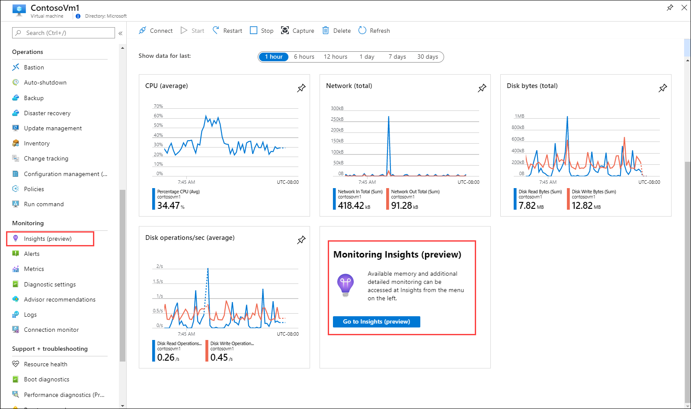
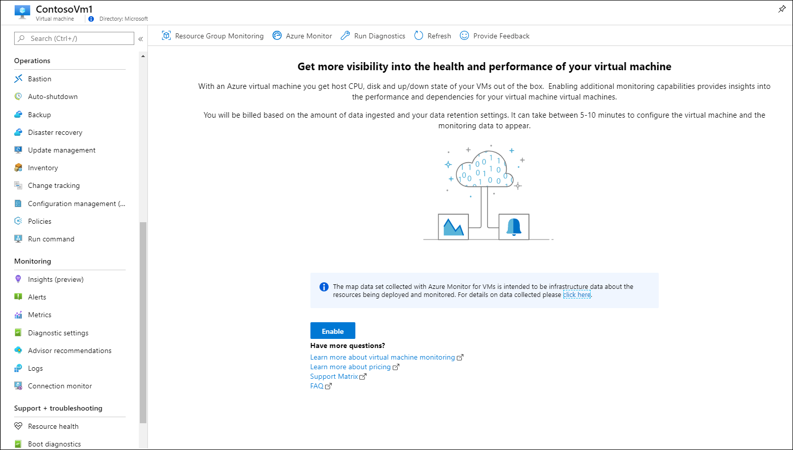
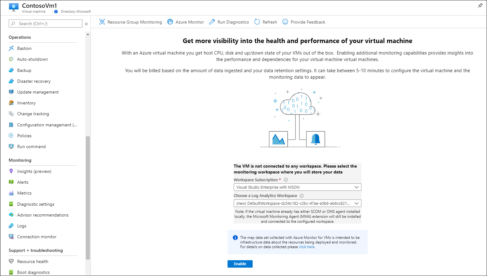
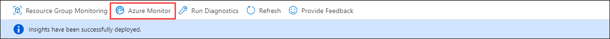
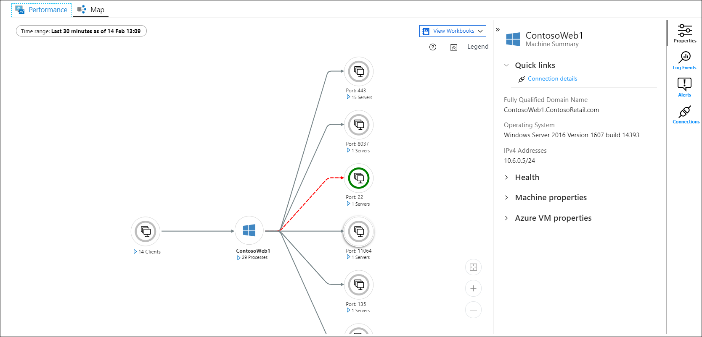
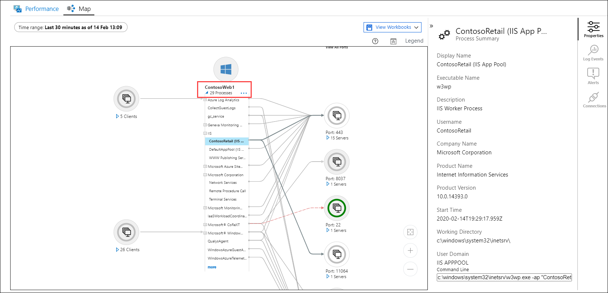
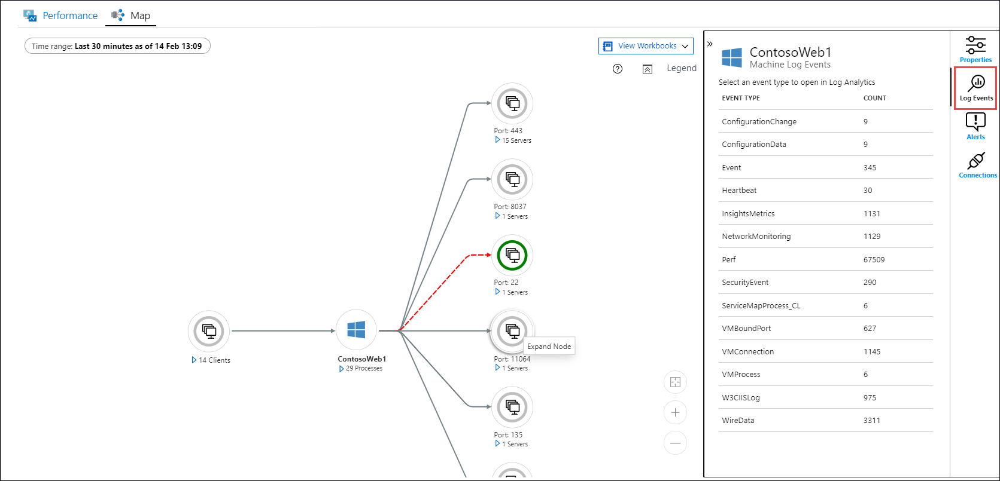
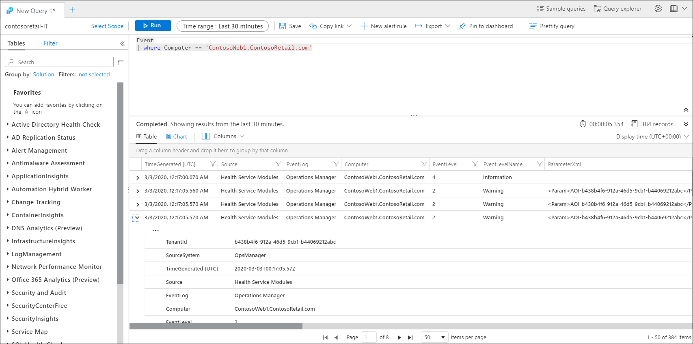

# Quickstart: Monitor an Azure virtual machine with Azure Monitor
[Azure Monitor](../overview.md) starts collecting data from Azure virtual machines the moment that they're created. In this quickstart, you'll take a brief walkthrough the data that's automatically collected for an Azure VM and how to view it in the Azure portal. You'll then enable [Azure Monitor for VMs](../insights/vminsights-overview.md) for your VM which will enable agents on the VM to collect and analyze data from the guest operating system including processes and their dependencies.

This quickstart assumes you have an existing Azure virtual machine. If not you can create a [Windows VM](../../virtual-machines/windows/quick-create-portal.md) or create a [Linux VM](../../virtual-machines/linux/quick-create-cli.md) following our VM quickstarts.

For more detailed descriptions of monitoring data collected from Azure resources  see [Monitoring Azure virtual machines with Azure Monitor](../insights/monitor-vm-azure.md).

## Complete the Monitor an Azure resource quickstart.
Complete [Monitor an Azure resource with Azure Monitor](quick-monitor-azure-resource.md) to view the overview page, activity log, and metrics for a VM in your subscription. Azure VMs collect the same monitoring data as any other Azure resource, but this is only for the host VM. The rest of this quickstart will focus on monitoring the guest operating system and its workloads.

## Enable Azure Monitor for VMs
While metrics and activity logs will be collected for the host VM, you need an agent and some configuration to collect and analyze monitoring data from the guest operating system and its workloads. Azure Monitor for VMs installs these agents and provides additional powerful features for monitoring your virtual machines.

1. Go to the menu for your virtual machine.
2. Either click **Go to Insights** from the tile in the **Overview** page, or click on **Insights** from the **Monitoring** menu.

    

3. If Azure Monitor for VMs has not yet been enabled for the virtual machine, click **Enable**. 

    

4. If the virtual machine isn't already attached to a Log Analytics workspace, you will be prompted to select an existing workspace or create a new one. Select the default which is a workspace with a unique name in the same region as your virtual machine.

    

5. Onboarding will take a few minutes as extensions are enabled and agents are installed on your virtual machine. When it's complete, you get a message that insights have been successfully deployed. Click **Azure Monitor** to open Azure Monitor for VMs.

    

6. You'll see your VM with any other VMs in your subscription that are onboarded. Select the **Not monitored** tab if you want to view virtual machines in your subscription that aren't onboarded.

    

## Configure workspace
When you create a new Log Analytics workspace, it needs to be configured to collect logs. This configuration only needs to be performed once since configuration is sent to any virtual machines that connect to it.

1. Select **Workspace configuration** and then select your workspace.

2. Select **Advanced settings**

    

### Data collection from Windows VM

2. Select **Data**, and then select **Windows Event Logs**.

3. Add an event log by typing in the name of the log.  Type **System** and then select the plus sign **+**.

4. In the table, check the severities **Error** and **Warning**.

5. Select **Save** at the top of the page to save the configuration.

### Data collection from Linux VM

1. Select **Syslog**.  

2. Add an event log by typing in the name of the log.  Type **Syslog** and then select the plus sign **+**.  

3. In the table, deselect the severities **Info**, **Notice** and **Debug**. 

4. Select **Save** at the top of the page to save the configuration.

## View data collected

7. Click on your virtual machine and then select the **Performance** tab. This shows a select group of performance counters collected from the guest operating system of your VM. Scroll down to view more counters, and move the mouse over a graph to view average and percentiles at different times.

    

9. Select **Map** to open the maps feature which shows the processes running on the virtual machine and their dependencies. Select **Properties** to open the property pane if it isn't already open.

    

11. Expand the processes for your virtual machine. Select one of the processes to view its details and to highlight its dependencies.

    

12. Select your virtual machine again and then select **Log Events**. 

    

13. You see a list of tables that are stored in the Log Analytics workspace for the virtual machine. This list will be different depending whether you're using a Windows or Linux virtual machine. Click the **Event** table. This includes all events from the Windows event log. Log Analytics opens with a simple query to retrieve event log entries.

    

## Next steps
In this quickstart, you enabled Azure Monitor for VMs for a virtual machine and configured the Log Analytics workspace to collect events for the guest operating system. To learn how to view and analyze the data, continue to the tutorial.

> [!div class="nextstepaction"]
> [View or analyze data in Log Analytics](../../azure-monitor/learn/tutorial-viewdata.md)
