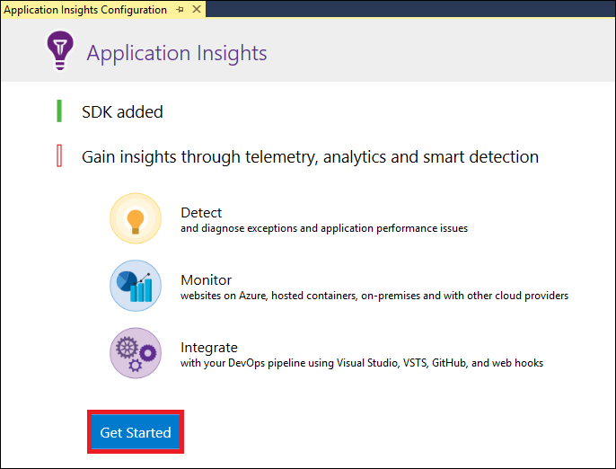
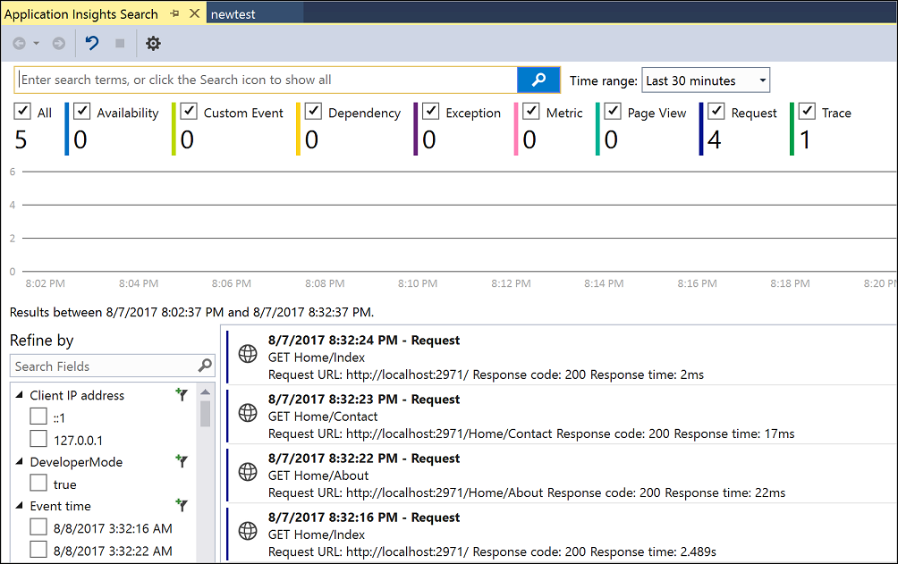
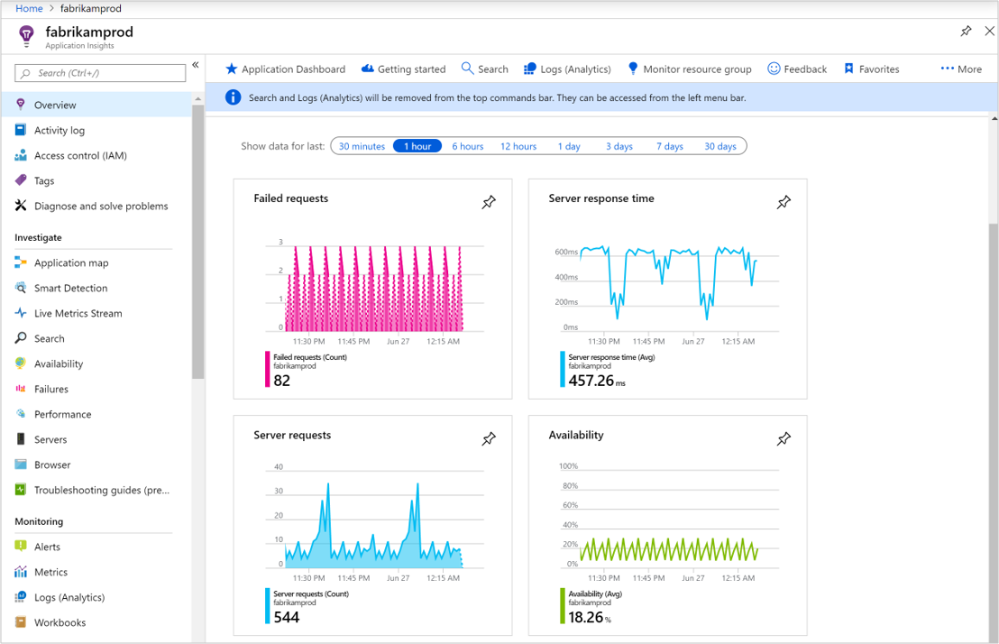
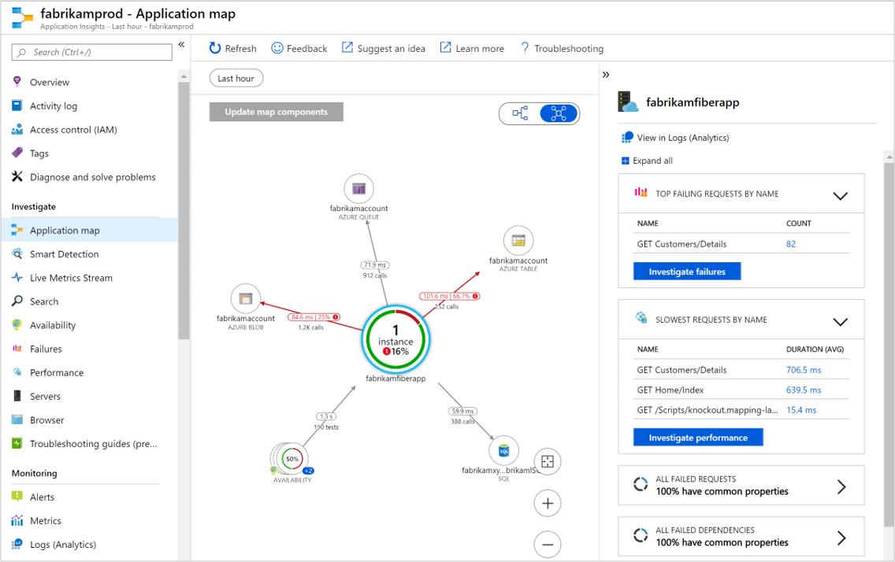

# Start monitoring your ASP.NET Web Application

With Azure Application Insights, you can easily monitor your web application for availability,
performance, and usage.  You can also quickly identify and diagnose errors in your application without waiting for a user to report them.  With the information that you collect from Application Insights about the performance and effectiveness of your
app, you can make informed choices to maintain and improve your application.

This quickstart shows how to add Application Insights to an existing ASP.NET web application and start
analyzing live statistics, which is just one of the various methods you can use to analyze your application. If you do not have an ASP.NET web application, you can create one following the
[Create an ASP.NET Web App quickstart](../../app-service/app-service-web-get-started-dotnet-framework.md).

## Prerequisites
To complete this quickstart:

- Install [Visual Studio 2019](https://www.visualstudio.com/downloads/) with the following workloads:
	- ASP.NET and web development
	- Azure development


If you don't have an Azure subscription, create a [free](https://azure.microsoft.com/free/) account before you begin.

## Enable Application Insights

1. Open your project in Visual Studio 2019.
2. Select **Configure Application Insights** from the Project menu. Visual Studio adds the Application Insights SDK to your application.

    > [!IMPORTANT]
    > The process to add Application Insights varies by ASP.NET template type. If you are using the **Empty** or **Azure Mobile App** template select **Project** > **Add Application Insights Telemetry**. For all other ASP.NET templates consult the instructions in the step above. 

3. Click **Get Started** (earlier versions of Visual Studio have a **Start Free** button instead).

    

4. Select your subscription and click **Register**.

5. Run your application by either selecting **Start Debugging** from the **Debug** menu or by pressing the
  F5 key.

## Confirm app configuration

Application Insights gathers telemetry data for your application regardless of where it's running. Use the following steps to start viewing this data.

1. Open Application Insights by clicking **View** -> **Other Windows** -> **Application Insights Search**.  You see the telemetry from your current session.<BR><br>

2. Click on the first request in the list (GET Home/Index in this example) to see the request details. Notice that the status code and response time are both included along with other valuable information about the request.<br><br>

## Start monitoring in the Azure portal

You can now open Application Insights in the Azure portal to view various details about your running application.

1. Expand the **Connected Services** folder (cloud and plug icon) in the Solution Explorer then right-click on the **Application Insights** folder and click **Open Application Insights Portal**.  You see some information about your application and a variety of options.

	

2. Click on **Application map** to get a visual layout of the dependency relationships between your application components.  Each component shows KPIs such as load, performance, failures, and alerts.

	

3. Click on the **App Analytics** icon  **View in Logs (Analytics)** on one of the application components. This opens **Logs (Analytics)**, which provides a rich query language for analyzing all data collected by Application Insights. In this case, a query is generated for you that renders the request count as a chart. You can write your own queries to analyze other data.

	

4. Click on **Live Metrics Stream** on the left under investigate. This shows live statistics about your application as it's running. This includes such information as the number of incoming requests, the duration of those requests, and any failures that occur. You can also inspect critical performance metrics such as processor and memory.

	

    If you are ready to host your application in Azure, you can publish it now. Follow the steps described
    in [Create an ASP.NET Web App Quickstart](../../app-service/app-service-web-get-started-dotnet.md#update-the-app-and-redeploy).

5. If you use Visual Studio to add Application Insights monitoring, you can automatically add client-side monitoring. To add client-side monitoring manually to an application add the following JavaScript to your application:

```html
<!-- 
To collect user behavior analytics about your application, 
insert the following script into each page you want to track.
Place this code immediately before the closing </head> tag,
and before any other scripts. Your first data will appear 
automatically in just a few seconds.
-->
<script type="text/javascript">
var appInsights=window.appInsights||function(a){
  function b(a){c[a]=function(){var b=arguments;c.queue.push(function(){c[a].apply(c,b)})}}var c={config:a},d=document,e=window;setTimeout(function(){var b=d.createElement("script");b.src=a.url||"https://az416426.vo.msecnd.net/scripts/a/ai.0.js",d.getElementsByTagName("script")[0].parentNode.appendChild(b)});try{c.cookie=d.cookie}catch(a){}c.queue=[];for(var f=["Event","Exception","Metric","PageView","Trace","Dependency"];f.length;)b("track"+f.pop());if(b("setAuthenticatedUserContext"),b("clearAuthenticatedUserContext"),b("startTrackEvent"),b("stopTrackEvent"),b("startTrackPage"),b("stopTrackPage"),b("flush"),!a.disableExceptionTracking){f="onerror",b("_"+f);var g=e[f];e[f]=function(a,b,d,e,h){var i=g&&g(a,b,d,e,h);return!0!==i&&c["_"+f](a,b,d,e,h),i}}return c
  }({
      instrumentationKey:"<your instrumentation key>"
  });

window.appInsights=appInsights,appInsights.queue&&0===appInsights.queue.length&&appInsights.trackPageView();
</script>
```

To learn more, visit the GitHub repository for our [open-source JavaScript SDK](https://github.com/Microsoft/ApplicationInsights-JS).

## Video

* External step-by-step video about [configuring Application Insights with a .NET application from scratch](https://www.youtube.com/watch?v=blnGAVgMAfA).

## Clean up resources
When you are done testing, you can delete the resource group and all related resources. To do so follow the steps below.
1. From the left-hand menu in the Azure portal, click **Resource groups** and then click **myResourceGroup**.
2. On your resource group page, click **Delete**, type **myResourceGroup** in the text box, and then click **Delete**.

## Next steps
In this quickstart, you’ve enabled your application for monitoring by Azure Application Insights.  Continue to the tutorials to learn how to use it to monitor statistics and detect issues in your application.

> [!div class="nextstepaction"]
> [Azure Application Insights tutorials](tutorial-runtime-exceptions.md)
