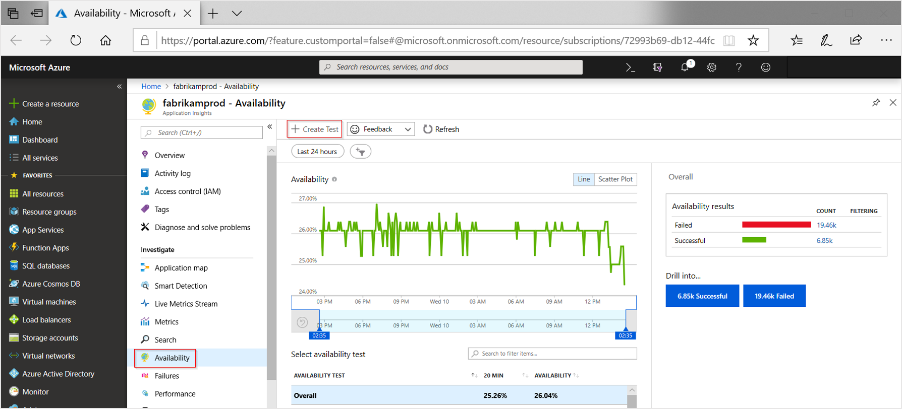
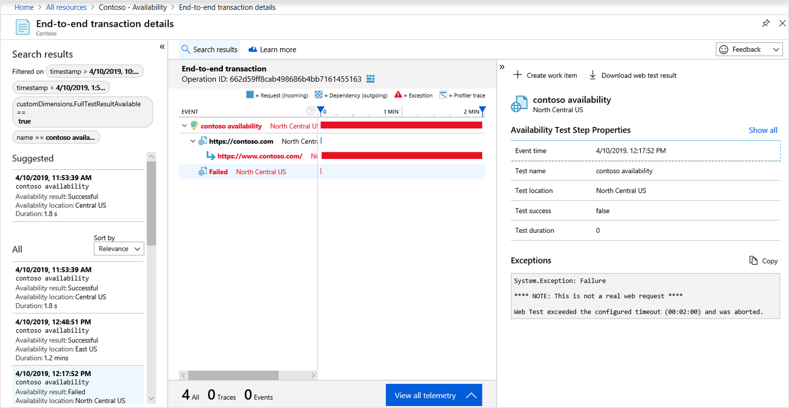

# Monitor and alert on application health with Azure Application Insights

Azure Application Insights allows you to monitor your application and send you alerts when it is either unavailable, experiencing failures, or suffering from performance issues.  This tutorial takes you through the process of creating tests to continuously check the availability of your application.

You learn how to:

> [!div class="checklist"]
> * Create availability test to continuously check the response of the application
> * Send mail to administrators when a problem occurs

## Prerequisites

To complete this tutorial:

Create an [Application Insights resource](https://docs.microsoft.com/azure/azure-monitor/learn/dotnetcore-quick-start#enable-application-insights).

## Sign in to Azure

Sign in to the Azure portal at [https://portal.azure.com](https://portal.azure.com).

## Create availability test

Availability tests in Application Insights allow you to automatically test your application from various locations around the world.   In this tutorial, you will perform a url test to ensure that your web application is available.  You could also create a complete walkthrough to test its detailed operation. 

1. Select **Application Insights** and then select your subscription.  

2. Select **Availability** under the **Investigate** menu and then click **Create test**.

    

3. Type in a name for the test and leave the other defaults.  This selection will trigger requests for the application url every 5 minutes from five different geographic locations.

4. Select **Alerts** to open the **Alerts** dropdown where you can define details for how to respond if the test fails. Choose **Near-realtime** and set the status to **Enabled.**

    Type in an email address to send when the alert criteria is met.  You could optionally type in the address of a webhook to call when the alert criteria is met.

    

5. Return to the test panel, select the ellipses and edit alert to enter the configuration for your near-realtime alert.

    

6. Set failed locations to greater than or equal to 3. Create an [action group](https://docs.microsoft.com/azure/azure-monitor/platform/action-groups) to configure who gets notified when your alert threshold is breached.

    

7. Once you have configured your alert, click on the test name to view details from each location. Tests can be viewed in both line graph and scatter plot format to visualize the success/failures for a given time range.

    

8. You can drill down into the details of any test by clicking on its dot in the scatter chart. This will launch the end-to-end transaction details view. The example below shows the details for a failed request.

    
  
## Next steps

Now that you've learned how to alert on issues, advance to the next tutorial to learn how to analyze how users are interacting with your application.

> [!div class="nextstepaction"]
> [Understand users](../../azure-monitor/learn/tutorial-users.md)