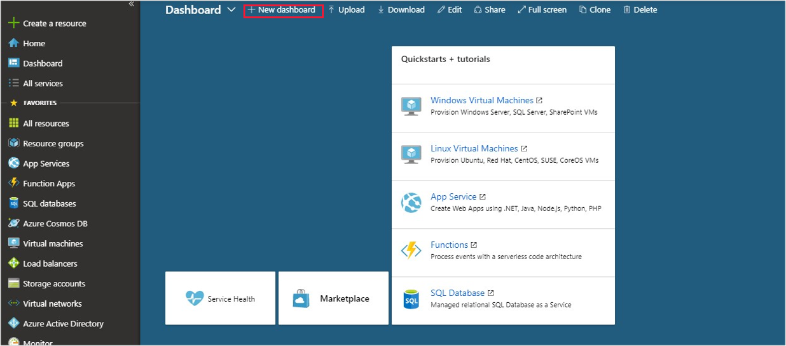
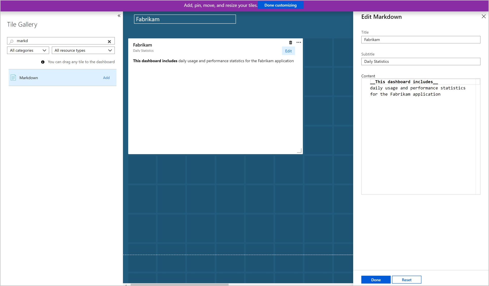
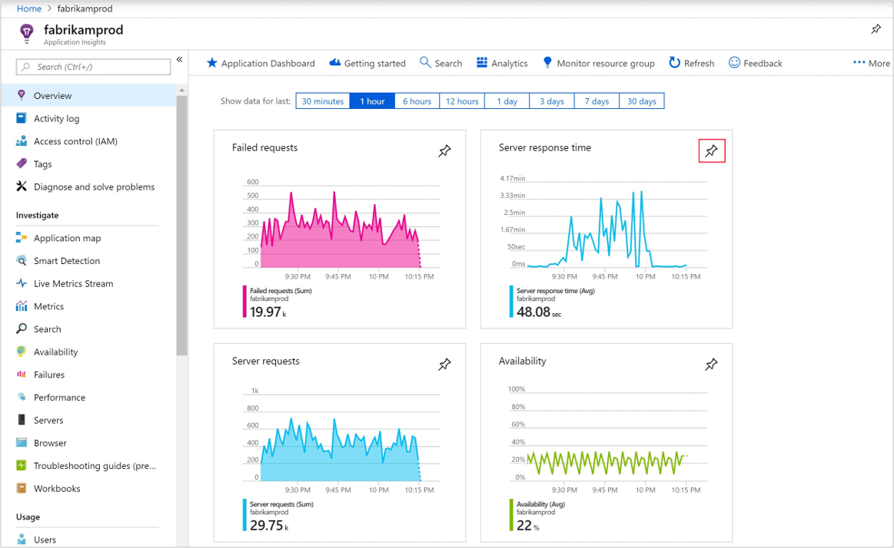
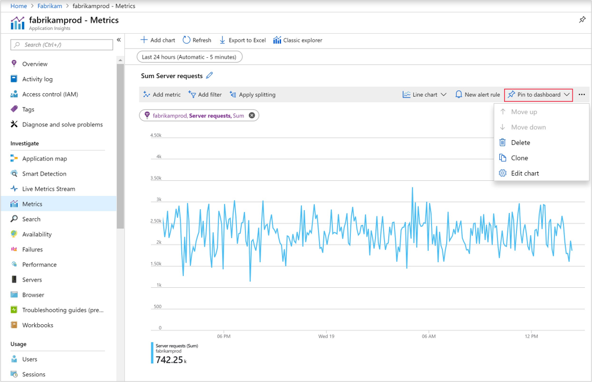
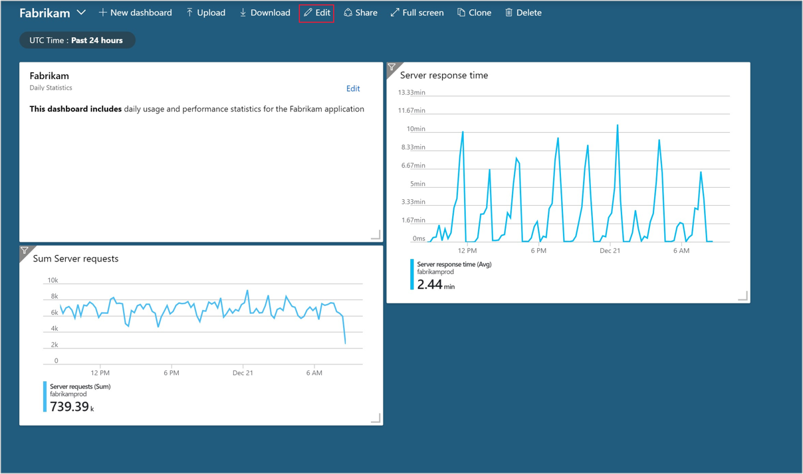
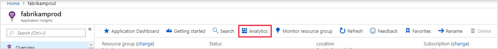
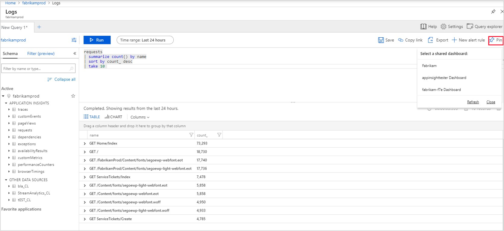
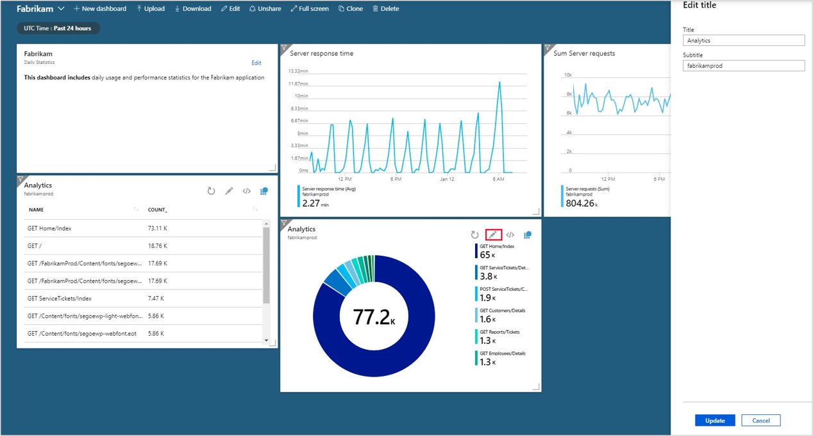

# Create custom KPI dashboards using Azure Application Insights

You can create multiple dashboards in the Azure portal that each include tiles visualizing data from multiple Azure resources across different resource groups and subscriptions.  You can pin different charts and views from Azure Application Insights to create custom dashboards that provide you with complete picture of the health and performance of your application.  This tutorial walks you through the creation of a custom dashboard that includes multiple types of data and visualizations from Azure Application Insights.  You learn how to:

> [!div class="checklist"]
> * Create a custom dashboard in Azure
> * Add a tile from the Tile Gallery
> * Add standard metrics in Application Insights to the dashboard 
> * Add a custom metric chart Application Insights to the dashboard
> * Add the results of an Analytics query to the dashboard 


## Prerequisites

To complete this tutorial:

- Deploy a .NET application to Azure and [enable the Application Insights SDK](../../azure-monitor/app/asp-net.md). 

## Log in to Azure
Log in to the Azure portal at [https://portal.azure.com](https://portal.azure.com).

## Create a new dashboard
A single dashboard can contain resources from multiple applications, resource groups, and subscriptions.  Start the tutorial by creating a new dashboard for your application.  

1. On the dashboard pane, select **New dashboard**.

   

1. Type a name for the dashboard.
1. Have a look at the **Tile Gallery** for a variety of tiles that you can add to your dashboard.  In addition to adding tiles from the gallery you can pin charts and other views directly from Application Insights to the dashboard.
1. Locate the **Markdown** tile and drag it on to your dashboard.  This tile allows you to add text formatted in markdown which is ideal for adding descriptive text to your dashboard.
1. Add text to the tile's properties and resize it on the dashboard canvas.
	
	

1. Click **Done customizing** at the top of the screen to exit tile customization mode.

## Add health overview
A dashboard with just static text isn't very interesting, so now add a tile from Application Insights to show information about your application.  You can add Application Insights tiles from the Tile Gallery, or you can pin them directly from Application Insights screens.  This allows you to configure charts and views that you're already familiar with before pinning them to your dashboard.  Start by adding the standard health overview for your application.  This requires no configuration and allows minimal customization in the dashboard.


1. Select your **Application Insights** resource on the home screen.
2. In the **Overview** pane, click the pushpin icon to add the tile to the last dashboard that you were viewing.  

	
 
3. In the top right a notification will appear that your tile was pinned to your dashboard. Click **Pinned to dashboard** in the notification to return to your dashboard or use the dashboard pane.
4. That tile is now added to your dashboard. Select **Edit** to change the positioning of the tile. Click and drag the it into position and then click **Done customizing**. Your dashboard now has a tile with some useful information.

	


## Add custom metric chart
The **Metrics** panel allows you to graph a metric collected by Application Insights over time with optional filters and grouping.  Like everything else in Application Insights, you can add this chart to the dashboard.  This does require you to do a little customization first.

1. Select your **Application Insights** resource in the home screen.
1. Select **Metrics**.  
2. An empty chart has already been created, and you're prompted to add a metric.  Add a metric to the chart and optionally add a filter and a grouping.  The example below shows the number of server requests grouped by success.  This gives a running view of successful and unsuccessful requests.

	

4. Select **Pin to dashboard** on the right. This adds the view to the last dashboard that you were working with.

	

3.  In the top right a notification will appear that your tile was pinned to your dashboard. Click **Pinned to dashboard** in the notification to return to your dashboard or use the dashboard blade.

4. That tile is now added to your dashboard. Select **Edit** to change the positioning of the tile. Click and drag the it into position and then click **Done customizing**.

	

## Add Analytics query
Azure Application Insights Analytics provides a rich query language that allows you to analyze all of the data collected Application Insights.  Just like charts and other views, you can add the output of an Analytics query to your dashboard.   

Since Azure Applications Insights Analytics is a separate service, you need to share your dashboard for it to include an Analytics query. When you share an Azure dashboard, you publish it as an Azure resource which can make it available to other users and resources.  

1. At the top of the dashboard screen, click **Share**.

	

2. Keep the **Dashboard name** the same and select the **Subscription Name** to share the dashboard.  Click **Publish**.  The dashboard is now available to other services and subscriptions.  You can optionally define specific users who should have access to the dashboard.
1. Select your **Application Insights** resource in the home screen.
2. Click **Analytics** at the top of the screen to open the Analytics portal.

	

3. Type the following query, which returns the top 10 most requested pages and their request count:

    ```
	requests
	| summarize count() by name
	| sort by count_ desc
	| take 10 
    ```

4. Click **Run** to validate the results of the query.
5. Click the pin icon and select the name of your dashboard. The reason that this option has you select a dashboard unlike the previous steps where the last dashboard was used is because the Analytics console is a separate service and needs to select from all available shared dashboards.

	

5. Before you go back to the dashboard, add another query, but this time render it as a chart so you see the different ways to visualize an Analytics query in a dashboard.  Start with the following query that summarizes the top 10 operations with the most exceptions.

    ```
	exceptions
	| summarize count() by operation_Name
	| sort by count_ desc
	| take 10 
    ```

6. Select **Chart** and then change to a **Doughnut** to visualize the output.

	

6. Click the pin icon to pin the chart to your dashboard and this time select the link to return to your dashboard.
4. The results of the queries are now added to your dashboard in the format that you selected.  Click and drag each into position and then click **Done customizing**.
5. Select the pencil icon on each title to give them a descriptive title.

	

5. Select **Share** to republish your changes to your dashboard that now includes a variety of charts and visualizations from Application Insights.


## Next steps
Now that you've learned how to create custom dashboards, have a look at the rest of the Application Insights documentation including a case study.

> [!div class="nextstepaction"]
> [Deep diagnostics](../../azure-monitor/app/devops.md)
