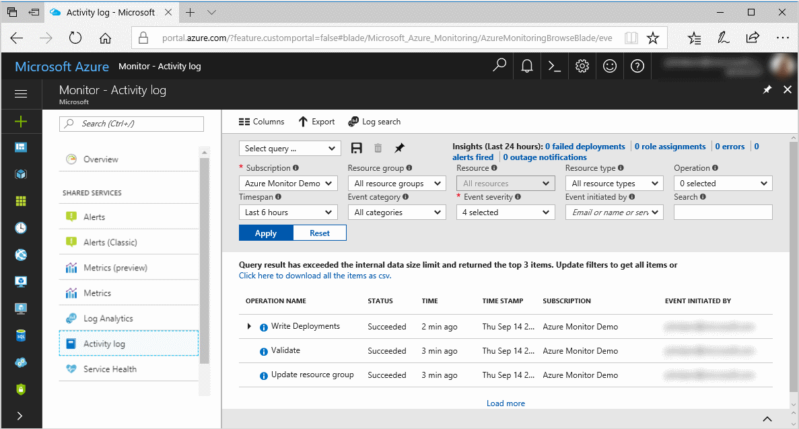
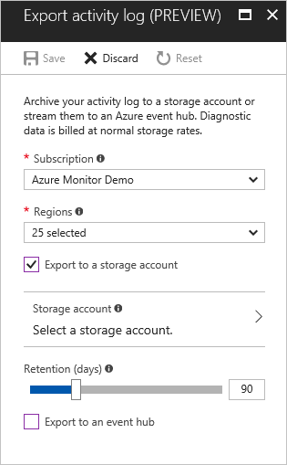
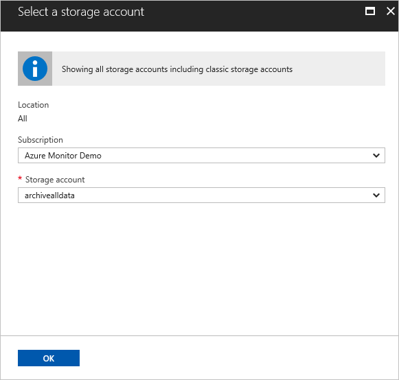
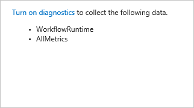
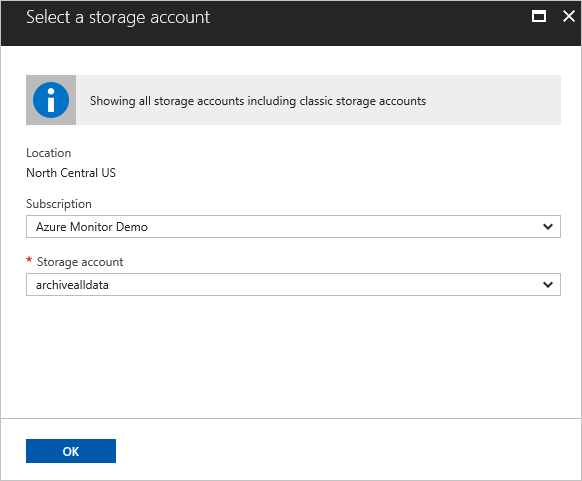
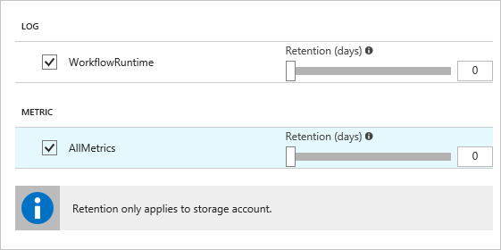
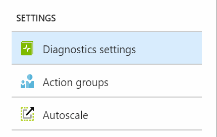
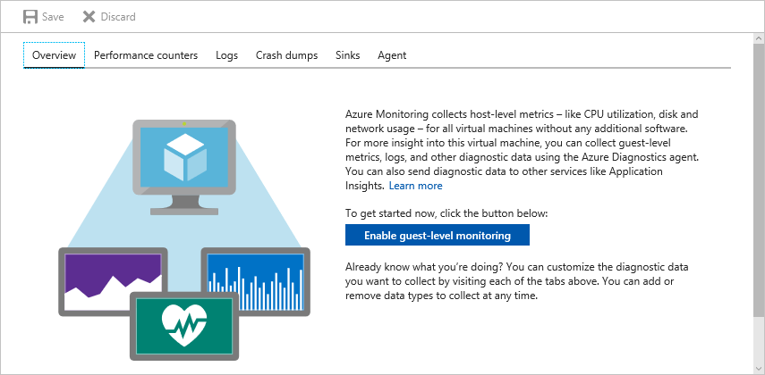
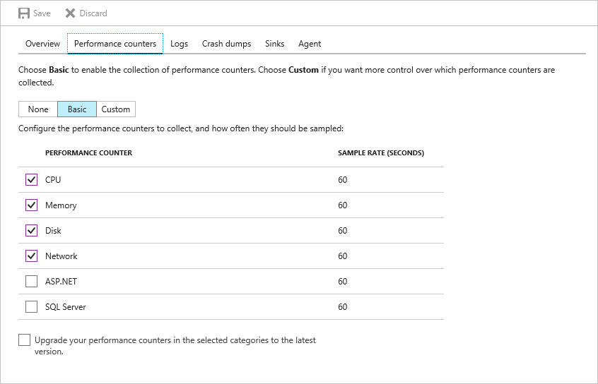
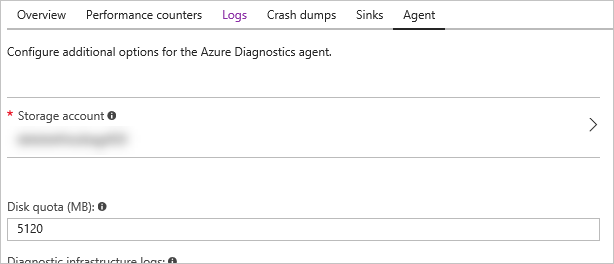

# Archive Azure metric and log data using Azure Storage

Several layers of your Azure environment produce log and metric data that can be archived to an Azure Storage account. You may want to do this to preserve a history of monitoring data over time in an inexpensive, non-searchable store after that data has passed its retention period.

- Azure Monitor platform metrics are kept for 93 days.
- Resource diagnostic logs only appear if routed to Log Analytics, where they have a configurable retention period with a minimum of 30 days.
- Activity log entries are kept for 90 days.  

This tutorial steps through the process of configuring your Azure environment to archive data to a storage account.

> [!div class="checklist"]
> * Create a storage account to hold monitoring data
> * Route subscription logs to it
> * Route resource data to it
> * Route virtual machine (guest OS) data to it
> * View the monitoring data in it
> * Clean up your resources

If you don't have an Azure subscription, create a [free](https://azure.microsoft.com/free/) account before you begin.

## Sign in to the Azure portal

Sign in to the [Azure portal](https://portal.azure.com/).

## Create a storage account

First you need to set up a storage account to which the monitoring data will be archived. To do this, [follow the steps here](../../storage/common/storage-account-create.md).

## Route subscription logs to the storage account

You are now ready to begin to set up your Azure environment to route monitoring data to a storage account. First we configure subscription-level data (contained in the Azure Activity Log) to be routed to the storage account. The [**Azure Activity Log**](../../azure-monitor/platform/platform-logs-overview.md) provides a history of subscription-level events in Azure. You can browse it in the Azure portal to determine *who* created, updated, or deleted *what* resources and *when* they did it.

1. Click the **Monitor** button found on the left-hand navigation list, then on **Activity Log**.

   

2. In the Activity Log section that is displayed, click on the **Export** button.

3. In the **Export activity log** section that appears, check the box for **Export to a storage account** and click **Select a storage account.**

   

4. In the section that appears, use the **Storage account** dropdown to select the name of the storage account you created in the preceding **Create a storage account** step, then click **OK**.

   

5. Set the **Retention (days)** slider to 30. This slider sets a number of days to retain the monitoring data in the storage account. Azure Monitor automatically deletes data older than the number of days specified. A retention of zero days stores the data indefinitely.

6. Click **Save** and close this section.

Monitoring data from your subscription is now flowing into the storage account.

## Route resource data to the storage account

Now we configure resource-level data (resource metrics and resource logs) to be routed to the storage account by setting up **resource diagnostic settings**.

1. Click the **Monitor** button found on the left-hand navigation list, then on **Diagnostic Settings**. Here you see a list of all resources in your subscription that produce monitoring data through Azure Monitor. If you do not have any resources in this list, you can [create a logic app](../../logic-apps/quickstart-create-first-logic-app-workflow.md) before proceeding so that you have a resource that you can configure a diagnostic setting on.

2. Click on a resource in the list, and then click **Turn on diagnostics**.

   

   If there is already a setting configured, you instead see the existing settings, and a button to **Add diagnostic setting**. Click this button.

   A resource diagnostic setting is a definition of *what* monitoring data should be routed from a particular resource and *where* that monitoring data should go.

3. In the section that appears, give your setting a **name** and check the box for **Archive to a storage account**.

   

4. Click on the **Configure** button under **Archive to a storage account** and select the storage account you created in the preceding section. Click **OK**.

   

5. Check all the boxes under **Log** and **Metric**. Depending on the resource type, you may only have one of these options. These checkboxes control what categories of log and metric data available for that resource type are sent to the destination you've selected, in this case, a storage account.

   

6. Set the **Retention (days)** slider to 30. This slider sets a number of days to retain the monitoring data in the storage account. Azure Monitor automatically deletes data older than the number of days specified. A retention of zero days stores the data indefinitely.

7. Click **Save**.

Monitoring data from your resource is now flowing into the storage account.

> [!NOTE]
> Sending multi-dimensional metrics via diagnostic settings is not currently supported. Metrics with dimensions are exported as flattened single dimensional metrics, aggregated across dimension values.
>
> *For example*: The 'Incoming Messages' metric on an Event Hub can be explored and charted on a per queue level. However, when exported via diagnostic settings the metric will be represented as all incoming messages across all queues in the Event Hub.
>
>

## Route virtual machine (guest OS) data to the storage account

1. If you do not already have a virtual machine in your subscription, [create a virtual machine](../../virtual-machines/windows/quick-create-portal.md).

2. In the left-hand navigation list in the portal, click on **Virtual Machines**.

3. In the list of virtual machines that is displayed, click on the virtual machine you created.

4. In the section that appears, click on **Diagnostic Settings** on the left-hand navigation. This section enables you to set up the out-of-box monitoring extension from Azure Monitor on your virtual machine and route data being produced by Windows or Linux to a storage account.

   

5. Click **Enable guest-level monitoring** in the section that appears.

   

6. Once the diagnostic setting has correctly saved, the **Overview** tab shows a list of the data being collected and where it is being stored. Click on the **Performance counters** section to review the set of Windows performance counters being collected.

   

7. Click on the **Logs** tab and check the checkboxes for **Information** level logs on Application and System logs.

   

8. Click on the **Agent** tab and under **Storage account** click on the name of the storage account shown.

   

9. In the section that appears, pick the storage account you created in the preceding **Create a storage account** step.

10. Click **Save**.

Monitoring data from your virtual machines is now flowing into the storage account.

## View the monitoring data in the storage account

> [!WARNING]
> The format of the log data in the storage account will change to JSON Lines on Nov. 1st, 2018. [See this article for a description of the impact and how to update your tooling to handle the new format.](./../../azure-monitor/platform/diagnostic-logs-append-blobs.md)
>
>

If you have followed the preceding steps, data has begun flowing to your storage account.

1. For some data types, for example, the Activity Log, there needs to be some activity that generates an event in the storage account. To generate activity in the Activity Log, follow [these instructions](./../../azure-monitor/platform/quick-audit-notify-action-subscription.md). You may need to wait up to five minutes before the event appears in the storage account.

2. In the portal, navigate to the **Storage Accounts** section by finding it on the left-hand navigation bar.

3. Identify the storage account you created in the preceding section and click on it.

4. Click on **Blobs**, then on the container labeled **insights-operational-logs** and finally on the container labeled **name=default**. This is the container that has your Activity Log in it. Monitoring data is broken out into containers by resource ID (just the subscription ID for the Activity Log), then by date and time. The full format for these blobs is:

   insights-operational-logs/name=default/resourceId=/SUBSCRIPTIONS/{subscription ID}/y={four-digit numeric year}/m={two-digit numeric month}/d={two-digit numeric day}/h={two-digit 24-hour clock hour}/m=00/PT1H.json

5. Navigate to the PT1H.json file by clicking into the containers for resource ID, date, and time. Click on the PT1H.json file and click **Download**. Each PT1H.json blob contains a JSON blob of events that occurred within the hour specified in the blob URL (for example, h=12). During the present hour, events are appended to the PT1H.json file as they occur. The minute value (m=00) is always 00, since log events are broken into individual blobs per hour.

   You can now view the JSON event that was stored in the storage account. For resource resource logs, the format for the blobs is:

   insights-logs-{log category name}/resourceId=/{resource ID}/y={four-digit numeric year}/m={two-digit numeric month}/d={two-digit numeric day}/h={two-digit 24-hour clock hour}/m=00/PT1H.json

6. Guest OS monitoring data is stored in tables. navigate back to the storage account home, and click **Tables**. There are tables for metrics, performance counters, and event logs.

You have now successfully set up monitoring data to be archived to a storage account.

## Clean up resources

1. Navigate back to the **Export Activity Log** section from the preceding **Route subscription logs to the storage account** step, and click **Reset**.

2. Navigate to the **Diagnostic Settings** section, click the resource on which you created a diagnostic setting in the preceding **Route resource data to the storage account** step, then find the setting you created, click the **Edit setting** button and click **Delete**.

3. Navigate to the **Diagnostic Settings** section on the virtual machine you configured in the preceding **Route virtual machine (guest OS) data to the storage account** step, and under the **Agent** tab click **Remove** (beneath the **Remove Azure Diagnostics agent** section).

4. Navigate to the storage account you created in the preceding **Create a storage account** step and click **Delete storage account**. Type the name of the storage account, and then click **Delete**.

5. If you created a virtual machine or Logic App for the preceding steps, delete those as well.

## Next steps

In this tutorial, you learned how to set up monitoring data from your Azure environment (subscription, resource, and guest OS) to be archived to a storage account.

> [!div class="checklist"]
> * Create a storage account to hold monitoring data
> * Route subscription logs to it
> * Route resource data to it
> * Route virtual machine (guest OS) data to it
> * View the monitoring data in it
> * Clean up your resources

To get more out of your data and derive additional insights, also  send your data into Log Analytics.

> [!div class="nextstepaction"]
> [Get started with Log Analytics](../../azure-monitor/log-query/log-query-overview.md)
