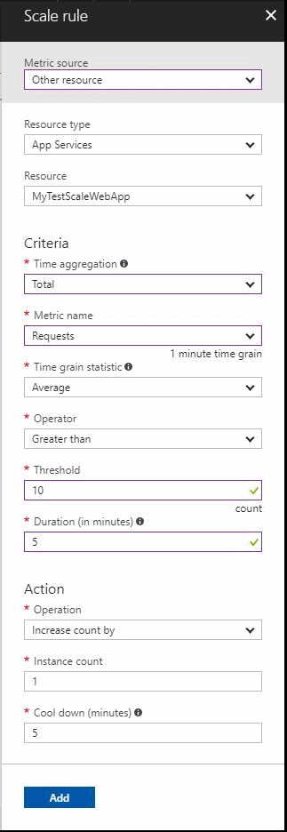
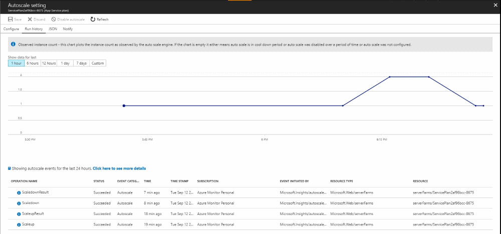

# Create an Autoscale Setting for  Azure resources based on performance data or a schedule

Autoscale settings enable you to add/remove instances of service based on preset conditions. These settings can be created through the portal. This method provides a browser-based user interface for creating and configuring an autoscale setting. 

In this tutorial, you will 
> [!div class="checklist"]
> * Create a Web App and App Service Plan
> * Configure autoscale rules for scale-in and scale out based on the number of requests a Web App receives
> * Trigger a scale-out action and watch the number of instances increase
> * Trigger a scale-in action and watch the number of instances decrease
> * Clean up your resources

If you don't have an Azure subscription, create a [free](https://azure.microsoft.com/free/) account before you begin.

## Log in to the Azure portal

Log in to the [Azure portal](https://portal.azure.com/).

## Create a Web App and App Service Plan
1. Click the **Create a resource** option from the left-hand navigation pane.
2. Search for and select the *Web App* item and click **Create**.
3. Select an app name like *MyTestScaleWebApp*. Create a new resource group *myResourceGroup' or place it into a resource group of your choosing.

Within a few minutes, your resources should be provisioned. Use the Web App and corresponding App Service Plan in the remainder of this tutorial.

   

## Navigate to Autoscale settings
1. From the left-hand navigation pane, select the **Monitor** option. Once the page loads, select the **Autoscale** tab.
2. A list of the resources under your subscription that support autoscale are listed here. Identify the App Service Plan that was created earlier in the tutorial, and click on it.

    

3. On the autoscale setting, click the **Enable Autoscale** button.

The next few steps help you fill the autoscale screen to look like following picture:

   

## Configure default profile
1. Provide a **Name** for the autoscale setting.
2. In the default profile, ensure the **Scale mode** is set to 'Scale to a specific instance count'.
3. Set the instance count to **1**. This setting ensures that when no other profile is active, or in effect, the default profile returns the instance count to 1.

   

## Create recurrence profile

1. Click on the **Add a scale condition** link under the default profile.

2. Edit the **Name** of this profile to be 'Monday to Friday profile'.

3. Ensure the **Scale mode** is set to 'Scale based on a metric'.

4. For **Instance limits** set the **Minimum** as '1', the **Maximum** as '2' and the **Default** as '1'. This setting ensures that this profile does not autoscale the service plan to have less than 1 instance, or more than 2 instances. If the profile does not have sufficient data to make a decision, it uses the default number of instances (in this case 1).

5. For **Schedule**, select 'Repeat specific days'.

6. Set the profile to repeat Monday through Friday, from 09:00 PST to 18:00 PST. This setting ensures that this profile is only active and applicable 9AM to 6PM, Monday through Friday. During all other times, the 'Default' profile is the profile the autoscale setting uses.

## Create a scale-out rule

1. In the 'Monday to Friday profile'.

2. Click the **Add a rule** link.

3. Set the **Metric source** to be 'other resource'. Set the **Resource type** as 'App Services' and the **Resource** as the Web App created earlier in this tutorial.

4. Set the **Time aggregation** as 'Total', the **Metric name** as 'Requests', and the **Time grain statistic** as 'Sum'.

5. Set the **Operator** as 'Greater than', the **Threshold** as '10' and the **Duration** as '5' minutes.

6. Select the **Operation** as 'Increase count by', the **Instance count** as '1', and the **Cool down** as '5' minutes.

7. Click the **Add** button.

This rule ensures that if your Web App receives more than 10 requests within 5 minutes or less, one additional instance is added to your App Service Plan to manage load.

   

## Create a scale-in rule
We recommended you always to have a scale-in rule to accompany a scale-out rule. Having both ensures that your resources are not over provisioned. Over provisioning means you have more instances running than needed to handle the current load. 

1. In the 'Monday to Friday profile'.

2. Click the **Add a rule** link.

3. Set the **Metric source** to be 'other resource'. Set the **Resource type** as 'App Services' and the **Resource** as the Web App created earlier in this tutorial.

4. Set the **Time aggregation** as 'Total', the **Metric name** as 'Requests', and the **Time grain statistic** as 'Average'.

5. Set the **Operator** as 'Less than', the **Threshold** as '5' and the **Duration** as '5' minutes.

6. Select the **Operation** as 'Decrease count by', the **Instance count** as '1', and the **Cool down** as '5' minutes.

7. Click the **Add** button.

    

8. **Save** the autoscale setting.

    

## Trigger scale-out action
To trigger the scale-out condition in the autoscale setting just created, the Web App must have more than 10 requests in less than 5 minutes.

1. Open a browser window and navigate to the Web App created earlier in this tutorial. You can find the URL for your Web App in the Azure Portal by navigating to your Web App resource and clicking on the **Browse** button in the 'Overview' tab.

2. In quick succession, reload the page more than 10 times.

3. From the left-hand navigation pane, select the **Monitor** option. Once the page loads select the **Autoscale** tab.

4. From the list, select the App Service Plan used throughout this tutorial.

5. On the autoscale setting, click the **Run history** tab.

6. You see a chart reflecting the instance count of the App Service Plan over time.

7. In a few minutes, the instance count should rise from 1, to 2.

8. Under the chart, you see the activity log entries for each scale action taken by this autoscale setting.

## Trigger scale-in action
The scale-in condition in the autoscale setting triggers if there are fewer than 5 requests to the Web App over a period of 10 minutes. 

1. Ensure no requests are being sent to your Web App.

2. Load the Azure Portal.

3. From the left-hand navigation pane, select the **Monitor** option. Once the page loads select the **Autoscale** tab.

4. From the list, select the App Service Plan used throughout this tutorial.

5. On the autoscale setting, click the **Run history** tab.

6. You see a chart reflecting the instance count of the App Service Plan over time.

7. In a few minutes, the instance count should drop from 2, to 1. The process takes at least 100 minutes.  

8. Under the chart, are the corresponding set of activity log entries for each scale action taken by this autoscale setting.

    

## Clean up resources

1. From the left-hand menu in the Azure portal, click **All resources** and then select the Web App created in this tutorial.

2. On your resource page, click **Delete**, confirm delete by typing **yes** in the text box, and then click **Delete**.

3. Then select the App Service Plan resource and click **Delete**.

4. Confirm delete by typing **yes** in the text box, and then click **Delete**.

## Next steps

In this tutorial, you  
> [!div class="checklist"]
> * Created a Web App and App Service Plan
> * Configured autoscale rules for scale-in and scale out based on the number of requests the Web App received
> * Triggered a scale-out action and watched the number of instances increase
> * Triggered a scale-in action and watched the number of instances decrease
> * Cleaned up your resources

To learn more about autoscale settings, continue on to the [autoscale overview](../../azure-monitor/platform/autoscale-overview.md).

> [!div class="nextstepaction"]
> [Archive your monitoring data](tutorial-archive-data.md)

