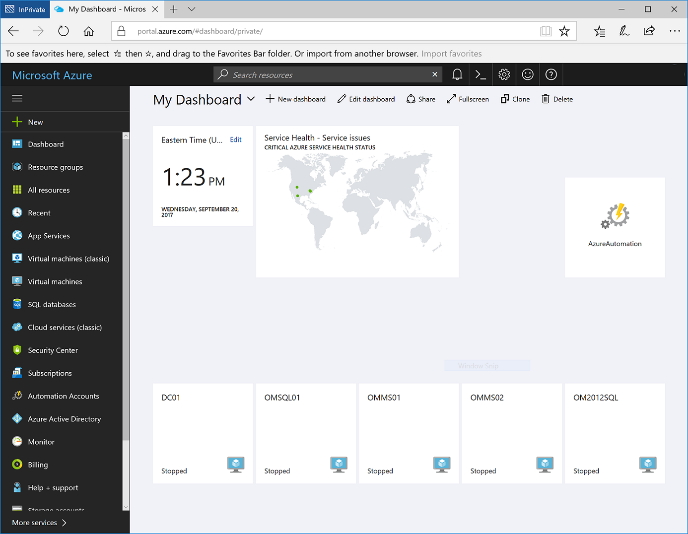
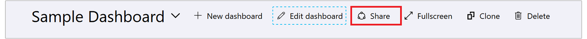
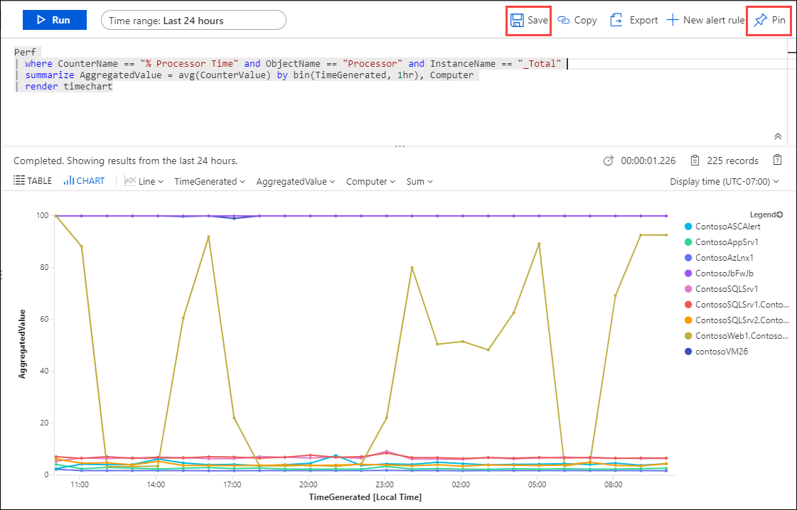
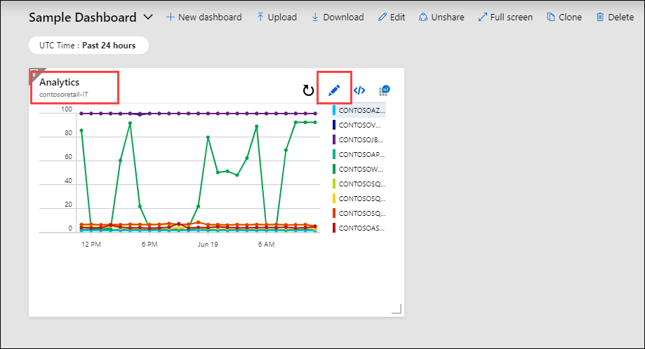
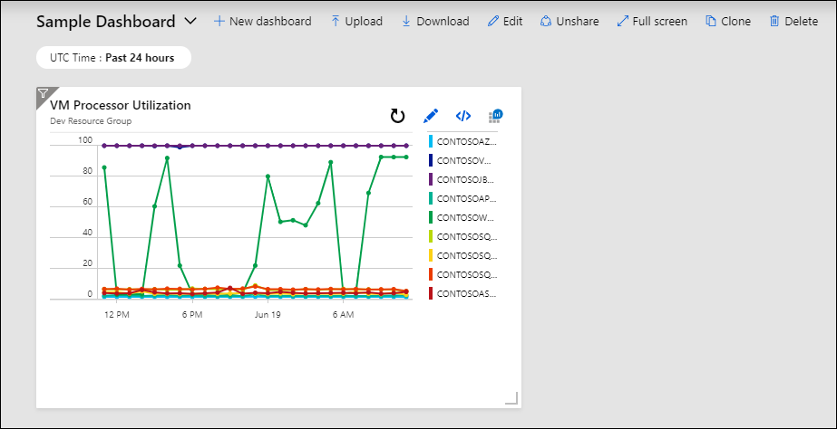

# Create and share dashboards of Log Analytics data

Log Analytics dashboards can visualize all of your saved log queries, giving you the ability to find, correlate, and share IT operational data in the organization.  This tutorial covers creating a log query that will be used to support a shared dashboard that will be accessed by your IT operations support team.  You learn how to:

> [!div class="checklist"]
> * Create a shared dashboard in the Azure portal
> * Visualize a performance log query 
> * Add a log query to a shared dashboard 
> * Customize a tile in a shared dashboard

To complete the example in this tutorial, you must have an existing virtual machine [connected to the Log Analytics workspace](quick-collect-azurevm.md).  
 
## Sign in to Azure portal
Sign in to the Azure portal at [https://portal.azure.com](https://portal.azure.com). 

## Create a shared dashboard
Select **Dashboard** to open your default [dashboard](../../azure-portal/azure-portal-dashboards.md). Your dashboard will look different than the example below.



Here you can bring together operational data that is most important to IT across all your Azure resources, including telemetry from Azure Log Analytics.  Before we step into visualizing a log query, let's first create a dashboard and share it.  We can then focus on our example performance log query, which will render as a line chart, and add it to the dashboard.  

> [!NOTE]
> The following chart types are supported in Azure dashboards using log queries:
> - areachart
> - columnchart
> - piechart (will render in dashboard as donut)
> - scatterchart
> - timechart

To create a dashboard, select the **New dashboard** button next to the current dashboard's name.


This action creates a new, empty, private dashboard and puts you into customization mode where you can name your dashboard and add or rearrange tiles. Edit the name of the dashboard and specify *Sample Dashboard* for this tutorial, and then select **Done customizing**.<br><br> 

When you create a dashboard, it is private by default, which means you are the only person who can see it. To make it visible to others, use the **Share** button that appears alongside the other dashboard commands.

 

You are asked to choose a subscription and resource group for your dashboard to be published to. For convenience, the portal's publishing experience guides you towards a pattern where you place dashboards in a resource group called **dashboards**.  Verify the subscription selected and then click **Publish**.  Access to the information displayed in the dashboard is controlled with [Azure Resource Based Access Control](../../role-based-access-control/role-assignments-portal.md).   

## Visualize a log query
[Log Analytics](../log-query/get-started-portal.md) is a dedicated portal used to work with log queries and their results. Features include the ability to edit a query on multiple lines, selectively execute code, context sensitive Intellisense, and Smart Analytics. In this tutorial, you will use Log Analytics to create a performance view in graphical form, save it for a future query, and pin it to the shared dashboard created earlier.

Open Log Analytics by selecting **Logs** in the Azure Monitor menu. It starts with a new blank query.


Enter the following query to return processor utilization records for both Windows and Linux computers, grouped by Computer and TimeGenerated, and displayed in a visual chart. Click **Run** to run the query and view the resulting chart.

```Kusto
Perf 
| where CounterName == "% Processor Time" and ObjectName == "Processor" and InstanceName == "_Total" 
| summarize AggregatedValue = avg(CounterValue) by bin(TimeGenerated, 1hr), Computer 
| render timechart
```

Save the query by selecting the **Save** button from the top of the page.



In the **Save Query** control panel, provide a name such as *Azure VMs - Processor Utilization* and a category such as *Dashboards* and then click **Save**.  This way you can create a library of common queries that you can use and modify.  Finally, pin this to the shared dashboard created earlier by selecting the **Pin to dashboard** button from the top right corner of the page and then selecting the dashboard name.

Now that we have a query pinned to the dashboard, you will notice it has a generic title and comment below it.



 We should rename it to something meaningful that can be easily understood by those viewing it.  Click the edit button to customize the title and subtitle for the tile, and then click **Update**.  A banner will appear asking you to publish changes or discard.  Click **Save a copy**.  



## Next steps
In this tutorial, you learned how to create a dashboard in the Azure portal and add a log query to it.  Advance to the next tutorial to learn the different responses you can implement based on log query results.  

> [!div class="nextstepaction"]
> [Respond to events with Log Analytics Alerts](tutorial-response.md)
