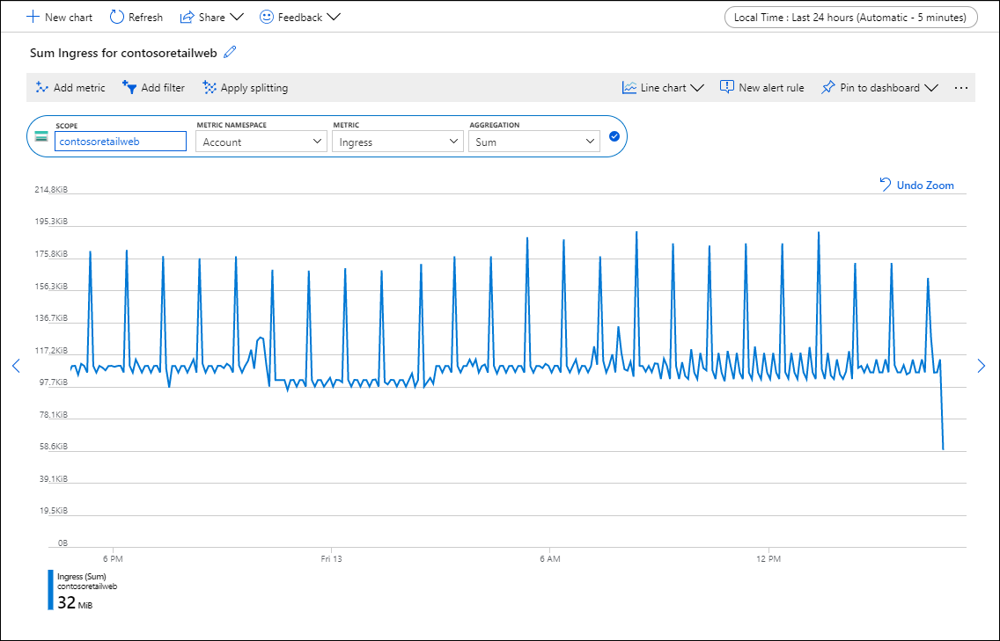
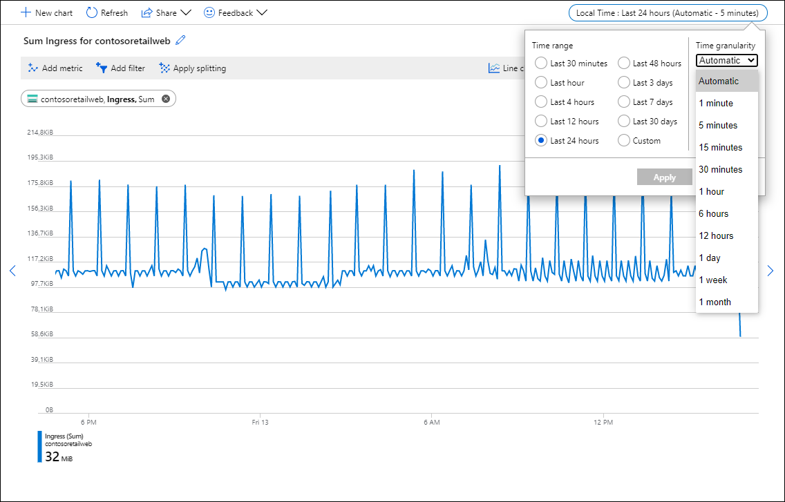

# Create a metrics chart using metrics explorer in Azure Monitor
Metrics explorer is a feature of Azure Monitor in the Azure portal that allows you to create charts from metric values, visually correlate trends, and investigate spikes and dips in metric values. Use the metrics explorer to investigate the health and utilization of your resources. 

In this tutorial, you learn how to:

> [!div class="checklist"]
> * Add a metric value to a chart
> * Modify aggregation of values
> * Filter for different 

## Prerequisites

To complete this tutorial you need an Azure resource to monitor. You can use any resource in your Azure subscription that supports metrics. To determine whether a resource supports diagnostic settings, go to its menu in the Azure portal and verify that there's a **Metrics** option in the **Monitoring** section of the menu.

## Log in to Azure
Log in to the Azure portal at [https://portal.azure.com](https://portal.azure.com).

## Open metrics explorer and select a scope
You can open metrics explorer either from the Azure Monitor menu or from a resource's menu in the Azure portal. Metric values from all resources are available regardless of which option you use. 

1. Select **Metrics** from the **Azure Monitor** menu or from the **Monitoring** section of a resource's menu.

1. Select the **Scope** which is the resource you want to see metrics for. The scope is already populated if you opened metrics explorer from a resource's menu.

    

2. Select a **Namespace** if the scope has more than one. The namespace is just a way to organize metrics so that you can easily find them. For example, storage accounts have separate namespaces for storing Files, Tables, Blobs, and Queues metrics. Many resource types only have one namespace.

3. Select a metric from a list of available metrics for the selected scope.

    

4. Optionally, you can change the metric **Aggregation**. This defines how the metric values will aggregated across the time granularity for the graph. For example, if the time granularity is set to 15 minutes and the aggregation is set to sum, then each point in the graph will be the sum of all collected values over each 15 minute segment.

    

5. Use the **Add metric** button and repeat these steps if you want to see multiple metrics plotted in the same chart. For multiple charts in one view, select the **Add chart** button on top.

## Select a time range and granularity

By default, the chart shows the most recent 24 hours of metrics data. Use the time picker to change the **Time range**, zoom in, or zoom out on your chart. The **Time granularity** defines the time range for each data point. The chart uses the specified aggregation to calculate all sampled values over the time granularity specified 

Use the **time brush** to investigate an interesting area of the chart (spike or a dip). Put the mouse pointer at the beginning of the area, click and hold the left mouse button, drag to the other side of area and then release the button. The chart will zoom in on that time range. 

## Apply dimension filters and splitting
See the following references for powerful diagnostic tools that allow you to identify possible outliers.

- [Filtering](metrics-charts.md#apply-filters-to-charts) lets you choose which dimension values are included in the chart. For example, you might want to show successful requests when charting the *server response time* metric. You would need to apply the filter on the *success of request* dimension. 

- [Splitting](metrics-charts.md#apply-splitting-to-a-chart) controls whether the chart displays separate lines for each value of a dimension, or aggregates the values into a single line. For example, you can see one line for an average response time across all server instances, or see separate lines for each server. You would need to apply splitting on the *server instance* dimension to see separate lines.

See [examples of the charts](metric-chart-samples.md) that have filtering and splitting applied. The article shows the steps were used to configure the charts.

## Advanced chart settings

You can customize chart style, title, and modify advanced chart settings. When done with customization, pin it to a dashboard to save your work. You can also configure metrics alerts. Follow [product documentation](metrics-charts.mds#lock-boundaries-of-chart-y-axis) to learn about these and other advanced features of Azure Monitor metrics explorer.

## Next steps
Now that you've learned how to work with metrics in Azure Monitor, learn how to use metrics to send proactive alerts.

> [!div class="nextstepaction"]
> [Create, view, and manage metric alerts using Azure Monitor](../platform/alerts-metric.md)

