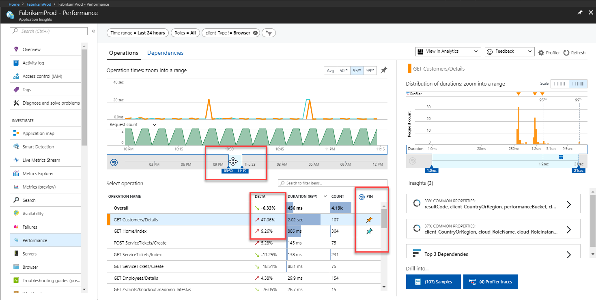
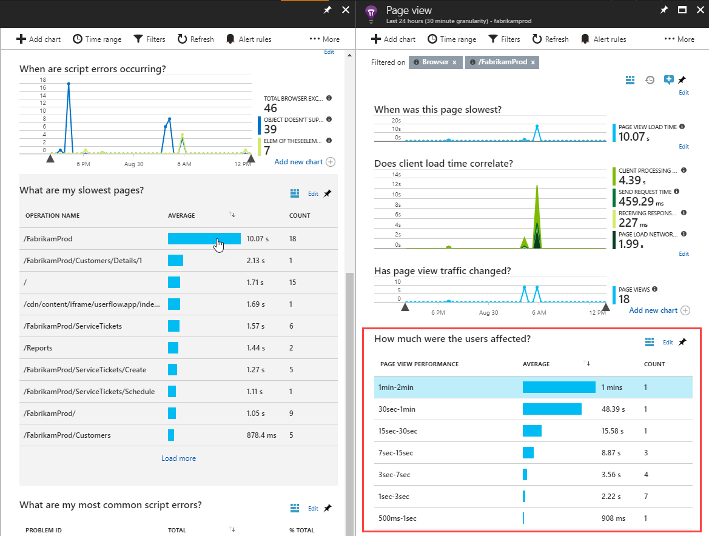

# Find and diagnose performance issues with Azure Application Insights

Azure Application Insights collects telemetry from your application to help analyze its operation and performance.  You can use this information to identify problems that may be occurring or to identify improvements to the application that would most impact users.  This tutorial takes you through the process of analyzing the performance of both the server components of your application and the perspective of the client.  You learn how to:

> [!div class="checklist"]
> * Identify the performance of server-side operations
> * Analyze server operations to determine the root cause of slow performance
> * Identify slowest client-side operations
> * Analyze details of page views using query language

## Prerequisites

To complete this tutorial:

- Install [Visual Studio 2019](https://www.visualstudio.com/downloads/) with the following workloads:
	- ASP.NET and web development
	- Azure development
- Deploy a .NET application to Azure and [enable the Application Insights SDK](../../azure-monitor/app/asp-net.md).
- [Enable the Application Insights profiler](../../azure-monitor/app/profiler.md#installation) for your application.

## Log in to Azure
Log in to the Azure portal at [https://portal.azure.com](https://portal.azure.com).

## Identify slow server operations
Application Insights collects performance details for the different operations in your application. By identifying those operations with the longest duration, you can diagnose potential problems or best target your ongoing development to improve the overall performance of the application.

1. Select **Application Insights** and then select your subscription.  
1. To open the **Performance** panel either select **Performance** under the **Investigate** menu or click the **Server Response Time** graph.

	

2. The **Performance** panel shows the count and average duration of each operation for the application.  You can use this information to identify those operations that most impact users. In this example, the **GET Customers/Details** and **GET Home/Index** are likely candidates to investigate because of their relatively high duration and number of calls.  Other operations may have a higher duration but were rarely called, so the effect of their improvement would be minimal.  

	

3. The graph currently shows the average duration of the selected operations over time. You can switch to the 95th percentile to find the performance issues. Add the operations that you're interested in by pinning them to the graph.  This shows that there are some peaks worth investigating.  Isolate this further by reducing the time window of the graph.

	

4.  The performance panel on the right shows distribution of durations for different requests for the selected operation.  Reduce the window to start around the 95th percentile. The "Top 3 dependencies" insights card, can tell you at a glance that the external dependencies are likely contributing to the slow transactions.  Click on the button with number of samples to see a list of the samples. You can then select any sample to see transaction details.

	

5.  You can see at a glance that the call to Fabrikamaccount Azure Table is contributing most to the total duration of the transaction. You can also see that an exception caused it to fail. You can click on any item in the list to see its details on the right side. [Learn more about the transaction diagnostics experience](../../azure-monitor/app/transaction-diagnostics.md)

	
	

6.  The **Profiler** helps get further with code level diagnostics by showing the actual code that ran for the operation and the time required for each step. Some operations may not have a trace since the profiler runs periodically.  Over time, more operations should have traces.  To start the profiler for the operation, click **Profiler traces**.
5.  The trace shows the individual events for each operation so you can diagnose the root cause for the duration of the overall operation.  Click one of the top examples, which have the longest duration.
6.  Click **Show Hot Path** to highlight the specific path of events that most contribute to the total duration of the operation.  In this example, you can see that the slowest call is from *FabrikamFiberAzureStorage.GetStorageTableData* method. The part that takes most time is the *CloudTable.CreateIfNotExist* method. If this line of code is executed every time the function gets called, unnecessary network call and CPU resource will be consumed. The best way to fix your code is to put this line in some startup method that only executes once. 

	

7.  The **Performance Tip** at the top of the screen supports the assessment that the excessive duration is due to waiting.  Click the **waiting** link for documentation on interpreting the different types of events.

	

8.  For further analysis, you can click **Download .etl trace** to download the trace in to Visual Studio.

## Use analytics data for server
Application Insights Analytics provides a rich query language that allows you to analyze all data collected by Application Insights.  You can use this to perform deep analysis on request and performance data.

1. Return to the operation detail panel and click the Analytics button.

	

2. Application Insights Analytics opens with a query for each of the views in the panel.  You can run these queries as they are or modify them for your requirements.  The first query shows the duration for this operation over time.

	

## Identify slow client operations
In addition to identifying server processes to optimize, Application Insights can analyze the perspective of client browsers.  This can help you identify potential improvements to client components and even identify issues with different browsers or different locations.

1. Select **Browser** under **Investigate** to open the browser summary.  This provides a visual summary of various telemetries of your application from the perspective of the browser.

	

2.  Scroll down to **What are my slowest pages?**.  This shows a list of the pages in your application that have taken the longest time for clients to load.  You can use this information to prioritize those pages that have the most significant impact on the user.
3.  Click one of the pages to open the **Page view** panel.  In the example, the **/FabrikamProd** page is showing an excessive average duration.  The **Page view** panel provides details about this page including a breakdown of different duration ranges.

	

4.  Click the highest duration to inspect details of these requests.  Then click the individual request to view details of the client requesting the page including the type of browser and its location.  This information can assist you in determining whether there are performance issues related to particular types of clients.

	

## Use analytics data for client
Like the data collected for server performance, Application Insights makes all client data available for deep analysis using Analytics.

1. Return to the browser summary and click the Analytics icon.

	

2. Application Insights Analytics opens with a query for each of the views in the panel. The first query shows the duration for different page views over time.

	

3.  Smart Diagnostics is a feature of Application Insights Analytics that identifies unique patterns in the data.  When you click the Smart Diagnostics dot in the line chart, the same query is run without the records that caused the anomaly.  Details of those records are shown in the comment section of the query so you can identify the properties of those page views that are causing the excessive duration.

	

## Next steps
Now that you've learned how to identify run-time exceptions, advance to the next tutorial to learn how to create alerts in response to failures.

> [!div class="nextstepaction"]
> [Alert on application health](../../azure-monitor/learn/tutorial-alert.md)
