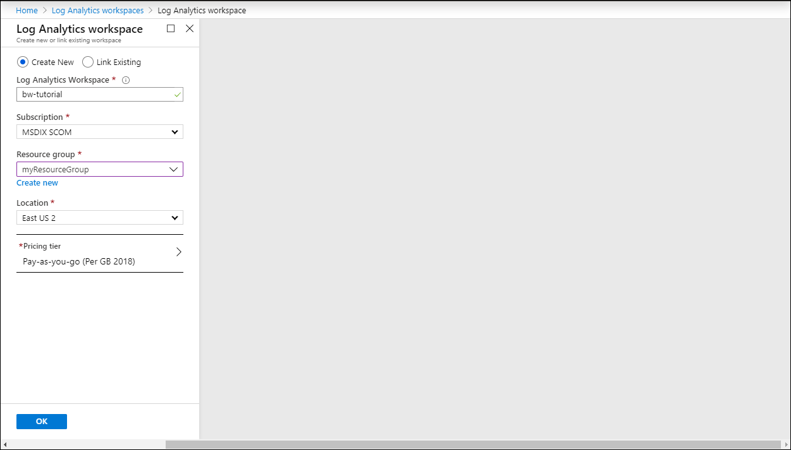
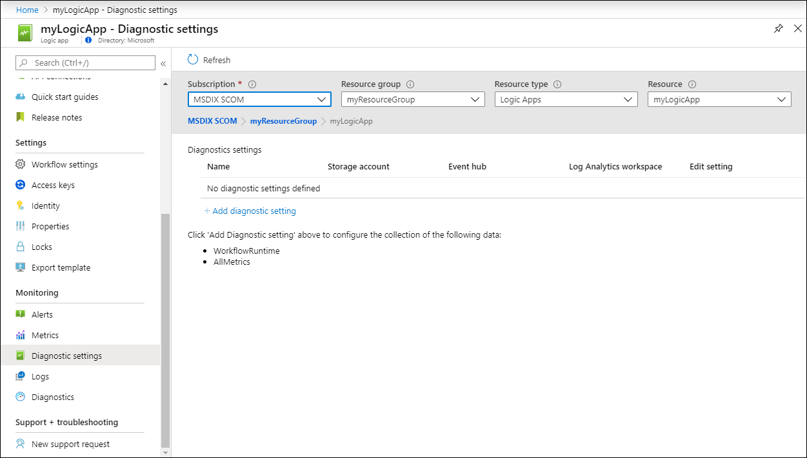
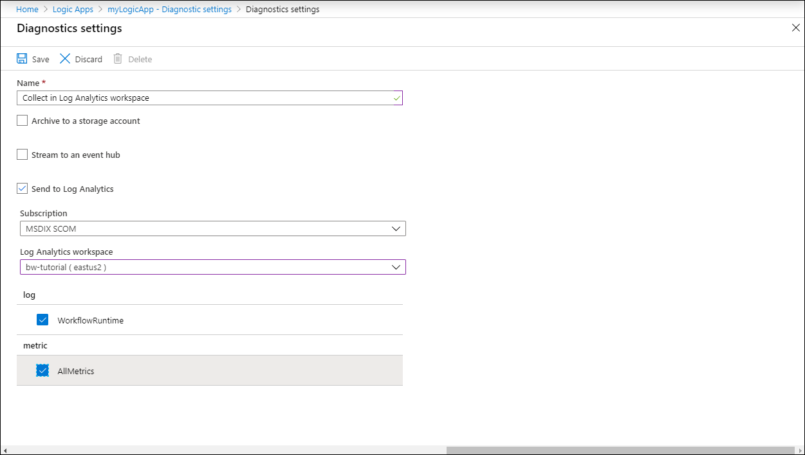
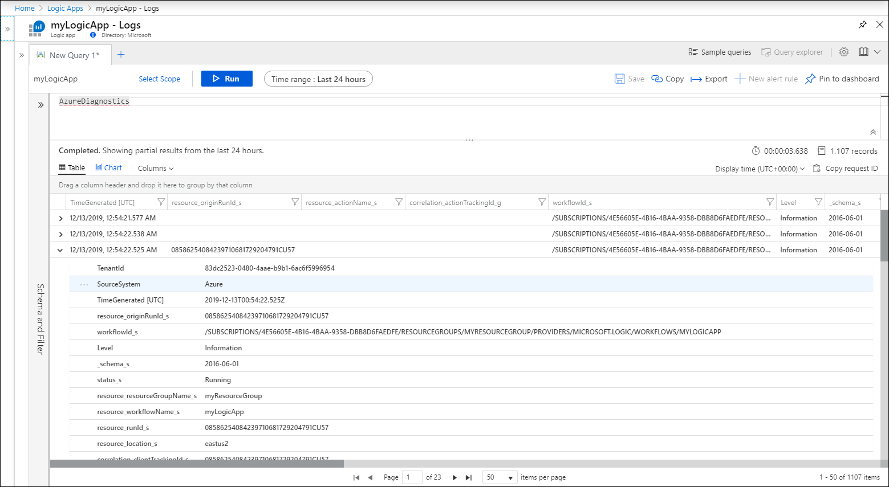

# Tutorial: Collect and analyze resource logs from an Azure resource

Resource logs provide insight into the detailed operation of an Azure resource and are useful for monitoring their health and availability. Azure resources generate resource logs automatically, but you must configure where they should be collected. This tutorial takes you through the process of creating a diagnostic setting to collect resource logs for a resource in your Azure subscription and analyzing it with a log query.

In this tutorial, you learn how to:

> [!div class="checklist"]
> * Create a Log Analytics workspace in Azure Monitor
> * Create a diagnostic setting to collect resource logs 
> * Create a simple log query to analyze logs

## Prerequisites

To complete this tutorial you need an Azure resource to monitor. You can use any resource in your Azure subscription that supports diagnostic settings. To determine whether a resource supports diagnostic settings, go to its menu in the Azure portal and verify that there's a **Diagnostic settings** option in the **Monitoring** section of the menu.

## Log in to Azure
Log in to the Azure portal at [https://portal.azure.com](https://portal.azure.com).

## Create a workspace
A Log Analytics workspace in Azure Monitor collects and indexes log data from a variety of sources and allows advanced analysis using a powerful query language. The Log Analytics workspace needs to exist before you create a diagnostic setting to send data into it. You can use an existing workspace in your Azure subscription or create one with the following procedure. 

> [!NOTE]
> While you can work with data in Log Analytics workspaces in the **Azure Monitor** menu, you create and manage workspaces in the **Log Analytics workspaces** menu.

1. From **All services**, select **Log Analytics workspaces**.
2. Click **Add** at the top of the screen and provide the following details for the workspace:
   - **Log Analytics workspace**: Name for the new workspace. This name must be globally unique across all Azure Monitor subscriptions.
   - **Subscription**: Select the subscription to store the workspace. This does not need to be the same subscription same as the resource being monitored.
   - **Resource Group**: Select an existing resource group or click **Create new** to create a new one. This does not need to be the same resource group same as the resource being monitored.
   - **Location**: Select an Azure region or create a new one. This does not need to be the same location same as the resource being monitored.
   - **Pricing tier**: Select *Pay-as-you-go* as the pricing tier. You can change this pricing tier later. Click the **Log Analytics pricing** link to learn more about different pricing tiers.

    

3. Click **OK** to create the workspace.

## Create a diagnostic setting
[Diagnostic settings](../platform/diagnostic-settings.md) define where resource logs should be sent for a particular resource. A single diagnostic setting can have multiple [destinations](../platform/diagnostic-settings.md#destinations), but we'll only use a Log Analytics workspace in this tutorial.

1. Under the **Monitoring** section of your resource's menu, select **Diagnostic settings**.
2. You should have a message "No diagnostic settings defined". Click **Add diagnostic setting**.

    

3. Each diagnostic setting has three basic parts:
 
   - **Name**: This has no significant effect and should simply be descriptive to you.
   - **Destinations**: One or more destinations to send the logs. All Azure services share the same set of three possible destinations. Each diagnostic setting can define one or more destinations but no more than one destination of a particular type. 
   - **Categories**: Categories of logs to send to each of the destinations. The set of categories will vary for each Azure service.

4. Select **Send to Log Analytics workspace** and then select the workspace that you created.
5. Select the categories that you want to collect. See the documentation for each service for a definition of its available categories.

    

6. Click **Save** to save the diagnostic settings.

    
 
 ## Use a log query to retrieve logs
Data is retrieved from a Log Analytics workspace using a log query written in Kusto Query Language (KQL). Insights and solutions in Azure Monitor will provide log queries to retrieve data for a particular service, but you can work directly with log queries and their results in the Azure portal with Log Analytics. 

1. Under the **Monitoring** section of your resource's menu, select **Logs**.
2. Log Analytics opens with an empty query window with the scope set to your resource. Any queries will include only records from that resource.

    > [!NOTE]
    > If you opened Logs from the Azure Monitor menu, the scope would be set to the Log Analytics workspace. In this case, any queries will include all records in the workspace.
   
    

4. The service shown in the example writes resource logs to the **AzureDiagnostics** table, but other services may write to other tables. See [Supported services, schemas, and categories for Azure Resource Logs](../platform/diagnostic-logs-schema.md) for tables used by different Azure services.

    > [!NOTE]
    > Multiple services write resource logs to the AzureDiagnostics table. If you start Log Analytics from the Azure Monitor menu, then you would need to add a `where` statement with the `ResourceProvider` column to specify your particular service. When you start Log Analytics from a resource's menu, then the scope is set to only records from this resource so this column isn't required. See the service's documentation for sample queries.

5. Type in a query and click **Run** to inspect results. 
6. See [Get started with log queries in Azure Monitor](../log-query/get-started-queries.md) for a tutorial on writing log queries.

    

## Next steps
Now that you've learned how to collect resource logs into a Log Analytics workspace, complete a tutorial on writing log queries to analyze this data.

> [!div class="nextstepaction"]
> [Get started with log queries in Azure Monitor](../log-query/get-started-queries.md)
