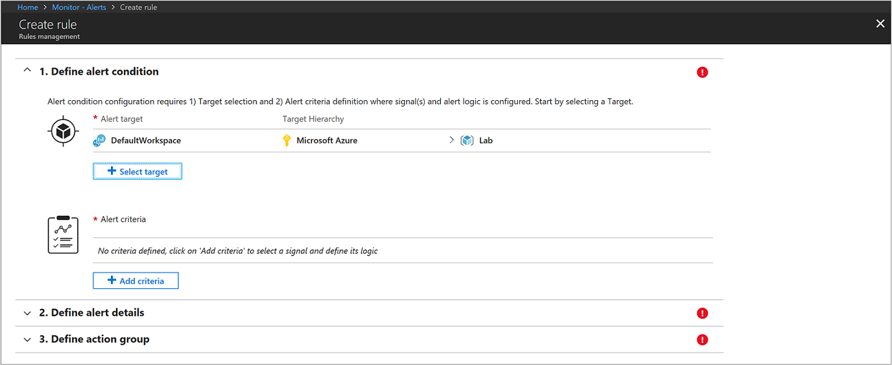
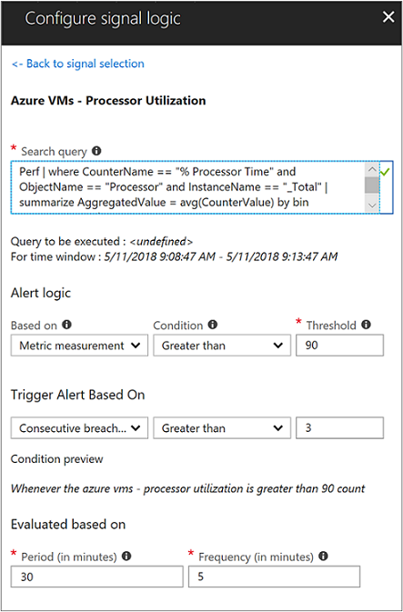
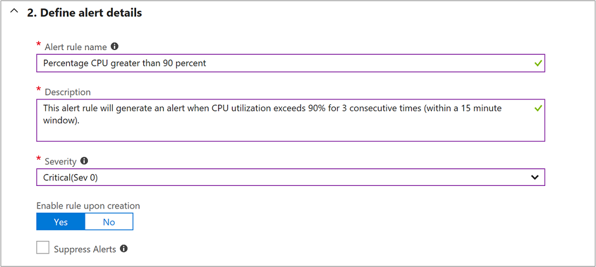
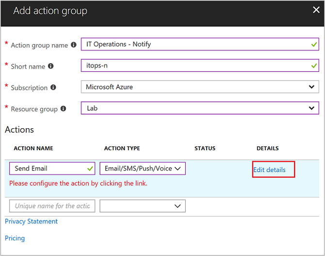
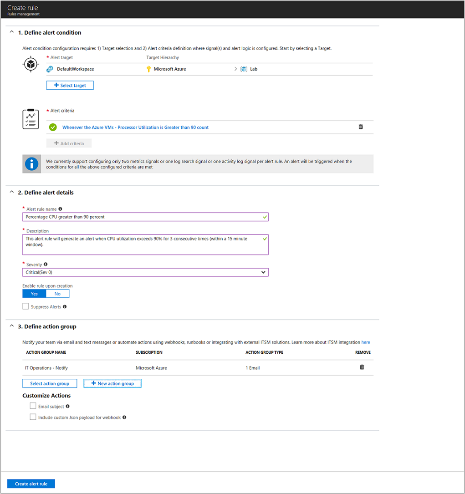

# Respond to events with Azure Monitor Alerts
Alerts in Azure Monitor can identify important information in your Log Analytics repository. They are created by alert rules that automatically run log searches at regular intervals, and if results of the log search match particular criteria, then an alert record is created and it can be configured to perform an automated response.  This tutorial is a continuation of the [Create and share dashboards of Log Analytics data](tutorial-logs-dashboards.md) tutorial.   

In this tutorial, you learn how to:

> [!div class="checklist"]
> * Create an alert rule
> * Configure an Action Group to send an e-mail notification

To complete the example in this tutorial, you must have an existing virtual machine [connected to the Log Analytics workspace](../../azure-monitor/learn/quick-collect-azurevm.md).  

## Sign in to Azure portal
Sign in to the Azure portal at [https://portal.azure.com](https://portal.azure.com). 

## Create alerts
Alerts are created by alert rules in Azure Monitor and can automatically run saved queries or custom log searches at regular intervals.  You can create alerts based on specific performance metrics or when certain events are created, absence of an event, or a number of events are created within a particular time window.  For example, alerts can be used to notify you when average CPU usage exceeds a certain threshold, when a missing update is detected, or when an event is generated upon detecting that a specific Windows service or Linux daemon is not running.  If the results of the log search match particular criteria, then an alert is created. The rule can then automatically run one or more actions, such as notify you of the alert or invoke another process. 

In the following example, you create a metric measurement alert rule based off of the *Azure VMs - Processor Utilization* query saved in the [Visualize data tutorial](tutorial-logs-dashboards.md).  An alert is created for each virtual machine that exceeds a threshold of 90%.  

1. In the Azure portal, click **All services**. In the list of resources, type **Log Analytics**. As you begin typing, the list filters based on your input. Select **Log Analytics**.
2. In the left-hand pane, select **Alerts** and then click **New Alert Rule** from the top of the page to create a new alert.    
3. For the first step, under the **Create Alert** section, you are going to select your Log Analytics workspace as the resource, since this is a log based alert signal.  Filter the results by choosing the specific **Subscription** from the drop-down list if you have more than one, which contains the VM and Log Analytics workspace created earlier.  Filter the **Resource Type** by selecting **Log Analytics** from the drop-down list.  Finally, select the **Resource** **DefaultLAWorkspace** and then click **Done**.    
4. Under the section **Alert Criteria**, click **Add Criteria** to select our saved query and then specify logic that the alert rule follows.  From the **Configure signal logic** pane, select *Azure VMs - Processor Utilization* from the list.  The pane updates to present the configuration settings for the alert.  On the top, it shows the results for the last 30 minutes of the selected signal and the search query itself.  
5. Configure the alert with the following information:  
   a. From the **Based on** drop-down list, select **Metric measurement**.  A metric measurement will create an alert for each object in the query with a value that exceeds our specified threshold.  
   b. For the **Condition**, select **Greater than** and enter **90** for **Threshold**.  
   c. Under Trigger Alert Based On section, select **Consecutive breaches** and from the drop-down list select **Greater than** enter a value of 3.  
   d. Under Evaluation based on section, modify the **Period** value to **30** minutes. The rule will run every five minutes and return records that were created within the last thirty minutes from the current time.  Setting the time period to a wider window accounts for the potential of data latency, and ensures the query returns data to avoid a false negative where the alert never fires.  
6. Click **Done** to complete the alert rule.     
7. Now moving onto the second step, provide a name of your alert in the **Alert rule name** field, such as **Percentage CPU greater than 90 percent**.  Specify a **Description** detailing specifics for the alert, and select **Critical(Sev 0)** for the **Severity** value from the options provided.    
8. To immediately activate the alert rule on creation, accept the default value for **Enable rule upon creation**.
9. For the third and final step, you specify an **Action Group**, which ensures that the same actions are taken each time an alert is triggered and can be used for each rule you define.  Configure a new action group with the following information:  
   a. Select **New action group** and the **Add action group** pane appears.  
   b. For **Action group name**, specify a name such as **IT Operations - Notify** and a **Short name** such as **itops-n**.  
   c. Verify the default values for **Subscription** and **Resource group** are correct. If not, select the correct one from the drop-down list.   
   d. Under the Actions section, specify a name for the action, such as **Send Email** and under **Action Type** select **Email/SMS/Push/Voice** from the drop-down list. The **Email/SMS/Push/Voice** properties pane will open to the right in order to provide additional information.  
   e. On the **Email/SMS/Push/Voice** pane, enable **Email** and provide a valid email SMTP address to deliver the message to.  
   f. Click **OK** to save your changes.   

    

10. Click **OK** to complete the action group. 
11. Click **Create alert rule** to complete the alert rule. It starts running immediately.     

## View your alerts in Azure portal
Now that you have created an alert, you can view Azure alerts in a single pane and manage all alert rules across your Azure subscriptions. It lists all the alert rules (enabled or disabled) and can be sorted based on target resources, resource groups, rule name, or status. Included is an aggregated summary of all the fired alerts, and total configured/enabled alert rules.     

When the alert triggers, the table reflects the condition and how many times it occurred within the time range selected (the default is last six hours).  There should be a corresponding email in your inbox similar to the following example showing the offending virtual machine and the top results that matched the search query in this case.   

## Next steps
In this tutorial, you learned how alert rules can proactively identify and respond to an issue when they run log searches at scheduled intervals and match a particular criteria.

Follow this link to see pre-built Log Analytics script samples.  

> [!div class="nextstepaction"]
> [Log Analytics script samples](../../azure-monitor/platform/powershell-samples.md)
