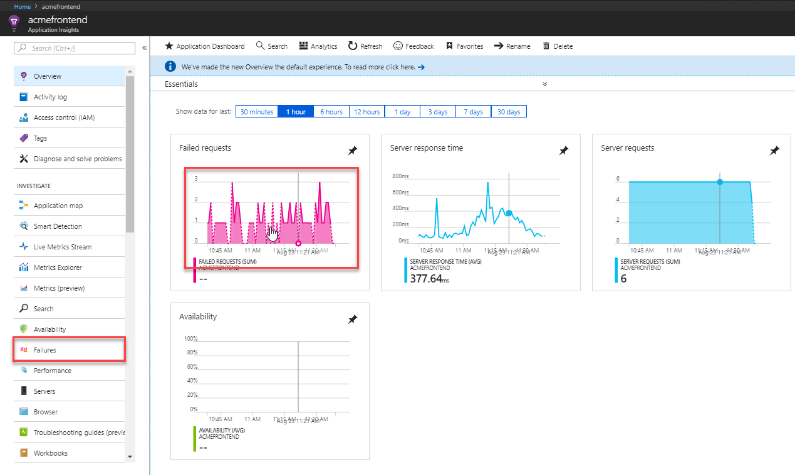
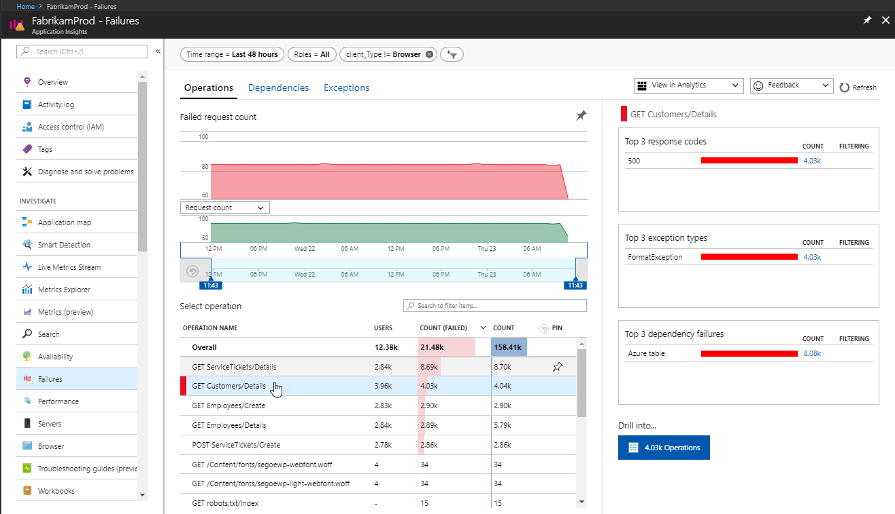
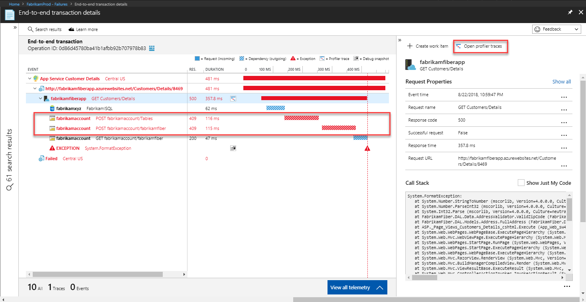
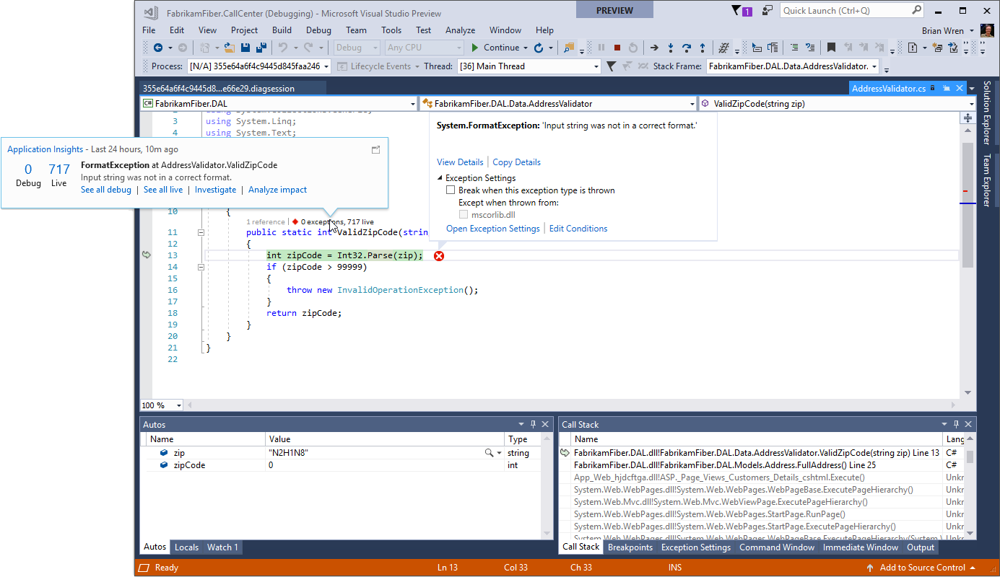

# Find and diagnose run-time exceptions with Azure Application Insights

Azure Application Insights collects telemetry from your application to help identify and diagnose run-time exceptions.  This tutorial takes you through this process with your application.  You learn how to:

> [!div class="checklist"]
> * Modify your project to enable exception tracking
> * Identify exceptions for different components of your application
> * View details of an exception
> * Download a snapshot of the exception to Visual Studio for debugging
> * Analyze details of failed requests using query language
> * Create a new work item to correct the faulty code

## Prerequisites

To complete this tutorial:

- Install [Visual Studio 2019](https://www.visualstudio.com/downloads/) with the following workloads:
	- ASP.NET and web development
	- Azure development
- Download and install the [Visual Studio Snapshot Debugger](https://aka.ms/snapshotdebugger).
- Enable [Visual Studio Snapshot Debugger](https://docs.microsoft.com/azure/application-insights/app-insights-snapshot-debugger)
- Deploy a .NET application to Azure and [enable the Application Insights SDK](../../azure-monitor/app/asp-net.md). 
- The tutorial tracks the identification of an exception in your application, so modify your code in your development or test environment to generate an exception. 

## Log in to Azure
Log in to the Azure portal at [https://portal.azure.com](https://portal.azure.com).

## Analyze failures
Application Insights collects any failures in your application and lets you view their frequency across different operations to help you focus your efforts on those with the highest impact.  You can then drill down on details of these failures to identify root cause.   

1. Select **Application Insights** and then your subscription.  
2. To open the **Failures** panel either select **Failures** under the **Investigate** menu or click the **Failed requests** graph.

	

3. The **Failed requests** panel shows the count of failed requests and the number of users affected for each operation for the application.  By sorting this information by user you can identify those failures that most impact users.  In this example, the **GET Employees/Create** and **GET Customers/Details** are likely candidates to investigate because of their large number of failures and impacted users.  Selecting an operation shows further information about this operation in the right panel.

	

4. Reduce the time window to zoom in on the period where the failure rate shows a spike.

	

5. See the related samples by clicking on the button with the number of filtered results. The "suggested" samples have related telemetry from all components, even if sampling may have been in effect in any of them. Click on a search result to see the details of the failure.

	

6. The details of the failed request shows the Gantt chart which shows that there were two dependency failures in this transaction, which also attributed to over 50% of the total duration of the transaction. This experience presents all telemetry, across components of a distributed application that are related to this operation ID. [Learn more about the new experience](../../azure-monitor/app/transaction-diagnostics.md). You can select any of the items to see its details on the right side. 

	

7. The operations detail also shows a FormatException which appears to have caused the failure.  You can see that it's due to an invalid zip code. You can open the debug snapshot to see code level debug information in Visual Studio.

	

## Identify failing code
The Snapshot Debugger collects snapshots of the most frequent exceptions in your application to assist you in diagnosing its root cause in production.  You can view debug snapshots in the portal to see the call stack and inspect variables at each call stack frame. Afterwards, you have the option to debug the source code by downloading the snapshot and opening it in Visual Studio 2019 Enterprise.

1. In the properties of the exception, click **Open debug snapshot**.
2. The **Debug Snapshot** panel opens with the call stack for the request.  Click any method to view the values of all local variables at the time of the request.  Starting from the top method in this example, we can see local variables that have no value.

	

3. The first call that has valid values is **ValidZipCode**, and we can see that a zip code was provided with letters that isn't able to be translated into an integer.  This appears to be the error in the code that needs to be corrected.

	

4. You then have the option to download this snapshot into Visual Studio where we can locate the actual code that needs to be corrected. To do so, click **Download Snapshot**.
5. The snapshot is loaded into Visual Studio.
6. You can now run a debug session in Visual Studio Enterprise that quickly identifies the line of code that caused the exception.

	

## Use analytics data
All data collected by Application Insights is stored in Azure Log Analytics, which provides a rich query language that allows you to analyze the data in a variety of ways.  We can use this data to analyze the requests that generated the exception we're researching. 

1. Click the CodeLens information above the code to view telemetry provided by Application Insights.

	

1. Click **Analyze impact** to open Application Insights Analytics.  It's populated with several queries that provide details on failed requests such as impacted users, browsers, and regions.   

## Add work item
If you connect Application Insights to a tracking system such as Azure DevOps or GitHub, you can create a work item directly from Application Insights.

1. Return to the **Exception Properties** panel in Application Insights.
2. Click **New Work Item**.
3. The **New Work Item** panel opens with details about the exception already populated.  You can add any additional information before saving it.

	

## Next steps
Now that you've learned how to identify run-time exceptions, advance to the next tutorial to learn how to identify and diagnose performance issues.

> [!div class="nextstepaction"]
> [Identify performance issues](../../azure-monitor/learn/tutorial-performance.md)