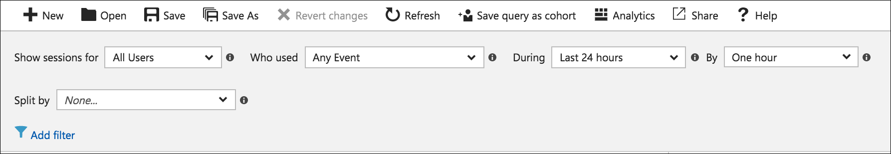
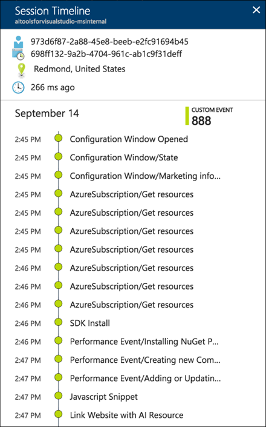
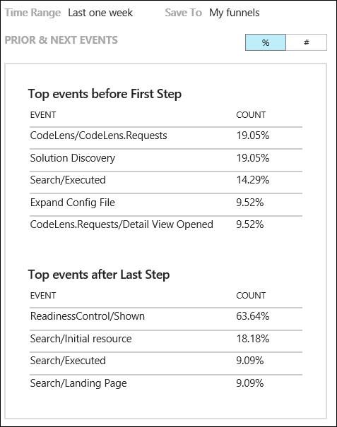
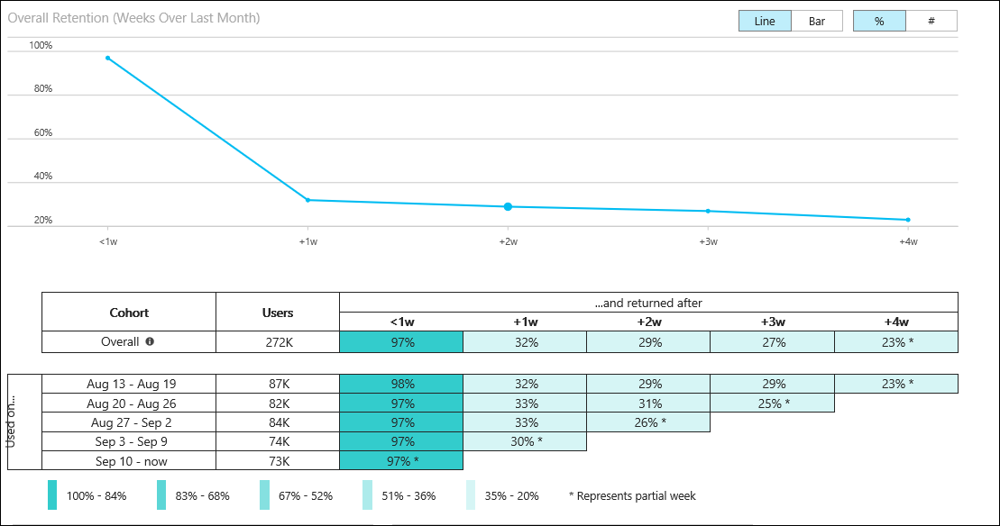
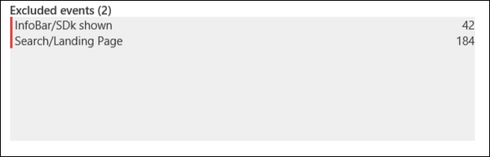

# Use Azure Application Insights to understand how customers are using your application

Azure Application Insights collects usage information to help you understand how your users interact with your application.  This tutorial walks you through the different resources that are available to analyze this information.  You will learn how to:

> [!div class="checklist"]
> * Analyze details about users accessing your application
> * Use session information to analyze how customers use your application
> * Define funnels that let you compare your desired user activity to their actual activity 
> * Create a workbook to consolidate visualizations and queries into a single document
> * Group similar users to analyze them together
> * Learn which users are returning to your application
> * Inspect how users navigate through your application

## Prerequisites

To complete this tutorial:

- Install [Visual Studio 2019](https://www.visualstudio.com/downloads/) with the following workloads:
	- ASP.NET and web development
	- Azure development
- Download and install the [Visual Studio Snapshot Debugger](https://aka.ms/snapshotdebugger).
- Deploy a .NET application to Azure and [enable the Application Insights SDK](../../azure-monitor/app/asp-net.md). 
- [Send telemetry from your application](../../azure-monitor/app/usage-overview.md#send-telemetry-from-your-app) for adding custom events/page views
- Send [user context](https://docs.microsoft.com/azure/application-insights/app-insights-usage-send-user-context) to track what a user does over time and fully utilize the usage features.

## Log in to Azure
Log in to the Azure portal at [https://portal.azure.com](https://portal.azure.com).

## Get information about your users
The **Users** panel allows you to understand important details about your users in a variety of ways. You can use this panel to understand such information as where your users are connecting from, details of their client, and what areas of your application they're accessing. 

1. Select **Application Insights** and then select your subscription.
2. Select **Users** in the menu.
3. The default view shows the number of unique users that have connected to your application over the past 24 hours.  You can change the time window and set various other criteria to filter this information.

	

6. Click the **During** dropdown and change the time window to 7 days.  This increases the data included in the different charts in the panel.

	

4. Click the **Split by** dropdown to add a breakdown by a user property to the graph.  Select **Country or region**.  The graph includes the same data but allows you to view a breakdown of the number of users for each country/region.

	

5. Position the cursor over different bars in the chart and note that the count for each country/region reflects only the time window represented by that bar.
6. Have a look at the **Insights** column at the right that perform analysis on your user data.  This provides information such as the number of unique sessions over the time period and records with common properties that make up significant of the user data 

	

## Analyze user sessions
The **Sessions** panel is similar to the **Users** panel.  Where **Users** helps you understand details about the users accessing your application, **Sessions** helps you understand how those users used your application.  

1. Select **Sessions** in the menu.
2. Have a look at the graph and note that you have the same options to filter and break down the data as in the **Users** panel.

	

3. The **Sample of these sessions** pane on the right lists sessions that include a large number of events.  These are interesting sessions to analyze.

	

4. Click on one of the sessions to view its **Session Timeline**, which shows every action in the sessions.  This can help you identify information such as the sessions with a large number of exceptions.

	

## Group together similar users
A **Cohort** is a set of users grouped on similar characteristics.  You can use cohorts to filter data in other panels allowing you to analyze particular groups of users.  For example, you might want to analyze only users who completed a purchase.

1.  Select **Cohorts** in the menu.
2.  Click **New** to create a new cohort.
3.  Select the **Who used** dropdown and select an action.  Only users who performed this action within the time window of the report will be included.

	

4.  Select **Users** in the menu.
5.  In the **Show** dropdown, select the cohort you just created.  The data for the graph is limited to those users.

	

## Compare desired activity to reality
While the previous panels are focused on what users of your application did, **Funnels** focus on what you want users to do.  A funnel represents a set of steps in your application and the percentage of users who move between steps.  For example, you could create a funnel that measures the percentage of users who connect to your application who search product.  You can then see the percentage of users who add that product to a shopping cart, and then the percentage of those who complete a purchase.

1. Select **Funnels** in the menu and then click **New**. 

	

2. Type in a **Funnel Name**.
3. Create a funnel with at least two steps by selecting an action for each step.  The list of actions is built from usage data collected by Application Insights.

	

4. Click **Save** to save the funnel and then view its results.  The window to the right of the funnel shows the most common events before the first activity and after the last activity to help you understand user tendencies around the particular sequence.

	

## Learn which customers return
**Retention** helps you understand which users are coming back to your application.  

1. Select **Retention** in the menu.
2. By default, the analyzed information includes users who performed any action and then returned to perform any action.  You can change this filter to any include, for example, only those users who returned after completing a purchase.

	

3. The returning users that match the criteria are shown in graphical and table form for different time durations.  The typical pattern is for a gradual drop in returning users over time.  A sudden drop from one time period to the next might raise a concern. 

	

## Analyze user navigation
A **User flow** visualizes how users navigate between the pages and features of your application.  This helps you answer questions such as where users typically move from a particular page, how they typically exit your application, and if there are any actions that are regularly repeated.

1.  Select **User flows** in the menu.
2.  Click **New** to create a new user flow and then click **Edit** to edit its details.
3.  Increase the **Time Range** to 7 days and then select an initial event.  The flow will track user sessions that start with that event.

	

4.  The user flow is displayed, and you can see the different user paths and their session counts.  Blue lines indicate an action that the user performed after the current action.  A red line indicates the end of the user session.

	

5.  To remove an event from the flow, click the **x** in the corner of the action and then click **Create Graph**.  The graph is redrawn with any instances of that event removed.  Click **Edit** to see that the event is now added to **Excluded events**.

	

## Consolidate usage data
**Workbooks** combine data visualizations, Analytics queries, and text into interactive documents.  You can use workbooks to group together common usage information, consolidate information from a particular incident, or report back to your team on your application's usage.

1.  Select **Workbooks** in the menu.
2.  Click **New** to create a new workbook.
3.  A query is already provided that includes all usage data in the last day displayed as a bar chart.  You can use this query, manually edit it, or click **Sample queries** to select from other useful queries.

	

4.  Click **Done editing**.
5.  Click **Edit** in the top pane to edit the text at the top of the workbook.  This is formatted using markdown.

	

6.  Click **Add users** to add a graph with user information.  Edit the details of the graph if you want and then click **Done editing** to save it.

## Next steps
Now that you've learned how to analyze your users, advance to the next tutorial to learn how to create custom dashboards that combine this information with other useful data about your application.

> [!div class="nextstepaction"]
> [Create custom dashboards](../../azure-monitor/learn/tutorial-app-dashboards.md)
