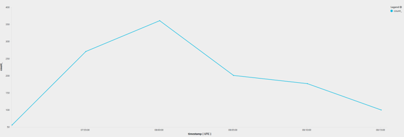

# Aggregations in Azure Monitor log queries

> [!NOTE]
> You should complete [Get started with the Analytics portal](get-started-portal.md) and [Getting started with queries](get-started-queries.md) before completing this lesson.

[!INCLUDE [log-analytics-demo-environment](../../../includes/log-analytics-demo-environment.md)]

This article describes aggregation functions in Azure Monitor log queries that offer useful ways to analyze your data. These functions all work with the `summarize` operator that produces a  table with aggregated results of the input table.

## Counts

### count
Count the number of rows in the result set after any filters are applied. The following example returns the total number of rows in the _Perf_ table from the last 30 minutes. The result is returned in a column named *count_* unless you assign it a specific name:


```Kusto
Perf
| where TimeGenerated > ago(30m) 
| summarize count()
```

```Kusto
Perf
| where TimeGenerated > ago(30m) 
| summarize num_of_records=count() 
```

A timechart visualization can be useful to see a trend over time:

```Kusto
Perf 
| where TimeGenerated > ago(30m) 
| summarize count() by bin(TimeGenerated, 5m)
| render timechart
```

The output from this example shows the perf record count trendline in 5 minutes' intervals:




### dcount, dcountif
Use `dcount` and `dcountif` to count distinct values in a specific column. The following query evaluates how many distinct computers sent heartbeats in the last hour:

```Kusto
Heartbeat 
| where TimeGenerated > ago(1h) 
| summarize dcount(Computer)
```

To count only the Linux computers that sent heartbeats, use `dcountif`:

```Kusto
Heartbeat 
| where TimeGenerated > ago(1h) 
| summarize dcountif(Computer, OSType=="Linux")
```

### Evaluating subgroups
To perform a count or other aggregations on subgroups in your data, use the `by` keyword. For example, to count the number of distinct Linux computers that sent heartbeats in each country/region:

```Kusto
Heartbeat 
| where TimeGenerated > ago(1h) 
| summarize distinct_computers=dcountif(Computer, OSType=="Linux") by RemoteIPCountry
```

|RemoteIPCountry  | distinct_computers  |
------------------|---------------------|
|United States 	  | 19          		|
|Canada        	  | 3       	  		|
|Ireland   	      | 0		       		|
|United Kingdom	  | 0		       		|
|Netherlands	  | 2  					|


To analyze even smaller subgroups of your data, add additional column names to the `by` section. For example, you might want to count the distinct computers from each country/region per OSType:

```Kusto
Heartbeat 
| where TimeGenerated > ago(1h) 
| summarize distinct_computers=dcountif(Computer, OSType=="Linux") by RemoteIPCountry, OSType
```

## Percentiles and Variance
When evaluating numerical values, a common practice is to average them using `summarize avg(expression)`. Averages are affected by extreme values that characterize only a few cases. To address that issue, you can use less sensitive functions such as `median` or `variance`.

### Percentile
To find the median value, use the `percentile` function with a value to specify the percentile:

```Kusto
Perf
| where TimeGenerated > ago(30m) 
| where CounterName == "% Processor Time" and InstanceName == "_Total" 
| summarize percentiles(CounterValue, 50) by Computer
```

You can also specify different percentiles to get an aggregated result for each:

```Kusto
Perf
| where TimeGenerated > ago(30m) 
| where CounterName == "% Processor Time" and InstanceName == "_Total" 
| summarize percentiles(CounterValue, 25, 50, 75, 90) by Computer
```

This might show that some computer CPUs have similar median values, but while some are steady around the median, other computers have reported much lower and higher CPU values meaning they experienced spikes.

### Variance
To directly evaluate the variance of a value, use the standard deviation and variance methods:

```Kusto
Perf
| where TimeGenerated > ago(30m) 
| where CounterName == "% Processor Time" and InstanceName == "_Total" 
| summarize stdev(CounterValue), variance(CounterValue) by Computer
```

A good way to analyze the stability of the CPU usage is to combine stdev with the median calculation:

```Kusto
Perf
| where TimeGenerated > ago(130m) 
| where CounterName == "% Processor Time" and InstanceName == "_Total" 
| summarize stdev(CounterValue), percentiles(CounterValue, 50) by Computer
```

See other lessons for using the [Kusto query language](/azure/kusto/query/) with Azure Monitor log data:

- [String operations](string-operations.md)
- [Date and time operations](datetime-operations.md)
- [Advanced aggregations](advanced-aggregations.md)
- [JSON and data structures](json-data-structures.md)
- [Advanced query writing](advanced-query-writing.md)
- [Joins](joins.md)
- [Charts](charts.md)
