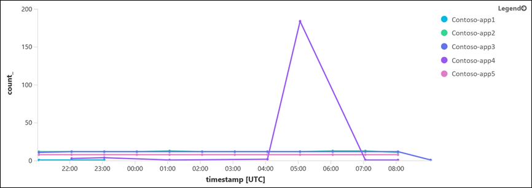

# Perform cross-resource log queries in Azure Monitor  

> [!IMPORTANT]
> If you are using a [workspace-based Application Insights resource](../app/create-workspace-resource.md) telemetry is stored in a Log Analytics workspace with all other log data. Use the log() expression to write a query that includes application in multiple workspaces. For multiple applications in the same workspace, you don't need a cross workspace query.

Previously with Azure Monitor, you could only analyze data from within the current workspace, and it limited your ability to query across multiple workspaces defined in your subscription.  Additionally, you could only search telemetry items collected from your web-based application with Application Insights directly in Application Insights or from Visual Studio. This also made it a challenge to natively analyze operational and application data together.

Now you can query not only across multiple Log Analytics workspaces, but also data from a specific Application Insights app in the same resource group, another resource group, or another subscription. This provides you with a system-wide view of your data. You can only perform these types of queries in [Log Analytics](portals.md).

## Cross-resource query limits 

* The number of Application Insights resources and Log Analytics workspaces that you can include in a single query is limited to 100.
* Cross-resource query is not supported in View Designer. You can Author a query in Log Analytics and pin it to Azure dashboard to [visualize a log query](../learn/tutorial-logs-dashboards.md). 
* Cross-resource query in log alerts is supported in the new [scheduledQueryRules API](https://docs.microsoft.com/rest/api/monitor/scheduledqueryrules). By default, Azure Monitor uses the [legacy Log Analytics Alert API](../platform/api-alerts.md) for creating new log alert rules from Azure portal, unless you switch from [legacy Log Alerts API](../platform/alerts-log-api-switch.md#process-of-switching-from-legacy-log-alerts-api). After the switch, the new API becomes the default for new alert rules in Azure portal and it lets you create cross-resource query log alerts rules. You can create cross-resource query log alert rules without making the switch by using the [Azure Resource Manager template for scheduledQueryRules API](../platform/alerts-log.md#log-alert-with-cross-resource-query-using-azure-resource-template) – but this alert rule is manageable though [scheduledQueryRules API](https://docs.microsoft.com/rest/api/monitor/scheduledqueryrules) and not from Azure portal.


## Querying across Log Analytics workspaces and from Application Insights
To reference another workspace in your query, use the [*workspace*](https://docs.microsoft.com/azure/log-analytics/query-language/workspace-expression) identifier, and for an app from Application Insights, use the [*app*](https://docs.microsoft.com/azure/log-analytics/query-language/app-expression) identifier.  

### Identifying workspace resources
The following examples demonstrate queries across Log Analytics workspaces to return summarized counts of logs from the Update table on a workspace named *contosoretail-it*. 

Identifying a workspace can be accomplished one of several ways:

* Resource name - is a human-readable name of the workspace, sometimes referred to as *component name*. 

    `workspace("contosoretail-it").Update | count`

* Qualified name - is the “full name” of the workspace, composed of the subscription name, resource group, and component name in this format: *subscriptionName/resourceGroup/componentName*. 

    `workspace('contoso/contosoretail/contosoretail-it').Update | count`

    >[!NOTE]
    >Because Azure subscription names are not unique, this identifier might be ambiguous. 
    >

* Workspace ID - A workspace ID is the unique, immutable, identifier assigned to each workspace represented as a globally unique identifier (GUID).

    `workspace("b459b4u5-912x-46d5-9cb1-p43069212nb4").Update | count`

* Azure Resource ID – the Azure-defined unique identity of the workspace. You use the Resource ID when the resource name is ambiguous.  For workspaces, the format is: */subscriptions/subscriptionId/resourcegroups/resourceGroup/providers/microsoft.OperationalInsights/workspaces/componentName*.  

    For example:
    ``` 
    workspace("/subscriptions/e427519-5645-8x4e-1v67-3b84b59a1985/resourcegroups/ContosoAzureHQ/providers/Microsoft.OperationalInsights/workspaces/contosoretail-it").Update | count
    ```

### Identifying an application
The following examples return a summarized count of requests made against an app named *fabrikamapp* in Application Insights. 

Identifying an application in Application Insights can be accomplished with the *app(Identifier)* expression.  The *Identifier* argument specifies the app using one of the following:

* Resource name - is a human readable name of the app, sometimes referred to as the *component name*.  

    `app("fabrikamapp")`

    >[!NOTE]
    >Identifying an application by name assumes uniqueness across all accessible subscriptions. If you have multiple applications with the specified name, the query fails because of the ambiguity. In this case, you must use one of the other identifiers.

* Qualified name - is the “full name” of the app, composed of the subscription name, resource group, and component name in this format: *subscriptionName/resourceGroup/componentName*. 

    `app("AI-Prototype/Fabrikam/fabrikamapp").requests | count`

     >[!NOTE]
    >Because Azure subscription names are not unique, this identifier might be ambiguous. 
    >

* ID - the app GUID of the application.

    `app("b459b4f6-912x-46d5-9cb1-b43069212ab4").requests | count`

* Azure Resource ID - the Azure-defined unique identity of the app. You use the Resource ID when the resource name is ambiguous. The format is: */subscriptions/subscriptionId/resourcegroups/resourceGroup/providers/microsoft.OperationalInsights/components/componentName*.  

    For example:
    ```
    app("/subscriptions/b459b4f6-912x-46d5-9cb1-b43069212ab4/resourcegroups/Fabrikam/providers/microsoft.insights/components/fabrikamapp").requests | count
    ```

### Performing a query across multiple resources
You can query multiple resources from any of your resource instances, these can be workspaces and apps combined.
    
Example for query across two workspaces:    

```
union Update, workspace("contosoretail-it").Update, workspace("b459b4u5-912x-46d5-9cb1-p43069212nb4").Update
| where TimeGenerated >= ago(1h)
| where UpdateState == "Needed"
| summarize dcount(Computer) by Classification
```

## Using cross-resource query for multiple resources
When using cross-resource queries to correlate data from multiple Log Analytics workspaces and Application Insights resources, the query can become complex and difficult to maintain. You should leverage [functions in Azure Monitor log queries](functions.md) to separate the query logic from the scoping of the query resources, which simplifies the query structure. The following example demonstrates how you can monitor multiple Application Insights resources and visualize the count of failed requests by application name. 

Create a query like the following that references the scope of Application Insights resources. The `withsource= SourceApp` command adds a column that designates the application name that sent the log. [Save the query as function](functions.md#create-a-function) with the alias _applicationsScoping_.

```Kusto
// crossResource function that scopes my Application Insights resources
union withsource= SourceApp
app('Contoso-app1').requests, 
app('Contoso-app2').requests,
app('Contoso-app3').requests,
app('Contoso-app4').requests,
app('Contoso-app5').requests
```


You can now [use this function](../../azure-monitor/log-query/functions.md#use-a-function) in a cross-resource query like the following. The function alias _applicationsScoping_ returns the union of the requests table from all the defined applications. The query then filters for failed requests and visualizes the trends by application. The _parse_ operator is optional in this example. It extracts the application name from _SourceApp_ property.

```Kusto
applicationsScoping 
| where timestamp > ago(12h)
| where success == 'False'
| parse SourceApp with * '(' applicationName ')' * 
| summarize count() by applicationName, bin(timestamp, 1h) 
| render timechart
```

>[!NOTE]
>This method can’t be used with log alerts because the access validation of the alert rule resources, including workspaces and applications, is performed at alert creation time. Adding new resources to the function after the alert creation isn’t supported. If you prefer to use function for resource scoping in log alerts, you need to edit the alert rule in the portal or with a Resource Manager template to update the scoped resources. Alternatively, you can include the list of resources in the log alert query.




## Next steps

- Review [Analyze log data in Azure Monitor](log-query-overview.md) for an overview of log queries and how Azure Monitor log data is structured.
- Review [Azure Monitor log queries](query-language.md) to view all of the resources for Azure Monitor log queries.