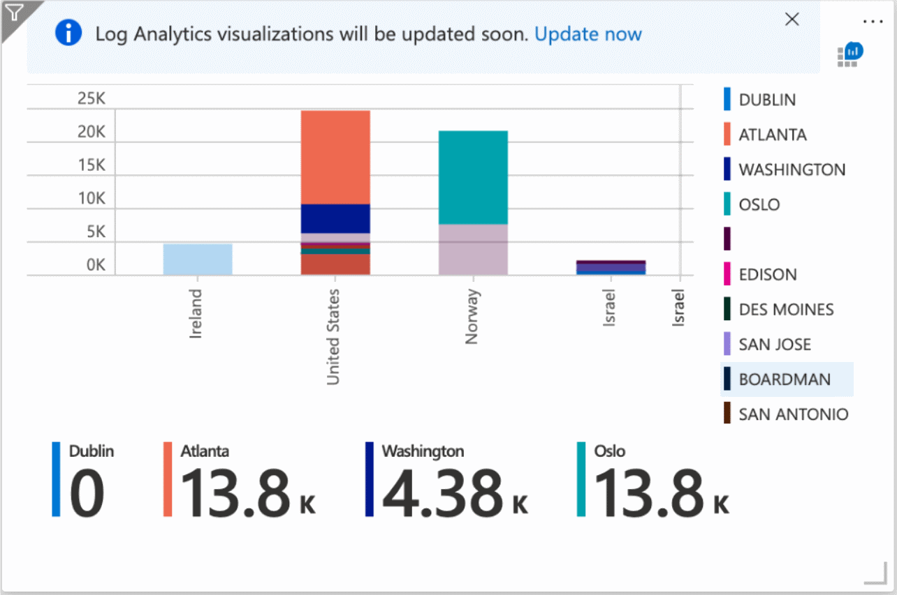
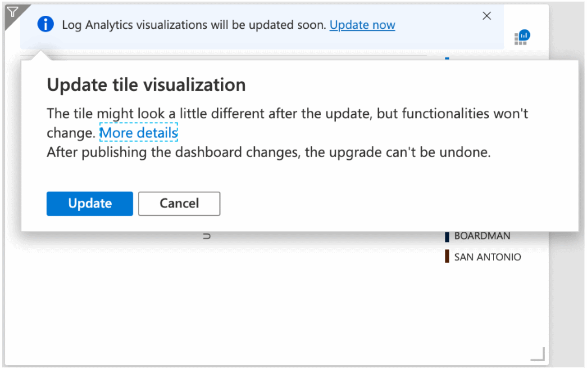
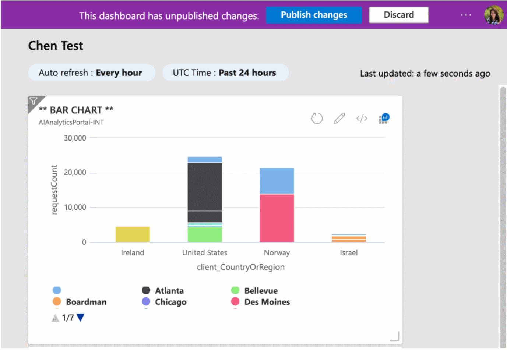

# Upgrading your Log Analytics Dashboard visualizations

In February 2020, we introduced an improved visualization technology. Improving and enhancing your ability to visualize query results and reach powerful insights, fast. 

You can read more about this upgrade in this [Azure Update](https://azure.microsoft.com/updates/azure-monitor-log-analytics-upgraded-results-visualization/). 

This new visualization technology is paving the way for new and improved experiences around your query result set. 

## Dashboards in Azure

Azure dashboards are a way to visualize the status of your entire Azure surface area. They are designed to provide a single pane of glass to your Azure estate status and allow a variety of shortcuts to common actions. 

For more information, see [Azure dashboards](https://docs.microsoft.com/azure/azure-portal/azure-portal-dashboards)

## Upgrading Log Analytics dashboard parts

The new visualization technology addresses some common issues with the old implementation and introduces some new capabilities to pinned Log Analytics parts: 

- **Same available types** - All visualization types available in Log Analytics are available as pinned parts on dashboards.

- **Consistent look-and-feel** - The visualization look-and-feel for pinned parts are now almost identical to those in Log Analytics. The differences are due to optimizations which require subtle differences in the data contents of the visual. See the considerations part of this document for more insight into those differences.

- **Tooltips and labels** – New pinned Log Analytics visualizations support tooltips. Pie and doughnut charts now support labels.

- **Interactive legends** – Clicking the visualization legend allows adding/removing of dimensions from the pinned visual as in Log Analytics.

## Stage 1 - Opt-in upgrade message

When a Log Analytics pinned part is able to be upgraded, a new *opt-in* notification appears on Log Analytics pinned parts in dashboards allowing users to upgrade their visualization. If you want to experience the new visualizations to upgrade selected visualizations in their dashboard.

 

 

> [!WARNING]
> Once the dashboard is published, the upgrade is irreversible. However, changes are discarded if you navigate away from the dashboard without re-publishing.  

Once clicked, the visualization will be updated to the new technology. Subtle differences in the visualization may occur to align with their look-and-feel in Log Analytics.

After the visualizations are upgraded, you need to republish your dashboard for the change to take effect.

## Stage 2 - Migration of all dashboards

After an initial opt-in period is over, the Log Analytics team will upgrade all dashboards in the system. Aligning all Azure dashboards allows the team to introduce more visualizations and experience improvements across the board.

## Considerations

Log Analytics visualizations pinned to a dashboard have some specific behavior designed for an optimal experience. Review the following design considerations when pinning a visualization to a dashboard.

### Query time scope - 30-day limit

As dashboards may contain multiple visualizations from multiple queries, the time scope for a single pinned query is limited to 30 days. A single query may only run on a time span smaller or equal to 30 days. This limitation is to ensure a reasonable dashboard load time.

### Query data values - 25 values and other grouping

Dashboards can be visually dense and complex. In order to reduce cognitive load when viewing a dashboard, we optimize the visualizations by limiting the display to 25 different data types. When there are more than 25, Log Analytics optimizes the data. It individually shows the 25 types with most data as separate and then groups the remaining values into an “other” value. The following chart shows such a case.  

### Dashboard refresh on load

Dashboards are refreshed upon load. All queries related to dashboard-pinned Log Analytics visualizations are executed and the dashboard is refreshed once it loads. If the dashboard page remains open, the data in the dashboard is refreshed every 60 minutes.

## Next steps

[Create and share dashboards in Log Analytics](../learn/tutorial-logs-dashboards.md)
