# Get started with Log Analytics in Azure Monitor

[!INCLUDE [log-analytics-demo-environment](../../../includes/log-analytics-demo-environment.md)]

In this tutorial you will learn how to use Log Analytics in the Azure portal to write Azure Monitor log queries. It will teach you how to:

- Use Log Analytics to write a simple query
- Understand the schema of your data
- Filter, sort, and group results
- Apply a time range
- Create charts
- Save and load queries
- Export and share queries

For a tutorial on writing log queries, see [Get started with log queries in Azure Monitor](get-started-queries.md).<br>
For more details on log queries, see [Overview of log queries in Azure Monitor](log-query-overview.md).

## Meet Log Analytics
Log Analytics is a web tool used to write and execute Azure Monitor log queries. Open it by selecting **Logs** in the Azure Monitor menu. It starts with a new blank query.

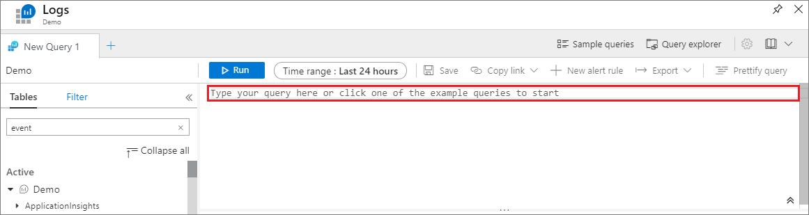

## Firewall requirements
To use Log Analytics, your browser requires access to the following addresses. If your browser is accessing the Azure portal through a firewall, you must enable access to these addresses.

| Uri | IP | Ports |
|:---|:---|:---|
| portal.loganalytics.io | Dynamic | 80,443 |
| api.loganalytics.io | Dynamic | 80,443 |
| docs.loganalytics.io | Dynamic | 80,443 |

## Basic queries
Queries can be used to search terms, identify trends, analyze patterns, and provide many other insights based on your data. Start with a basic query:

```Kusto
Event | search "error"
```

This query searches the _Event_ table for records that contain the term _error_ in any property.

Queries can start with either a table name or a [search](/azure/kusto/query/searchoperator) command. The above example starts with the table name _Event_, which retrieves all records from the Event table. The pipe (|) character separates commands, so the output of the first one serves as the input of the following command. You can add any number of commands to a single query.

Another way to write that same query would be:

```Kusto
search in (Event) "error"
```

In this example, **search** is scoped to the _Event_ table, and all records in that table are searched for the term _error_.

## Running a query
Run a query by clicking the **Run** button or pressing **Shift+Enter**. Consider the following details which determine the code that will be run and the data that's returned:

- Line breaks: A single break makes your query easier to read. Multiple line breaks split it into separate queries.
- Cursor: Place your cursor somewhere inside the query to execute it. The current query is considered to be the code up until a blank line is found.
- Time range - A time range of _last 24 hours_ is set by default. To use a different range, use the time-picker or add an explicit time range filter to your query.


## Understand the schema
The schema is a collection of tables visually grouped under a logical category. Several of the categories are from monitoring solutions. The _LogManagement_ category contains common data such as Windows and Syslog events, performance data, and agent heartbeats.

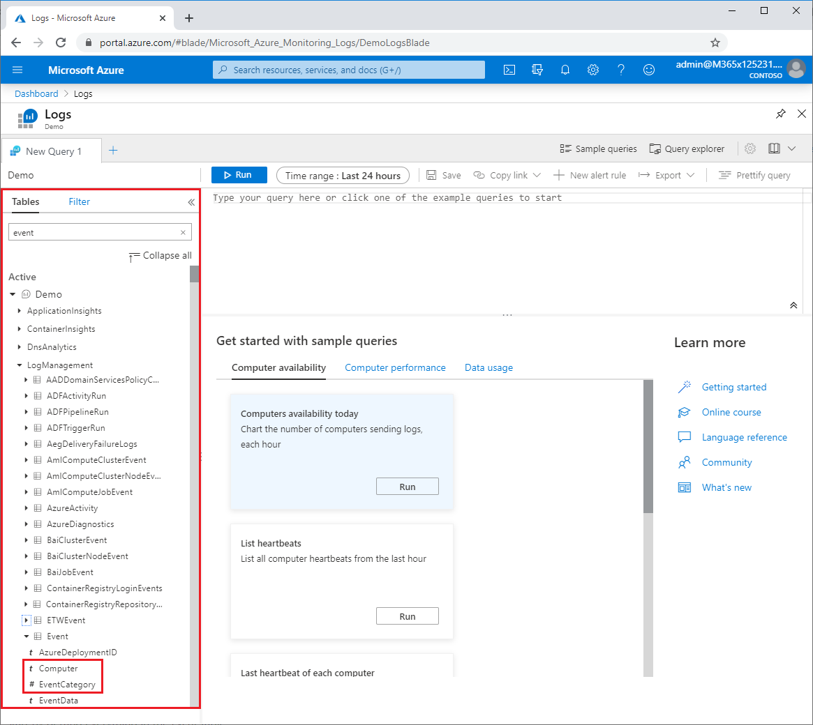

In each table, data is organized in columns with different data types as indicated by icons next to the column name. For example, the _Event_ table shown in the screenshot contains columns such as _Computer_ which is text, _EventCategory_ which is a number, and _TimeGenerated_ which is date/time.

## Filter the results
Start by getting everything in the _Event_ table.

```Kusto
Event
```

Log Analytics automatically scopes results by:

- Time range:  By default, queries are limited to the last 24 hours.
- Number of results: Results are limited to maximum of 10,000 records.

This query is very general, and it returns too many results to be useful. You can filter the results either through the table elements, or by explicitly adding a filter to the query. Filtering results through the table elements applies to the existing result set, while a filter to the query itself will return a new filtered result set and could therefore produce more accurate results.

### Add a filter to the query
There is an arrow to the left of each record. Click this arrow to open the details for a specific record.

Hover above a column name for the "+" and "-" icons to display. To add a filter that will return only records with the same value, click the "+" sign. Click "-" to exclude records with this value and then click **Run** to run the query again.

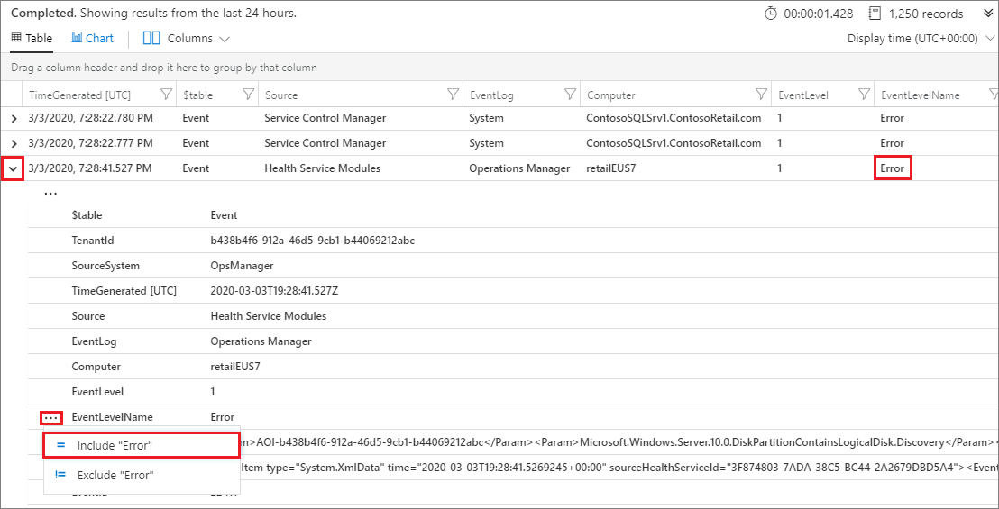

### Filter through the table elements
Now let's focus on events with a severity of _Error_. This is specified in a column named _EventLevelName_. You'll need to scroll to the right to see this column.

Click the Filter icon next to the column title, and in the pop-up window select values that _Starts with_ the text _error_:

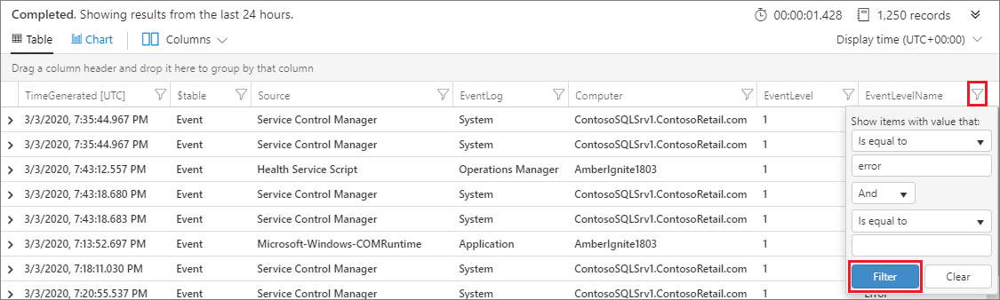


## Sort and group results
The results are now narrowed down to include only error events from SQL Server, created in the last 24 hours. However, the results are not sorted in any way. To sort the results by a specific column, such as _timestamp_ for example, click the column title. One click sorts in ascending order while a second click will sort in descending.

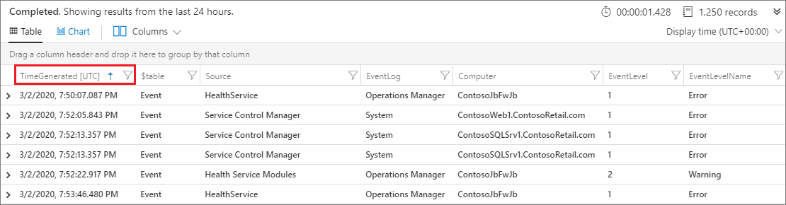

Another way to organize results is by groups. To group results by a specific column, simply drag the column header above the other columns. To create subgroups, drag other columns the upper bar as well.


## Select columns to display
The results table often includes a lot of columns. You might find that some of the returned columns are not displayed by default, or you may want to remove some the columns that are displayed. To select the columns to show, click the Columns button:

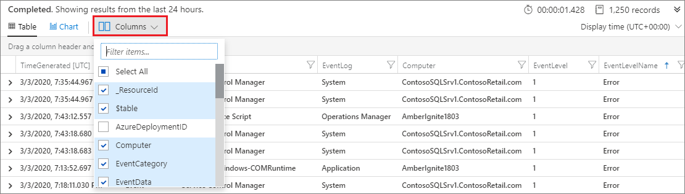


## Select a time range
By default, Log Analytics applies the _last 24 hours_ time range. To use a different range, select another value through the time picker and click **Run**. In addition to the preset values, you can use the _Custom time range_ option to select an absolute range for your query.

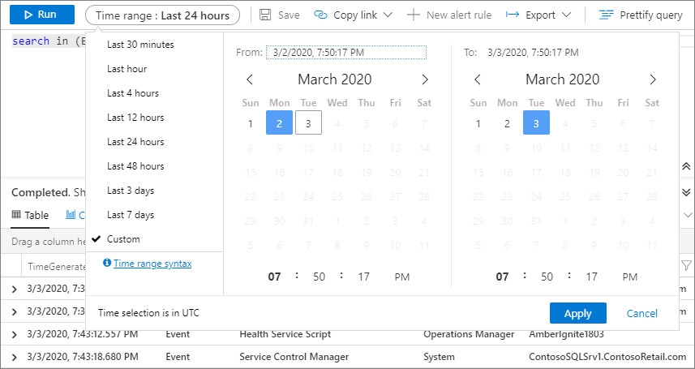

When selecting a custom time range, the selected values are in UTC, which could be different than your local time zone.

If the query explicitly contains a filter for _TimeGenerated_, the time picker title will show _Set in query_. Manual selection will be disabled to prevent a conflict.


## Charts
In addition to returning results in a table, query results can be presented in visual formats. Use the following query as an example:

```Kusto
Event 
| where EventLevelName == "Error" 
| where TimeGenerated > ago(1d) 
| summarize count() by Source 
```

By default, results are displayed in a table. Click _Chart_ to see the results in a graphic view:

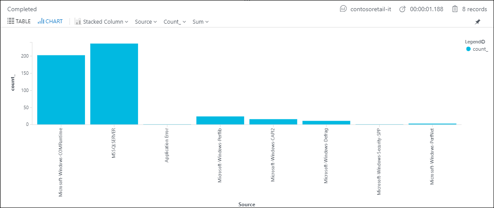

The results are shown in a stacked bar chart. Click _Stacked Column_ and select _Pie_ to show another view of the results:

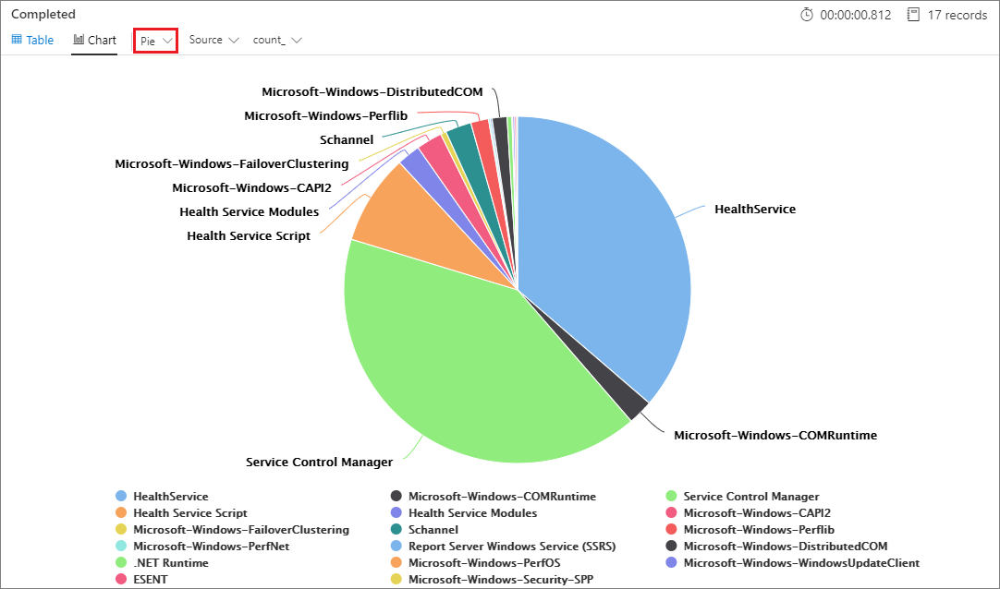

Different properties of the view, such as x and y axes, or grouping and splitting preferences, can be changed manually from the control bar.

You can also set the preferred view in the query itself, using the render operator.

### Smart diagnostics
On a timechart, if there is a sudden spike or step in your data, you may see a highlighted point on the line. This indicates that _Smart Diagnostics_ has identified a combination of properties that filter out the sudden change. Click the point to get more detail on the filter, and to see the filtered version. This may help you identify what caused the change:

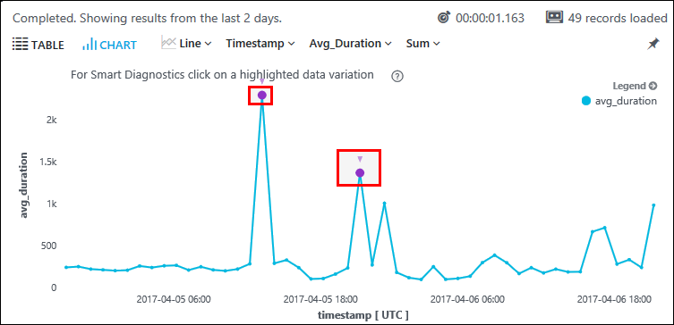

## Pin to dashboard
To pin a diagram or table to one of your shared Azure dashboards, click the pin icon.

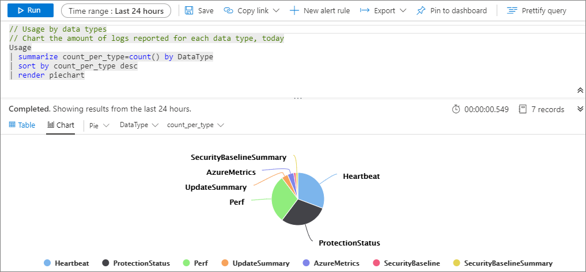

Certain simplifications are applied to a chart when you pin it to a dashboard:

- Table columns and rows: In order to pin a table to the dashboard, it must have four or fewer columns. Only the top seven rows are displayed.
- Time restriction: Queries are automatically limited to the past 14 days.
- Bin count restriction: If you display a chart that has a lot of discrete bins, less populated bins are automatically grouped into a single _others_ bin.

## Save queries
Once you've created a useful query, you might want to save it or share with others. The **Save** icon is on the top bar.

You can save either the entire query page, or a single query as a function. Functions are queries that can also be referenced by other queries. In order to save a query as a function, you must provide a function alias, which is the name used to call this query when referenced by other queries.

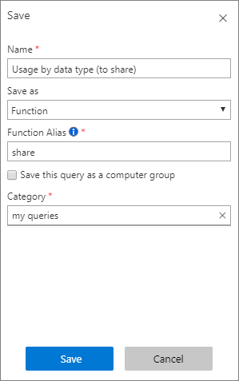

Log Analytics queries are always saved to a selected workspace, and shared with other users of that workspace.

## Load queries
The Query Explorer icon is at the top-right area. This lists all saved queries by category. It also enables you to mark specific queries as Favorites to quickly find them in the future. Double-click a saved query to add it to the current window.

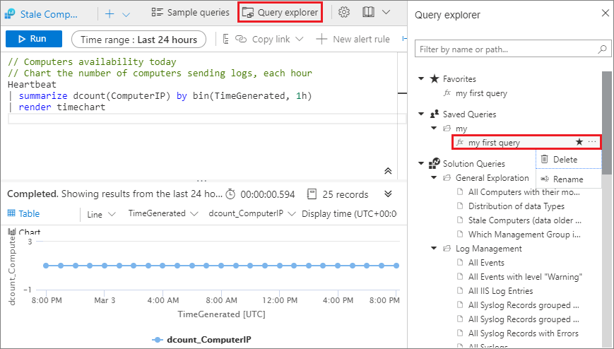

## Export and share as link
Log Analytics supports several exporting methods:

- Excel: Save the results as a CSV file.
- Power BI: Export the results to Power BI. See [Import Azure Monitor log data into Power BI](../../azure-monitor/platform/powerbi.md) for details.
- Share a link: The query itself can be shared as a link which can then be sent and executed by other users that have access to the same workspace.

## Next steps

- Learn more about [writing Azure Monitor log queries](get-started-queries.md).
