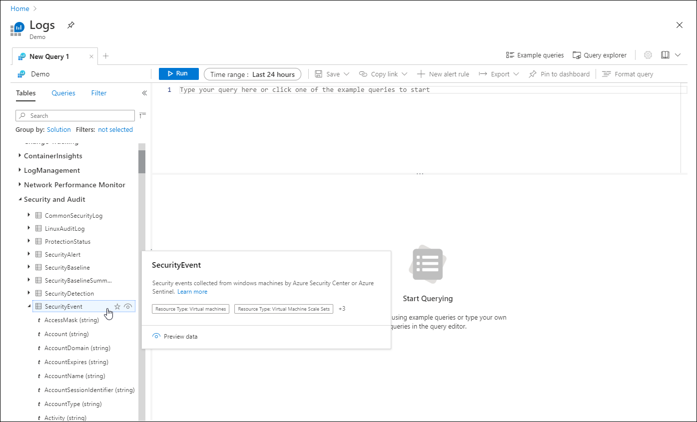
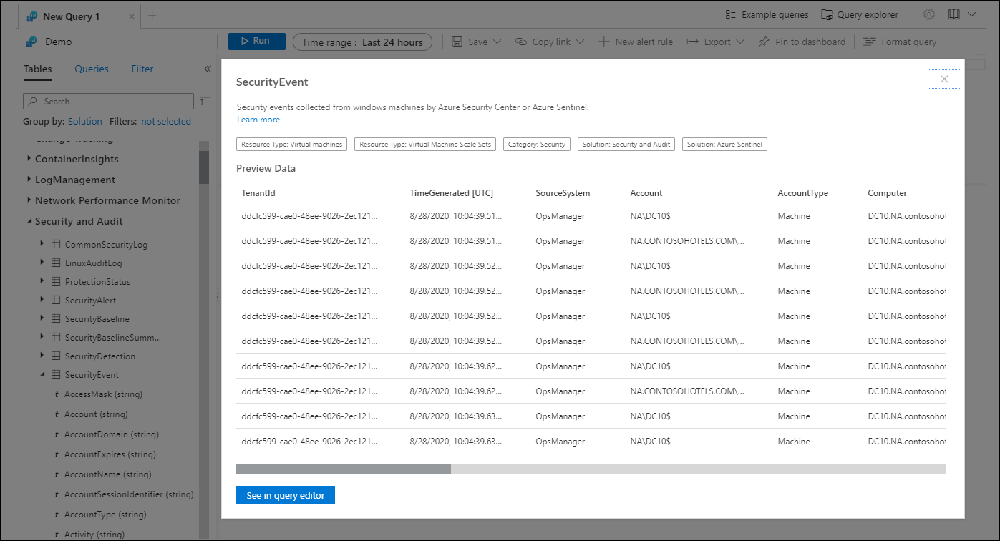
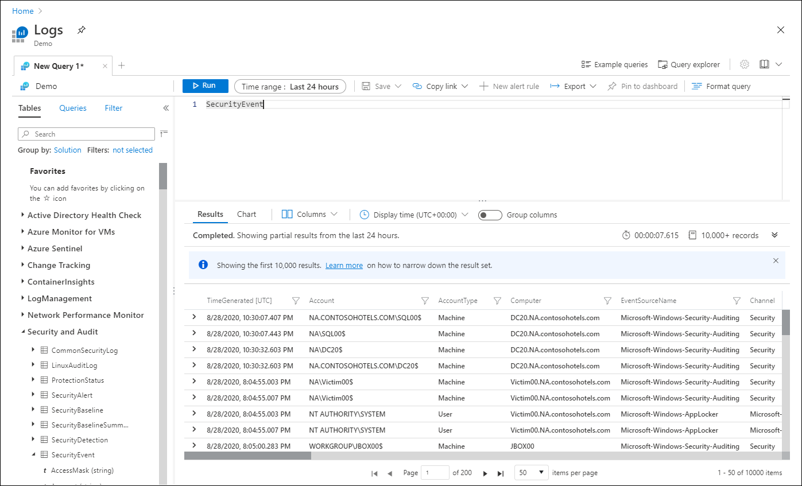
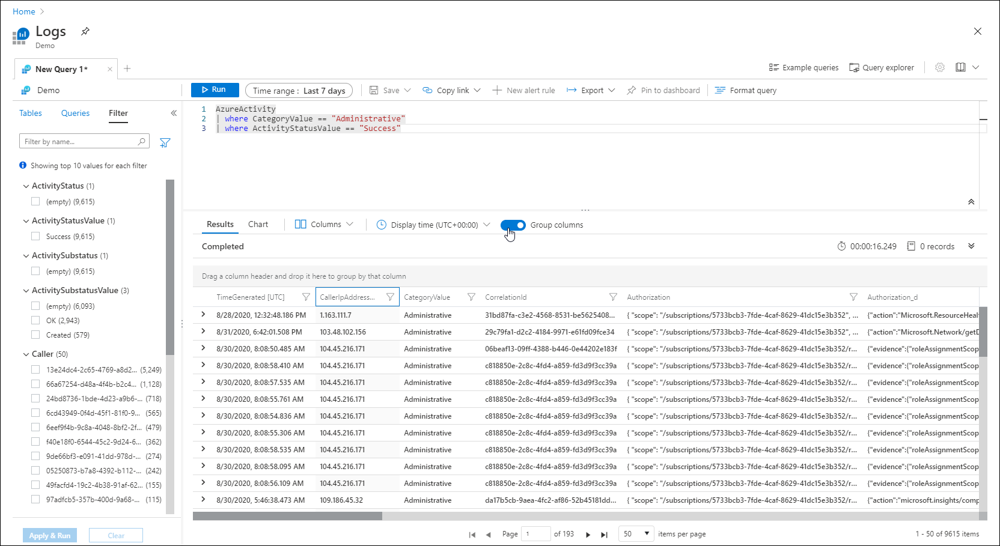
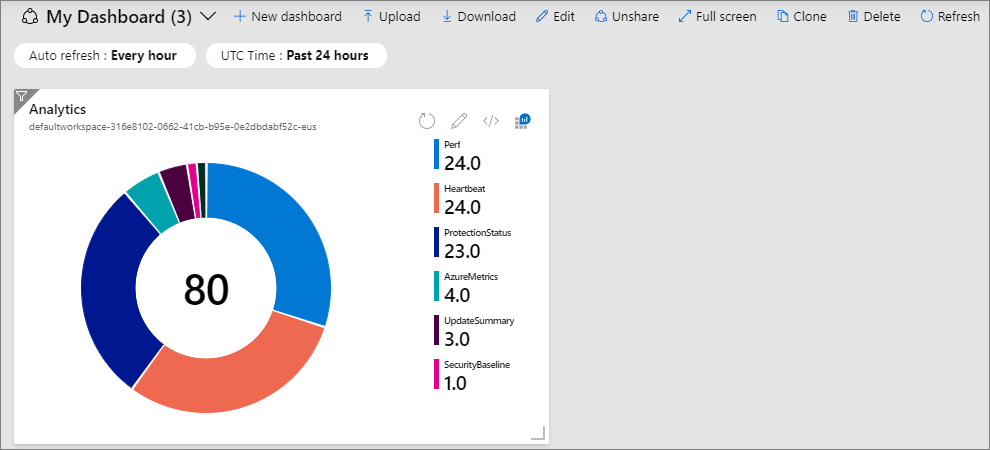

# Log Analytics tutorial
Log Analytics is a tool in the Azure portal to edit and run log queries in Azure Monitor Logs and interactively analyze their results. You can use Log Analytics queries to search for terms, identify trends, analyze patterns, and provide many other insights from your data. 

This tutorial walks you through the Log Analytics interface, gets you started with some basic queries, and shows you how you can work with the results. You will learn the following:

> [!div class="checklist"]
> * Understand the log data schema
> * Write and run simple queries, and modify the time range for queries
> * Filter, sort, and group query results
> * View, modify, and share visuals of query results
> * Save, load, export, and copy queries and results


## Prerequisites
To use Log Analytics, you need to be signed in to an Azure account. If you don't have an Azure account, [create one for free](https://azure.microsoft.com/free/?WT.mc_id=A261C142F). To complete most of the steps in this tutorial, you can use the [Log Analytics demo environment](https://ms.portal.azure.com/#blade/Microsoft_Azure_Monitoring_Logs/DemoLogsBlade). This includes plenty of sample data supporting the sample queries. With the demo environment though, you won't be able to save queries or pin results to a dashboard. You should perform these steps in your own environment.

## Open Log Analytics
Open the [Log Analytics demo environment](https://ms.portal.azure.com/#blade/Microsoft_Azure_Monitoring_Logs/DemoLogsBlade) or select **Logs** from the Azure Monitor menu. This will set the initial scope to a Log Analytics workspace meaning that your query will select from all data in that workspace. If you select **Logs** from an Azure resource's menu, the scope is set to that resource. You can change the current  See [Log query scope](scope.md) for details about the scope.

You can view the scope in the top left corner of the screen. If you're using your own environment, you'll see an option to select a different scope, but this option isn't available in the demo environment.

[](media/get-started-portal/scope.png#lightbox)

## Table schema
The left side of the screen includes the **Tables** tab which allows you to inspect the tables that are available in the current scope. These are grouped by **Solution** by default, but you change their grouping or filter them. 

Expand the **Log Management** solution and locate the **AzureActivity** table. You can expand the table to view its schema, or hover over its name to show additional information about it. 

[](media/get-started-portal/table-details.png#lightbox)

Click **Learn more** to go to the table reference that documents each table and its columns. Click **Preview data** to have a quick look at a few recent records in the table to determine 

[](media/get-started-portal/sample-data.png#lightbox)

## Write a query
Let's go ahead and write a query using the **SecurityEvent** table. Double-click its name to add it to the query window. You can also type directly in the window and even get intellisense that will help complete the names of tables in the current scope and KQL commands.

This is the simplest query that we can write. It just returns all the records in a table. Run it by clicking the **Run** button or by pressing Shift+Enter with the cursor positioned anywhere in the query text.

[](media/get-started-portal/query-results.png#lightbox)

You can see that we do have results. The number of records returned by the query is displayed in the bottom right corner. 

## Filter

Let's add a filter to the query to reduce the number of records that are returned. Select the **Filter** tab in the left pane. This shows different columns in the query results that you can use to filter the results. The top values in those columns are displayed with the number of records with that value. Click on **Administrative** under **CategoryValue** and then **Apply & Run**. 

[](media/get-started-portal/query-pane.png#lightbox)

A **where** statement is added to the query with the value you selected. The results now include only those records with that value so you can see that the record count is reduced.

[](media/get-started-portal/query-results-filter-01.png#lightbox)


## Time range
All tables in a Log Analytics workspace have a column called **TimeGenerated** which is the time that the record was created. All queries have a time range that limits the results to records with a **TimeGenerated** value within that range. The time range can either be set in the query or with the selector at the top of the screen.

By default, the query will return records form the last 24 hours. Select the **Time range** dropdown and change it to **7 days**. Click **Run** again to return the results. You can see that results are returned, but we have a message here that we're not seeing all of the results. This is because Log Analytics can return a maximum of 10,000 records, and our query returned more records than that. 

[](media/get-started-portal/query-results-max.png#lightbox)


## Multiple query conditions
Let's reduce our results further by adding another filter condition. A query can include any number of filters to target exactly the set of records that you want. Select **Success** under **ActivityStatusValue** and click **Apply & Run**. 

[](media/get-started-portal/query-results-filter-02.png#lightbox)


## Analyze results
In addition to helping you write and run queries, Log Analytics provides features for working with the results. Start by expanding a record to view the values for all of its columns.

[](media/get-started-portal/expand-record.png#lightbox)

Click on the name of any column to sort the results by that column. Click on the filter icon next to it to provide a filter condition. This is similar to adding a filter condition to the query itself except that this filter is cleared if the query is run again. Use this method if you want to quickly analyze a set of records as part of interactive analysis.

For example, set a filter on the **CallerIpAddress** column to limit the records to a single caller. 

[](media/get-started-portal/query-results-filter.png#lightbox)

Instead of filtering the results, you can group records by a particular column. Clear the filter that you just created and then turn on the **Group columns** slider. 

[](media/get-started-portal/query-results-group-columns.png#lightbox)

Now drag the **CallerIpAddress** column into the grouping row. Results are now organized by that column, and you can collapse each group to help you with your analysis.

[](media/get-started-portal/query-results-grouped.png#lightbox)

## Numeric data
Let's have a look at a query that uses numerical data that we can view in a chart. 


## Log Analytics interface
Let's start with a walkthrough of the Log Anlaytics 


### 1. Top action bar
The top action bar provides controls for working with the query in the query window and 

**Scope:** Specifies the scope of data used for the query. This could be all data in a Log Analytics workspace or data for a particular resource across multiple workspaces. See [Query scope](#query-scope).

**Run button:** Click to run the selected query in the query window. You can also press shift+enter to run a query.

**Time picker:** Select the time range for the data available to the query. This is overriden if you include a time filter in the query. See [Log query scope and time range in Azure Monitor Log Analytics](scope.md).

**Save button:** Save the query to the Query Explorer for the workspace.

**Copy button:** Copy a link to the query, the query text, or the query results to the clipboard.

**New alert rule button:** Create a new tab with an empty query.

**Export button:** Export the results of the query to a CSV file or the query to Power Query Formula Language format for use with Power Bi.

**Pin to dashboard button:** Add the results of the query to an Azure dashboard.

**Format query button:** Arrange the selected text for readability.

**Example queries button:** Open the example queries dialog box that is displayed when you first open Log Analytics.

**Query Explorer button:** Open **Query Explorer** which provides access to saved queries in the workspace.

### 2. Sidebar

**Tables:** Lists the tables that are part of the selected scope. Select **Group by** to change the grouping of the tables. Hover over a table name to display a dialog box with a description of the table and options to view its documentation and to preview its data. Expand a table to view its columns. Double-click on a table or column name to add it to the query.

**Queries:** List of example queries that you can open in the query window. This is the same list that's displayed when you open Log Analytics. Select **Group by** to change the grouping of the queries. Double-click on a query to add it to the query window or hover over it for other options.

**Filter:** Creates filter options based on the results of a query. After you a run a query, columns will be displayed with different values from the results. Select one or more values and then click **Apply & Run** to add a **where** command to the query and run it again.

### 3. Query window
The query window is where you edit your query. This includes intellisense for KQL commands and color coding to enhance readability. Click the **+** at the top of the window to open another tab.

As single window can include multiple queries. A query cannot include any blank lines, so you can separate multiple queries in a window with one or more blank lines. The current query is the one with the cursor positioned anywhere in it.

To run the current query, click the **Run** button or press Shift+Enter.

### 4. Results window
The results of the query are displayed in the results window. By default, the results are displayed as a table. To display as a chart, either select **Chart** in the results window, or add a **render** command to your query.

#### Results view
The Results view displays query results in a table organized by columns and rows. Click to the left of a row to expand its values. Click on the **Columns** dropdown to change the list of columns. 

Sort the results by clicking on a column name. Filter the results by clicking the funnel next to a column name. Clear the filters and reset the sorting by running the query again.

Select **Group columns** to display the grouping bar above the query results. Group the results by any column by dragging it to the bar. Create nested groups in the results by adding additional columns. 

#### Chart view
The Chart view displays the results as one of multiple available chart types. You can specify the chart type in a **render** command in your query or select it from the **Visualization Type** dropdown.

| Option | Description |
|:---|:---|
| **Visualization Type** | Type of chart to display. |
| **X-Axis** | Column in the results to use for the X-Axis 
| **Y-Axis** | Column in the results to use for the Y-Axis. This will typically be a numeric column. |
| **Split by** | Column in the results that defines the series in the chart. A series is created for each value in the column. |
| **Aggregation** | Type of aggregation to perform on the numeric values in the Y-Axis. |

## Understand the schema
 
A *schema* is a collection of tables grouped under logical categories. The Demo schema has several categories from monitoring solutions. For example, the **LogManagement** category contains Windows and Syslog events, performance data, and agent heartbeats.

The schema tables appear on the **Tables** tab of the Log Analytics workspace. The tables contain columns, each with a data type shown by the icon next to the column name. For example, the **Event** table contains text columns like **Computer** and numerical columns like **EventCategory**.


## Write and run basic queries

Log Analytics opens with a new blank query in the **Query editor**.


### Write a query

Azure Monitor log queries use a version of the Kusto query language. Queries can begin with either a table name or a [search](/azure/kusto/query/searchoperator) command. 

The following query retrieves all records from the **Event** table:

```Kusto
Event
```

The pipe (|) character separates commands, so the output of the first command is the input of the next command. You can add any number of commands to a single query. The following query retrieves the records from the **Event** table, and then searches them for the term **error** in any property:

```Kusto
Event 
| search "error"
```

A single line break makes queries easier to read. More than one line break splits the query into separate queries.

Another way to write the same query is:

```Kusto
search in (Event) "error"
```

In the second example, the **search** command searches only records in the **Events** table for the term **error**.

By default, Log Analytics limits queries to a time range of the past 24 hours. To set a different time range, you can add an explicit **TimeGenerated** filter to the query, or use the **Time range** control.

### Use the Time range control
To use the **Time range** control, select it in the top bar, and then select a value from the dropdown list, or select **Custom** to create a custom time range.


- Time range values are in UTC, which could be different than your local time zone.
- If the query explicitly sets a filter for **TimeGenerated**, the time picker control shows **Set in query**, and is disabled to prevent a conflict.

### Run a query
To run a query, place your cursor somewhere inside the query, and select **Run** in the top bar or press **Shift**+**Enter**. The query runs until it finds a blank line.

## Filter results
Log Analytics limits results to a maximum of 10,000 records. A general query like `Event` returns too many results to be useful. You can filter query results either through restricting the table elements in the query, or by explicitly adding a filter to the results. Filtering through the table elements returns a new result set, while an explicit filter applies to the existing result set.

### Filter by restricting table elements
To filter `Event` query results to **Error** events by restricting table elements in the query:

1. In the query results, select the dropdown arrow next to any record that has **Error** in the **EventLevelName** column. 
   
1. In the expanded details, hover over and select the **...** next to **EventLevelName**, and then select **Include "Error"**. 
   
   
   
1. Notice that the query in the **Query editor** has now changed to:
   
   ```Kusto
   Event
   | where EventLevelName == "Error"
   ```
   
1. Select **Run** to run the new query.

### Filter by explicitly filtering results
To filter the `Event` query results to **Error** events by filtering the query results:

1. In the query results, select the **Filter** icon next to the column heading **EventLevelName**. 
   
1. In the first field of the pop-up window, select **Is equal to**, and in the next field, enter *error*. 
   
1. Select **Filter**.
   
   

## Sort, group, and select columns
To sort query results by a specific column, such as **TimeGenerated [UTC]**, select the column heading. Select the heading again to toggle between ascending and descending order.


Another way to organize results is by groups. To group results by a specific column, drag the column header to the bar above the results table labeled **Drag a column header and drop it here to group by that column**. To create subgroups, drag other columns to the upper bar. You can rearrange the hierarchy and sorting of the groups and subgroups in the bar.


To hide or show columns in the results, select **Columns** above the table, and then select or deselect the columns you want from the dropdown list.


## View and modify charts
You can also see query results in visual formats. Enter the following query as an example:

```Kusto
Event 
| where EventLevelName == "Error" 
| where TimeGenerated > ago(1d) 
| summarize count() by Source 
```

By default, results appear in a table. Select **Chart** above the table to see the results in a graphic view.


The results appear in a stacked bar chart. Select other options like **Stacked Column** or **Pie** to show other views of the results.


You can change properties of the view, such as x and y axes, or grouping and splitting preferences, manually from the control bar.

You can also set the preferred view in the query itself, using the [render](/azure/kusto/query/renderoperator) operator.

## Pin results to a dashboard

To pin a results table or chart from Log Analytics to a shared Azure dashboard, select **Pin to dashboard** on the top bar. 


In the **Pin to another dashboard** pane, select or create a shared dashboard to pin to, and select **Apply**. The table or chart appears on the selected Azure dashboard.



A table or chart that you pin to a shared dashboard has the following simplifications: 

- Data is limited to the past 14 days.
- A table shows only up to four columns and the top seven rows.
- Charts with many discrete categories automatically group less populated categories into a single **others** bin.

## Save, load, or export queries

Once you create a query, you can save or share the query or results with others. 

### Save queries

To save a query:

1. Select **Save** on the top bar.
   
1. In the **Save** dialog, give the query a **Name**, using the characters a–z, A–Z, 0-9, space, hyphen, underscore, period, parenthesis, or pipe. 
   
1. Select whether to save the query as a **Query** or a **Function**. Functions are queries that other queries can reference. 
   
   To save a query as a function, provide a **Function Alias**, which is a short name for other queries to use to call this query.
   
1. If you are in a Log Analytics workspace, provide a **Category** for **Query explorer** to use for the query. (Categories aren't available for Applications Insights queries)
   
1. Select **Save**.
   
   

### Load queries
To load a saved query, select **Query explorer** at upper right. The **Query explorer** pane opens, listing all queries by category. Expand the categories or enter a query name in the search bar, then select a query to load it into the **Query editor**. You can mark a query as a **Favorite** by selecting the star next to the query name.


### Export and share queries
To export a query, select **Export** on the top bar, and then select **Export to CSV - all columns**, **Export to CSV - displayed columns**, or **Export to Power BI (M query)** from the dropdown list.

The following video shows you how to integrate Log Analytics with Excel.

> [!VIDEO https://www.microsoft.com/en-us/videoplayer/embed/RE4Asme]

To share a link to a query, select **Copy link** on the top bar, and then select **Copy link to query**, **Copy query text**, or **Copy query results** to copy to the clipboard. You can send the query link to others who have access to the same workspace.

## Next steps

Advance to the next tutorial to learn more about writing Azure Monitor log queries.
> [!div class="nextstepaction"]
> [Write Azure Monitor log queries](get-started-queries.md)
