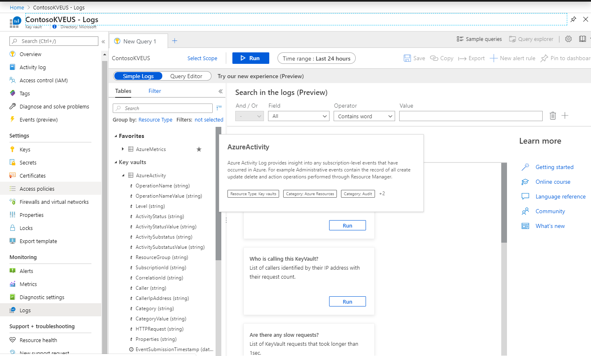
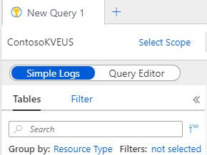

# Tutorial: Get started with Log Analytics queries

This tutorial shows you how to use Log Analytics to write, execute, and manage Azure Monitor log queries in the Azure portal. You can use Log Analytics queries to search for terms, identify trends, analyze patterns, and provide many other insights from your data. 

In this tutorial, you learn how to use Log Analytics to:

> [!div class="checklist"]
> * Understand the log data schema
> * Write and run simple queries, and modify the time range for queries
> * Filter, sort, and group query results
> * View, modify, and share visuals of query results
> * Save, load, export, and copy queries and results

For more information about log queries, see [Overview of log queries in Azure Monitor](log-query-overview.md).<br/>
For a detailed tutorial on writing log queries, see [Get started with log queries in Azure Monitor](get-started-queries.md).

To complete most of the steps in this tutorial, you can use [this demo environment](https://portal.loganalytics.io/demo), which includes plenty of sample data. With the demo environment, you won't be able to save queries or pin results to a dashboard.

You can also use your own environment, if you're using Azure Monitor to collect log data on at least one Azure resource. To open a Log Analytics workspace, in your Azure Monitor left navigation, select **Logs**. 


## Open Log Analytics

To use Log Analytics, you need to be signed in to an Azure account. If you don't have an Azure account, [create one for free](https://azure.microsoft.com/free/?WT.mc_id=A261C142F).



## Firewall requirements

To use Log Analytics, your browser requires access to the following addresses. If your browser is accessing the Azure portal through a firewall, you must enable access to these addresses.

| Uri | IP | Ports |
|:---|:---|:---|
| portal.loganalytics.io | Dynamic | 80,443 |
| api.loganalytics.io | Dynamic | 80,443 |
| docs.loganalytics.io | Dynamic | 80,443 |


## Understand the schema

A *schema* is a collection of tables grouped under logical categories. The Demo schema has several categories from monitoring solutions. For example, the **LogManagement** category contains Windows and Syslog events, performance data, and agent heartbeats.

## Upper Left of Query Pane

When you first come to the Log Analytics screen, you see a tab labled **New Query**. You can create additional tabs as desired so you can easily run then view the results of multiple queries by clicking on each tab. In the upper left corner of each tab is a section of the screen with a number of options on it.  



Let's walk through what each option does. 

## Select Scope

The **Select Scope** clickable label lets you select what subscriptions and resources groups you search across in later steps.  What you select here filters our what you see in the **Tables** section described later. Similarly, queries only search across resources that you have included in the **Select Scope** window.


## Simple Logs and Query Editor Toggle

Also in the upper left is a toggle between showing the **Simple Logs** and **Query Editor** window.  **Simple Logs** give you the option to build a query using dropdowns and text fields. The **Query Editor** allows you to build queries using Log Analytics subset version of the KQL query language. KQL is also used in [Azure Data Explorer](../../azure/data-explorer.md).  More on KQL later in this article. 

## Tables filter and search

Clicking on the **Tables** tag shows the schema pane, which is described in the following section.

The **filter** label does what it implies. Once you get results, they are processed in the filter pane and you can use checkboxes to select subsets of data. You can also use the KQL language to filter results, which is described later in this article.  

**Search** functionality is also described in the following section.

## The schema pane

The schema pane shows a collection of tables visually grouped by resource type, category, or solution depending on the value in **Group by**. 
- **Resource type** refers to the Azure resource type; for example, Key Vault or Virtual Machine.  
- **Category** groups tables based on function; for example, security, auditing or Azure resource specific tables.
- **Solution** groups tables based on what [Azure Monitor solution](../insights/solutions.md) they are part of.  

The **Filter** label next to the **Group by** allows you to 
Tables may apply in more than one location as appropriate based on the grouping chosen above.

As mentioned previously, the tables shown are contextual. They are shown are based on the scope selected.  If enter Log Analytics by selecting **Logs** while looking at an individual resource, you only see tables for that resource. If you widen your scope to a subscription, you all tables relevant to that subscription. Click [**Select scope**](#select-scope) above the schema pane to change the scope.

If you expand a table, you'll see the individual fields and the types of those fields.  


If you hover over a table name, you see information describing that table/field. You also see a star, which adds that table to your favorites list at the tope of the schema pane. Clicking the **Preview data** icon to the right of the favorites expands a window to show some data from that table.

If you can't locate a table, column or description in the pane, you can use the **Search** box at the top of the pane to find them. Note that the same physical table or fields may appear multiple times depending on the **Group by** setting. It's still the same table containing the same data.

## Query editor

Queries can be used to search terms, identify trends, analyze patterns, and provide many other insights based on your data. Start with a basic query:

```Kusto
Event | search "error"
```

This query searches the _Event_ table for records that contain the term _error_ in any property.

Queries can start with either a table name or a [search](/azure/kusto/query/searchoperator) command. The above example starts with the table name _Event_, which retrieves all records from the Event table. The pipe (|) character separates commands, so the output of the first one serves as the input of the following command. You can add any number of commands to a single query.

Another way to write that same query would be:

```Kusto
search in (Event) "error"
```

In this example, **search** is scoped to the _Event_ table, and all records in that table are searched for the term _error_.

The schema tables appear on the **Tables** tab of the Log Analytics workspace. The tables contain columns, each with a data type shown by the icon next to the column name. For example, the **Event** table contains text columns like **Computer** and numerical columns like **EventCategory**.


## Write and run basic queries

<<<<<<< HEAD
=======
Log Analytics opens with a new blank query in the **Query editor**.


### Write a query
Azure Monitor log queries use a version of the Kusto query language. Queries can begin with either a table name or a [search](/azure/kusto/query/searchoperator) command. 
>>>>>>> e2ebaa85d71e67c2f969f742c815c4b2ca09b978

The following query retrieves all records from the **Event** table:

```Kusto
Event
```

The pipe (|) character separates commands, so the output of the first command is the input of the next command. You can add any number of commands to a single query. The following query retrieves the records from the **Event** table, and then searches them for the term **error** in any property:

```Kusto
Event 
| search "error"
```

A single line break makes queries easier to read. More than one line break splits the query into separate queries.

Another way to write the same query is:

```Kusto
search in (Event) "error"
```

In the second example, the **search** command searches only records in the **Events** table for the term **error**.

By default, Log Analytics limits queries to a time range of the past 24 hours. To set a different time range, you can add an explicit **TimeGenerated** filter to the query, or use the **Time range** control.

### Use the Time range control

To use the **Time range** control, select it in the top bar, and then select a value from the dropdown list, or select **Custom** to create a custom time range.


- Time range values are in UTC, which could be different than your local time zone.
- If the query explicitly sets a filter for **TimeGenerated**, the time picker control shows **Set in query**, and is disabled to prevent a conflict.

### Run a query
To run a query, place your cursor somewhere inside the query, and select **Run** in the top bar or press **Shift**+**Enter**. The query runs until it finds a blank line.

## Filter results
Log Analytics limits results to a maximum of 10,000 records. A general query like `Event` returns too many results to be useful. You can filter query results either through restricting the table elements in the query, or by explicitly adding a filter to the results. Filtering through the table elements returns a new result set, while an explicit filter applies to the existing result set.

### Filter by restricting table elements
To filter `Event` query results to **Error** events by restricting table elements in the query:

1. In the query results, select the dropdown arrow next to any record that has **Error** in the **EventLevelName** column. 
   
1. In the expanded details, hover over and select the **...** next to **EventLevelName**, and then select **Include "Error"**. 
   
   
   
1. Notice that the query in the **Query editor** has now changed to:
   
   ```Kusto
   Event
   | where EventLevelName == "Error"
   ```
   
1. Select **Run** to run the new query.

### Filter by explicitly filtering results
To filter the `Event` query results to **Error** events by filtering the query results:

1. In the query results, select the **Filter** icon next to the column heading **EventLevelName**. 
   
1. In the first field of the pop-up window, select **Is equal to**, and in the next field, enter *error*. 
   
1. Select **Filter**.
   
   

## Sort, group, and select columns
To sort query results by a specific column, such as **TimeGenerated [UTC]**, select the column heading. Select the heading again to toggle between ascending and descending order.


Another way to organize results is by groups. To group results by a specific column, drag the column header to the bar above the results table labeled **Drag a column header and drop it here to group by that column**. To create subgroups, drag other columns to the upper bar. You can rearrange the hierarchy and sorting of the groups and subgroups in the bar.


To hide or show columns in the results, select **Columns** above the table, and then select or deselect the columns you want from the dropdown list.


## View and modify charts
You can also see query results in visual formats. Enter the following query as an example:

```Kusto
Event 
| where EventLevelName == "Error" 
| where TimeGenerated > ago(1d) 
| summarize count() by Source 
```

By default, results appear in a table. Select **Chart** above the table to see the results in a graphic view.


The results appear in a stacked bar chart. Select other options like **Stacked Column** or **Pie** to show other views of the results.


You can change properties of the view, such as x and y axes, or grouping and splitting preferences, manually from the control bar.

You can also set the preferred view in the query itself, using the [render](/azure/kusto/query/renderoperator) operator.

## Pin results to a dashboard
To pin a results table or chart from Log Analytics to a shared Azure dashboard, select **Pin to dashboard** on the top bar. 


In the **Pin to another dashboard** pane, select or create a shared dashboard to pin to, and select **Apply**. The table or chart appears on the selected Azure dashboard.


A table or chart that you pin to a shared dashboard has the following simplifications: 

- Data is limited to the past 14 days.
- A table shows only up to four columns and the top seven rows.
- Charts with many discrete categories automatically group less populated categories into a single **others** bin.

## Save, load, or export queries
Once you create a query, you can save or share the query or results with others. 

### Save queries
To save a query:

1. Select **Save** on the top bar.
   
1. In the **Save** dialog, give the query a **Name**, using the characters a–z, A–Z, 0-9, space, hyphen, underscore, period, parenthesis, or pipe. 
   
1. Select whether to save the query as a **Query** or a **Function**. Functions are queries that other queries can reference. 
   
   To save a query as a function, provide a **Function Alias**, which is a short name for other queries to use to call this query.
   
1. Provide a **Category** for **Query explorer** to use for the query.
   
1. Select **Save**.
   
   

### Load queries
To load a saved query, select **Query explorer** at upper right. The **Query explorer** pane opens, listing all queries by category. Expand the categories or enter a query name in the search bar, then select a query to load it into the **Query editor**. You can mark a query as a **Favorite** by selecting the star next to the query name.


### Export and share queries
To export a query, select **Export** on the top bar, and then select **Export to CSV - all columns**, **Export to CSV - displayed columns**, or **Export to Power BI (M query)** from the dropdown list.

To share a link to a query, select **Copy link** on the top bar, and then select **Copy link to query**, **Copy query text**, or **Copy query results** to copy to the clipboard. You can send the query link to others who have access to the same workspace.

## Next steps

Advance to the next tutorial to learn more about writing Azure Monitor log queries.
> [!div class="nextstepaction"]
> [Write Azure Monitor log queries](get-started-queries.md)
