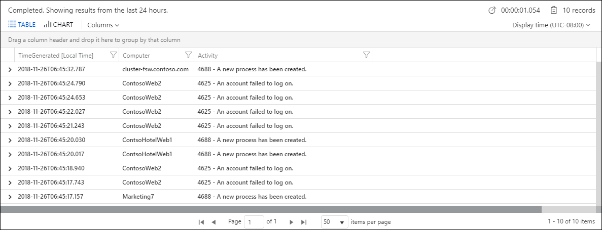

# Get started with log queries in Azure Monitor

> [!NOTE]
> You can work through this exercise in your own environment if you are collecting data from at least one virtual machine. If not then use our [Demo environment](https://portal.loganalytics.io/demo), which includes plenty of sample data.  If you already know how to query in KQL, but just need to quickly create useful queries based on resource type(s), see the [saved example queries pane](saved-queries.md).

In this tutorial you will learn to write log queries in Azure Monitor. It will teach you how to:

- Understand query structure
- Sort query results
- Filter query results
- Specify a time range
- Select which fields to include in the results
- Define and use custom fields
- Aggregate and group results

For a tutorial on using Log Analytics in the Azure portal, see [Get started with Azure Monitor Log Analytics](get-started-portal.md).<br>
For more details on log queries in Azure Monitor, see [Overview of log queries in Azure Monitor](log-query-overview.md).

Follow along with a video version of this tutorial below:

> [!VIDEO https://www.microsoft.com/videoplayer/embed/RE42pGX]

## Writing a new query

Queries can start with either a table name or the *search* command. You should start with a table name, since it defines a clear scope for the query and improves both query performance and relevance of the results.

> [!NOTE]
> The Kusto query language used by Azure Monitor is case-sensitive. Language keywords are typically written in lower-case. When using names of tables or columns in a query, make sure to use the correct case, as shown on the schema pane.

### Table-based queries

Azure Monitor organizes log data in tables, each composed of multiple columns. All tables and columns are shown on the schema pane in Log Analytics in the Analytics portal. Identify a table that you're interested in and then take a look at a bit of data:

```Kusto
SecurityEvent
| take 10
```

The query shown above returns 10 results from the *SecurityEvent* table, in no specific order. This is a very common way to take a glance at a table and understand its structure and content. Let's examine how it's built:

* The query starts with the table name *SecurityEvent* - this part defines the scope of the query.
* The pipe (|) character separates commands, so the output of the first one in the input of the following command. You can add any number of piped elements.
* Following the pipe is the **take** command, which returns a specific number of arbitrary records from the table.

We could actually run the query even without adding `| take 10` - that would still be valid, but it could return up to 10,000 results.

### Search queries

Search queries are less structured, and generally more suited for finding records that include a specific value in any of their columns:

```Kusto
search in (SecurityEvent) "Cryptographic"
| take 10
```

This query searches the *SecurityEvent* table for records that contain the phrase "Cryptographic". Of those records, 10 records will be returned and displayed. If we omit the `in (SecurityEvent)` part and just run `search "Cryptographic"`, the search will go over *all* tables, which would take longer and be less efficient.

> [!WARNING]
> Search queries are typically slower than table-based queries because they have to process more data. 

## Sort and top
While **take** is useful to get a few records, the results are selected and displayed in no particular order. To get an ordered view, you could **sort** by the preferred column:

```Kusto
SecurityEvent	
| sort by TimeGenerated desc
```

That could return too many results though and might also take some time. The above query sorts *the entire* SecurityEvent table by the TimeGenerated column. The Analytics portal then limits the display to show only 10,000 records. This approach is of course not optimal.

The best way to get only the latest 10 records is to use **top**, which sorts the entire table on the server side and then returns the top records:

```Kusto
SecurityEvent
| top 10 by TimeGenerated
```

Descending is the default sorting order, so we typically omit the **desc** argument.The output will look like this:


## Where: filtering on a condition
Filters, as indicated by their name, filter the data by a specific condition. This is the most common way to limit query results to relevant information.

To add a filter to a query, use the **where** operator followed by one or more conditions. For example, the following query returns only *SecurityEvent* records where _Level_ equals _8_:

```Kusto
SecurityEvent
| where Level == 8
```

When writing filter conditions, you can use the following expressions:

| Expression | Description | Example |
|:---|:---|:---|
| == | Check equality<br>(case-sensitive) | `Level == 8` |
| =~ | Check equality<br>(case-insensitive) | `EventSourceName =~ "microsoft-windows-security-auditing"` |
| !=, <> | Check inequality<br>(both expressions are identical) | `Level != 4` |
| *and*, *or* | Required between conditions| `Level == 16 or CommandLine != ""` |

To filter by multiple conditions, you can either use **and**:

```Kusto
SecurityEvent
| where Level == 8 and EventID == 4672
```

or pipe multiple **where** elements one after the other:

```Kusto
SecurityEvent
| where Level == 8 
| where EventID == 4672
```
	
> [!NOTE]
> Values can have different types, so you might need to cast them to perform comparison on the correct type. For example, SecurityEvent *Level* column is of type String, so you must cast it to a numerical type such as *int* or *long*, before you can use numerical operators on it:
> `SecurityEvent | where toint(Level) >= 10`

## Specify a time range

### Time picker

The time picker is next to the Run button and indicates we’re querying only records from the last 24 hours. This is the default time range applied to all queries. To get only records from the last hour, select _Last hour_ and run the query again.


### Time filter in query

You can also define your own time range by adding a time filter to the query. It’s best to place the time filter immediately after the table name: 

```Kusto
SecurityEvent
| where TimeGenerated > ago(30m) 
| where toint(Level) >= 10
```

In the above time filter  `ago(30m)` means "30 minutes ago" so this query only returns records from the last 30 minutes. Other units of time include days (2d), minutes (25m), and seconds (10s).


## Project and Extend: select and compute columns

Use **project** to select specific columns to include in the results:

```Kusto
SecurityEvent 
| top 10 by TimeGenerated 
| project TimeGenerated, Computer, Activity
```

The preceding example generates this output:



You can also use **project** to rename columns and define new ones. The following example uses project to do the following:

* Select only the *Computer* and *TimeGenerated* original columns.
* Rename the *Activity* column to *EventDetails*.
* Create a new column named *EventCode*. The **substring()** function is used to get only the first four characters from the Activity field.


```Kusto
SecurityEvent
| top 10 by TimeGenerated 
| project Computer, TimeGenerated, EventDetails=Activity, EventCode=substring(Activity, 0, 4)
```

**extend** keeps all original columns in the result set and defines additional ones. The following query uses **extend** to add the *EventCode* column. Note that this column may not display at the end of the table results in which case you would need to expand the details of a record to view it.

```Kusto
SecurityEvent
| top 10 by TimeGenerated
| extend EventCode=substring(Activity, 0, 4)
```

## Summarize: aggregate groups of rows
Use **summarize** to identify groups of records, according to one or more columns, and apply aggregations to them. The most common use of **summarize** is *count*, which returns the number of results in each group.

The following query reviews all *Perf* records from the last hour, groups them by *ObjectName*, and counts the records in each group: 
```Kusto
Perf
| where TimeGenerated > ago(1h)
| summarize count() by ObjectName
```

Sometimes it makes sense to define groups by multiple dimensions. Each unique combination of these values defines a separate group:

```Kusto
Perf
| where TimeGenerated > ago(1h)
| summarize count() by ObjectName, CounterName
```

Another common use is to perform mathematical or statistical calculations on each group. For example, the following calculates the average *CounterValue* for each computer:

```Kusto
Perf
| where TimeGenerated > ago(1h)
| summarize avg(CounterValue) by Computer
```

Unfortunately, the results of this query are meaningless since we mixed together different performance counters. To make this more meaningful, we should calculate the average separately for each combination of *CounterName* and *Computer*:

```Kusto
Perf
| where TimeGenerated > ago(1h)
| summarize avg(CounterValue) by Computer, CounterName
```

### Summarize by a time column
Grouping results can also be based on a time column, or another continuous value. Simply summarizing `by TimeGenerated` though would create groups for every single millisecond over the time range, since these are unique values. 

To create groups based on continuous values, it is best to break the range into manageable units using **bin**. The following query analyzes *Perf* records that measure free memory (*Available MBytes*) on a specific computer. It calculates the average value of each 1 hour period over the last 7 days:

```Kusto
Perf 
| where TimeGenerated > ago(7d)
| where Computer == "ContosoAzADDS2" 
| where CounterName == "Available MBytes" 
| summarize avg(CounterValue) by bin(TimeGenerated, 1h)
```

To make the output clearer, you select to display it as a time-chart, showing the available memory over time:


## Next steps

- Learn more about using string data in a log query with [Work with strings in Azure Monitor log queries](string-operations.md).
- Learn more about aggregating data in a log query with [Advanced aggregations in Azure Monitor log queries](advanced-aggregations.md).
- Learn how to join data from multiple tables with [Joins in Azure Monitor log queries](joins.md).
- Get documentation on the entire Kusto query language in the [KQL language reference](/azure/kusto/query/).
