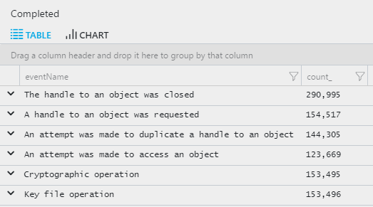

# Joins in Azure Monitor log queries

> [!NOTE]
> You should complete [Get started with Azure Monitor Log Analytics](get-started-portal.md) and [Azure Monitor log queries](get-started-queries.md) before completing this lesson.

[!INCLUDE [log-analytics-demo-environment](../../../includes/log-analytics-demo-environment.md)]

Joins allow you to analyze data from multiple tables, in the same query. They merge the rows of two data sets by matching values of specified columns.


```Kusto
SecurityEvent 
| where EventID == 4624		// sign-in events
| project Computer, Account, TargetLogonId, LogonTime=TimeGenerated
| join kind= inner (
    SecurityEvent 
    | where EventID == 4634		// sign-out events
    | project TargetLogonId, LogoffTime=TimeGenerated
) on TargetLogonId
| extend Duration = LogoffTime-LogonTime
| project-away TargetLogonId1 
| top 10 by Duration desc
```

In this example, the first dataset filters for all sign-in events. This is joined with a second dataset that filters for all sign-out events. The projected columns are _Computer_, _Account_, _TargetLogonId_, and _TimeGenerated_. The datasets are correlated by a shared column, _TargetLogonId_. The output is a single record per correlation, which 
has both the sign-in and sign-out time.

If both datasets have columns with the same names, the columns of the right-side dataset would be given an index number, so in this example the results would show _TargetLogonId_ with values from the left-side table and _TargetLogonId1_  with values from the right-side table. In this case, the second _TargetLogonId1_ column was removed by using the `project-away` operator.

> [!NOTE]
> To improve performance, keep only the relevant columns of the joined data-sets, using the `project` operator.


Use the following syntax to join two datasets and the joined key has a different name between the two tables:
```
Table1
| join ( Table2 ) 
on $left.key1 == $right.key2
```

## Lookup Tables
A common use of joins is using static mapping of values using `datatable` that can help in transforming the results into more presentable way. For example, to enrich the security event data with the event name for each event ID.

```Kusto
let DimTable = datatable(EventID:int, eventName:string)
  [
    4625, "Account activity",
    4688, "Process action",
    4634, "Account activity",
    4658, "The handle to an object was closed",
    4656, "A handle to an object was requested",
    4690, "An attempt was made to duplicate a handle to an object",
    4663, "An attempt was made to access an object",
    5061, "Cryptographic operation",
    5058, "Key file operation"
  ];
SecurityEvent
| join kind = inner
 DimTable on EventID
| summarize count() by eventName
```



## Join kinds
Specify the type of join with the _kind_ argument. Each type performs a different match between the records of the given tables as described in the following table.

| Join type | Description |
|:---|:---|
| innerunique | This is the default join mode. First the values of the matched column on the left table are found, and duplicate values are removed.  Then the set of unique values is matched against the right table. |
| inner | Only matching records in both tables are included in the results. |
| leftouter | All records in the left table and matching records in the right table are included in the results. Unmatched output properties contain nulls.  |
| leftanti | Records from the left side that do not have matches from the right are included in the results. The results table has only columns from the left table. |
| leftsemi | Records from the left side that have matches from the right are included in the results. The results table has only columns from the left table. |


## Best practices

Consider the following points for optimal performance:

- Use a time filter on each table to reduce the records that must be evaluated for the join.
- Use `where` and `project` to reduce the numbers of rows and columns in the input tables before the join.
- If one table is always smaller than the other, use it as the left side of the join.


## Next steps
See other lessons for using Azure Monitor log queries:

- [String operations](string-operations.md)
- [Aggregation functions](aggregations.md)
- [Advanced aggregations](advanced-aggregations.md)
- [JSON and data structures](json-data-structures.md)
- [Advanced query writing](advanced-query-writing.md)
- [Charts](charts.md)