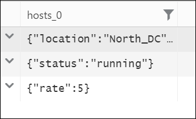

# Working with JSON and data Structures in Azure Monitor log queries

> [!NOTE]
> You should complete [Get started with Azure Monitor Log Analytics](get-started-portal.md) and [Getting started with Azure Monitor log queries](get-started-queries.md) before completing this lesson.

[!INCLUDE [log-analytics-demo-environment](../../../includes/log-analytics-demo-environment.md)]

Nested objects are objects that contain other objects in an array or a map of key-value pairs. These objects are represented as JSON strings. This article describes how JSON is used to retrieve data and analyze nested objects.

## Working with JSON strings
Use `extractjson` to access a specific JSON element in a known path. This function requires a path expression that uses the following conventions.

- _$_ to refer to the root folder
- Use the bracket or dot notation to refer to indexes and elements as illustrated in the following examples.


Use brackets for indexes and dots to separate elements:

```Kusto
let hosts_report='{"hosts": [{"location":"North_DC", "status":"running", "rate":5},{"location":"South_DC", "status":"stopped", "rate":3}]}';
print hosts_report
| extend status = extractjson("$.hosts[0].status", hosts_report)
```

This is the same result using only the brackets notation:

```Kusto
let hosts_report='{"hosts": [{"location":"North_DC", "status":"running", "rate":5},{"location":"South_DC", "status":"stopped", "rate":3}]}';
print hosts_report 
| extend status = extractjson("$['hosts'][0]['status']", hosts_report)
```

If there is only one element, you can use only the dot notation:

```Kusto
let hosts_report='{"location":"North_DC", "status":"running", "rate":5}';
print hosts_report 
| extend status = hosts_report.status
```


## Working with objects

### parsejson
To access multiple elements in your json structure, it's easier to access it as a dynamic object. Use `parsejson` to cast text data to a dynamic object. Once converted to a dynamic type, additional functions can be used to analyze the data.

```Kusto
let hosts_object = parsejson('{"hosts": [{"location":"North_DC", "status":"running", "rate":5},{"location":"South_DC", "status":"stopped", "rate":3}]}');
print hosts_object 
| extend status0=hosts_object.hosts[0].status, rate1=hosts_object.hosts[1].rate
```


### arraylength
Use `arraylength` to count the number of elements in an array:

```Kusto
let hosts_object = parsejson('{"hosts": [{"location":"North_DC", "status":"running", "rate":5},{"location":"South_DC", "status":"stopped", "rate":3}]}');
print hosts_object 
| extend hosts_num=arraylength(hosts_object.hosts)
```

### mvexpand
Use `mvexpand` to break the properties of an object into separate rows.

```Kusto
let hosts_object = parsejson('{"hosts": [{"location":"North_DC", "status":"running", "rate":5},{"location":"South_DC", "status":"stopped", "rate":3}]}');
print hosts_object 
| mvexpand hosts_object.hosts[0]
```



### buildschema
Use `buildschema` to get the schema that admits all values of an object:

```Kusto
let hosts_object = parsejson('{"hosts": [{"location":"North_DC", "status":"running", "rate":5},{"location":"South_DC", "status":"stopped", "rate":3}]}');
print hosts_object 
| summarize buildschema(hosts_object)
```

The output is a schema in JSON format:
```json
{
    "hosts":
    {
        "indexer":
        {
            "location": "string",
            "rate": "int",
            "status": "string"
        }
    }
}
```
This output describes the names of the object fields and their matching data types. 

Nested objects may have different schemas such as in the following example:

```Kusto
let hosts_object = parsejson('{"hosts": [{"location":"North_DC", "status":"running", "rate":5},{"status":"stopped", "rate":"3", "range":100}]}');
print hosts_object 
| summarize buildschema(hosts_object)
```


## Next steps
See other lessons for using log queries in Azure Monitor:

- [String operations](string-operations.md)
- [Date and time operations](datetime-operations.md)
- [Aggregation functions](aggregations.md)
- [Advanced aggregations](advanced-aggregations.md)
- [Advanced query writing](advanced-query-writing.md)
- [Joins](joins.md)
- [Charts](charts.md)