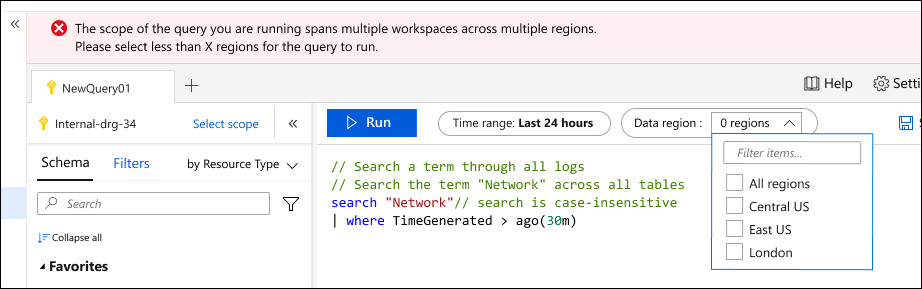

# Overview of Log Analytics in Azure Monitor
[Azure Monitor Logs](../platform/data-platform-logs.md) stores monitoring data from all of your resources monitored by Azure Monitor. This includes such data as resource logs and platform metrics from your Azure resources, performance data and events from your virtual machines, and application usage and performance. Log Analytics is the primary tool in Azure Monitor to create and run log queries to retrieve this data. You can use interactive tools in Log Analytics to analyze the results of log queries interactively or use the query to visualize results in a workbook or to create a log alert rule.

## Relationship to Azure Data Explorer
If you're already familiar with Azure Data Explorer, then Log Analytics should look familiar. That's because it's built on top of Azure Data Explorer and uses the same Kusto Query Language (KQL). There are some difference in the Azure Monitor flavor of the language that are noted in the [KQL reference](/azure/data-explorer/kusto/query/).

## Meet Log Analytics
The following image identifies the different components of Log Analytics.

### 1. Top action bar
The top action bar provides controls for working with the query in the query window and 

**Scope:** Specifies the scope of data used for the query. This could be all data in a Log Analytics workspace or data for a particular resource across multiple workspaces. See [Query scope](#query-scope).

**Run button:** Click to run the selected query in the query window. You can also press shift+enter to run a query.

**Time picker:** Select the time range for the data available to the query. This is overriden if you include a time filter in the query. See [Log query scope and time range in Azure Monitor Log Analytics](scope.md).

**Save button:** Save the query to the Query Explorer for the workspace.

**Copy button:** Copy a link to the query, the query text, or the query results to the clipboard.

**New alert rule button:** Create a new tab with an empty query.

**Export button:** Export the results of the query to a CSV file or the query to Power Query Formula Language format for use with Power Bi.

**Pin to dashboard button:** Add the results of the query to an Azure dashboard.

**Format query button:** Arrange the selected text for readability.

**Example queries button:** Open the example queries dialog box that is displayed when you first open Log Analytics.

**Query Explorer button:** Open **Query Explorer** which provides access to saved queries in the workspace.

### 2. Sidebar

**Tables:** Lists the tables that are part of the selected scope. Select **Group by** to change the grouping of the tables. Hover over a table name to display a dialog box with a description of the table and options to view its documentation and to preview its data. Expand a table to view its columns. Double-click on a table or column name to add it to the query.

**Queries:** List of example queries that you can open in the query window. This is the same list that's displayed when you open Log Analytics. Select **Group by** to change the grouping of the queries. Double-click on a query to add it to the query window or hover over it for other options.

**Filter:** Creates filter options based on the results of a query. After you a run a query, columns will be displayed with different values from the results. Select one or more values and then click **Apply & Run** to add a **where** command to the query and run it again.

### 3. Query window
The query window is where you edit your query. This includes intellisense for KQL commands and color coding to enhance readability. Click the **+** at the top of the window to open another tab.

As single window can include multiple queries. A query cannot include any blank lines, so you can separate multiple queries in a window with one or more blank lines. The current query is the one with the cursor positioned anywhere in it.

To run the current query, click the **Run** button or press Shift+Enter.

### 4. Results window
The results of the query are displayed in the results window. By default, the results are displayed as a table. To display as a chart, either select **Chart** in the results window, or add a **render** command to your query.

#### Results view
The Results view displays query results in a table organized by columns and rows. Click to the left of a row to expand its values. Click on the **Columns** dropdown to change the list of columns. 

Sort the results by clicking on a column name. Filter the results by clicking the funnel next to a column name. Clear the filters and reset the sorting by running the query again.

Select **Group columns** to display the grouping bar above the query results. Group the results by any column by dragging it to the bar. Create nested groups in the results by adding additional columns. 

#### Chart view
The Chart view displays the results as one of multiple available chart types. You can specify the chart type in a **render** command in your query or select it from the **Visualization Type** dropdown.

| Option | Description |
|:---|:---|
| **Visualization Type** | Type of chart to display. |
| **X-Axis** | Column in the results to use for the X-Axis 
| **Y-Axis** | Column in the results to use for the Y-Axis. This will typically be a numeric column. |
| **Split by** | Column in the results that defines the series in the chart. A series is created for each value in the column. |
| **Aggregation** | Type of aggregation to perform on the numeric values in the Y-Axis. |

## Query scope
The query scope defines the records that are evaluated by the query. This will usually include all records in a single Log Analytics workspace or Application Insights application. Log Analytics also allows you to set a scope for a particular monitored Azure resource. This allows a resource owner to focus only on their data, even if that resource writes to multiple workspaces.

The scope is always displayed at the top left of the Log Analytics window. An icon indicates whether the scope is a Log Analytics workspace or an Application Insights application. No icon indicates another Azure resource.

The scope is determined by the method you use to start Log Analytics, and in some cases you can change the scope by clicking on it. The following table lists the different types of scope used and different details for each.

> [!IMPORTANT]
> If you are using APM 2.1, then Application Insights applications are stored in a Log Analytics workspace with all other log data, and the Application Insights scope is not available. If you select **Logs** from the Application Insights menu, then it acts the same as the **Other Azure resources** scope, and only the data fro that application in the Application Insights tables is available.

| Query scope | Records in scope | How to select | Changing Scope |
|:---|:---|:---|:---|
| Log Analytics workspace | All records in the Log Analytics workspace. | Select **Logs** from the **Azure Monitor** menu or the **Log Analytics workspaces** menu.  | Can change scope to any other resource type. |
| Application Insights application | All records in the Application Insights application. | Select **Analytics** from **Overview** page of Application Insights. | Can only change scope to another Application Insights application. |
| Resource group | Records created by all resources in the resource group. May include data from multiple Log Analytics workspaces. | Select **Logs** from the resource group menu. | Cannot change scope.|
| Subscription | Records created by all resources in the subscription. May include data from multiple Log Analytics workspaces. | Select **Logs** from the subscription menu.   | Cannot change scope. |
| Other Azure resources | Records created by the resource. May include data from multiple Log Analytics workspaces.  | Select **Logs** from the resource menu. OR Select **Logs** from the **Azure Monitor** menu and then select a new scope. | Can only change scope to same resource type. |

## Query limits
You may have business requirements for an Azure resource to write data to multiple Log Analytics workspaces. The workspace doesn't need to be in the same region as the resource, and a single workspace might gather data from resources in a variety of regions.  

Setting the scope to a resource or set of resources is a particularly powerful feature of Log Analytics since it allows you to automatically consolidate distributed data in a single query. It can significantly affect performance though if data needs to be retrieved from workspaces across multiple Azure regions.

Log Analytics helps protect against excessive overhead from queries that span workspaces in multiple regions by issuing a warning or error when a certain number of regions are being used. 
Your query will receive a warning if the scope includes workspaces in 5 or more regions. it will still run, but it may take excessive time to complete.

Your query will be blocked from running if the scope includes workspaces in 20 or more regions. In this case you will be prompted to reduce the number of workspace regions and attempt to run the query again. The dropdown will display all of the regions in the scope of the query, and you should reduce the number of regions before attempting to run the query again.

## Time range
The time range specifies the set of records that are evaluated for the query based on when the record was created. This is defined by a standard property on every record in the workspace or application as specified in the following table.

| Location | Property |
|:---|:---|
| Log Analytics workspace          | TimeGenerated |
| Application Insights application | timestamp     |

Set the time range by selecting it from the time picker at the top of the Log Analytics window.  You can select a predefined period or select **Custom** to specify a specific time range.

If you set a filter in the query that uses the standard time property as shown in the table above, the time picker changes to **Set in query**, and the time picker is disabled. In this case, it's most efficient to put the filter at the top of the query so that any subsequent processing only needs to work with the filtered records.

If you use the [workspace](workspace-expression.md) or [app](app-expression.md) command to retrieve data from another workspace or application, the time picker may behave differently. If the scope is a Log Analytics workspace and you use **app**, or if the scope is an Application Insights application and you use **workspace**, then Log Analytics may not understand that the property used in the filter should determine the time filter.

In the following example, the scope is set to a Log Analytics workspace.  The query uses **workspace** to retrieve data from another Log Analytics workspace. The time picker changes to **Set in query** because it sees a filter that uses the expected **TimeGenerated** property.

If the query uses **app** to retrieve data from an Application Insights application though, Log Analytics doesn't recognize the **timestamp** property in the filter, and the time picker remains unchanged. In this case, both filters are applied. In the example, only records created in the last 24 hours are included in the query even though it specifies 7 days in the **where** clause.

## Next steps
- Walk through a [tutorial on using Log Analytics in the Azure portal](get-started-portal.md).
- Walk through a [tutorial on writing queries](get-started-queries.md).
