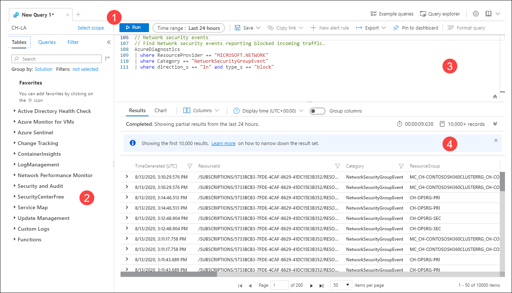

# Overview of Log Analytics in Azure Monitor
[Azure Monitor Logs](../platform/data-platform-logs.md) stores monitoring data from all of your resources monitored by Azure Monitor. This includes such data as resource logs and platform metrics from your Azure resources, performance data and events from your virtual machines, and application usage and performance. Log Analytics is the primary tool in Azure Monitor to create and run log queries to retrieve this data. You can use interactive tools in Log Analytics to analyze the results of log queries interactively or use the query to visualize results in a workbook or to create a log alert rule.

## Relationship to Azure Data Explorer
If you're already familiar with Azure Data Explorer, then Log Analytics should look familiar. That's because it's built on top of Azure Data Explorer and uses the same Kusto Query Language (KQL). There are some difference in the Azure Monitor flavor of the language that are noted in the [KQL reference](/azure/data-explorer/kusto/query/).

## Meet Log Analytics
The following image identifies the different components of Log Analytics.

### 1. Top action bar
The top action bar provides controls for working with the query in the query window and 

**Scope:** Specifies the scope of data used for the query. This could be all data in a Log Analytics workspace or data for a particular resource across multiple workspaces. See [Query scope](#query-scope).

**Run button:** Click to run the selected query in the query window. You can also press shift+enter to run a query.

**Time picker:** Select the time range for the data available to the query. This is overriden if you include a time filter in the query. See [Log query scope and time range in Azure Monitor Log Analytics](scope.md).

**Save button:** Save the query to the Query Explorer for the workspace.

**Copy button:** Copy a link to the query, the query text, or the query results to the clipboard.

**New alert rule button:** Create a new tab with an empty query.

**Export button:** Export the results of the query to a CSV file or the query to Power Query Formula Language format for use with Power Bi.

**Pin to dashboard button:** Add the results of the query to an Azure dashboard.

**Format query button:** Arrange the selected text for readability.

**Example queries button:** Open the example queries dialog box that is displayed when you first open Log Analytics.

**Query Explorer button:** Open **Query Explorer** which provides access to saved queries in the workspace.

### 2. Sidebar

**Tables:** Lists the tables that are part of the selected scope. Select **Group by** to change the grouping of the tables. Hover over a table name to display a dialog box with a description of the table and options to view its documentation and to preview its data. Expand a table to view its columns. Double-click on a table or column name to add it to the query.

**Queries:** List of example queries that you can open in the query window. This is the same list that's displayed when you open Log Analytics. Select **Group by** to change the grouping of the queries. Double-click on a query to add it to the query window or hover over it for other options.

**Filter:** Creates filter options based on the results of a query. After you a run a query, columns will be displayed with different values from the results. Select one or more values and then click **Apply & Run** to add a **where** command to the query and run it again.

### 3. Query window
The query window is where you edit your query. This includes intellisense for KQL commands and color coding to enhance readability. Click the **+** at the top of the window to open another tab.

As single window can include multiple queries. A query cannot include any blank lines, so you can separate multiple queries in a window with one or more blank lines. The current query is the one with the cursor positioned anywhere in it.

To run the current query, click the **Run** button or press Shift+Enter.

### 4. Results window
The results of the query are displayed in the results window. By default, the results are displayed as a table. To display as a chart, either select **Chart** in the results window, or add a **render** command to your query.

#### Results view
The Results view displays query results in a table organized by columns and rows. Click to the left of a row to expand its values. Click on the **Columns** dropdown to change the list of columns. 

Sort the results by clicking on a column name. Filter the results by clicking the funnel next to a column name. Clear the filters and reset the sorting by running the query again.

Select **Group columns** to display the grouping bar above the query results. Group the results by any column by dragging it to the bar. Create nested groups in the results by adding additional columns. 

#### Chart view
The Chart view displays the results as one of multiple available chart types. You can specify the chart type in a **render** command in your query or select it from the **Visualization Type** dropdown.

| Option | Description |
|:---|:---|
| **Visualization Type** | Type of chart to display. |
| **X-Axis** | Column in the results to use for the X-Axis 
| **Y-Axis** | Column in the results to use for the Y-Axis. This will typically be a numeric column. |
| **Split by** | Column in the results that defines the series in the chart. A series is created for each value in the column. |
| **Aggregation** | Type of aggregation to perform on the numeric values in the Y-Axis. |

## Next steps
- Walk through a [tutorial on using Log Analytics in the Azure portal](get-started-portal.md).
- Walk through a [tutorial on writing queries](get-started-queries.md).
