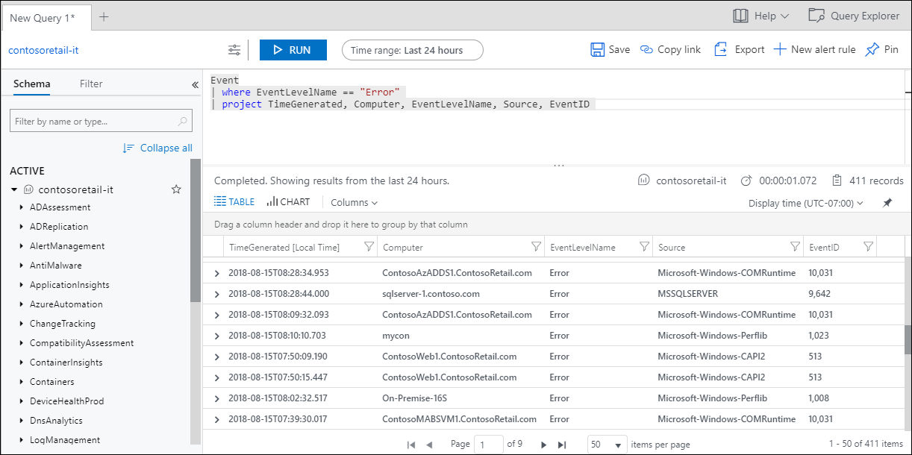

# Overview of log queries in Azure Monitor
Log queries help you to fully leverage the value of the data collected in [Azure Monitor Logs](../platform/data-platform-logs.md). A powerful query language allows you to join data from multiple tables, aggregate large sets of data, and perform complex operations with minimal code. Virtually any question can be answered and analysis performed as long as the supporting data has been collected, and you understand how to construct the right query.

Some features in Azure Monitor such as [insights](../insights/insights-overview.md) and [solutions](../insights/solutions-inventory.md) process log data without exposing you to the underlying queries. To fully leverage other features of Azure Monitor, you should understand how queries are constructed and how you can use them to interactively analyze data in Azure Monitor Logs.

Use this article as a starting point to learning about log queries in Azure Monitor. It answers common questions and provides links to other documentation that provides further details and lessons.

## How can I learn how to write queries?
If you want to jump right into things, you can start with the following tutorials:

- [Get started with Log Analytics in Azure Monitor](get-started-portal.md).
- [Get started with log queries in Azure Monitor](get-started-queries.md).

Once you have the basics down, walk through multiple lessons using either your own data or data from our demo environment starting with: 

- [Work with strings in Azure Monitor log queries](string-operations.md)
 
## What language do log queries use?
Azure Monitor Logs is based on [Azure Data Explorer](/azure/data-explorer), and log queries are written using the same Kusto query language (KQL). This is a rich language designed to be easy to read and author, and you should be able to start using it with minimal guidance.

See [Azure Data Explorer KQL documentation](/azure/kusto/query) for complete documentation on KQL and reference on different functions available.<br>
See [Get started with log queries in Azure Monitor](get-started-queries.md) for a quick walkthrough of the language using data from Azure Monitor Logs.
 See [Azure Monitor log query language differences](data-explorer-difference.md) for minor differences in the version of KQL used by Azure Monitor.

## What data is available to log queries?
All data collected in Azure Monitor Logs is available to retrieve and analyze in log queries. Different data sources will write their data to different tables, but you can include multiple tables in a single query to analyze data across multiple sources. When you build a query, you start by determining which tables have the data that you're looking for, so you should have at least a basic understanding of how data in Azure Monitor Logs is structured.

See [Sources of Azure Monitor Logs](../platform/data-platform-logs.md#sources-of-azure-monitor-logs), for a list of different data sources that populate Azure Monitor Logs.<br>
See [Structure of Azure Monitor Logs](logs-structure.md) for an explanation of how the data is structured.

## What does a log query look like?
A query could be as simple as a single table name for retrieving all records from that table:

```Kusto
Syslog
```

Or it could filter for particular records, summarize them, and visualize the results in a chart:

```
SecurityEvent
| where TimeGenerated > ago(7d)
| where EventID == 4625
| summarize count() by Computer, bin(TimeGenerated, 1h)
| render timechart 
```

For more complex analysis, you might retrieve data from multiple tables using a join to analyze the results together.

```Kusto
app("ContosoRetailWeb").requests
| summarize count() by bin(timestamp,1hr)
| join kind= inner (Perf
    | summarize avg(CounterValue) 
      by bin(TimeGenerated,1hr))
on $left.timestamp == $right.TimeGenerated
```
Even if you aren't familiar with KQL, you should be able to at least figure out the basic logic being used by these queries. They start with the name of a table and then add multiple commands to filter and process that data. A query can use any number of commands, and you can write more complex queries as you become familiar with the different KQL commands available.

See [Get started with log queries in Azure Monitor](get-started-queries.md) for a tutorial on log queries that introduces the language and common functions, .<br>


## What is Log Analytics?
Log Analytics is the primary tool in the Azure portal for writing log queries and interactively analyzing their results. Even if a log query is used elsewhere in Azure Monitor, you'll typically write and test the query first using Log Analytics.

You can start Log Analytics from several places in the Azure portal. The scope of the data available to Log Analytics is determined by how you start it. See [Query Scope](scope.md) for more details.

- Select **Logs** from the **Azure Monitor** menu or **Log Analytics workspaces** menu.
- Select **Analytics** from the **Overview** page of an Application Insights application.
- Select **Logs** from the menu of an Azure resource.



See [Get started with Log Analytics in Azure Monitor](get-started-portal.md) for a tutorial walkthrough of Log Analytics that introduces several of its features.

## Where else are log queries used?
In addition to interactively working with log queries and their results in Log Analytics, areas in Azure Monitor where you will use queries include the following:

- **Alert rules.** [Alert rules](../platform/alerts-overview.md) proactively identify issues from data in your workspace.  Each alert rule is based on a log search that is automatically run at regular intervals.  The results are inspected to determine if an alert should be created.
- **Dashboards.** You can pin the results of any query into an [Azure dashboard](../learn/tutorial-logs-dashboards.md) which allow you to visualize log and metric data together and optionally share with other Azure users.
- **Views.**  You can create visualizations of data to be included in user dashboards with [View Designer](../platform/view-designer.md).  Log queries provide the data used by [tiles](../platform/view-designer-tiles.md) and [visualization parts](../platform/view-designer-parts.md) in each view.  
- **Export.**  When you import log data from Azure Monitor into Excel or [Power BI](../platform/powerbi.md), you create a log query to define the data to export.
- **PowerShell.** You can run a PowerShell script from a command line or an Azure Automation runbook that uses [Get-AzOperationalInsightsSearchResults](/powershell/module/az.operationalinsights/get-azoperationalinsightssearchresult) to retrieve log data from Azure Monitor.  This cmdlet requires a query to determine the data to retrieve.
- **Azure Monitor Logs API.**  The [Azure Monitor Logs API](../platform/alerts-overview.md) allows any REST API client to retrieve log data from the workspace.  The API request includes a query that is run against Azure Monitor to determine the data to retrieve.


## Next steps
- Walk through a [tutorial on using Log Analytics in the Azure portal](get-started-portal.md).
- Walk through a [tutorial on writing queries](get-started-queries.md).
