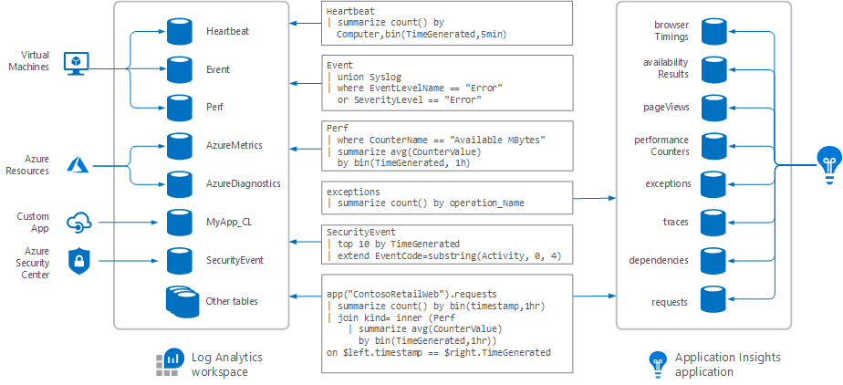

# Analyze log data in Azure Monitor

Log data collected by Azure Monitor is stored in a Log Analytics workspace, which is based on [Azure Data Explorer](/azure/data-explorer). It collects telemetry from a variety of sources and uses the [Kusto query language](/azure/kusto/query) used by Data Explorer to retrieve and analyze data.

[!INCLUDE [azure-monitor-log-analytics-rebrand](../../../includes/azure-monitor-log-analytics-rebrand.md)]


## Log queries

You require a log query to retrieve any log data from Azure Monitor.  Whether you're [analyzing data in the portal](portals.md), [configuring an alert rule](../platform/alerts-metric.md) to be notified of a particular condition, or retrieving data using the [Azure Monitor Logs API](https://dev.loganalytics.io/), you will use a query to specify the data you want.  This article describes how log queries are used in Azure Monitor and provides concepts that should understand before creating one.


## Where log queries are used


[!INCLUDE [updated-for-az](../../../includes/updated-for-az.md)]

The different ways that you will use queries in Azure Monitor include the following:


- **Portal.** You can perform interactive analysis of log data in the [Azure portal](portals.md).  This allows you to edit your query and analyze the results in a variety of formats and visualizations.  
- **Alert rules.** [Alert rules](../platform/alerts-overview.md) proactively identify issues from data in your workspace.  Each alert rule is based on a log search that is automatically run at regular intervals.  The results are inspected to determine if an alert should be created.
- **Dashboards.** You can pin the results of any query into an [Azure dashboard](../learn/tutorial-logs-dashboards.md) which allow you to visualize log and metric data together and optionally share with other Azure users. 
- **Views.**  You can create visualizations of data to be included in user dashboards with [View Designer](../platform/view-designer.md).  Log queries provide the data used by [tiles](../platform/view-designer-tiles.md) and [visualization parts](../platform/view-designer-parts.md) in each view.  

- **Export.**  When you import log data from Azure Monitor into Excel or [Power BI](../platform/powerbi.md), you create a log query to define the data to export.
- **PowerShell.** You can run a PowerShell script from a command line or an Azure Automation runbook that uses [Get-AzOperationalInsightsSearchResults](/powershell/module/azurerm.operationalinsights/get-azurermoperationalinsightssearchresults?view=azurermps-4.0.0) to retrieve log data from Azure Monitor.  This cmdlet requires a query to determine the data to retrieve.
- **Azure Monitor Logs API.**  The [Azure Monitor Logs API](../platform/alerts-overview.md) allows any REST API client to retrieve log data from the workspace.  The API request includes a query that is run against Azure Monitor to determine the data to retrieve.


## Write a query
Azure Monitor uses [a version of the Kusto query language](get-started-queries.md) to retrieve and analyze log data in a variety of ways.  You'll typically start with basic queries and then progress to use more advanced functions as your requirements become more complex.

The basic structure of a query is a source table followed by a series of operators separated by a pipe character `|`.  You can chain together multiple operators to refine the data and perform advanced functions.

For example, suppose you wanted to find the top ten computers with the most error events over the past day.

```Kusto
Event
| where (EventLevelName == "Error")
| where (TimeGenerated > ago(1days))
| summarize ErrorCount = count() by Computer
| top 10 by ErrorCount desc
```

Or maybe you want to find computers that haven't had a heartbeat in the last day.

```Kusto
Heartbeat
| where TimeGenerated > ago(7d)
| summarize max(TimeGenerated) by Computer
| where max_TimeGenerated < ago(1d)  
```

How about a line chart with the processor utilization for each computer from last week?

```Kusto
Perf
| where ObjectName == "Processor" and CounterName == "% Processor Time"
| where TimeGenerated  between (startofweek(ago(7d)) .. endofweek(ago(7d)) )
| summarize avg(CounterValue) by Computer, bin(TimeGenerated, 5min)
| render timechart    
```

You can see from these quick samples that regardless of the kind of data that you're working with, the structure of the query is similar.  You can break it down into distinct steps where the resulting data from one command is sent through the pipeline to the next command.

You can also query data across Log Analytics workspaces within your subscription.

```Kusto
union Update, workspace("contoso-workspace").Update
| where TimeGenerated >= ago(1h)
| summarize dcount(Computer) by Classification 
```

## How Azure Monitor log data is organized
When you build a query, you start by determining which tables have the data that you're looking for. Different kinds of data are separated into dedicated tables in each [Log Analytics workspace](../learn/quick-create-workspace.md).  Documentation for different data sources includes the name of the data type that it creates and a description of each of its properties.  Many queries will only require data from a single table, but others may use a variety of options to include data from multiple tables.

While [Application Insights](../app/app-insights-overview.md) stores application data such as requests, exceptions, traces, and usage in Azure Monitor logs, this data is stored in a different partition than the other log data. You use the same query language to access this data but must use the [Application Insights console](../app/analytics.md) or [Application Insights REST API](https://dev.applicationinsights.io/) to access it. You can use [cross-resources queries](../log-query/cross-workspace-query.md) to combine Application Insights data with other log data in Azure Monitor.





## Next steps
- Learn about using [Log Analytics to create and edit log searches](../log-query/portals.md).
- Check out a [tutorial on writing queries](../log-query/get-started-queries.md) using the new query language.
