# Transition from Log Analytics log search to Azure Monitor logs
The log search in Log Analytics was recently replaced with a new experience for analyzing Azure Monitor logs. The Log search page is currently still accessible through the **Logs (classic)** menu item in the **Log Analytics workspaces** page in the Azure portal but will be removed February 15th, 2019. This article describes differences between the two experiences to help you transition from log search. 

## Filter results of a query
In Log Search, a list of filters are displayed as search results are delivered. Select a filter and click **Apply** to run the query with the selected filter.

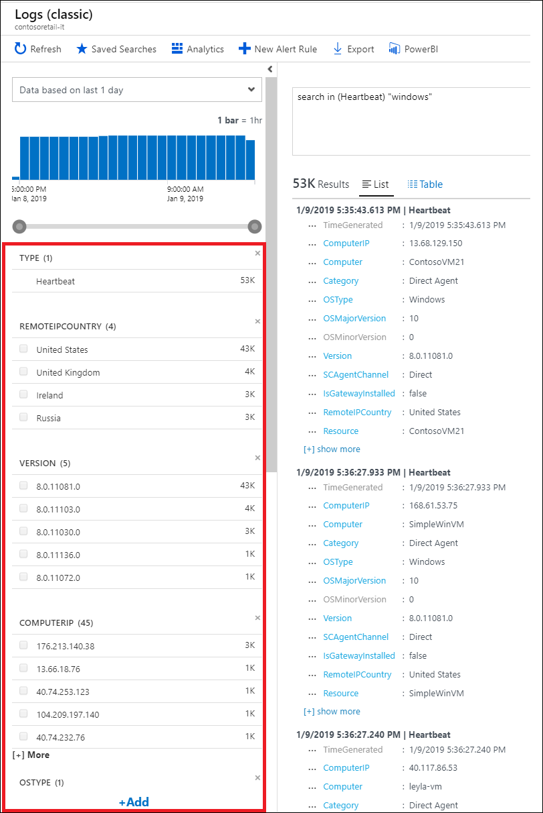

In Azure Monitor logs, select *Filter (preview)* to display filters. Click on the filter icon to display addition filters. Select a filter and click **Apply & Run** to run the query with the selected filter.

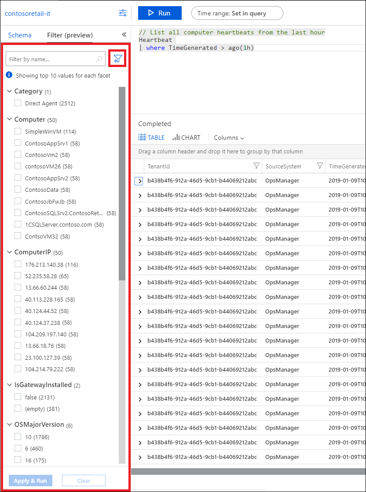

## Extract custom fields 
In Log Search, you extract [custom fields](../platform/custom-fields.md) from the List view, where a field’s menu includes the action _Extract fields from Table_.

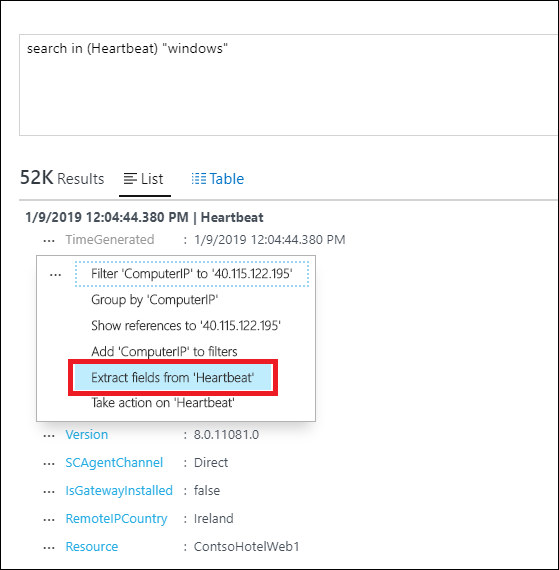

In Azure Monitor logs, you extract custom fields from the table view. Expand a record by clicking the arrow to its left then click the ellipsis to access the _Extract fields_ action.

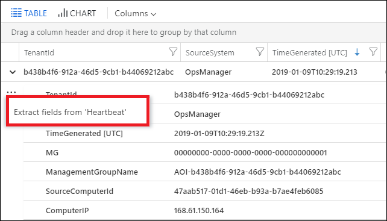

## Functions and computer groups
To save a search in Log Search, select **Saved searches** and **Add** to provide a name, category, and query text. Create a [computer group](../platform/computer-groups.md) by adding a function alias.

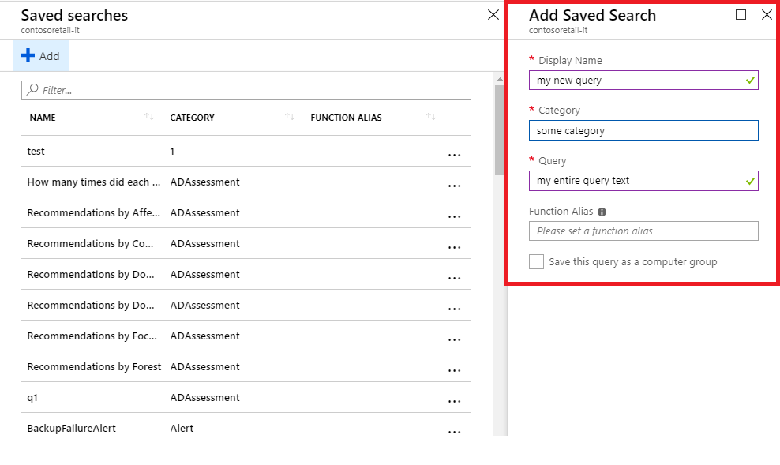

To save the current query in Azure Monitor logs, select **Save**. Change **Save as** to _Function_ and provide a **Function Alias** to create a [function](functions.md). Select _Save this query as a computer group_ to use the function alias for a [computer group](../platform/computer-groups.md).

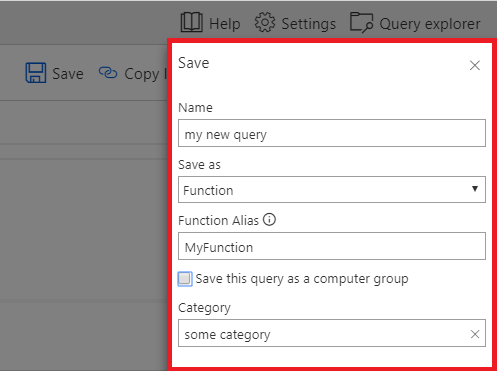

## Saved queries
In Log Search, your saved queries are available through the action bar item **Saved searches**. In Azure Monitor logs, access saved queries from [Query Explorer](../log-query/get-started-portal.md#save-queries).

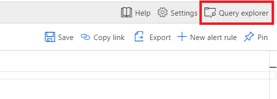

## Drill down on summarized rows
In Log Search, you can click on a row in a summarized query to launch another query that lists detailed records in that row.

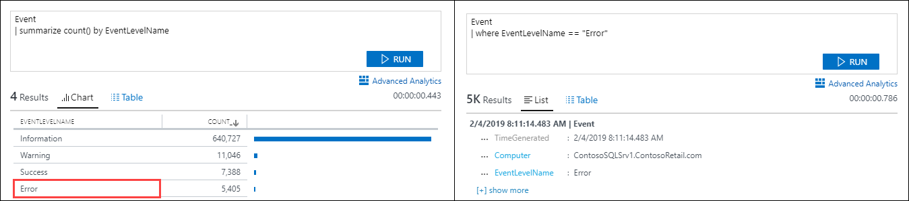

In Azure Monitor logs, you must modify the query to return these records. Expand one of the rows in the results and click the **+** next to the value to add it to the query. Then comment out the **summarize** command and run the query again.

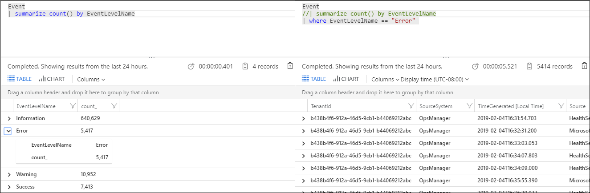

## Take action
In Log Search, you can [start a runbook](take-action.md) from a search result by selecting **Take action**.

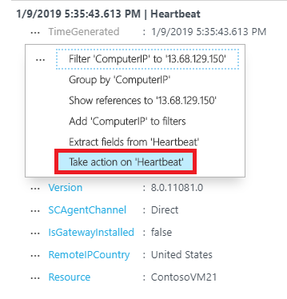

In Azure Monitor logs, [create an alert from the log query](../platform/alerts-log.md). Configure an action group with one or more actions that will run in response to the alert.

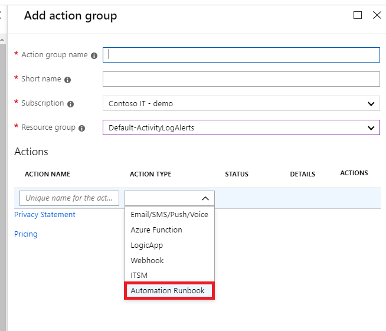

## Next steps

- Learn more about the new [Azure Monitor logs experience](get-started-portal.md).
