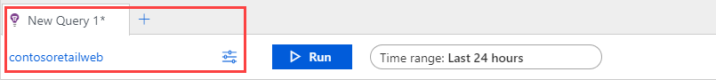

# Overview of Log Analytics in Azure Monitor
Log Analytics is a tool in the Azure portal for writing log queries and analyzing their results. It's the primary experience for working with log data and creating queries in Azure Monitor.  You can perform analysis of log data in Log Analytics or use it to test queries before using them in other places.

This article gives an overview of Log Analytics and important details about its operation. For a tutorial walkthrough of Log Analytics, see [Get started with Azure Monitor Log Analytics](get-started-portal.md).

## Query scope
The query scope defines the records that are evaluated by the query. This may include all records in a single Log Analytics workspace or Application Insights application, or it may include records created by particular Azure resources across multiple workspaces. The scope is always displayed at the top left of the Log Analytics window. An icon indicates whether the scope is a Log Analytics workspace or an Application Insights application. No icon indicates another Azure resource.

 

The scope is defined by a single Azure resource and functions differently depending on the resource type. The scope is determined by the method you use to start Log Analytics, and in some cases you can change the scope by clicking on it.

The following table lists the different resource types used for the query scope and different details for each.

| Query scope resource | Records in scope | How to select | Changing Scope |
|:---|:---|:---|:---|
| Log Analytics workspace | All records in the Log Analytics workspace. | Select **Logs** from the **Azure Monitor** menu or the **Log Analytics workspaces** menu.  | Can change scope to any other resource type. |
| Application Insights application | All records in the Application Insights application. | Select **Analytics** from **Overview** page of Application Insights. | Can only change scope to another Application Insights application. |
| Resource group | Records created by all resources in the resource group. May include data from multiple Log Analytics workspaces. | Select **Logs** from the resource group menu. | Cannot change scope.|
| Subscription | Records created by all resources in the subsciption. May include data from multiple Log Analytics workspaces. | Select **Logs** from the **Azure Monitor** menu. Click on scope. Select **Multiple resources**. Select subscription. | Can change scope to any other resource type. |
| Other Azure resources | Records created by the resource. May include data from multiple Log Analytics workspaces.  | Select **Logs** from the resource menu. OR Select **Logs** from the **Azure Monitor** menu and then select a new scope. | Can only change scope to same resource type. |

## Scope limitations
When the query scope is a Log Analytics workspace or an Application Insights application, all options in the portal and all query commands are available. The following limitations though apply when another resource type is used for the scope.

The following options in the portal not available:
- Save
- New alert rule
- Query explorer

The following commands cannot be used in the query:
- [app](app-expression.md)
- [workspace](workspace-expression.md)
 

## Query limits
When the query scope is a resource group or Azure subscription, it may
include multiple Log Analytics workspaces, and it can significantly affect performance if those workspaces are spread across multiple Azure regions. In this case, your query may receive a warning or be blocked from running.

Your query will receive a warning if the scope includes workspaces in 7 or more regions, it will still run but may take excessive time to complete.

Your query will be blocked from running if the scope includes workspaces in 20 or more regions. In this case you will be prompted to reduce the number of workspace regions and attempt to run the query again. The dropdown will display all of the regions in the scope of the query, but you may only select up to 5 before attempting to run the query again.

## Time range
The time range species the set of records that are evaluated for the query based on when the record was created. This is defined by a standard property on every record in the workspace or application as specified in the following table.

| Location | Property |
|:---|:---|
| Log Analytics workspace          | TimeGenerated |
| Application Insights application | timestamp     |

Set the time range by selecting the time range from the time picker at the top of the Log Analytics window.  You can select a predefined period or select **Custom** to specify a specific time range.

If you set a filter in the query that uses the standard time property as shown in the table above, the time picker changes to **Set in query**, and the time picker is disabled. In this case, it's most efficient to put the filter at the top of the query so that any subsequent processing only needs to work with the filtered records.

If you use the [workspace](workspace-expression.md) or [app](app-expression.md) command to retrieve data from another workspace or application, the time picker may behave differently. If the scope is a Log Analytics workspace, and you use **app** or if the scope is an Application Insights application, and you use **workspace**, then Log Analytics may not understand that the property used in the filter should determine the time filter.

In the following example, the scope is set to a Log Analytics workspace.  The query uses **workspace** to retrieve data from another Log Analytics workspace. The time picker changes to **Set in query** because it sees a filter that uses the expected **TimeGenerated** property.

If the query uses **app** to retrieve data from an Application Insights application though, Log Analytics doesn't recognize the **timestamp** property in the filter, and the time picker remains unchanged. In this case, both filters are applied. In the example, only records created in the last 24 hours are included in the query even though it specifies 7 days in the **where** clause.

## Firewall requirements
Your browser requires access to the following addresses to access Log Analytics.  If your browser is accessing the Azure portal through a firewall, you must enable access to these addresses.

| Uri | IP | Ports |
|:---|:---|:---|
| portal.loganalytics.io | Dynamic | 80,443 |
| api.loganalytics.io    | Dynamic | 80,443 |
| docs.loganalytics.io   | Dynamic | 80,443 |

## Next steps

- Walk through a [tutorial using Log Analytics](../../azure-monitor/log-query/get-started-portal.md).
- Walk through a [tutorial using Log Search](../../azure-monitor/learn/tutorial-viewdata.md).

