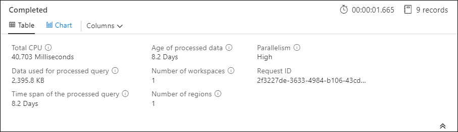

# Optimize log queries in Azure Monitor
Azure Monitor Logs uses [Azure Data Explorer (ADX)](/azure/data-explorer/) to store log data and run queries for analyzing that data. It creates, manages, and maintains the ADX clusters for you, and optimizes them for your log analysis workload. When you run a query, it's optimized, and routed to the appropriate ADX cluster that stores the workspace data. Both Azure Monitor Logs and Azure Data Explorer uses many automatic query optimization mechanisms. While automatic optimizations provide significant boost, they are in some cases where you can dramatically improve your query performance. This article explains the performance considerations and several techniques to fix them.

Most of the techniques are common to queries that are run directly on Azure Data Explorer and Azure Monitor Logs, though there are several unique Azure Monitor Logs considerations that are discussed here. For more Azure Data Explorer optimization tips, see [Query best practices](/azure/kusto/query/best-practices).

Optimized queries will:

- Run faster, reduce overall duration of the query execution.
- Have smaller chance of being throttled or rejected.

You should give particular attention to queries that are used for recurrent and bursty usage such as dashboards, alerts, Logic Apps and Power BI. The impact of an ineffective query in these cases is substantial.

## Query performance pane
After you run a query in Log Analytics, click the down arrow above the query results to view the query performance pane that shows the results of several performance indicators for the query. These performance indicators are each described in the following section.




## Query performance indicators

The following query performance indicators are available for every query that is executed:

- [Total CPU](#total-cpu): Overall compute used to process the query across all compute nodes. It represents time used for computing, parsing, and data fetching. 

- [Data used for processed query](#data-used-for-processed-query): Overall data that was accessed to process the query. Influenced by the size of the target table, time span used, filters applied, and the number of columns referenced.

- [Time span of the processed query](#time-span-of-the-processed-query): The gap between the newest and the oldest data that was accessed to process the query. Influenced by the explicit time range specified for the query.

- [Age of processed data](#age-of-processed-data): The gap between now and the oldest data that was accessed to process the query. It highly influences the efficiency of data fetching.

- [Number of workspaces](#number-of-workspaces): How many workspaces were accessed during the query processing due to implicit or explicit selection.

- [Number of regions](#number-of-regions): How many regions were accessed during the query processing based due to implicit or explicit selection of workspaces. Multi-region queries are much less efficient and performance indicators present partial coverage.

- [Parallelism](#parallelism): Indicates how much the system was able to execute this query on multiple nodes. Relevant only to queries that have high CPU consumption. Influenced by usage of specific functions and operators.


## Total CPU
The actual compute CPU that was invested to process this query across all the query processing nodes. Since most queries are executed on large numbers of nodes, this will usually be much larger than the duration the query actually took to execute. 

Query processing time is spent on:
- Data retrieval – retrieval of old data will consume more time than retrieval of recent data.
- Data processing – logic and evaluation of the data. 

Other than time spent in the query processing nodes, there is additional time that is spend by Azure Monitor Logs to: authenticate the user and verify that they are permitted to access this data, locate the data store, parse the query, and allocate the query processing nodes. This time is not included in the query total CPU time.

### Early filtering of records prior of using high CPU functions

Some of the query commands and functions are heavy in their CPU consumption. This is especially true for commands that parse JSON and XML or extract complex regular expressions. Such parsing can happen explicitly via [parse_json()](/azure/kusto/query/parsejsonfunction) or [parse_xml()](/azure/kusto/query/parse-xmlfunction) functions or implicitly when referring to dynamic columns.

These functions consume CPU in proportion to the number of rows they are processing. The most efficient optimization is to add where conditions early in the query that can filter out as many records as possible before the CPU intensive function is executed.

For example, the following queries produce exactly the same result but the second one is by far the most efficient as the [where](/azure/kusto/query/whereoperator) condition before parsing excludes many records:

```Kusto
//less efficient
SecurityEvent
| extend Details = parse_xml(EventData)
| extend FilePath = tostring(Details.UserData.RuleAndFileData.FilePath)
| extend FileHash = tostring(Details.UserData.RuleAndFileData.FileHash)
| summarize count() by FileHash, FilePath
| where FileHash != "" and FilePath !startswith "%SYSTEM32"  // Problem: irrelevant results are filtered after all processing and parsing is done
```
```Kusto
//more efficient
SecurityEvent
| where EventID == 8002 //Only this event have FileHash
| where EventData !has "%SYSTEM32" //Early removal of unwanted records
| extend Details = parse_xml(EventData)
| extend FilePath = tostring(Details.UserData.RuleAndFileData.FilePath)
| extend FileHash = tostring(Details.UserData.RuleAndFileData.FileHash)
| summarize count() by FileHash, FilePath
| where FileHash != "" // No need to filter out %SYSTEM32 here as it was removed before
```

### Avoid using evaluated where clauses

Queries that contain [where](/azure/kusto/query/whereoperator) clauses on an evaluated column rather than on columns that are physically present in the dataset lose efficiency. Filtering on evaluated columns prevents some system optimizations when large sets of data are handled.
For example, the following queries produce exactly the same result but the second one is more efficient as the [where](/azure/kusto/query/whereoperator) condition refers to built-in column

```Kusto
//less efficient
Heartbeat 
| extend IPRegion = iif(RemoteIPLongitude  < -94,"WestCoast","EastCoast")
| where IPRegion == "WestCoast"
| summarize count() by Computer
```
```Kusto
//more efficient
Heartbeat 
| where RemoteIPLongitude  < -94
| extend IPRegion = iif(RemoteIPLongitude  < -94,"WestCoast","EastCoast")
| summarize count() by Computer
```

### Use effective aggregation commands and dimensions in summarize and join

While some aggregation commands like [max()](/azure/kusto/query/max-aggfunction), [sum()](/azure/kusto/query/sum-aggfunction), [count()](/azure/kusto/query/count-aggfunction), and [avg()](/azure/kusto/query/avg-aggfunction) have low CPU impact due to their logic, other are  more complex and include heuristics and estimations that allow them to be executed efficiently. For example, [dcount()](/azure/kusto/query/dcount-aggfunction) uses the HyperLogLog algorithm to provide close estimation to distinct count of large sets of data without actually counting each value; the percentile functions are doing similar approximations using the nearest rank percentile algorithm. Several of the commands include optional parameters to reduce their impact. For example, the [makeset()](/azure/kusto/query/makeset-aggfunction) function has an optional parameter to define the maximum set size, which significantly affects the CPU and memory.

[Join](/azure/kusto/query/joinoperator?pivots=azuremonitor) and [summarize](/azure/kusto/query/summarizeoperator) commands may cause high CPU utilization when they are processing a large set of data. Their complexity is directly related to the number of possible values, referred to as *cardinality*, of the columns that are using as the `by` in summarize or as the join attributes. For explanation and optimization of join and summarize, see their documentation articles and optimization tips.

For example, the following queries produce exactly the same result because **CounterPath** is always one-to-one mapped to **CounterName** and **ObjectName**. The second one is more efficient as the aggregation dimension is smaller:

```Kusto
//less efficient
Perf
| summarize avg(CounterValue) 
by CounterName, CounterPath, ObjectName
```
```Kusto
//make the group expression more compact improve the performance
Perf
| summarize avg(CounterValue), any(CounterName), any(ObjectName) 
by CounterPath
```

CPU consumption might also be impacted by where conditions or extended columns that require intensive computing. All trivial string comparisons such as [equal ==](/azure/kusto/query/datatypes-string-operators) and [startswith](/azure/kusto/query/datatypes-string-operators) have roughly the same CPU impact while advanced text matches have more impact. Specifically, the [has](/azure/kusto/query/datatypes-string-operators) operator is more efficient that the [contains](/azure/kusto/query/datatypes-string-operators) operator. Due to string handling techniques, it is more efficient to look for strings that are longer than four characters than short strings.

For example, the following queries produce similar results, depending on Computer naming policy, but the second one is more efficient:

```Kusto
//less efficient – due to filter based on contains
Heartbeat
| where Computer contains "Production" 
| summarize count() by ComputerIP 
```
```Kusto
//less efficient – due to filter based on extend
Heartbeat
| extend MyComputer = Computer
| where MyComputer startswith "Production" 
| summarize count() by ComputerIP 
```
```Kusto
//more efficient
Heartbeat
| where Computer startswith "Production" 
| summarize count() by ComputerIP 
```

> [!NOTE]
> This indicator presents only CPU from the immediate cluster. In multi-region query, it would represent only one of the regions. In multi-workspace query, it might not include all workspaces.

### Avoid full XML and JSON parsing when string parsing works
Full parsing of an XML or JSON object may consume high CPU and memory resources. In many cases, when only one or two parameters are needed and the XML or JSON objects are simple, it is easier to parse them as strings using the [parse operator](/azure/kusto/query/parseoperator) or other [text parsing techniques](/azure/azure-monitor/log-query/parse-text). The performance boost will be more significant as the number of records in the XML or JSON object increases. It is essential when the number of records reaches tens of millions.

For example, the following query will return exactly the same results as the queries above without performing full XML parsing. Note that it makes some assumptions on the XML file structure such as that FilePath element comes after FileHash and none of them has attributes. 

```Kusto
//even more efficient
SecurityEvent
| where EventID == 8002 //Only this event have FileHash
| where EventData !has "%SYSTEM32" //Early removal of unwanted records
| parse EventData with * "<FilePath>" FilePath "</FilePath>" * "<FileHash>" FileHash "</FileHash>" *
| summarize count() by FileHash, FilePath
| where FileHash != "" // No need to filter out %SYSTEM32 here as it was removed before
```


## Data used for processed query

A critical factor in the processing of the query is the volume of data that is scanned and used for the query processing. Azure Data Explorer uses aggressive optimizations that dramatically reduce the data volume compared to other data platforms. Still, there are critical factors in the query that can impact the data volume that is used.

In Azure Monitor Logs, the **TimeGenerated** column is used as a way to index the data. Restricting the **TimeGenerated** values to as narrow a range as possible will make a significant improvement to query performance by significantly limiting the amount of data that has to be processed.

### Avoid unnecessary use of search and union operators

Another factor that increases the data that is process is the use of large number of tables. This usually happens when `search *` and `union *` commands are used. These commands force the system to evaluate and scan data from all tables in the workspace. In some cases, there might be hundreds of tables in the workspace. Try to avoid as much as possible using "search *" or any search without scoping it to a specific table.

For example, the following queries produce exactly the same result but the last one is by far the most efficient:

```Kusto
// This version scans all tables though only Perf has this kind of data
search "Processor Time" 
| summarize count(), avg(CounterValue)  by Computer
```
```Kusto
// This version scans all strings in Perf tables – much more efficient
Perf
| search "Processor Time" 
| summarize count(), avg(CounterValue)  by Computer
```
```Kusto
// This is the most efficient version 
Perf 
| where CounterName == "% Processor Time"  
| summarize count(), avg(CounterValue)  by Computer
```

### Add early filters to the query

Another method to reduce the data volume is to have [where](/azure/kusto/query/whereoperator) conditions early in the query. The Azure Data Explorer platform includes a cache that lets it know which partitions include data that is relevant for a specific where condition. For example, if a query contains `where EventID == 4624` then it would distribute the query only to nodes that handle partitions with matching events.

The following example queries produce exactly the same result but the second one is more efficient:

```Kusto
//less efficient
SecurityEvent
| summarize LoginSessions = dcount(LogonGuid) by Account
```
```Kusto
//more efficient
SecurityEvent
| where EventID == 4624 //Logon GUID is relevant only for logon event
| summarize LoginSessions = dcount(LogonGuid) by Account
```

### Reduce the number of columns that is retrieved

Since Azure Data Explorer is a columnar data store, retrieval of every column is independent of the others. The number of columns that are retrieved directly influences the overall data volume. You should only include the columns in the output that are needed by [summarizing](/azure/kusto/query/summarizeoperator) the results or [projecting](/azure/kusto/query/projectoperator) the specific columns. Azure Data Explorer has several optimizations to reduce the number of retrieved columns. If it determines that a column isn't needed, for example if it's not referenced in the [summarize](/azure/kusto/query/summarizeoperator) command, it won't retrieve it.

For example, the second query may process three times more data since it needs to fetch not one column but three:

```Kusto
//Less columns --> Less data
SecurityEvent
| summarize count() by Computer  
```
```Kusto
//More columns --> More data
SecurityEvent
| summarize count(), dcount(EventID), avg(Level) by Computer  
```

## Time span of the processed query

All logs in Azure Monitor Logs are partitioned according to the **TimeGenerated** column. The number of partitions that are accessed are directly related to the time span. Reducing the time range is the most efficient way of assuring a prompt query execution.

The time range can be set using the time range selector in the Log Analytics screen as described in [Log query scope and time range in Azure Monitor Log Analytics](scope.md#time-range). This is the recommended method as the selected time range is passed to the backend using the query metadata. 

An alternative method is to explicitly include a [where](/azure/kusto/query/whereoperator) condition on **TimeGenerated** in the query. You should use this method as it assures that the time span is fixed, even when the query is used from a different interface.
You should ensure that all parts of the query have **TimeGenerated** filters. When a query has sub-queries fetching data from various tables or the same table, each has to include its own [where](/azure/kusto/query/whereoperator) condition.

### Make sure all sub-queries have TimeGenerated filter

For example, in the following query, while the **Perf** table will be scanned only for the last day, the **Heartbeat** table will be scanned for all of its history, which might be up to two years:

```Kusto
Perf
| where TimeGenerated > ago(1d)
| summarize avg(CounterValue) by Computer, CounterName
| join kind=leftouter (
    Heartbeat
    //No time span filter in this part of the query
    | summarize IPs = makeset(ComputerIP, 10) by  Computer
) on Computer
```

A common case where such a mistake occurs is when [arg_max()](/azure/kusto/query/arg-max-aggfunction) is used to find the most recent occurrence. For example:

```Kusto
Perf
| where TimeGenerated > ago(1d)
| summarize avg(CounterValue) by Computer, CounterName
| join kind=leftouter (
    Heartbeat
    //No time span filter in this part of the query
    | summarize arg_max(TimeGenerated, *), min(TimeGenerated)   
by Computer
) on Computer
```

This can be easily corrected by adding a time filter in the inner query:

```Kusto
Perf
| where TimeGenerated > ago(1d)
| summarize avg(CounterValue) by Computer, CounterName
| join kind=leftouter (
    Heartbeat
    | where TimeGenerated > ago(1d) //filter for this part
    | summarize arg_max(TimeGenerated, *), min(TimeGenerated)   
by Computer
) on Computer
```

Another example for this fault is when performing the time scope filtering just after a [union](/azure/kusto/query/unionoperator?pivots=azuremonitor) over several tables. When performing the union, each sub-query should be scoped. You can use [let](/azure/kusto/query/letstatement) statement to assure scoping consistency.

For example, the following query will scan all the data in the *Heartbeat* and *Perf* tables, not just the last 1 day:

```Kusto
Heartbeat 
| summarize arg_min(TimeGenerated,*) by Computer
| union (
    Perf 
    | summarize arg_min(TimeGenerated,*) by Computer) 
| where TimeGenerated > ago(1d)
| summarize min(TimeGenerated) by Computer
```

This query should be fixed as follows:

```Kusto
let MinTime = ago(1d);
Heartbeat 
| where TimeGenerated > MinTime
| summarize arg_min(TimeGenerated,*) by Computer
| union (
    Perf 
    | where TimeGenerated > MinTime
    | summarize arg_min(TimeGenerated,*) by Computer) 
| summarize min(TimeGenerated) by Computer
```

### Time span measurement limitations

The measurement is always larger than the actual time specified. For example, if the filter on the query is 7 days, the system might scan 7.5 or 8.1 days. This is because the system is partitioning the data into chunks in variable size. To assure that all relevant records are scanned, it scans the entire partition that might cover several hours and even more than a day.

There are several cases where the system cannot provide an accurate measurement of the time range. This happens in most of the cases where the query's span less than a day or in multi-workspace queries.


> [!IMPORTANT]
> This indicator presents only data processed in the immediate cluster. In multi-region query, it would represent only one of the regions. In multi-workspace query, it might not include all workspaces.

## Age of processed data
Azure Data Explorer uses several storage tiers: in-memory, local SSD disks and much slower Azure Blobs. The newer the data, the higher is the chance that it is stored in a more performant tier with smaller latency, reducing the query duration and CPU. Other than the data itself, the system also has a cache for metadata. The older the data, the less chance its metadata will be in cache.

While some queries require usage of old data, there are cases where old data is used by mistake. This happens when queries are executed without providing time range in their meta-data and not all table references include filter on the **TimeGenerated** column. In these cases, the system will scan all the data that is stored in that table. When the data retention is long, it can cover long time ranges and thus data that is as old as the data retention period.

Such cases can be for example:

- Not setting the time range in Log Analytics with a sub-query that isn't limited. See example above.
- Using the API without the time range optional parameters.
- Using a client that doesn't force a time range such as the Power BI connector.

See examples and notes in the pervious section as they are also relevant in this case.

## Number of regions
There are several situations where a single query might be executed across different regions:

- When several workspaces are explicitly listed, and they are located in different regions.
- When a resource-scoped query is fetching data and the data is stored in multiple workspaces that are located in different regions.

Cross-region query execution requires the system to serialize and transfer in the backend large chunks of intermediate data that are usually much larger than the query final results. It also limits the system's ability to perform optimizations, heuristics, and utilize caches.
If there is no real reason to scan all these regions, you should adjust the scope so it covers fewer regions. If the resource scope is minimized but still many regions are used, it might happen due to misconfiguration. For example, audit logs and diagnostic settings are sent to different workspaces in different regions or there are multiple diagnostic settings configurations. 

> [!IMPORTANT]
> When a query is run across several regions, the CPU and data measurements will not be accurate and will represent the measurement only on one of the regions.

## Number of workspaces
Workspaces are logical containers that are used to segregate and administer logs data. The backend optimizes workspace placements on physical clusters within the selected region.

Usage of multiple workspaces can result from: 

- Where several workspaces are explicitly listed.
- When a resource-scoped query is fetching data and the data is stored in multiple workspaces.
 
Cross-region and cross-cluster execution of queries requires the system to serialize and transfer in the backend large chunks of intermediate data that are usually much larger than the query final results. It also limits the system ability to perform optimizations, heuristics and utilizing caches.

> [!IMPORTANT]
> In some multi-workspace scenarios, the CPU and data measurements will not be accurate and will represent the measurement only to few of the workspaces.

## Parallelism
Azure Monitor Logs is using large clusters of Azure Data Explorer to run queries, and these clusters vary in scale, potentially getting up to dozens of compute nodes. The system automatically scales the clusters according to workspace placement logic and capacity.

To efficiently execute a query, it is partitioned and distributed to compute nodes based on the data that is required for its processing. There are some situations where the system cannot do this efficiently. This can lead to a long duration of the query. 

Query behaviors that can reduce parallelism include:

- Use of serialization and window functions such as the [serialize operator](/azure/kusto/query/serializeoperator), [next()](/azure/kusto/query/nextfunction), [prev()](/azure/kusto/query/prevfunction), and the [row](/azure/kusto/query/rowcumsumfunction) functions. Time series and user analytics functions can be used in some of these cases. Inefficient serialization may also happen if the following operators are used not at the end of the query: [range](/azure/kusto/query/rangeoperator), [sort](/azure/kusto/query/sortoperator), [order](/azure/kusto/query/orderoperator), [top](/azure/kusto/query/topoperator), [top-hitters](/azure/kusto/query/tophittersoperator), [getschema](/azure/kusto/query/getschemaoperator).
-    Usage of [dcount()](/azure/kusto/query/dcount-aggfunction) aggregation function force the system to have central copy of the distinct values. When the scale of data is high, consider using the dcount function optional parameters to reduced accuracy.
-    In many cases, the [join](/azure/kusto/query/joinoperator?pivots=azuremonitor) operator lowers overall parallelism. Examine shuffle join as an alternative when performance is problematic.
-    In resource-scope queries, the pre-execution RBAC checks may linger in situations where there is very large number of RBAC assignments. This may lead to longer checks that would result in lower parallelism. For example, a query is executed on a subscription where there are thousands of resources and each resource has many role assignments in the resource level, not on the subscription or resource group.
-    If a query is processing small chunks of data, its parallelism will be low as the system will not spread it across many compute nodes.


## Next steps

- [Reference documentation for the Kusto query language](/azure/kusto/query/).
