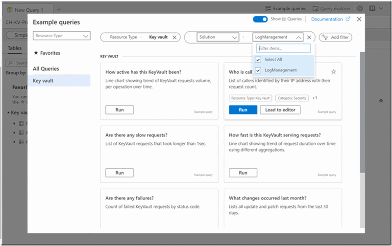

# Saved queries in Azure Monitor Log Analytics

Log Analytics offers sets of example queries that you can run on their own or use as a starting point for your own queries. This article describes example queries and how to use them.

If you aren't familiar with Log Analytics or the KQL query language, example queries are a great way to start. They can provide instant insight into a resource and provide a nice way to start learning and using KQL, thus shortening the time it takes to start using Log Analytics. We have collected and curated over 250 example queries designed to provide you instant value and that number of example queries is continually growing.

## In-context queries

The new experience filters and suggests queries in context. In other words, the system automatically shows only queries relevant to the scope you have selected.

- For a **single resource** – queries are filtered according to the resource type.
- For a **resource group** - queries are filtered according to the resources in the specific resource group.
- For a **workspace** – queries are filtered according to the solutions installed on the workspace.

This behavior is consistent for all Log Analytics scopes. If you are not seeing an example query for the resource type you want, it may be because of filters  due to being in-context. A later section describes how to remove in-context scoping so you can view all possible queries.

> [!TIP]
> The more resources you have in your scope, the longer the time for the portal to filter and show the sample query dialog.

## Example query user interface

You can get to example queries from two different locations.

### Example query dialog

When you first enter the Log Analytics experience, the *Example queries dialog* is shown automatically.  It can also be accessed by clicking in the upper right of the screen on **Example queries**.

The example query dialog then appears as shown below:  

The previous screenshot displays the logs screen for an Azure Key Vault instance. As mentioned previously in this article, the queries are shown in-context.  As a result, the screenshot shows only Key Vault related examples. If you select an entire subscription, then queries for all the resource types in that subscription are displayed.  

Each example query is represented by a card. You can quickly scan through the queries to find what you need. You can run the query directly from the dialog or choose to load it to the query editor for additional fine-tuning and tweaking.

### Sidebar query experience

All the same functionality of the dialog experience can be accessed from the queries pane on the left-hand sidebar of Log Analytics. You can hover over a query name to get the query description and additional functionality.

## Finding and filtering queries

The options in this section are available in both the dialog and sidebar query experience, but with a slightly different user interface.  

### Use Favorites

You can favorite frequently used queries to give you quicker access.

> [!TIP]
> Collecting and viewing queries later is a good way to get started. Find the queries you need and click the star next to the query to add it to the Favorites. If later you find the query isn't useful to you, you can un-favorite it.  

### Filtering and group by

While the query dialog experience filers to show only queries with the right context, you can choose to remove the filter and see all the queries.

### Group by

Change the grouping of the queries by clicking the *group by* drop-down list:

The dialog supports grouping by:

- **Resource type** – A resource as defined in Azure, such as a Virtual machine. See the [Azure Monitor Table Reference](https://docs.microsoft.com/azure/azure-monitor/reference/tables/tables-resroucetype) for a full mapping of Azure Monitor Logs/Log Analytics tables to resource type.  
- **Category** – A type of information such as *Security* or *Audit*. Categories are identical to the categories defined in the Tables side pane. See the [Azure Monitor Table Reference](https://docs.microsoft.com/azure/azure-monitor/reference/tables/tables-category) for a full list of categories.  
- **Solution** – An Azure Monitor solution associated with the queries
- **Topic** – The topic of the example query such as *Activity Logs* or *App logs*. The topic property is unique to example queries and may differ according to the specific resource type.

The grouping values also act as an active table of contents. Clicking one of the values on the left-hand side of the screen scrolls the queries view right to the item clicked.

### Filter

You can also filter the queries according to the groupby values mentioned earlier. In the example query dialog, the filters are found at the top.

### Combining group by and filter

The filter and group by functionality are designed to work in tandem. They provide flexibility in how queries are arranged. For example, if you using a resource group with multiple resources, you may want to filter down to a specific resource type and arrange the resulting queries by topic.

## Sample query dialog appearance behavior

If you are a KQL pro and prefer to get directly to the query editor, you can toggle the the query dialog "off". With the toggle off, the example query dialog does not load when Log Analytics screen loads.

You can always access the sample query popup experience from the *Example queries* button on the top bar of Log Analytics.

## Query explorer

The query explorer experience for saving and sharing user-generated queries remains unchanged for the time being.

## Next steps

[Get started with KQL Queries](get-started-queries.md)

