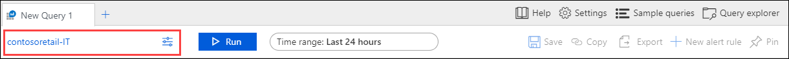
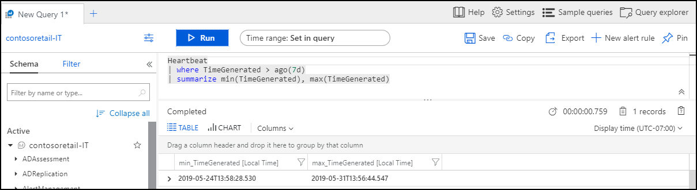
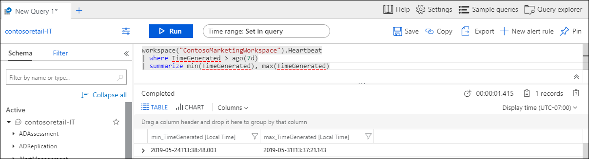
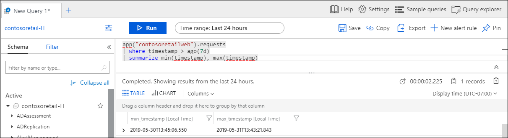

# Log query scope and time range in Azure Monitor Log Analytics
When you run a [log query](log-query-overview.md) in [Log Analytics in the Azure portal](get-started-portal.md), the set of data evaluated by the query depends on the scope and the time range that you select. This article describes the scope and time range and how you can set each depending on your requirements. It also describes the behavior of different types of scopes.

## Query scope
The query scope defines the records that are evaluated by the query. This will usually include all records in a single Log Analytics workspace or Application Insights application. Log Analytics also allows you to set a scope for a particular monitored Azure resource. This allows a resource owner to focus only on their data, even if that resource writes to multiple workspaces.

The scope is always displayed at the top left of the Log Analytics window. An icon indicates whether the scope is a Log Analytics workspace or an Application Insights application. No icon indicates another Azure resource.

The scope is determined by the method you use to start Log Analytics, and in some cases you can change the scope by clicking on it. The following table lists the different types of scope used and different details for each.

| Query scope | Records in scope | How to select | Changing Scope |
|:---|:---|:---|:---|
| Log Analytics workspace | All records in the Log Analytics workspace. | Select **Logs** from the **Azure Monitor** menu or the **Log Analytics workspaces** menu.  | Can change scope to any other resource type. |
| Application Insights application | All records in the Application Insights application. | Select **Analytics** from **Overview** page of Application Insights. | Can only change scope to another Application Insights application. |
| Resource group | Records created by all resources in the resource group. May include data from multiple Log Analytics workspaces. | Select **Logs** from the resource group menu. | Cannot change scope.|
| Subscription | Records created by all resources in the subscription. May include data from multiple Log Analytics workspaces. | Select **Logs** from the subscription menu.   | Cannot change scope. |
| Other Azure resources | Records created by the resource. May include data from multiple Log Analytics workspaces.  | Select **Logs** from the resource menu. OR Select **Logs** from the **Azure Monitor** menu and then select a new scope. | Can only change scope to same resource type. |

### Limitations when scoped to a resource

When the query scope is a Log Analytics workspace or an Application Insights application, all options in the portal and all query commands are available. When scoped to a resource though, the following options in the portal not available because they're associated with a single workspace or application:

- Save
- Query explorer
- New alert rule

You can't use the following commands in a query when scoped to a resource since the query scope will already include any workspaces with data for that resource or set of resources:

- [app](app-expression.md)
- [workspace](workspace-expression.md)
 

## Time range
The time range specifies the set of records that are evaluated for the query based on when the record was created. This is defined by a standard property on every record in the workspace or application as specified in the following table.

| Location | Property |
|:---|:---|
| Log Analytics workspace          | TimeGenerated |
| Application Insights application | timestamp     |

Set the time range by selecting it from the time picker at the top of the Log Analytics window.  You can select a predefined period or select **Custom** to specify a specific time range.

If you set a filter in the query that uses the standard time property as shown in the table above, the time picker changes to **Set in query**, and the time picker is disabled. In this case, it's most efficient to put the filter at the top of the query so that any subsequent processing only needs to work with the filtered records.

If you use the [workspace](workspace-expression.md) or [app](app-expression.md) command to retrieve data from another workspace or application, the time picker may behave differently. If the scope is a Log Analytics workspace and you use **app**, or if the scope is an Application Insights application and you use **workspace**, then Log Analytics may not understand that the property used in the filter should determine the time filter.

In the following example, the scope is set to a Log Analytics workspace.  The query uses **workspace** to retrieve data from another Log Analytics workspace. The time picker changes to **Set in query** because it sees a filter that uses the expected **TimeGenerated** property.

If the query uses **app** to retrieve data from an Application Insights application though, Log Analytics doesn't recognize the **timestamp** property in the filter, and the time picker remains unchanged. In this case, both filters are applied. In the example, only records created in the last 24 hours are included in the query even though it specifies 7 days in the **where** clause.

## Next steps

- Walk through a [tutorial on using Log Analytics in the Azure portal](get-started-portal.md).
- Walk through a [tutorial on writing queries](get-started-queries.md).