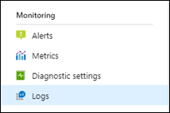
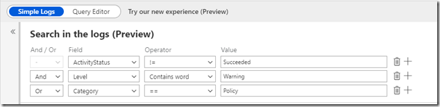
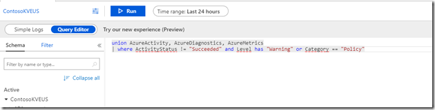
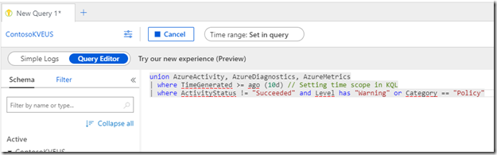

# Simple Logs experience in Azure Monitor (Preview)
Azure Monitor provides a [rich experience](get-started-portal.md) for creating [log queries](log-query-overview.md) using the KQL language. You may not require the full power of KQL though and prefer a simplified experience for basic query requirements. The Simple Logs experience allows you to create basic queries without directly interacting with KQL. You can also use Simple Logs as a learning tool for KQL as you require more sophisticated queries.

> [!NOTE]
> Simple Logs is currently implemented as a test for only Cosmos DB and  Key Vaults. Please share your experience with Microsoft through [User Voice](https://feedback.azure.com/forums/913690-azure-monitor) to help us determine whether we will expand and release this feature.

## Scope
The Simple Logs experience retrieves data from the *AzureDiagnostics*, *AzureMetrics*, and *AzureActivity* table for the selected resource. 

## Using Simple Logs
Navigate to any Cosmos DB or Key Vault in your Azure subscription with [diagnostic settings configured to collect logs in a Log Analytics workspace](../platform/resource-logs-collect-storage.md). Click **Logs** in the **Monitoring** menu to open the Simple Logs experience.

Select a **Field** and an **Operator** and specify a **Value** for comparison. Click **+** and specify **And/Or** to add additional criteria.

Click **Run** to view the query results.

## View and edit KQL
Select **Query editor** to open the KQL generated by the Simple Logs query in the full Log Analytics experience. 

You can directly edit the KQL and use other features in Log Analytics such as filters to further refine your results.

## Next steps

- Complete a tutorial on [using Log Analytics in the Azure portal](get-started-portal.md).
- Complete a tutorial on [writing log queries](get-started-portal.md).
