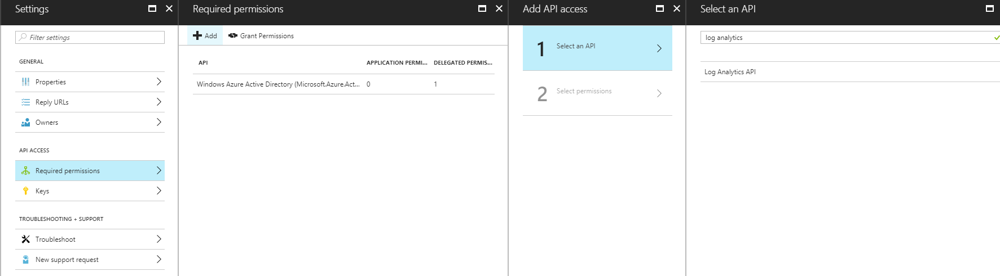

# Set up AAD Authentication for the API

1. In the Azure portal, select the Azure Active Directory resource.
1. In the **Manage** section on the left, select **App Registrations**.
1. Select **New Registration**.
    :::image type="content" source="media/aad-setup/aad-app-register.png" alt-text="New Registration.":::

1. Enter an App name.
1. (Optional) If the default tenancy scope is not appropriate, change the tenancy scope. 
1. (Optional) Enter a Redirect URL,
1. Select **Register**.
1. The App you just created opens. Note the "Application (client) ID" and the "Directory (tenant) ID" properties. We will need these later in the process.
1. Select **API Permissions**. 
1. ***********

1. This step will vary depending on the [OAuth2 flow](https://dev.loganalytics.io/documentation/Authorization/OAuth2) you choose to use to authenticate.

  - If you plan to use the authorization code grant or implicit grant flow, search for Log Analytics API in the "Select an API" menu, and choose it from the list. Select "Read Log Analytics data as user" under Delegated Permissions.

7.  Click Select at the bottom of the page, then done.

8.  Back in the "Required Permissions" window open on the left, click the "Grant Permissions" button to update the application permissions with your new selections.

9.  Move back again to the Settings menu for you AAD App, this time selecting "Keys". Provide a name and expiration date for your key, and click save. The key will be shown **only** now, so save it immediately. This key will be used to request tokens when paired with an authorization code.

After this step, you can retrieve OAuth2 tokens which you will send to the Log Analytics API. These tokens authorize you to the API. However, you still need to link your Log Analytics workspace so that the app will have permission to your particular workspace.

## Link Log Analytics Workspace

1.  Navigate to your Azure portal, and select or search for Log Analytics.
2.  Select your workspace from the list of available options, or search for it.
3.  From the left menu that opens, select Access Control (IAM). Click Add, and select "Log Analytics Reader" for the Role in the blade that appears. Search for your AAD App by name, and then click save.

You app is now setup to make API calls to your workspace. Next, you must decided on an [OAuth2 flow](oath2.md) to use, and request a token to authorize your access.
