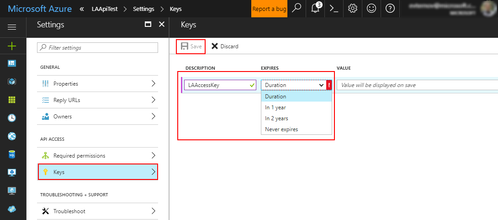
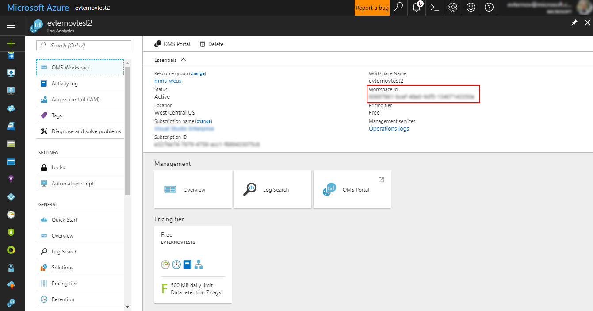
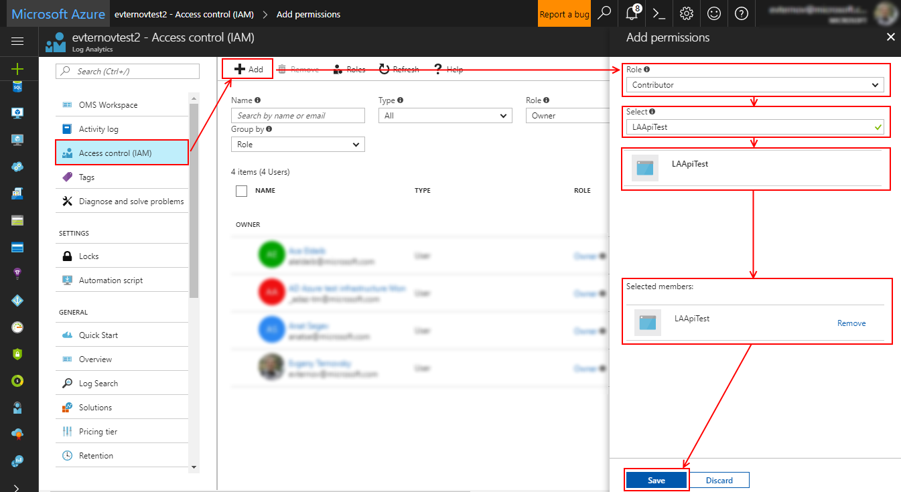
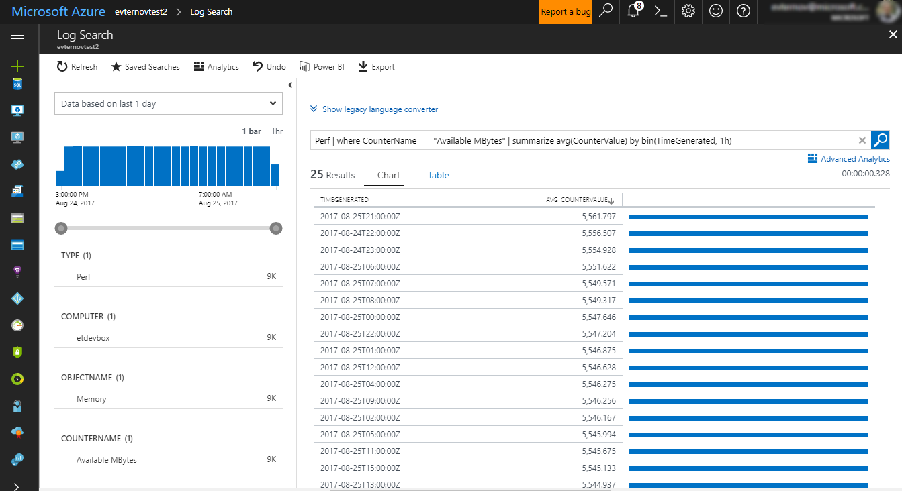

# Azure Log Analytics API Tutorial

This tutorial walks you through the steps to get started using the API. For details, see [Using the API](using-api.md), and the [reference](https://dev.loganalytics.io/reference) section.

## 1. Set up Azure Active Directory (one-time)

The Azure Log Analytics API uses the Azure Active Directory authentication scheme. Alternative authentication schemes, and other details are available on the [AAD Authentication](authentication.md) page.

### 1.1 Register an Azure Active Directory Application

1. Create an AAD Application, which we will use to authenticate against our AAD. Open the Azure Active Directory resource in the Azure Portal.
1. Click `App registrations`.
    
1. Click "New application registration". 
    
1. Give your application a `name`.
1. Set the application type to `Web app/API`. 
1. Choose a sign-on URL. If you have a forwarding URL, use it here. Otherwise, you can put in a placeholder such as the `http://localhost:3000/login` seen in the screenshot below. 
1. Select "create".  
    

We'll need to modify a few additional settings on the app we just created. Back on the App registrations page, find the app we just created, and click on it to open it's details page:  


First, take note of the Application ID. We'll need it later. Then, click `Required permissions`: 

On the required permissions page, press `add`: 

On the Add API Access page, start by completing step 1: finding and selecting the Service Principal we created in step 1.1, "Log Analytics API". Next, in step 2, ensure that `Read Log Analytics data as user` is checked under delegated permissions. Press "select" and then complete the add API access process by pressing "done".  


The last step to get our AAD Application configured is to create an API access key. Back in the settings page for our AAD Application, click on "Keys". Give your key a name and an expiry date. Then, press save:  


As soon as you press save, your API Key will be generated. *Make sure to copy it down*\! It will disappear as soon as you navigate away from the page.  


We now have an application that will allow us to authenticate against our Azure Active Directory\!

### 1.2 Give the AAD Application access to our Log Analytics Workspace

The final step is to ensure that users that authenticated against our Azure Active Directory Application will have access to our Log Analytics resource. Start by finding your Log Analytics resource on the Azure Portal. While here, jot down the `workspace ID`. We'll need it later.  


Next, press "Access Control (IAM)", and "Add". Set role to "Log Analytics Reader", find the AAD Application we created, click on it, make sure it appears under "selected members", and press "save":  


With that, we are now ready to start calling the API\!

## 2. Calling the API

Now that our Azure Active Directory resource is configured, an AAD Application is created, and the Log Analytics Workspace configured, let's call the API. For this example, we'll be using a query that will calculate the average hourly free RAM in Megabytes counter for us. This is a simple query, but any query that you can run in the Log Analytics language can be run programmatically. The query is as follows:
```
    Perf | where CounterName == 'Available MBytes' | summarize avg(CounterValue) by bin(TimeGenerated, 1h)
```

And returns the following results:  


### 2.1 Preparing to call the API

It's useful to get organized and that we have all the information we'll need before continuing. Specifically, here are the things we'll need:

| Entity                           | Description                                                                                     |
| -------------------------------- | ----------------------------------------------------------------------------------------------- |
| Azure Active Directory ID        | Obtained in step 1.1                                                                            |
| AAD Application ID               | Obtained in step 1.2                                                                            |
| AAD Application Key              | Created is step 1.2                                                                             |
| Redirect URI                     | Provided as part of step 1.2. Unless differing from tutorial, is `http://localhost:3000/login`. |
| Azure Log Analytics Workspace ID | Obtained in step 1.3                                                                            |
| Azure Log Analytics Query        | The query we'll actually be executing                                                           |

### 2.2 Procedure Overview

In the following steps, we will be executing an OAuth2 client credentials request. We need to acquire an access token to send requests to the API. This is a POST request to the AAD Token endpoint, with the following shape:

```
    POST /YOUR_AAD_TENANT/oauth2/token HTTP/1.1
    Host: https://login.microsoftonline.com
    Content-Type: application/x-www-form-urlencoded
    
    grant_type=client_credentials
    &client_id=YOUR_CLIENT_ID
    &redirect_uri=YOUR_REDIRECT_URI
    &resource=https://api.loganalytics.io
    &client_secret=YOUR_CLIENT_SECRET
```

A successful request will receive an access token:

```
    {
        "token_type": "Bearer",
        "expires_in": "3600",
        "ext_expires_in": "0",
        "expires_on": "1505929459",
        "not_before": "1505925559",
        "resource": "https://api.loganalytics.io",
        "access_token": "ey.....A"
    }
```

### 2.4 Querying the Azure Log Analytics API

Now that we have the access token, we can query the Azure Log Analytics API\! The details of the call are as follows:

| Parameter | Value                                                                 | Notes                                                                |
| --------- | --------------------------------------------------------------------- | -------------------------------------------------------------------- |
| Verb      | POST                                                                  |                                                                      |
| URI       | `https://api.loganalytics.io/v1/workspaces/{Log Analytics workspace id}/query` | Make sure to replace the `Log Analytics workspace id` parameter |
| Headers   | `Content-Type: application/json`, `Authorization: Bearer {access token}` | Make sure to replace the <code>access token</code> parameter with the one obtained in step 2.4 |
| Body      | `{ "query": {query to execute}, "timespan": {time over which to run the query} }` | Make sure to replace the `query to execute` and `time over which to run your query` with your own. The time is expressed in [ISO8601 format](https://en.wikipedia.org/wiki/ISO_8601). For example, to run the query over the last 12 houors, we'd use "PT12H" |

Using our sample query, the request body will look as follows:

```
    { 
            "query": "Perf | where CounterName == 'Available MBytes' | summarize avg(CounterValue) by bin(TimeGenerated, 1h)",
            "timespan": "PT12H"
    }
```

Here's the call in Fiddler:  
