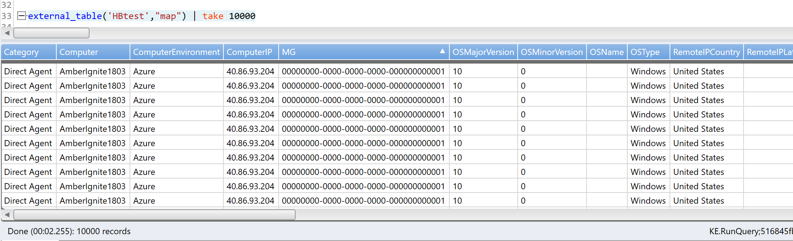

# Query exported data from Azure Monitor by using Azure Data Explorer
Exporting data from Azure Monitor to an Azure Storage account enables low-cost retention and the ability to reallocate logs to different regions. Use Azure Data Explorer to query data that was exported from your Log Analytics workspaces. After configuration, supported tables that are sent from your workspaces to a storage account will be available as a data source for Azure Data Explorer.

The process flow is to:

1. Export data from the Log Analytics workspace to the storage account.
1. Create an external table in your Azure Data Explorer cluster and mapping for the data types.
1. Query data from Azure Data Explorer.

:::image type="content" source="media/azure-data-explorer-query-storage/exported-data-query.png" alt-text="Diagram that shows Azure Data Explorer exported data querying flow.":::

## Send data to Azure Storage
Azure Monitor logs can be exported to a storage account by using any of the following options:

- Export all data from your Log Analytics workspace to a storage account or event hub. Use the Log Analytics workspace data export feature of Azure Monitor Logs. For more information, see [Log Analytics workspace data export in Azure Monitor](./logs-data-export.md).
- Scheduled export from a log query by using a logic app workflow. This method is similar to the data export feature but allows you to send filtered or aggregated data to Azure Storage. This method is subject to [log query limits](../service-limits.md#log-analytics-workspaces). For more information, see [Archive data from a Log Analytics workspace to Azure Storage by using Azure Logic Apps](./logs-export-logic-app.md).
- One-time export by using a logic app workflow. For more information, see [Azure Monitor Logs connector for Azure Logic Apps](../../connectors/connectors-azure-monitor-logs.md).
- One-time export to a local machine by using a PowerShell script. For more information, see [Invoke-AzOperationalInsightsQueryExport](https://www.powershellgallery.com/packages/Invoke-AzOperationalInsightsQueryExport).

> [!TIP]
> You can use an existing Azure Data Explorer cluster or create a new dedicated cluster with the needed configurations.

## Create an external table located in Azure Blob Storage
Use [external tables](/azure/data-explorer/kusto/query/schema-entities/externaltables) to link Azure Data Explorer to a storage account. An external table is a Kusto schema entity that references data stored outside a Kusto database. Like tables, an external table has a well-defined schema. Unlike tables, data is stored and managed outside of a Kusto cluster. The exported data from the previous section is saved in JSON lines.

To create a reference, you require the schema of the exported table. Use the [getschema](/azure/data-explorer/kusto/query/getschemaoperator) operator from Log Analytics to retrieve this information, which includes the table's columns and their data types.

:::image type="content" source="media\azure-data-explorer-query-storage\exported-data-map-schema.jpg" alt-text="Screenshot that shows a Log Analytics table schema.":::

You can now use the output to create the Kusto query for building the external table.
Follow the guidance in [Create and alter external tables in Azure Storage or Azure Data Lake](/azure/data-explorer/kusto/management/external-tables-azurestorage-azuredatalake) to create an external table in a JSON format. Then run the query from your Azure Data Explorer database.

>[!NOTE]
>The external table creation is built from two processes. The first process is to create the external table. The second process is to create the mapping.

The following PowerShell script creates the [create](/azure/data-explorer/kusto/management/external-tables-azurestorage-azuredatalake#create-external-table-mapping) commands for the table and the mapping:

```powershell
PARAM(
    $resourcegroupname, #The name of the Azure resource group
    $TableName, # The Log Analytics table you want to convert to an external table
    $MapName, # The name of the map
    $subscriptionId, # The ID of the subscription
    $WorkspaceId, # The Log Analytics WorkspaceId
    $WorkspaceName, # The Log Analytics workspace name
    $BlobURL, # The Blob URL where the data is saved
    $ContainerAccessKey, # The blob container Access Key (option to add an SAS URL)
    $ExternalTableName = $null # The External Table name, null to use the same name
)

if($null -eq $ExternalTableName) {
    $ExternalTableName = $TableName
}

$query = $TableName + ' | getschema | project ColumnName, DataType'

$output = (Invoke-AzOperationalInsightsQuery -WorkspaceId $WorkspaceId -Query $query).Results

$FirstCommand = @()
$SecondCommand = @()

foreach ($record in $output) {
    if ($record.DataType -eq 'System.DateTime') {
        $dataType = 'datetime'
    } elseif ($record.DataType -eq 'System.Int32') {
        $dataType = 'int32'
    } elseif ($record.DataType -eq 'System.Double') {
        $dataType = 'double'
    } else {
        $dataType = 'string'
    }
    $FirstCommand += $record.ColumnName + ":" + "$dataType" + ","
    $SecondCommand += "{`"column`":" + "`"" + $record.ColumnName + "`"," + "`"datatype`":`"$dataType`",`"path`":`"$." + $record.ColumnName + "`"},"
}
$schema = ($FirstCommand -join '') -replace ',$'
$mapping = ($SecondCommand -join '') -replace ',$'

$CreateExternal = @'
.create external table {0} ({1})
kind=blob
partition by (TimeGeneratedPartition:datetime = bin(TimeGenerated, 1min))
pathformat = (datetime_pattern("'y='yyyy'/m='MM'/d='dd'/h='HH'/m='mm", TimeGeneratedPartition))
dataformat=multijson
(
   h@'{2}/WorkspaceResourceId=/subscriptions/{4}/resourcegroups/{6}/providers/microsoft.operationalinsights/workspaces/{5};{3}'
)
with
(
   docstring = "Docs",
   folder = "ExternalTables"
)
'@ -f $TableName, $schema, $BlobURL, $ContainerAccessKey, $subscriptionId, $WorkspaceName.ToLower(), $resourcegroupname.ToLower(),$WorkspaceId

$createMapping = @'
.create external table {0} json mapping "{1}" '[{2}]'
'@ -f $ExternalTableName, $MapName, $mapping

Write-Host -ForegroundColor Red 'Copy and run the following commands (one by one), on your Azure Data Explorer cluster query window to create the external table and mappings:'
write-host -ForegroundColor Green $CreateExternal
Write-Host -ForegroundColor Green $createMapping
```

The following image shows an example of the output:

:::image type="content" source="media/azure-data-explorer-query-storage/external-table-create-command-output.png" alt-text="Screenshot that shows the ExternalTable create command output.":::

>[!TIP]
>* Copy, paste, and then run the output of the script in your Azure Data Explorer client tool to create the table and mapping.
>* To use all the data inside the container, alter the script and change the URL to be `https://your.blob.core.windows.net/containername;SecKey`.

## Query the exported data from Azure Data Explorer

After you configure the mapping, you can query the exported data from Azure Data Explorer. Your query requires the [external_table](/azure/data-explorer/kusto/query/externaltablefunction) function, as shown in the following example:

```kusto
external_table("HBTest","map") | take 10000
```

[](media/azure-data-explorer-query-storage/external-table-query.png#lightbox)

## Next steps

Learn to [write queries in Azure Data Explorer](/azure/data-explorer/write-queries).
