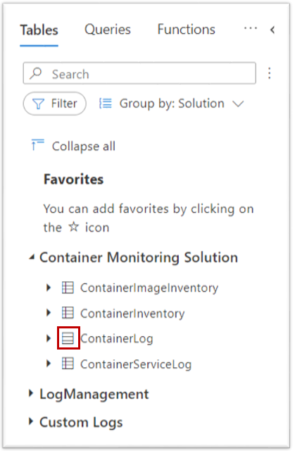
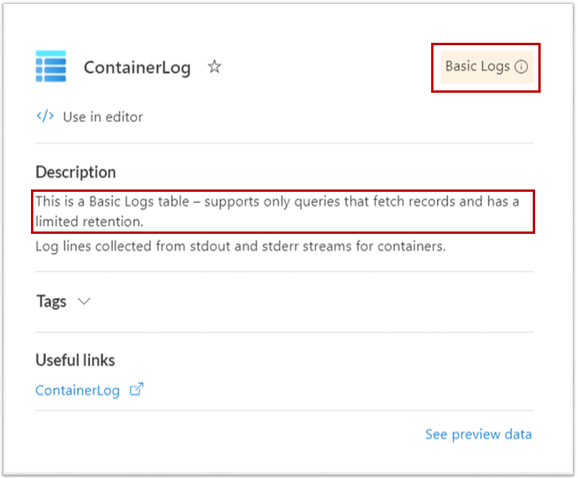
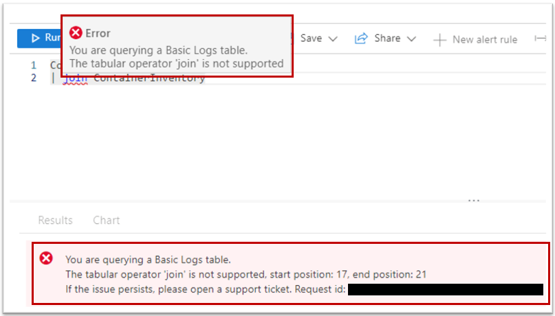

# Query Basic Logs in Azure Monitor
Basic Logs tables reduce the cost of ingesting high-volume verbose logs and let you query the data they store using a limited set of log queries. This article explains how to query data from Basic Logs tables. 

For more information, see [Set a table's log data plan](basic-logs-configure.md). 


> [!NOTE]
> Other tools that use the Azure API for querying - for example, Grafana and Power BI - cannot access Basic Logs.

[!INCLUDE [log-analytics-query-permissions](../../../includes/log-analytics-query-permissions.md)]

## Limitations
Queries with Basic Logs are subject to the following limitations:
### KQL language limits
Log queries against Basic Logs are optimized for simple data retrieval using a subset of KQL language, including the following operators: 

- [where](/azure/data-explorer/kusto/query/whereoperator)
- [extend](/azure/data-explorer/kusto/query/extendoperator)
- [project](/azure/data-explorer/kusto/query/projectoperator)
- [project-away](/azure/data-explorer/kusto/query/projectawayoperator)
- [project-keep](/azure/data-explorer/kusto/query/project-keep-operator)
- [project-rename](/azure/data-explorer/kusto/query/projectrenameoperator)
- [project-reorder](/azure/data-explorer/kusto/query/projectreorderoperator)
- [parse](/azure/data-explorer/kusto/query/parseoperator)
- [parse-where](/azure/data-explorer/kusto/query/parsewhereoperator)

You can use all functions and binary operators within these operators.

### Time range
Specify the time range in the query header in Log Analytics or in the API call. You can't specify the time range in the query body using a **where** statement.

### Query context
Queries with Basic Logs must use a workspace for the scope. You can't run queries using another resource for the scope. For more information, see [Log query scope and time range in Azure Monitor Log Analytics](scope.md).

### Concurrent queries
You can run two concurrent queries per user. 

### Purge
You can’t [purge personal data](personal-data-mgmt.md#exporting-and-deleting-personal-data) from Basic Logs tables. 

## Run a query on a Basic Logs table
Creating a query using Basic Logs is the same as any other query in Log Analytics. See [Get started with Azure Monitor Log Analytics](./log-analytics-tutorial.md) if you aren't familiar with this process.

# [Portal](#tab/portal-1)

In the Azure portal, select **Monitor** > **Logs** > **Tables**.

In the list of tables, you can identify Basic Logs tables by their unique icon: 



You can also hover over a table name for the table information view, which will specify that the table is configured as Basic Logs:



When you add a table to the query, Log Analytics will identify a Basic Logs table and align the authoring experience accordingly. The following example shows when you attempt to use an operator that isn't supported by Basic Logs.



# [API](#tab/api-1)

Use **/search** from the [Log Analytics API](api/overview.md) to run a query with Basic Logs using a REST API. This is similar to the [/query](api/request-format.md) API with the following differences:

- The query is subject to the language limitations described above.
- The time span must be specified in the header of the request and not in the query statement.

**Sample Request**

```http
https://api.loganalytics.io/v1/workspaces/testWS/search?timespan=P1D
```

**Request body**

```json
{
    "query": "ContainerLogV2 | where Computer ==  \"some value\"\n",
}
```


---
## Pricing model
The charge for a query on Basic Logs is based on the amount of data the query scans, which is influenced by the size of the table and the query's time range. For example, a query that scans three days of data in a table that ingests 100 GB each day, would be charged for 300 GB. 

For more information, see [Azure Monitor pricing](https://azure.microsoft.com/pricing/details/monitor/).


## Next steps

- [Learn more about the Basic Logs and Analytics log plans](basic-logs-configure.md).
- [Use a search job to retrieve data from Basic Logs into Analytics Logs where it can be queries multiple times](search-jobs.md).

