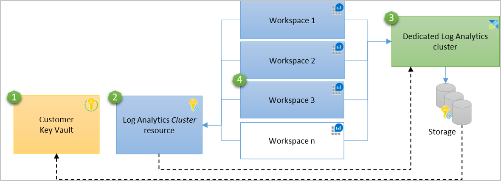
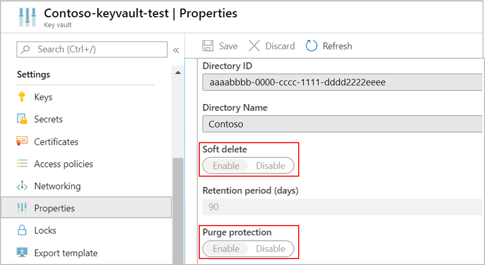
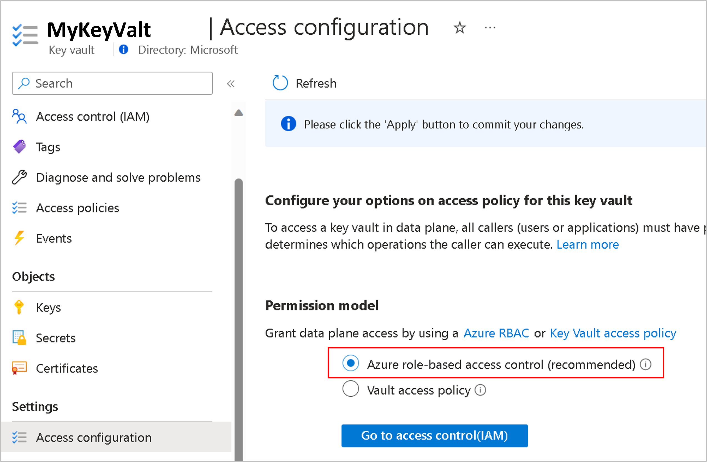
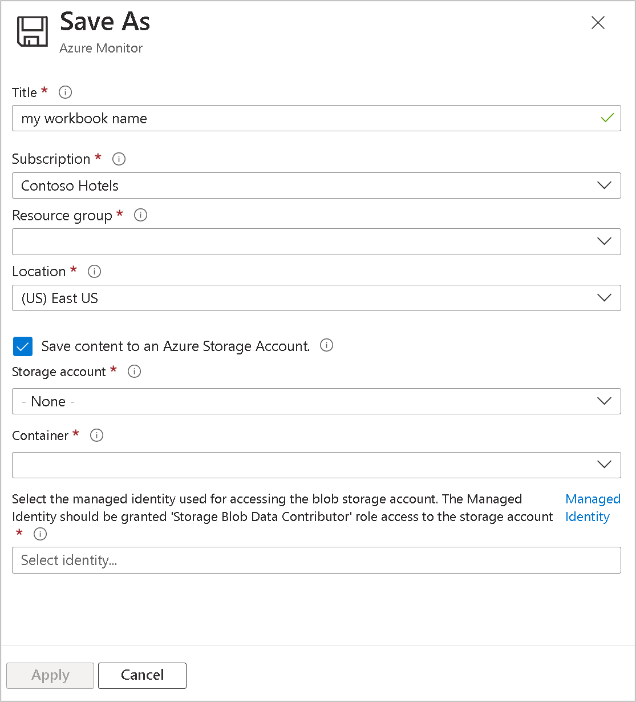

# Azure Monitor customer-managed key 

Data in Azure Monitor is encrypted with Microsoft-managed keys. You can use your own encryption key to protect the data and saved queries in your workspaces. Customer-managed keys in Azure Monitor give you greater flexibility to manage access controls to logs. Once configure, new data for linked workspaces is encrypted with your key stored in [Azure Key Vault](../../key-vault/general/overview.md), or [Azure Key Vault Managed "HSM"](../../key-vault/managed-hsm/overview.md). 

We recommend you review [Limitations and constraints](#limitationsandconstraints) below before configuration.

## Customer-managed key overview

[Encryption at Rest](../../security/fundamentals/encryption-atrest.md) is a common privacy and security requirement in organizations. You can let Azure completely manage encryption at rest, while you have various options to closely manage encryption and encryption keys.

Azure Monitor ensures that all data and saved queries are encrypted at rest using Microsoft-managed keys (MMK). You also have the option to encrypt data with your own key in [Azure Key Vault](../../key-vault/general/overview.md), with control over key lifecycle and ability to revoke  access to your data at any time. Azure Monitor use of encryption is identical to the way [Azure Storage encryption](../../storage/common/storage-service-encryption.md#about-azure-storage-service-side-encryption) operates.

Customer-managed key is delivered on [dedicated clusters](./logs-dedicated-clusters.md) providing higher protection level and control. Data to dedicated clusters is encrypted twice, once at the service level using Microsoft-managed keys or Customer-managed keys, and once at the infrastructure level, using two different encryption algorithms and two different keys. [double encryption](../../storage/common/storage-service-encryption.md#doubly-encrypt-data-with-infrastructure-encryption) protects against a scenario where one of the encryption algorithms or keys may be compromised. In this case, the additional layer of encryption continues to protect your data. Dedicated cluster also allows you to protect your data with [Lockbox](#customer-lockbox) control.

Data ingested in the last 14 days or recently used in queries is kept in hot-cache (SSD-backed) for query efficiency. SSD data is encrypted with Microsoft keys regardless customer-managed key configuration, but your control over SSD access adheres to [key revocation](#key-revocation)

Log Analytics Dedicated Clusters [pricing model](./logs-dedicated-clusters.md#cluster-pricing-model) requires commitment Tier starting at 500 GB per day and can have values of 500, 1000, 2000 or 5000 GB per day.

## How Customer-managed key works in Azure Monitor

Azure Monitor uses managed identity to grant access to your Azure Key Vault. The identity of the Log Analytics cluster is supported at the cluster level. To allow Customer-managed key on multiple workspaces, a Log Analytics Cluster resource performs as an intermediate identity connection between your Key Vault and your Log Analytics workspaces. The cluster's storage uses the managed identity that\'s associated with the Cluster resource to authenticate to your Azure Key Vault via Microsoft Entra ID. 

Clusters support two [managed identity types](../../active-directory/managed-identities-azure-resources/overview.md#managed-identity-types): System-assigned and User-assigned, while a single identity can be defined in a cluster depending on your scenario. 

- System-assigned managed identity is simpler and being generated automatically with the cluster creation when identity `type` is set to "*SystemAssigned*". This identity can be used later to grant storage access to your Key Vault for wrap and unwrap operations.
- User-assigned managed identity lets you configure Customer-managed key at cluster creation, when granting it permissions in your Key Vault before cluster creation.

You can apply Customer-managed key configuration to a new cluster, or existing cluster that has linked workspaces with data ingested to them. New data ingested to linked workspaces gets encrypted with your key, and older data ingested before the configuration, remains encrypted with Microsoft key. Your queries aren't affected by Customer-managed key configuration and query is performed across old and new data seamlessly. You can unlink workspaces from your cluster at any time, and new data ingested after the unlink gets encrypted with Microsoft key, and query is performed across old and new data seamlessly.

> [!IMPORTANT]
> Customer-managed key capability is regional. Your Azure Key Vault, cluster and linked workspaces must be in the same region, but they can be in different subscriptions.

[](media/customer-managed-keys/cmk-overview.png#lightbox)

1. Key Vault
2. Log Analytics cluster resource having managed identity with permissions to Key Vault—The identity is propagated to the underlay dedicated cluster storage
3. Dedicated cluster
4. Workspaces linked to dedicated cluster

### Encryption keys operation

There are three types of keys involved in Storage data encryption:

- "**KEK**" - Key Encryption Key (your Customer-managed key)
- "**AEK**" - Account Encryption Key
- "**DEK**" - Data Encryption Key

The following rules apply:

- The cluster storage has unique encryption key for every Storage Account, which is known as the "AEK".
- The "AEK" is used to derive "DEKs, which are the keys that are used to encrypt each block of data written to disk.
- When you configure a key in your Key Vault, and updated the key details in the cluster, the cluster storage performs requests to 'wrap' and 'unwrap' "AEK" for encryption and decryption.
- Your "KEK" never leaves your Key Vault, and in the case of Managed "HSM", it never leaves the hardware.
- Azure Storage uses managed identity that's associated with the *Cluster* resource for authentication. It accesses Azure Key Vault via Microsoft Entra ID.

### Customer-Managed key provisioning steps

1. Creating Azure Key Vault and storing key
1. Creating cluster
1. Granting permissions to your Key Vault
1. Updating cluster with key identifier details
1. Linking workspaces

Customer-managed key configuration isn't supported in Azure portal currently and provisioning can be performed via [PowerShell](/powershell/module/az.operationalinsights/), [CLI](/cli/azure/monitor/log-analytics), or [REST](/rest/api/loganalytics/) requests.

## Storing encryption key ("KEK")

A [portfolio of Azure Key Management products](../../key-vault/managed-hsm/mhsm-control-data.md#portfolio-of-azure-key-management-products) lists the vaults and managed HSMs that can be used. 

Create or use an existing Azure Key Vault in the region that the cluster is planed, and generate or import a key to be used for logs encryption. The Azure Key Vault must be configured as recoverable, to protect your key and the access to your data in Azure Monitor. You can verify this configuration under properties in your Key Vault, both **Soft delete** and **Purge protection** should be enabled.

[](media/customer-managed-keys/soft-purge-protection.png#lightbox)

These settings can be updated in Key Vault via CLI and PowerShell:

- [Soft Delete](../../key-vault/general/soft-delete-overview.md)
- [Purge protection](../../key-vault/general/soft-delete-overview.md#purge-protection) guards against force deletion of the secret, vault even after soft delete

## Create cluster

Clusters use managed identity for data encryption with your Key Vault. Configure identity `type` property to `SystemAssigned` when creating your cluster to allow access to your Key Vault for "wrap" and "unwrap" operations. 
  
  Identity settings in cluster for System-assigned managed identity
  ```json
  {
    "identity": {
      "type": "SystemAssigned"
      }
  }
  ```

Follow the procedure illustrated in [Dedicated Clusters article](./logs-dedicated-clusters.md#create-a-dedicated-cluster). 

## Grant Key Vault permissions

There are two permission models in Key Vault to grant access to your cluster and underlay storage—Azure role-based access control (Azure RBAC), and Vault access policies (legacy).

1. Assign Azure RBAC you control (recommended)
      
   To add role assignments, you must have Microsoft.Authorization/roleAssignments/write and Microsoft.Authorization/roleAssignments/delete permissions, such as [User Access Administrator](../../role-based-access-control/built-in-roles.md#user-access-administrator) or [Owner](../../role-based-access-control/built-in-roles.md#owner).

   Open your Key Vault in Azure portal, **click Access configuration** in **Settings**, and select **Azure role-based access control** option. Then enter **Access control (IAM)** and add **Key Vault Crypto Service Encryption User** role assignment.

   [](media/customer-managed-keys/grant-key-vault-permissions-rbac-8bit.png#lightbox)

1. Assign vault access policy (legacy)

    Open your Key Vault in Azure portal and click **Access Policies**, select **Vault access policy**, then click **+ Add Access Policy** to create a policy with these settings:

    - Key permissions—select **Get**, **Wrap Key** and **Unwrap Key**.
    - Select principal—depending on the identity type used in the cluster (system or user assigned managed identity)
      - System assigned managed identity - enter the cluster name or cluster principal ID 
      - User assigned managed identity - enter the identity name

   [](media/customer-managed-keys/grant-key-vault-permissions-8bit.png#lightbox)

    The **Get** permission is required to verify that your Key Vault is configured as recoverable to protect your key and the access to your Azure Monitor data.

## Update cluster with key identifier details

All operations on the cluster require the `Microsoft.OperationalInsights/clusters/write` action permission. This permission could be granted via the Owner or Contributor that contains the `*/write` action or via the Log Analytics Contributor role that contains the `Microsoft.OperationalInsights/*` action.

This step updates dedicated cluster storage with the key and version to use for "AEK" wrap and unwrap.

>[!IMPORTANT]
>- Key rotation can be automatic or require explicit key update, see [Key rotation](#key-rotation) to determine approach that is suitable for you before updating the key identifier details in cluster.
>- Cluster update should not include both identity and key identifier details in the same operation. If you need to update both, the update should be in two consecutive operations.

[](media/customer-managed-keys/key-identifier-8bit.png#lightbox)

Update KeyVaultProperties in cluster with key identifier details.

The operation is asynchronous and can take a while to complete.

# [Azure portal](#tab/portal)

N/A

# [Azure CLI](#tab/azure-cli)

```azurecli
az account set —subscription "cluster-subscription-id"

az monitor log-analytics cluster update —no-wait —name "cluster-name" —resource-group "resource-group-name" —key-name "key-name" —key-vault-uri "key-uri" —key-version "key-version"

# Wait for job completion when `—no-wait` was used
$clusterResourceId = az monitor log-analytics cluster list —resource-group "resource-group-name" —query "[?contains(name, "cluster-name")].[id]" —output tsv
az resource wait —created —ids $clusterResourceId —include-response-body true

```
# [PowerShell](#tab/powershell)

```powershell
Select-AzSubscription "cluster-subscription-id"

Update-AzOperationalInsightsCluster -ResourceGroupName "resource-group-name" -ClusterName "cluster-name" -KeyVaultUri "key-uri" -KeyName "key-name" -KeyVersion "key-version" -AsJob

# Check when the job is done when `-AsJob` was used
Get-Job -Command "New-AzOperationalInsightsCluster*" | Format-List -Property *
```

# [REST](#tab/rest)

```rst
PATCH https://management.azure.com/subscriptions/<subscription-id>/resourcegroups/<resource-group-name>/providers/Microsoft.OperationalInsights/clusters/cluster-name?api-version=2021-06-01
Authorization: Bearer <token> 
Content-type: application/json
 
{
  "properties": {
    "keyVaultProperties": {
      "keyVaultUri": "https://key-vault-name.vault.azure.net",
      "keyName": "key-name",
      "keyVersion": "current-version"
  },
  "sku": {
    "name": "CapacityReservation",
    "capacity": 500
  }
}
```

**Response**

It takes the propagation of the key a while to complete. You can check the update state by sending GET request on the cluster and look at the **KeyVaultProperties** properties. Your recently updated key should return in the response.

Response to GET request when key update is completed:
202 (Accepted) and header
```json
{
  "identity": {
    "type": "SystemAssigned",
    "tenantId": "tenant-id",
    "principalId": "principal-id"
  },
  "sku": {
    "name": "capacityreservation",
    "capacity": 500
  },
  "properties": {
    "keyVaultProperties": {
      "keyVaultUri": "https://key-vault-name.vault.azure.net",
      "keyName": "key-name",
      "keyVersion": "current-version"
      },
    "provisioningState": "Succeeded",
    "clusterId": "cluster-id",
    "billingType": "Cluster",
    "lastModifiedDate": "last-modified-date",
    "createdDate": "created-date",
    "isDoubleEncryptionEnabled": false,
    "isAvailabilityZonesEnabled": false,
    "capacityReservationProperties": {
      "lastSkuUpdate": "last-sku-modified-date",
      "minCapacity": 500
    }
  },
  "id": "/subscriptions/subscription-id/resourceGroups/resource-group-name/providers/Microsoft.OperationalInsights/clusters/cluster-name",
  "name": "cluster-name",
  "type": "Microsoft.OperationalInsights/clusters",
  "location": "cluster-region"
}
```

---

## Link workspace to cluster

> [!IMPORTANT]
> This step should be performed only after the cluster provisioning. If you link workspaces and ingest data prior to the provisioning, ingested data will be dropped and won't be recoverable.

You need to have "write" permissions on your workspace and cluster to perform this operation. It includes `Microsoft.OperationalInsights/workspaces/write` and `Microsoft.OperationalInsights/clusters/write`.

Follow the procedure illustrated in [Dedicated Clusters article](./logs-dedicated-clusters.md#link-a-workspace-to-a-cluster).

## Key revocation

> [!IMPORTANT]
> - The recommended way to revoke access to your data is by disabling your key, or deleting Access Policy in your Key Vault.
> - Setting the cluster's `identity` `type` to `None` also revokes access to your data, but this approach isn't recommended since you can't revert it without contacting support.

The cluster storage will always respect changes in key permissions within an hour or sooner and storage will become unavailable. New data ingested to linked workspaces is dropped and non-recoverable. Data is inaccessible on these workspaces and queries fail. Previously ingested data remains in storage as long as your cluster and your workspaces aren't deleted. Inaccessible data is governed by the data-retention policy and will be purged when retention is reached. Data ingested in the last 14 days and data recently used in queries is also kept in hot-cache (SSD-backed) for query efficiency. The data on SSD gets deleted on key revocation operation and becomes inaccessible. The cluster storage attempts reach your Key Vault to unwrap encryption periodically, and when key is enabled, unwrap succeeds, SSD data is reloaded from storage, data ingestion and query are resumed within 30 minutes.

## Key rotation

Key rotation has two modes: 
- Autorotation—update your cluster with ```"keyVaultProperties"``` but omit ```"keyVersion"``` property, or set it to ```""```. Storage will automatically use the latest versions.
- Explicit key version update—update your cluster with key version in ```"keyVersion"``` property. Rotation of keys requires an explicit ```"keyVaultProperties"``` update in cluster, see [Update cluster with Key identifier details](#update-cluster-with-key-identifier-details). If you generate new key version in Key Vault but don't update it in the cluster, the cluster storage will keep using your previous key. If you disable or delete the old key before updating a new one in the cluster, you will get into [key revocation](#key-revocation) state.

All your data remains accessible after the key rotation operation. Data always encrypted with the Account Encryption Key ("AEK"), which is encrypted with your new Key Encryption Key ("KEK") version in Key Vault.

## Customer-managed key for saved queries and log alerts

The query language used in Log Analytics is expressive and can contain sensitive information in comments, or in the query syntax. Some organizations require that such information is kept protected under Customer-managed key policy and you need save your queries encrypted with your key. Azure Monitor enables you to store saved queries and log alerts encrypted with your key in your own Storage Account when linked to your workspace. 

## Customer-managed key for Workbooks

With the considerations mentioned for [Customer-managed key for saved queries and log alerts](#customer-managed-key-for-saved-queries-and-log-alerts), Azure Monitor enables you to store Workbook queries encrypted with your key in your own Storage Account, when selecting **Save content to an Azure Storage Account** in Workbook 'Save' operation.

[  ](media/customer-managed-keys/cmk-workbook.png#lightbox)

> [!NOTE]
> Queries remain encrypted with Microsoft key ("MMK") in the following scenarios regardless Customer-managed key configuration: Azure dashboards, Azure Logic App, Azure Notebooks and Automation Runbooks.

When linking your Storage Account for saved queries, the service stores saved-queries and log alerts queries in your Storage Account. Having control on your Storage Account [encryption-at-rest policy](../../storage/common/customer-managed-keys-overview.md), you can protect saved queries and log alerts with Customer-managed key. You will, however, be responsible for the costs associated with that Storage Account. 

**Considerations before setting Customer-managed key for queries**
* You need to have "write" permissions on your workspace and Storage Account.
* Make sure to create your Storage Account in the same region as your Log Analytics workspace is located.
* The saves queries in storage is considered as service artifacts and their format may change.
* Linking a Storage Account for queries removed existing saves queries from your workspace. Copy saves queries that you need before this configuration. You can view your saved queries using  [PowerShell](/powershell/module/az.operationalinsights/get-azoperationalinsightssavedsearch).
* Query 'history' and 'pin to dashboard' aren't supported when linking Storage Account for queries.
* You can link a single Storage Account to a workspace, which can be used for both saved queries and log alerts queries.
* Fired log alerts will not contain search results or alert query. You can use [alert dimensions](../alerts/alerts-unified-log.md#split-by-alert-dimensions) to get context in the fired alerts.

**Configure BYOS for saved queries**

Link a Storage Account for queries to keep saved queries in your Storage Account. 

# [Azure portal](#tab/portal)

N/A

# [Azure CLI](#tab/azure-cli)

```azurecli
az account set —subscription "storage-account-subscription-id"

$storageAccountId = '/subscriptions/<subscription-id>/resourceGroups/<resource-group-name>/providers/Microsoft.Storage/storageAccounts/<storage name>'

az account set —subscription "workspace-subscription-id"

az monitor log-analytics workspace linked-storage create —type Query —resource-group "resource-group-name" —workspace-name "workspace-name" —storage-accounts $storageAccountId
```

# [PowerShell](#tab/powershell)

```powershell
Select-AzSubscription "StorageAccount-subscription-id"

$storageAccountId = (Get-AzStorageAccount -ResourceGroupName "resource-group-name" -Name "storage-account-name").id

Select-AzSubscription "workspace-subscription-id"

New-AzOperationalInsightsLinkedStorageAccount -ResourceGroupName "resource-group-name" -WorkspaceName "workspace-name" -DataSourceType Query -StorageAccountIds $storageAccountId
```

# [REST](#tab/rest)

```rst
PUT https://management.azure.com/subscriptions/<subscription-id>/resourcegroups/<resource-group-name>/providers/Microsoft.OperationalInsights/workspaces/<workspace-name>/linkedStorageAccounts/Query?api-version=2021-06-01
Authorization: Bearer <token> 
Content-type: application/json
 
{
  "properties": {
    "dataSourceType": "Query", 
    "storageAccountIds": 
    [
      "/subscriptions/<subscription-id>/resourceGroups/<resource-group-name>/providers/Microsoft.Storage/storageAccounts/<storage-account-name>"
    ]
  }
}
```

---

After the configuration, any new *saved search* query will be saved in your storage.

**Configure BYOS for log alerts queries**

Link a Storage Account for *Alerts* to keep *log alerts* queries in your Storage Account. 

# [Azure portal](#tab/portal)

N/A

# [Azure CLI](#tab/azure-cli)

```azurecli
az account set —subscription "storage-account-subscription-id"

$storageAccountId = '/subscriptions/<subscription-id>/resourceGroups/<resource-group-name>/providers/Microsoft.Storage/storageAccounts/<storage name>'

az account set —subscription "workspace-subscription-id"

az monitor log-analytics workspace linked-storage create —type ALerts —resource-group "resource-group-name" —workspace-name "workspace-name" —storage-accounts $storageAccountId
```

# [PowerShell](#tab/powershell)

```powershell
Select-AzSubscription "StorageAccount-subscription-id"

$storageAccountId = (Get-AzStorageAccount -ResourceGroupName "resource-group-name" -Name "storage-account-name").id

Select-AzSubscription "workspace-subscription-id"

New-AzOperationalInsightsLinkedStorageAccount -ResourceGroupName "resource-group-name" -WorkspaceName "workspace-name" -DataSourceType Alerts -StorageAccountIds $storageAccountId
```

# [REST](#tab/rest)

```rst
PUT https://management.azure.com/subscriptions/<subscription-id>/resourcegroups/<resource-group-name>/providers/Microsoft.OperationalInsights/workspaces/<workspace-name>/linkedStorageAccounts/Alerts?api-version=2021-06-01
Authorization: Bearer <token> 
Content-type: application/json
 
{
  "properties": {
    "dataSourceType": "Alerts", 
    "storageAccountIds": 
    [
      "/subscriptions/<subscription-id>/resourceGroups/<resource-group-name>/providers/Microsoft.Storage/storageAccounts/<storage-account-name>"
    ]
  }
}
```
---

After the configuration, any new alert query will be saved in your storage.

## Customer Lockbox

Lockbox gives you the control to approve or reject Microsoft engineer request to access your data during a support request.

In Azure Monitor, you have this control on data in workspaces linked to your dedicated cluster. The Lockbox control applies to data stored in a dedicated cluster where it’s kept isolated in the cluster storage under your Lockbox protected subscription.  

Learn more about [Customer Lockbox for Microsoft Azure](../../security/fundamentals/customer-lockbox-overview.md)

## Customer-Managed key operations

Customer-Managed key is provided on dedicated cluster and these operations are referred in [dedicated cluster article](./logs-dedicated-clusters.md#change-cluster-properties)

- Get all clusters in resource group  
- Get all clusters in subscription
- Update *capacity reservation* in cluster
- Update *billingType* in cluster
- Unlink a workspace from cluster
- Delete cluster

## Limitations and constraints

- A maximum of five active clusters can be created in each region and subscription.

- A maximum number of seven reserved clusters (active or recently deleted) can exist in each region and subscription.

- A maximum of 1,000 Log Analytics workspaces can be linked to a cluster.

- A maximum of two workspace link operations on particular workspace is allowed in 30 day period.

- Moving a cluster to another resource group or subscription isn't currently supported.

- Cluster update should not include both identity and key identifier details in the same operation. In case you need to update both, the update should be in two consecutive operations.

- Lockbox isn't available in China currently. 

- [Double encryption](../../storage/common/storage-service-encryption.md#doubly-encrypt-data-with-infrastructure-encryption) is configured automatically for clusters created from October 2020 in supported regions. You can verify if your cluster is configured for double encryption by sending a GET request on the cluster and observing that the `isDoubleEncryptionEnabled` value is `true` for clusters with Double encryption enabled. 
  - If you create a cluster and get an error—"region-name doesn’t support Double Encryption for clusters", you can still create the cluster without Double encryption, by adding `"properties": {"isDoubleEncryptionEnabled": false}` in the REST request body.
  - Double encryption settings cannot be changed after the cluster has been created.

Deleting a linked workspace is permitted while linked to cluster. If you decide to [recover](./delete-workspace.md#recover-a-workspace) the workspace during the [soft-delete](./delete-workspace.md#soft-delete-behavior) period, it returns to previous state and remains linked to cluster.

- Customer-managed key encryption applies to newly ingested data after the configuration time. Data that was ingested prior to the configuration, remains encrypted with Microsoft key. You can query data ingested before and after the Customer-managed key configuration seamlessly.

- The Azure Key Vault must be configured as recoverable. These properties aren't enabled by default and should be configured using CLI or PowerShell:<br>
  - [Soft Delete](../../key-vault/general/soft-delete-overview.md).
  - [Purge protection](../../key-vault/general/soft-delete-overview.md#purge-protection) should be turned on to guard against force deletion of the secret, vault even after soft delete.

- Your Azure Key Vault, cluster and workspaces must be in the same region and in the same Microsoft Entra tenant, but they can be in different subscriptions.

- Setting the cluster's `identity` `type` to `None` also revokes access to your data, but this approach isn't recommended since you can't revert it without contacting support. The recommended way to revoke access to your data is [key revocation](#key-revocation).

- You can't use Customer-managed key with User-assigned managed identity if your Key Vault is in Private-Link (vNet). You can use System-assigned managed identity in this scenario.

- [Search jobs asynchronous queries](./search-jobs.md) aren't supported in Customer-managed key scenario currently.

## Troubleshooting

- Behavior per Key Vault availability:
  - Normal operation—storage caches "AEK" for short periods of time and goes back to Key Vault to unwrap periodically.
    
  - Key Vault connection errors—storage handles transient errors (timeouts, connection failures, "DNS" issues), by allowing keys to stay in cache for the duration of the availability issue, and it overcomes blips and availability issues. The query and ingestion capabilities continue without interruption.
    
- Key Vault access rate—The frequency that Azure the cluster storage accesses Key Vault for wrap and unwrap is between 6 to 60 seconds.

- If you update your cluster while it's at provisioning state, or updating state, the update will fail.

- If you get conflict—error when creating a cluster, you may have deleted your cluster in the last 14 days and it’s in a soft-delete state. The cluster name remains reserved during the soft-delete period and you can't create a new cluster with that name. The name is released after the soft-delete period when the cluster is permanently deleted.

- Workspace link to cluster will fail if it is linked to another cluster.

- If you create a cluster and specify the KeyVaultProperties immediately, the operation may fail since the Access Policy can't be defined until system identity is assigned to the cluster.

- If you update existing cluster with KeyVaultProperties and 'Get' key Access Policy is missing in Key Vault, the operation will fail.

- If you fail to deploy your cluster, verify that your Azure Key Vault, cluster and linked workspaces are in the same region. The can be in different subscriptions.

- If you update your key version in Key Vault and don't update the new key identifier details in the cluster, the cluster will keep using your previous key and your data will become inaccessible. Update new key identifier details in the cluster to resume data ingestion and ability to query data.

- Some operations are long and can take a while to complete — these are cluster create, cluster key update and cluster delete. You can check the operation status by sending GET request to cluster or workspace and observe the response. For example, unlinked workspace won't have the *clusterResourceId* under *features*.

- Error messages
  
  **Cluster Update**
  -  400 — Cluster is in deleting state. Async operation is in progress. Cluster must complete its operation before any update operation is performed.
  -  400 — KeyVaultProperties is not empty but has a bad format. See [key identifier update](#update-cluster-with-key-identifier-details).
  -  400 — Failed to validate key in Key Vault. Could be due to lack of permissions or when key doesn’t exist. Verify that you [set key and Access Policy](#grant-key-vault-permissions) in Key Vault.
  -  400 — Key is not recoverable. Key Vault must be set to Soft-delete and Purge-protection. See [Key Vault documentation](../../key-vault/general/soft-delete-overview.md)
  -  400 — Operation cannot be executed now. Wait for the Async operation to complete and try again.
  -  400 — Cluster is in deleting state. Wait for the Async operation to complete and try again.

  **Cluster Get**
  -  404--Cluster not found, the cluster might have been deleted. If you try to create a cluster with that name and get conflict, the cluster is in deletion process. 

## Next steps

- Learn about [Log Analytics dedicated cluster billing](cost-logs.md#dedicated-clusters)
- Learn about [proper design of Log Analytics workspaces](./workspace-design.md)
