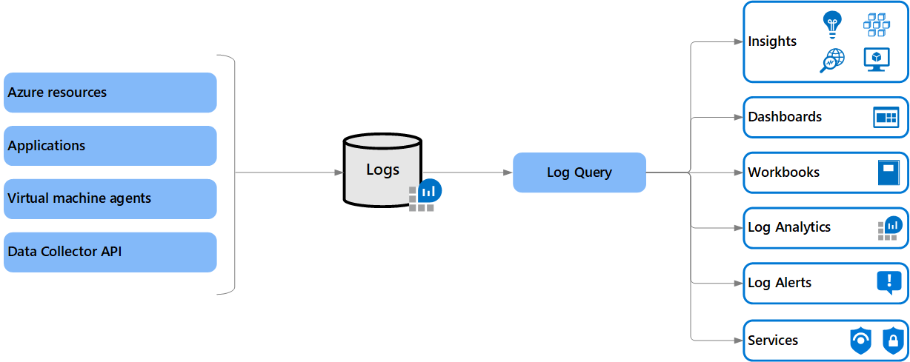

# Azure Monitor Logs overview
Azure Monitor Logs is a feature of Azure Monitor that collects and organizes log and performance data from [monitored resources](../monitor-reference.md). Several features of Azure Monitor store their data in Logs and present this data in various ways to assist you in monitoring the performance and availability of your cloud and hybrid applications and their supporting components.

Along with using existing Azure Monitor features, you can analyze Logs data by using a sophisticated query language that's capable of quickly analyzing millions of records. You might perform a simple query that retrieves a specific set of records or perform sophisticated data analysis to identify critical patterns in your monitoring data. Work with log queries and their results interactively by using Log Analytics, use them in alert rules to be proactively notified of issues, or visualize their results in a workbook or dashboard.

> [!NOTE]
> Azure Monitor Logs is one half of the data platform that supports Azure Monitor. The other is [Azure Monitor Metrics](../essentials/data-platform-metrics.md), which stores numeric data in a time-series database. Numeric data is more lightweight than data in Azure Monitor Logs. Azure Monitor Metrics can support near real time scenarios, so it's useful for alerting and fast detection of issues.
>
> Azure Monitor Metrics can only store numeric data in a particular structure, whereas Azure Monitor Logs can store a variety of data types that have their own structures. You can also perform complex analysis on Azure Monitor Logs data by using log queries, which can't be used for analysis of Azure Monitor Metrics data.

## What can you do with Azure Monitor Logs?
The following table describes some of the ways that you can use Azure Monitor Logs.

|  Capability | Description |
|:---|:---|
| Analyze | Use [Log Analytics](./log-analytics-tutorial.md) in the Azure portal to write [log queries](./log-query-overview.md) and interactively analyze log data by using a powerful analysis engine. |
| Alert | Configure a [log alert rule](../alerts/alerts-log.md) that sends a notification or takes [automated action](../alerts/action-groups.md) when the results of the query match a particular result. |
| Visualize | Pin query results rendered as tables or charts to an [Azure dashboard](../../azure-portal/azure-portal-dashboards.md). Create a [workbook](../visualize/workbooks-overview.md) to combine with multiple sets of data in an interactive report.  Export the results of a query to [Power BI](./log-powerbi.md) to use different visualizations and share with users outside Azure. Export the results of a query to [Grafana](../visualize/grafana-plugin.md) to use its dashboarding and combine with other data sources.|
| Get insights | Logs support [insights](../insights/insights-overview.md) that provide a customized monitoring experience for particular applications and services.  |
| Retrieve | Access log query results from:<ul><li>Command line via the [Azure CLI](/cli/azure/monitor/log-analytics) or [Azure PowerShell cmdlets](/powershell/module/az.operationalinsights).</li><li>Custom app via the [REST API](/rest/api/loganalytics/) or client library for [.NET](/dotnet/api/overview/azure/Monitor.Query-readme), [Go](https://pkg.go.dev/github.com/Azure/azure-sdk-for-go/sdk/monitor/azquery), [Java](/java/api/overview/azure/monitor-query-readme), [JavaScript](/javascript/api/overview/azure/monitor-query-readme), or [Python](/python/api/overview/azure/monitor-query-readme).</li></ul> |
| Import | Upload logs from a custom app via the [REST API](/azure/azure-monitor/logs/logs-ingestion-api-overview) or client library for [.NET](/dotnet/api/overview/azure/Monitor.Ingestion-readme), [Java](/java/api/overview/azure/monitor-ingestion-readme), [JavaScript](/javascript/api/overview/azure/monitor-ingestion-readme), or [Python](/python/api/overview/azure/monitor-ingestion-readme). |
| Export | Configure [automated export of log data](./logs-data-export.md) to an Azure Storage account or Azure Event Hubs. Build a workflow to retrieve log data and copy it to an external location by using [Azure Logic Apps](../../connectors/connectors-azure-monitor-logs.md). |

## Data collection
After you create a [Log Analytics workspace](#log-analytics-workspaces), you must configure sources to send their data. No data is collected automatically.

This configuration will be different depending on the data source. For example:

- [Create diagnostic settings](../essentials/diagnostic-settings.md) to send resource logs from Azure resources to the workspace.
- [Enable VM insights](../vm/vminsights-enable-overview.md) to collect data from virtual machines. 
- [Configure data sources on the workspace](../data-sources.md) to collect more events and performance data.

> [!IMPORTANT]
> Most data collection in Logs will incur ingestion and retention costs. See [Azure Monitor pricing](https://azure.microsoft.com/pricing/details/monitor/) before you enable any data collection.

For a complete list of data sources that you can configure to send data to Azure Monitor Logs, see [What is monitored by Azure Monitor?](../monitor-reference.md).

## Log Analytics workspaces
Azure Monitor Logs stores the data that it collects in one or more [Log Analytics workspaces](./workspace-design.md). You must create at least one workspace to use Azure Monitor Logs. For a description of Log Analytics workspaces, see [Log Analytics workspace overview](log-analytics-workspace-overview.md).

## Log Analytics 
Log Analytics is a tool in the Azure portal. Use it to edit and run log queries and interactively analyze their results. You can then use those queries to support other features in Azure Monitor, such as log query alerts and workbooks. Access Log Analytics from the **Logs** option on the Azure Monitor menu or from most other services in the Azure portal.

For a description of Log Analytics, see [Overview of Log Analytics in Azure Monitor](./log-analytics-overview.md). To walk through using Log Analytics features to create a simple log query and analyze its results, see [Log Analytics tutorial](./log-analytics-tutorial.md).

## Log queries
Data is retrieved from a Log Analytics workspace through a log query, which is a read-only request to process data and return results. Log queries are written in [Kusto Query Language (KQL)](/azure/data-explorer/kusto/query/). KQL is the same query language that Azure Data Explorer uses.

You can:

- Write log queries in Log Analytics to interactively analyze their results.
- Use them in alert rules to be proactively notified of issues.
- Include their results in workbooks or dashboards.

Insights include prebuilt queries to support their views and workbooks.

For a list of where log queries are used and references to tutorials and other documentation to get you started, see [Log queries in Azure Monitor](./log-query-overview.md).

## Relationship to Azure Data Explorer
Azure Monitor Logs is based on Azure Data Explorer. A Log Analytics workspace is roughly the equivalent of a database in Azure Data Explorer. Tables are structured the same, and both use KQL.

The experience of using Log Analytics to work with Azure Monitor queries in the Azure portal is similar to the experience of using the Azure Data Explorer Web UI. You can even [include data from a Log Analytics workspace in an Azure Data Explorer query](/azure/data-explorer/query-monitor-data).

## Next steps

- Learn about [log queries](./log-query-overview.md) to retrieve and analyze data from a Log Analytics workspace.
- Learn about [metrics in Azure Monitor](../essentials/data-platform-metrics.md).
- Learn about the [monitoring data available](../data-sources.md) for various resources in Azure.
