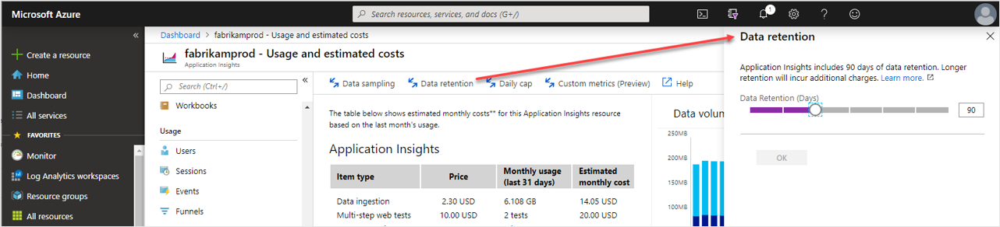

# Data retention and archive in Azure Monitor Logs

Azure Monitor Logs retains data in two states:

* **Interactive retention**: Lets you retain Analytics logs for [interactive queries](../logs/get-started-queries.md) of up to 2 years.
* **Archive**: Lets you keep older, less used data in your workspace at a reduced cost. You can access data in the archived state by using [search jobs](../logs/search-jobs.md) and [restore](../logs/restore.md). You can currently keep data in archived state for up to 7 years. In the coming months, it will be possible to extend archive to 12 years.

This article describes how to configure data retention and archiving.

## How retention and archiving work

Each workspace has a default retention setting that's applied to all tables. You can configure a different retention setting on individual tables.

:::image type="content" source="media/data-retention-configure/retention-archive.png" alt-text="Diagram that shows an overview of data retention and archive periods.":::

During the interactive retention period, data is available for monitoring, troubleshooting, and analytics. When you no longer use the logs, but still need to keep the data for compliance or occasional investigation, archive the logs to save costs.

Archived data stays in the same table, alongside the data that's available for interactive queries. When you set a total retention period that's longer than the interactive retention period, Log Analytics automatically archives the relevant data immediately at the end of the retention period.

You can access archived data by [running a search job](search-jobs.md) or [restoring archived logs](restore.md).

> [!NOTE]
> The archive period can only be set at the table level, not at the workspace level.
### Adjustments to retention and archive settings

When you shorten an existing retention setting, Azure Monitor waits 30 days before removing the data, so you can revert the change and avoid data loss in the event of an error in configuration. You can [purge data](#purge-retained-data) immediately when required. 

When you increase the retention setting, the new retention period applies to all data that's already been ingested into the table and hasn't yet been purged or removed.   

If you change the archive settings on a table with existing data, the relevant data in the table is also affected immediately. For example, you might have an existing table with 180 days of interactive retention and no archive period. You decide to change the retention setting to 90 days of interactive retention without changing the total retention period of 180 days. Log Analytics immediately archives any data that's older than 90 days and none of the data is deleted.

## Permissions required

| Action | Permissions required |
|:-------|:---------------------|
| Configure data retention and archive policies for a Log Analytics workspace | `Microsoft.OperationalInsights/workspaces/write` and `microsoft.operationalinsights/workspaces/tables/write` permissions to the Log Analytics workspace, as provided by the [Log Analytics Contributor built-in role](./manage-access.md#log-analytics-contributor), for example |
| Get the retention and archive policy by table for a Log Analytics workspace | `Microsoft.OperationalInsights/workspaces/tables/read` permissions to the Log Analytics workspace, as provided by the [Log Analytics Reader built-in role](./manage-access.md#log-analytics-reader), for example |
| Purge data from a Log Analytics workspace | `Microsoft.OperationalInsights/workspaces/purge/action` permissions to the Log Analytics workspace, as provided by the [Log Analytics Contributor built-in role](./manage-access.md#log-analytics-contributor), for example |
| Set data retention for a classic Application Insights resource | `microsoft.insights/components/write` permissions to the classic Application Insights resource, as provided by the [Application Insights Component Contributor built-in role](../../role-based-access-control/built-in-roles.md#application-insights-component-contributor), for example |
| Purge data from a classic Application Insights resource | `Microsoft.Insights/components/purge/action` permissions to the classic Application Insights resource, as provided by the [Application Insights Component Contributor built-in role](../../role-based-access-control/built-in-roles.md#application-insights-component-contributor), for example |

## Configure the default workspace retention

You can set a Log Analytics workspace's default retention in the Azure portal to 30, 31, 60, 90, 120, 180, 270, 365, 550, and 730 days. You can apply a different setting to specific tables by [configuring retention and archive at the table level](#configure-retention-and-archive-at-the-table-level). If you're on the *free* tier, you need to upgrade to the paid tier to change the data retention period.

To set the default workspace retention:

1. From the **Log Analytics workspaces** menu in the Azure portal, select your workspace.
1. Select **Usage and estimated costs** in the left pane.
1. Select **Data Retention** at the top of the page.
    
    :::image type="content" source="media/manage-cost-storage/manage-cost-change-retention-01.png" alt-text="Screenshot that shows changing the workspace data retention setting.":::

1. Move the slider to increase or decrease the number of days, and then select **OK**.

## Configure retention and archive at the table level

By default, all tables in your workspace inherit the workspace's interactive retention setting and have no archive. You can modify the retention and archive settings of individual tables, except for workspaces in the legacy Free Trial pricing tier.

The Analytics log data plan includes 30 days of interactive retention. You can increase the interactive retention period to up to 730 days at an [additional cost](https://azure.microsoft.com/pricing/details/monitor/). If needed, you can reduce the interactive retention period to as little as four days using the API or CLI. However, since 30 days are included in the ingestion price, lowering the retention period below 30 days doesn't reduce costs. You can set the archive period to a total retention time of up to 2,556 days (seven years).

> [!NOTE]
> In the coming months, new settings will enable retaining data for up to 12 years.

# [Portal](#tab/portal-1)

To set the retention and archive duration for a table in the Azure portal:

1. From the **Log Analytics workspaces** menu, select **Tables**.

    The **Tables** screen lists all the tables in the workspace.

1. Select the context menu for the table you want to configure and select **Manage table**.

    :::image type="content" source="media/basic-logs-configure/log-analytics-table-configuration.png" lightbox="media/basic-logs-configure/log-analytics-table-configuration.png" alt-text="Screenshot that shows the Manage table button for one of the tables in a workspace.":::

1. Configure the retention and archive duration in the **Data retention settings** section of the table configuration screen.

    :::image type="content" source="media/data-retention-configure/log-analytics-configure-table-retention-archive.png" lightbox="media/data-retention-configure/log-analytics-configure-table-retention-archive.png" alt-text="Screenshot that shows the data retention settings on the table configuration screen.":::

# [API](#tab/api-1)

To set the retention and archive duration for a table, call the **Tables - Update** API:

```http
PATCH https://management.azure.com/subscriptions/{subscriptionId}/resourcegroups/{resourceGroupName}/providers/Microsoft.OperationalInsights/workspaces/{workspaceName}/tables/{tableName}?api-version=2021-12-01-preview
```

> [!NOTE]
> You don't explicitly specify the archive duration in the API call. Instead, you set the total retention, which is the sum of the interactive retention plus the archive duration.

You can use either PUT or PATCH, with the following difference:

- The **PUT** API sets `retentionInDays` and `totalRetentionInDays` to the default value if you don't set non-null values.
- The **PATCH** API doesn't change the `retentionInDays` or `totalRetentionInDays` values if you don't specify values.

**Request body**

The request body includes the values in the following table.

|Name | Type | Description |
| --- | --- | --- |
|properties.retentionInDays | integer  | The table's data retention in days. This value can be between 4 and 730. <br/>Setting this property to null applies the workspace retention period. For a Basic Logs table, the value is always 8. |
|properties.totalRetentionInDays | integer  | The table's total data retention including archive period. This value can be between 4 and 730; or 1095, 1460, 1826, 2191, or 2556. Set this property to null if you don't want to archive data.  |

**Example**

This example sets the table's interactive retention to the workspace default of 30 days, and the total retention to two years, which means that the archive duration is 23 months.

**Request**

```http
PATCH https://management.azure.com/subscriptions/00000000-0000-0000-0000-00000000000/resourcegroups/testRG/providers/Microsoft.OperationalInsights/workspaces/testWS/tables/CustomLog_CL?api-version=2021-12-01-preview
```

**Request body**

```http
{
    "properties": {
        "retentionInDays": null,
        "totalRetentionInDays": 730
    }
}
```

**Response**

Status code: 200

```http
{
    "properties": {
        "retentionInDays": 30,
        "totalRetentionInDays": 730,
        "archiveRetentionInDays": 700,
        ...        
    },
   ...
}
```

# [CLI](#tab/cli-1)

To set the retention and archive duration for a table, run the [az monitor log-analytics workspace table update](/cli/azure/monitor/log-analytics/workspace/table#az-monitor-log-analytics-workspace-table-update) command and pass the `--retention-time` and `--total-retention-time` parameters.

This example sets the table's interactive retention to 30 days, and the total retention to two years, which means that the archive duration is 23 months:

```azurecli
az monitor log-analytics workspace table update --subscription ContosoSID --resource-group ContosoRG --workspace-name ContosoWorkspace --name AzureMetrics --retention-time 30 --total-retention-time 730
```

To reapply the workspace's default interactive retention value to the table and reset its total retention to 0, run the [az monitor log-analytics workspace table update](/cli/azure/monitor/log-analytics/workspace/table#az-monitor-log-analytics-workspace-table-update) command with the `--retention-time` and `--total-retention-time` parameters set to `-1`.

For example:

```azurecli
az monitor log-analytics workspace table update --subscription ContosoSID --resource-group ContosoRG --workspace-name ContosoWorkspace --name Syslog --retention-time -1 --total-retention-time -1
```

# [PowerShell](#tab/PowerShell-1)

Use the [Update-AzOperationalInsightsTable](/powershell/module/az.operationalinsights/Update-AzOperationalInsightsTable) cmdlet to set the retention and archive duration for a table. This example sets the table's interactive retention to 30 days, and the total retention to two years, which means that the archive duration is 23 months:

```powershell
Update-AzOperationalInsightsTable -ResourceGroupName ContosoRG -WorkspaceName ContosoWorkspace -TableName AzureMetrics -RetentionInDays 30 -TotalRetentionInDays 730
```

To reapply the workspace's default interactive retention value to the table and reset its total retention to 0, run the [Update-AzOperationalInsightsTable](/powershell/module/az.operationalinsights/Update-AzOperationalInsightsTable) cmdlet with the `-RetentionInDays` and `-TotalRetentionInDays` parameters set to `-1`.

For example:

```powershell
Update-AzOperationalInsightsTable -ResourceGroupName ContosoRG -WorkspaceName ContosoWorkspace -TableName Syslog -RetentionInDays -1 -TotalRetentionInDays -1
```

---

## Get retention and archive settings by table

# [Portal](#tab/portal-2)

To view the retention and archive duration for a table in the Azure portal, from the **Log Analytics workspaces** menu, select **Tables**.

The **Tables** screen shows the interactive retention and archive period for all the tables in the workspace.

:::image type="content" source="media/data-retention-configure/log-analytics-view-table-retention-archive.png" lightbox="media/data-retention-configure/log-analytics-view-table-retention-archive.png" alt-text="Screenshot that shows the Manage table button for one of the tables in a workspace.":::


# [API](#tab/api-2)

To get the retention setting of a particular table (in this example, `SecurityEvent`), call the **Tables - Get** API:

```JSON
GET /subscriptions/00000000-0000-0000-0000-00000000000/resourceGroups/MyResourceGroupName/providers/Microsoft.OperationalInsights/workspaces/MyWorkspaceName/Tables/SecurityEvent?api-version=2021-12-01-preview
```

To get all table-level retention settings in your workspace, don't set a table name. 

For example:

```JSON
GET /subscriptions/00000000-0000-0000-0000-00000000000/resourceGroups/MyResourceGroupName/providers/Microsoft.OperationalInsights/workspaces/MyWorkspaceName/Tables?api-version=2021-12-01-preview
```

# [CLI](#tab/cli-2)

To get the retention setting of a particular table, run the [az monitor log-analytics workspace table show](/cli/azure/monitor/log-analytics/workspace/table#az-monitor-log-analytics-workspace-table-show) command.

For example:

```azurecli
az monitor log-analytics workspace table show --subscription ContosoSID --resource-group ContosoRG --workspace-name ContosoWorkspace --name SecurityEvent
``` 

# [PowerShell](#tab/PowerShell-2)

To get the retention setting of a particular table, run the [Get-AzOperationalInsightsTable](/powershell/module/az.operationalinsights/get-azoperationalinsightstable) cmdlet.

For example:

```powershell
Get-AzOperationalInsightsTable -ResourceGroupName ContosoRG -WorkspaceName ContosoWorkspace -tableName SecurityEvent
``` 

---

## Purge retained data

If you set the data retention to 30 days, you can purge older data immediately by using the `immediatePurgeDataOn30Days` parameter in Azure Resource Manager. The purge functionality is useful when you need to remove personal data immediately. The immediate purge functionality isn't available through the Azure portal.

Workspaces with a 30-day retention might keep data for 31 days if you don't set the `immediatePurgeDataOn30Days` parameter.

You can also purge data from a workspace by using the [purge feature](personal-data-mgmt.md#exporting-and-deleting-personal-data), which removes personal data. You can't purge data from archived logs.

The Log Analytics [Purge API](/rest/api/loganalytics/workspacepurge/purge) doesn't affect retention billing. To lower retention costs, *decrease the retention period for the workspace or for specific tables*.

## Tables with unique retention periods

By default, two data types, `Usage` and `AzureActivity`, keep data for at least 90 days at no charge. When you increase the workspace retention to more than 90 days, you also increase the retention of these data types. These tables are also free from data ingestion charges.

Tables related to Application Insights resources also keep data for 90 days at no charge. You can adjust the retention of each of these tables individually:

- `AppAvailabilityResults`
- `AppBrowserTimings`
- `AppDependencies`
- `AppExceptions`
- `AppEvents`
- `AppMetrics`
- `AppPageViews`
- `AppPerformanceCounters`
- `AppRequests`
- `AppSystemEvents`
- `AppTraces`

## Pricing model

The charge for maintaining archived logs is calculated based on the volume of data you archive, in GB, and the number or days for which you archive the data.

For more information, see [Azure Monitor pricing](https://azure.microsoft.com/pricing/details/monitor/).

## Set data retention for classic Application Insights resources

Workspace-based Application Insights resources store data in a Log Analytics workspace, so it's included in the data retention and archive settings for the workspace. Classic Application Insights resources have separate retention settings.

The default retention for Application Insights resources is 90 days. You can select different retention periods for each Application Insights resource. The full set of available retention periods is 30, 60, 90, 120, 180, 270, 365, 550, or 730 days.

To change the retention, from your Application Insights resource, go to the **Usage and estimated costs** page and select the **Data retention** option.



A several-day grace period begins when the retention is lowered before the oldest data is removed.

The retention can also be [set programmatically with PowerShell](../app/powershell.md#set-the-data-retention) by using the `retentionInDays` parameter. If you set the data retention to 30 days, you can trigger an immediate purge of older data by using the `immediatePurgeDataOn30Days` parameter. This approach might be useful for compliance-related scenarios. This purge functionality is only exposed via Azure Resource Manager and should be used with extreme care. The daily reset time for the data volume cap can be configured by using Azure Resource Manager to set the `dailyQuotaResetTime` parameter.

## Next steps

- [Learn more about Log Analytics workspaces and data retention and archive](log-analytics-workspace-overview.md)
- [Create a search job to retrieve archive data matching particular criteria](search-jobs.md)
- [Restore archive data within a particular time range](restore.md)
