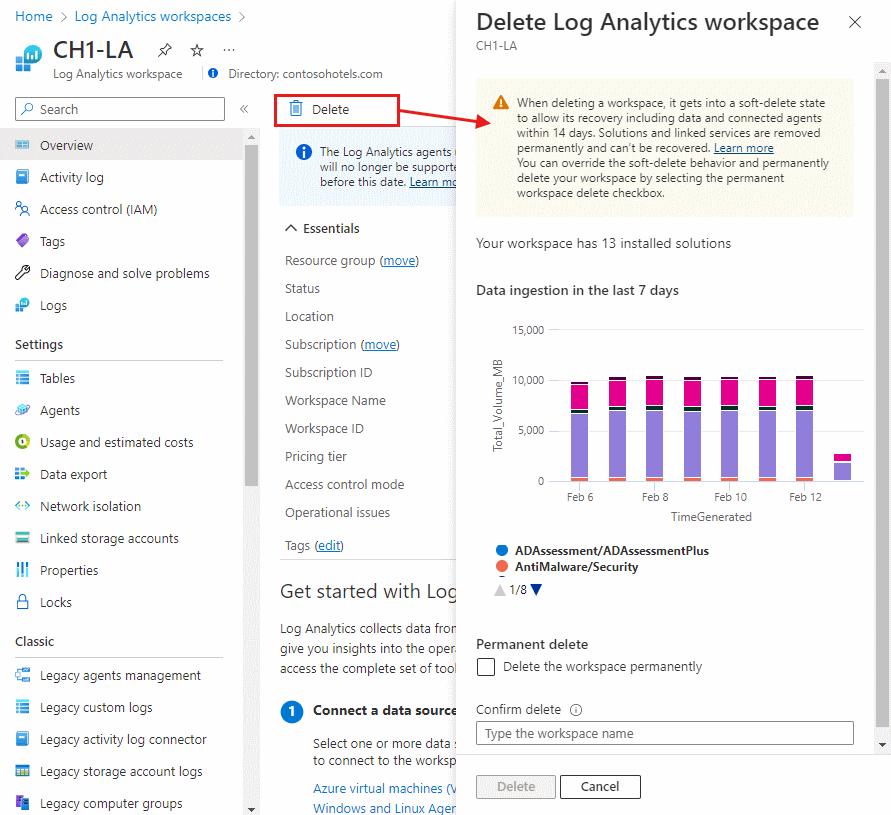
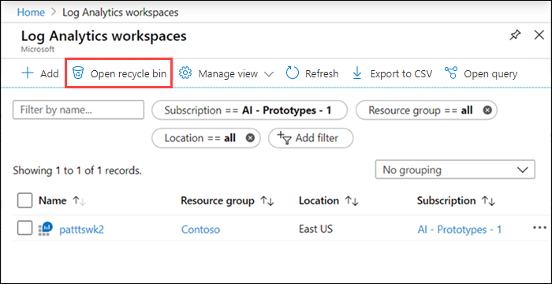
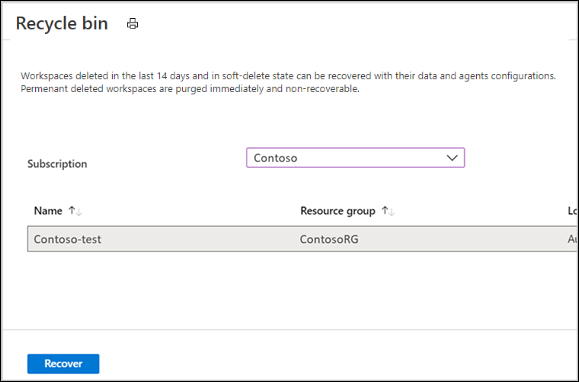

# Delete and recover an Azure Log Analytics workspace

This article explains the concept of Azure Log Analytics workspace soft-delete and how to recover a deleted workspace.

## Considerations when you delete a workspace

When you delete a Log Analytics workspace, a soft-delete operation is performed to allow the recovery of the workspace, including its data and connected agents, within 14 days. This process occurs whether the deletion was accidental or intentional.

After the soft-delete period, the workspace resource and its data are nonrecoverable and queued for purge completely within 30 days. The workspace name is released and you can use it to create a new workspace.

> [!NOTE]
> If you want to override the soft-delete behavior and permanently delete your workspace, follow the steps in [Permanent workspace delete](#permanent-workspace-delete).

Be careful when you delete a workspace because there might be important data and configuration that might negatively affect your service operation. Review what agents, solutions, and other Azure services store their data in Log Analytics, such as:

* Management solutions.
* Azure Automation.
* Agents running on Windows and Linux virtual machines.
* Agents running on Windows and Linux computers in your environment.
* System Center Operations Manager.

The soft-delete operation deletes the workspace resource, and any associated users' permission is broken. If users are associated with other workspaces, they can continue using Log Analytics with those other workspaces.

## Soft-delete behavior

The workspace delete operation removes the workspace Azure Resource Manager resource. Its configuration and data are kept for 14 days, although it will look as if the workspace is deleted. Any agents and System Center Operations Manager management groups configured to report to the workspace remain in an orphaned state during the soft-delete period. The service provides a mechanism for recovering the deleted workspace, including its data and connected resources, essentially undoing the deletion.

> [!NOTE]
> Installed solutions and linked services like your Azure Automation account are permanently removed from the workspace at deletion time and can't be recovered. These resources should be reconfigured after the recovery operation to bring the workspace back to its previously configured state.

You can delete a workspace by using [PowerShell](/powershell/module/azurerm.operationalinsights/remove-azurermoperationalinsightsworkspace), the [REST API](/rest/api/loganalytics/workspaces/delete), or the [Azure portal](https://portal.azure.com).

### Azure portal

1. Sign in to the [Azure portal](https://portal.azure.com).
1. In the Azure portal, select **All services**. In the list of resources, enter **Log Analytics**. As you begin typing, the list filters based on your input. Select **Log Analytics workspaces**.
1. In the list of Log Analytics workspaces, select a workspace. Select **Delete**.
1. A confirmation page appears that shows the data ingestion to the workspace over the past week.
1. If you want to permanently delete the workspace and remove the option to later recover it, select the **Delete the workspace permanently** checkbox.
1. Enter the name of the workspace to confirm and then select **Delete**.

   

### PowerShell
```PowerShell
PS C:\>Remove-AzOperationalInsightsWorkspace -ResourceGroupName "resource-group-name" -Name "workspace-name"
```

## Permanent workspace delete
The soft-delete method might not fit in some scenarios, such as development and testing, where you need to repeat a deployment with the same settings and workspace name. In such cases, you can permanently delete your workspace and "override" the soft-delete period. The permanent workspace delete operation releases the workspace name. You can create a new workspace by using the same name.

> [!IMPORTANT]
> Use the permanent workspace delete operation with caution because it's irreversible. You won't be able to recover your workspace and its data.

To permanently delete a workspace by using the Azure portal, select the **Delete the workspace permanently** checkbox before you select **Delete**.

To permanently delete a workspace by using PowerShell, add a `-ForceDelete` tag to permanently delete your workspace. The `-ForceDelete` option is currently available with Az.OperationalInsights 2.3.0 or higher.

```powershell
PS C:\>Remove-AzOperationalInsightsWorkspace -ResourceGroupName "resource-group-name" -Name "workspace-name" -ForceDelete
```

## Recover a workspace
When you delete a Log Analytics workspace accidentally or intentionally, the service places the workspace in a soft-delete state and makes it inaccessible to any operation. The name of the deleted workspace is preserved during the soft-delete period. It can't be used to create a new workspace. After the soft-delete period, the workspace is nonrecoverable, it's scheduled for permanent deletion, and its name is released and can be used to create a new workspace.

You can recover your workspace during the soft-delete period, including its data, configuration, and connected agents. You must have Contributor permissions to the subscription and resource group where the workspace was located before the soft-delete operation. The workspace recovery is performed by re-creating the Log Analytics workspace with the details of the deleted workspace, including:

- Subscription ID
- Resource group name
- Workspace name
- Region

> [!IMPORTANT]
> If your workspace was deleted as part of a resource group delete operation, you must first re-create the resource group.

### Azure portal

1. Sign in to the [Azure portal](https://portal.azure.com).
1. In the Azure portal, select **All services**. In the list of resources, enter **Log Analytics**. As you begin typing, the list filters based on your input. Select **Log Analytics workspaces**. You see the list of workspaces you have in the selected scope.
1. Select **Recover** on the top left menu to open a page with workspaces in a soft-delete state that can be recovered.

   

1. Select the workspace. Then select **Recover** to recover the workspace.

   

### PowerShell
```PowerShell
PS C:\>Select-AzSubscription "subscription-name-the-workspace-was-in"
PS C:\>Restore-AzOperationalInsightsWorkspace -ResourceGroupName "resource-group-name-the-workspace-was-in" -Name "deleted-workspace-name" -Location "region-name-the-workspace-was-in"
```

The workspace and all its data are brought back after the recovery operation. However, solutions and linked services were permanently removed from the workspace when it was deleted. These resources should be reconfigured to bring the workspace to its previously configured state. Some of the data might not be available for query after the workspace recovery until the associated solutions are reinstalled and their schemas are added to the workspace.

## Troubleshooting

You must have at least Log Analytics Contributor permissions to delete a workspace.

* If you aren't sure if a deleted workspace is in a soft-delete state and can be recovered, select [Open recycle bin](#recover-a-workspace) on the **Log Analytics workspaces** page to see a list of soft-deleted workspaces per subscription. Permanently deleted workspaces aren't included in the list.
* If you get the error message "This workspace name is already in use" or "conflict" when you create a workspace, it could be because:
  * The workspace name isn't available because it's being used by someone in your organization or another customer.
  * The workspace was deleted in the last 14 days and its name was kept reserved for the soft-delete period. To override the soft-delete and permanently delete your workspace to create a new workspace with the same name, follow these steps to recover the workspace first and then perform a permanent delete:<br>
    1. [Recover](#recover-a-workspace) your workspace.
    1. [Permanently delete](#permanent-workspace-delete) your workspace.
    1. Create a new workspace by using the same workspace name.

      After the deletion call is successfully completed on the back end, you can restore the workspace and finish the permanent delete operation by using one of the methods suggested earlier.

* If you get a 204 response code with "Resource not found" when you delete a workspace, consecutive retries operations might have occurred. The 204 code is an empty response, which usually means that the resource doesn't exist, so the delete finished without doing anything.
* If you deleted your resource group and your workspace was included, you can see the deleted workspace on the [Open recycle bin](#recover-a-workspace) page. The recovery operation will fail with the error code 404 because the resource group doesn't exist. Re-create your resource group and try the recovery again.
