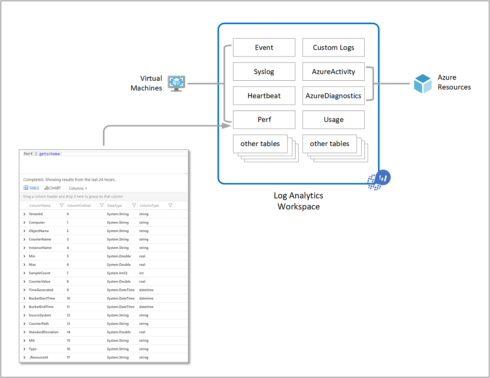
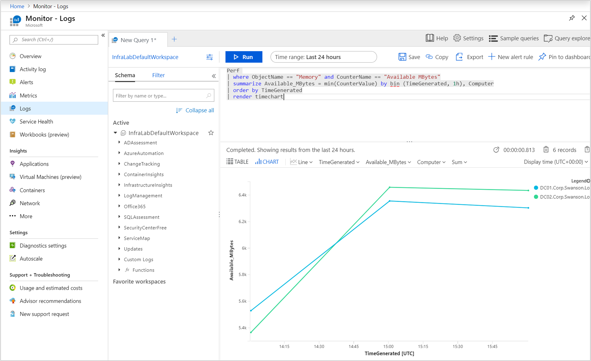
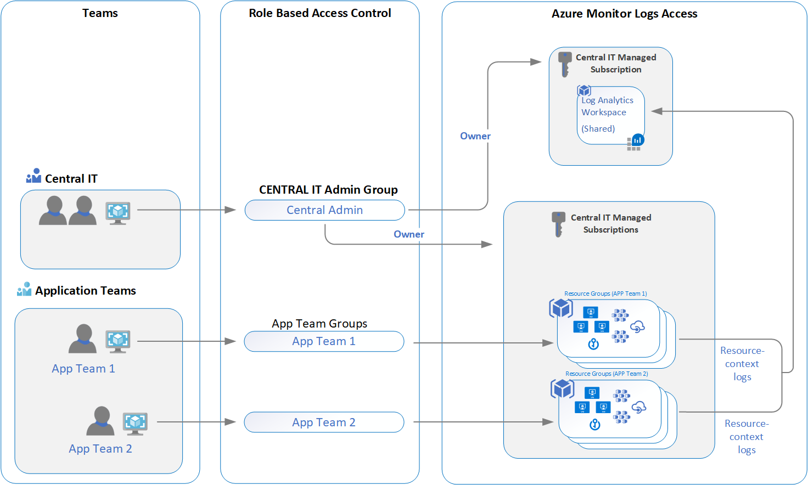

# Designing your Azure Monitor Logs deployment

Azure Monitor stores [log](data-platform-logs.md) data in a Log Analytics workspace, which is an Azure resource and a container where data is collected, aggregated, and serves as an administrative boundary. While you can deploy one or more workspaces in your Azure subscription, there are several considerations you should understand in order to ensure your initial deployment is following our guidelines to provide you with a cost effective, manageable, and scalable deployment meeting your organization's needs.

Data in a workspace is organized into tables, each of which stores different kinds of data and has its own unique set of properties based on the resource generating the data. Most data sources will write to their own tables in a Log Analytics workspace.

A Log Analytics workspace provides:

* A geographic location for data storage.
* Data isolation by granting different users access rights following one of our recommended design strategies.
* Scope for configuration of settings like [pricing tier](./manage-cost-storage.md#changing-pricing-tier), [retention](./manage-cost-storage.md#change-the-data-retention-period), and [data capping](./manage-cost-storage.md#manage-your-maximum-daily-data-volume).

Workspaces are hosted on physical clusters. By default, the system is creating and managing these clusters. Customers that ingest more than 4TB/day are expected to create their own dedicated clusters for their workspaces - it enables them better control and higher ingestion rate.

This article provides a detailed overview of the design and migration considerations, access control overview, and an understanding of the design implementations we recommend for your IT organization.

## Important considerations for an access control strategy

Identifying the number of workspaces you need is influenced by one or more of the following requirements:

* You are a global company and you need log data stored in specific regions for data sovereignty or compliance reasons.
* You are using Azure and you want to avoid outbound data transfer charges by having a workspace in the same region as the Azure resources it manages.
* You manage multiple departments or business groups, and you want each to see their own data, but not data from others. Also, there is no business requirement for a consolidated cross department or business group view.

IT organizations today are modeled following either a centralized, decentralized, or an in-between hybrid of both structures. As a result, the following workspace deployment models have been commonly used to map to one of these organizational structures:

* **Centralized**: All logs are stored in a central workspace and administered by a single team, with Azure Monitor providing differentiated access per-team. In this scenario, it is easy to manage, search across resources, and cross-correlate logs. The workspace can grow significantly depending on the amount of data collected from multiple resources in your subscription, with additional administrative overhead to maintain access control to different users. This model is known as "hub and spoke".
* **Decentralized**: Each team has their own workspace created in a resource group they own and manage, and log data is segregated per resource. In this scenario, the workspace can be kept secure and access control is consistent with resource access, but it's difficult to cross-correlate logs. Users who need a broad view of many resources cannot analyze the data in a meaningful way.
* **Hybrid**: Security audit compliance requirements further complicate this scenario because many organizations implement both deployment models in parallel. This commonly results in a complex, expensive, and hard-to-maintain configuration with gaps in logs coverage.

When using the Log Analytics agents to collect data, you need to understand the following in order to plan your agent deployment:

* To collect data from Windows agents, you can [configure each agent to report to one or more workspaces](./../agents/agent-windows.md), even while it is reporting to a System Center Operations Manager management group. The Windows agent can report up to four workspaces.
* The Linux agent does not support multi-homing and can only report to a single workspace.

If you are using System Center Operations Manager 2012 R2 or later:

* Each Operations Manager management group can be [connected to only one workspace](../agents/om-agents.md). 
* Linux computers reporting to a management group must be configured to report directly to a Log Analytics workspace. If your Linux computers are already reporting directly to a workspace and you want to monitor them with Operations Manager, follow these steps to [report to an Operations Manager management group](../agents/agent-manage.md#configure-agent-to-report-to-an-operations-manager-management-group). 
* You can install the Log Analytics Windows agent on the Windows computer and have it report to both Operations Manager integrated with a workspace, and a different workspace.

## Access control overview

With Azure role-based access control (Azure RBAC), you can grant users and groups only the amount of access they need to work with monitoring data in a workspace. This allows you to align with your IT organization operating model using a single workspace to store collected data enabled on all your resources. For example, you grant access to your team responsible for infrastructure services hosted on Azure virtual machines (VMs), and as a result they'll have access to only the logs generated by the VMs. This is following our new resource-context log model. The basis for this model is for every log record emitted by an Azure resource, it is automatically associated with this resource. Logs are forwarded to a central workspace that respects scoping and Azure RBAC based on the resources.

The data a user has access to is determined by a combination of factors that are listed in the following table. Each is described in the sections below.

| Factor | Description |
|:---|:---|
| [Access mode](#access-mode) | Method the user uses to access the workspace.  Defines the scope of the data available and the access control mode that's applied. |
| [Access control mode](#access-control-mode) | Setting on the workspace that defines whether permissions are applied at the workspace or resource level. |
| [Permissions](./manage-access.md) | Permissions applied to individual or groups of users for the workspace or resource. Defines what data the user will have access to. |
| [Table level Azure RBAC](./manage-access.md#table-level-azure-rbac) | Optional granular permissions that apply to all users regardless of their access mode or access control mode. Defines which data types a user can access. |

## Access mode

The *access mode* refers to how a user accesses a Log Analytics workspace and defines the scope of data they can access. 

Users have two options for accessing the data:

* **Workspace-context**: You can view all logs in the workspace you have permission to. Queries in this mode are scoped to all data in all tables in the workspace. This is the access mode used when logs are accessed with the workspace as the scope, such as when you select **Logs** from the **Azure Monitor** menu in the Azure portal.

    

* **Resource-context**: When you access the workspace for a particular resource, resource group, or subscription, such as when you select **Logs** from a resource menu in the Azure portal, you can view logs for only resources in all tables that you have access to. Queries in this mode are scoped to only data associated with that resource. This mode also enables granular Azure RBAC.

    

    > [!NOTE]
    > Logs are available for resource-context queries only if they were properly associated with the relevant resource. Currently, the following resources have limitations:
    > - Computers outside of Azure - Supported for resource-context only via [Azure Arc for Servers](../../azure-arc/servers/index.yml)
    > - Service Fabric
    > - Application Insights - Supported for resource-context only when using [Workspace-based Application Insights resource](../app/create-workspace-resource.md)
    >
    > You can test if logs are properly associated with their resource by running a query and inspecting the records you're interested in. If the correct resource ID is in the [_ResourceId](./log-standard-columns.md#_resourceid) property, then data is available to resource-centric queries.

Azure Monitor automatically determines the right mode depending on the context you perform the log search from. The scope is always presented in the top-left section of Log Analytics.

### Comparing access modes

The following table summarizes the access modes:

| Issue | Workspace-context | Resource-context |
|:---|:---|:---|
| Who is each model intended for? | Central administration. Administrators who need to configure data collection and users who need access to a wide variety of resources. Also currently required for users who need to access logs for resources outside of Azure. | Application teams. Administrators of Azure resources being monitored. |
| What does a user require to view logs? | Permissions to the workspace. See **Workspace permissions** in [Manage access using workspace permissions](./manage-access.md#manage-access-using-workspace-permissions). | Read access to the resource. See **Resource permissions** in [Manage access using Azure permissions](./manage-access.md#manage-access-using-azure-permissions). Permissions can be inherited (such as from the containing resource group) or directly assigned to the resource. Permission to the logs for the resource will be automatically assigned. |
| What is the scope of permissions? | Workspace. Users with access to the workspace can query all logs in the workspace from tables that they have permissions to. See [Table access control](./manage-access.md#table-level-azure-rbac) | Azure resource. User can query logs for specific resources, resource groups, or subscription they have access to from any workspace but can't query logs for other resources. |
| How can user access logs? | <ul><li>Start **Logs** from **Azure Monitor** menu.</li></ul> <ul><li>Start **Logs** from **Log Analytics workspaces**.</li></ul> <ul><li>From Azure Monitor [Workbooks](../visualizations.md#workbooks).</li></ul> | <ul><li>Start **Logs** from the menu for the Azure resource</li></ul> <ul><li>Start **Logs** from **Azure Monitor** menu.</li></ul> <ul><li>Start **Logs** from **Log Analytics workspaces**.</li></ul> <ul><li>From Azure Monitor [Workbooks](../visualizations.md#workbooks).</li></ul> |

## Access control mode

The *Access control mode* is a setting on each workspace that defines how permissions are determined for the workspace.

* **Require workspace permissions**: This control mode does not allow granular Azure RBAC. For a user to access the workspace, they must be granted permissions to the workspace or to specific tables.

    If a user accesses the workspace following the workspace-context mode, they have access to all data in any table they've been granted access to. If a user accesses the workspace following the resource-context mode, they have access to only data for that resource in any table they've been granted access to.

    This is the default setting for all workspaces created before March 2019.

* **Use resource or workspace permissions**: This control mode allows granular Azure RBAC. Users can be granted access to only data associated with resources they can view by assigning Azure `read` permission. 

    When a user accesses the workspace in workspace-context mode, workspace permissions apply. When a user accesses the workspace in resource-context mode, only resource permissions are verified, and workspace permissions are ignored. Enable Azure RBAC for a user by removing them from workspace permissions and allowing their resource permissions to be recognized.

    This is the default setting for all workspaces created after March 2019.

    > [!NOTE]
    > If a user has only resource permissions to the workspace, they are only able to access the workspace using resource-context mode assuming the workspace access mode is set to **Use resource or workspace permissions**.

To learn how to change the access control mode in the portal, with PowerShell, or using a Resource Manager template, see [Configure access control mode](./manage-access.md#configure-access-control-mode).

## Scale and ingestion volume rate limit

Azure Monitor is a high scale data service that serves thousands of customers sending petabytes of data each month at a growing pace. Workspaces are not limited in their storage space and can grow to petabytes of data. There is no need to split workspaces due to scale.

To protect and isolate Azure Monitor customers and its backend infrastructure, there is a default ingestion rate limit that is designed to protect from spikes and floods situations. The rate limit default is about **6 GB/minute** and is designed to enable normal ingestion. For more details on ingestion volume limit measurement, see [Azure Monitor service limits](../service-limits.md#data-ingestion-volume-rate).

Customers that ingest less than 4TB/day will usually not meet these limits. Customers that ingest higher volumes or that have spikes as part of their normal operations shall consider moving to [dedicated clusters](./logs-dedicated-clusters.md) where the ingestion rate limit could be raised.

When the ingestion rate limit is activated or get to 80% of the threshold, an event is added to the *Operation* table in your workspace. It is recommended to monitor it and create an alert. See more details in [data ingestion volume rate](../service-limits.md#data-ingestion-volume-rate).

## Recommendations

This scenario covers a single workspace design in your IT organization's subscription that is not constrained by data sovereignty or regulatory compliance, or needs to map to the regions your resources are deployed within. It allows your organization's security and IT admin teams the ability to leverage the improved integration with Azure access management and more secure access control.

All resources, monitoring solutions, and Insights such as Application Insights and VM insights, supporting infrastructure and applications maintained by the different teams are configured to forward their collected log data to the IT organization's centralized shared workspace. Users on each team are granted access to logs for resources they have been given access to.

Once you have deployed your workspace architecture, you can enforce this on Azure resources with [Azure Policy](../../governance/policy/overview.md). It provides a way to define policies and ensure compliance with your Azure resources so they send all their resource logs to a particular workspace. For example, with Azure virtual machines or virtual machine scale sets, you can use existing policies that evaluate workspace compliance and report results, or customize to remediate if non-compliant.  

## Workspace consolidation migration strategy

For customers who have already deployed multiple workspaces and are interested in consolidating to the resource-context access model, we recommend you take an incremental approach to migrate to the recommended access model, and you don't attempt to achieve this quickly or aggressively. Following a phased approach to plan,  migrate, validate, and retire following a reasonable timeline will help avoid any unplanned incidents or unexpected impact to your cloud operations. If you do not have a data retention policy for compliance or business reasons, you need to assess the appropriate length of time to retain data in the workspace you are migrating from during the process. While you are reconfiguring resources to report to the shared workspace, you can still analyze the data in the original workspace as necessary. Once the migration is complete, if you're governed to retain data in the original workspace before the end of the retention period, don't delete it.

While planning your migration to this model, consider the following:

* Understand what industry regulations and internal policies regarding data retention you must comply with.
* Make sure that your application teams can work within the existing resource-context functionality.
* Identify the access granted to resources for your application teams and test in a development environment before implementing in production.
* Configure the workspace to enable **Use resource or workspace permissions**.
* Remove application teams permission to read and query the workspace.
* Enable and configure any monitoring solutions, Insights such as Container insights and/or Azure Monitor for VMs, your Automation account(s), and management solutions such as Update Management, Start/Stop VMs, etc., that were deployed in the original workspace.

## Next steps

To implement the security permissions and controls recommended in this guide, review [manage access to logs](./manage-access.md).
