# Log Analytics tutorial
Log Analytics is a tool in the Azure portal to edit and run log queries from data collected by Azure Monitor Logs and interactively analyze their results. You can use Log Analytics queries to retrieve records matching particular criteria, identify trends, analyze patterns, and provide a variety of insights into your data. 

This tutorial walks you through the Log Analytics interface, gets you started with some basic queries, and shows you how you can work with the results. You will learn the following:

> [!div class="checklist"]
> * Understand the log data schema
> * Write and run simple queries, and modify the time range for queries
> * Filter, sort, and group query results
> * View, modify, and share visuals of query results
> * Load, export, and copy queries and results

> [!IMPORTANT]
> This tutorial uses features of Log Analytics to build and run a query instead of working with the query itself. You'll leverage Log Analytics features to build one query and use another example query. When you're ready to learn the syntax of queries and start directly editing the query itself, go through the [Kusto Query Language tutorial](/azure/data-explorer/kusto/query/tutorial?pivots=azuremonitor). That tutorial walks through several example queries that you can edit and run in Log Analytics, leveraging several of the features that you'll learn in this tutorial.

## Prerequisites
This tutorial uses the [Log Analytics demo environment](https://ms.portal.azure.com/#blade/Microsoft_Azure_Monitoring_Logs/DemoLogsBlade), which includes plenty of sample data supporting the sample queries. You can also use your own Azure subscription, but you may not have data in the same tables.

## Open Log Analytics
Open the [Log Analytics demo environment](https://ms.portal.azure.com/#blade/Microsoft_Azure_Monitoring_Logs/DemoLogsBlade) or select **Logs** from the Azure Monitor menu in your subscription. This will set the initial scope to a Log Analytics workspace meaning that your query will select from all data in that workspace. If you select **Logs** from an Azure resource's menu, the scope is set to only records from that resource. See [Log query scope](./scope.md) for details about the scope.

You can view the scope in the top left corner of the screen. If you're using your own environment, you'll see an option to select a different scope, but this option isn't available in the demo environment.

[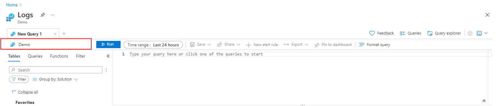](media/log-analytics-tutorial/scope.png#lightbox)

## Table schema
The left side of the screen includes the **Tables** tab which allows you to inspect the tables that are available in the current scope. These are grouped by **Solution** by default, but you change their grouping or filter them. 

Expand the **Log Management** solution and locate the **AzureActivity** table. You can expand the table to view its schema, or hover over its name to show additional information about it. 

[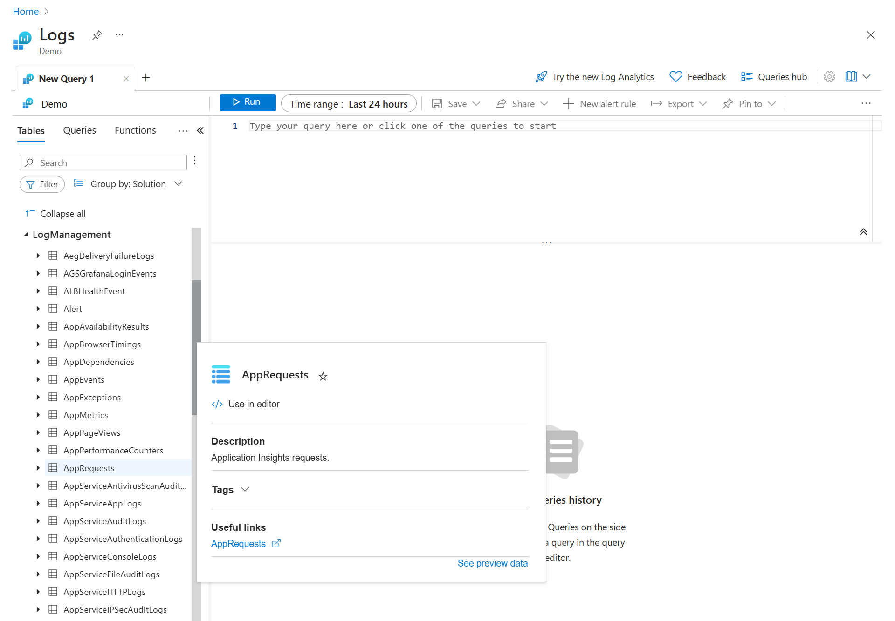](media/log-analytics-tutorial/table-details.png#lightbox)

Click **Learn more** to go to the table reference that documents each table and its columns. Click **Preview data** to have a quick look at a few recent records in the table. This can be useful to ensure that this is the data that you're expecting before you actually run a query with it.

[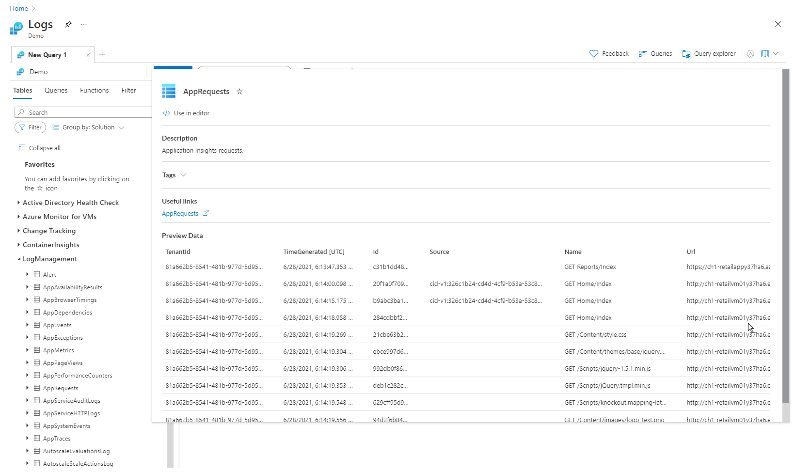](media/log-analytics-tutorial/sample-data.png#lightbox)

## Write a query
Let's go ahead and write a query using the **AzureActivity** table. Double-click its name to add it to the query window. You can also type directly in the window and even get intellisense that will help complete the names of tables in the current scope and KQL commands.

This is the simplest query that we can write. It just returns all the records in a table. Run it by clicking the **Run** button or by pressing Shift+Enter with the cursor positioned anywhere in the query text.

[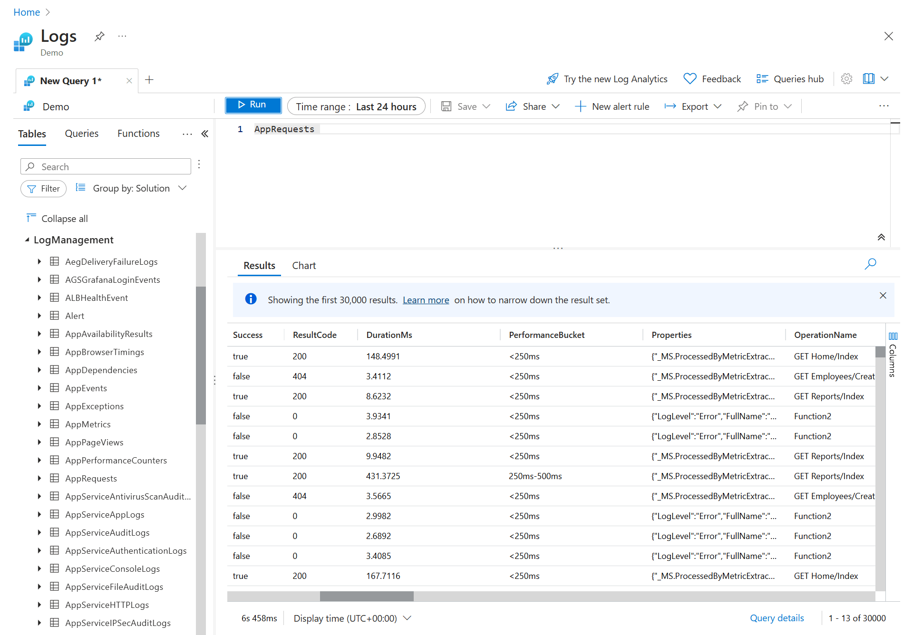](media/log-analytics-tutorial/query-results.png#lightbox)

You can see that we do have results. The number of records returned by the query is displayed in the bottom right corner. 

## Filter

Let's add a filter to the query to reduce the number of records that are returned. Select the **Filter** tab in the left pane. This shows different columns in the query results that you can use to filter the results. The top values in those columns are displayed with the number of records with that value. Click on **Administrative** under **CategoryValue** and then **Apply & Run**. 

[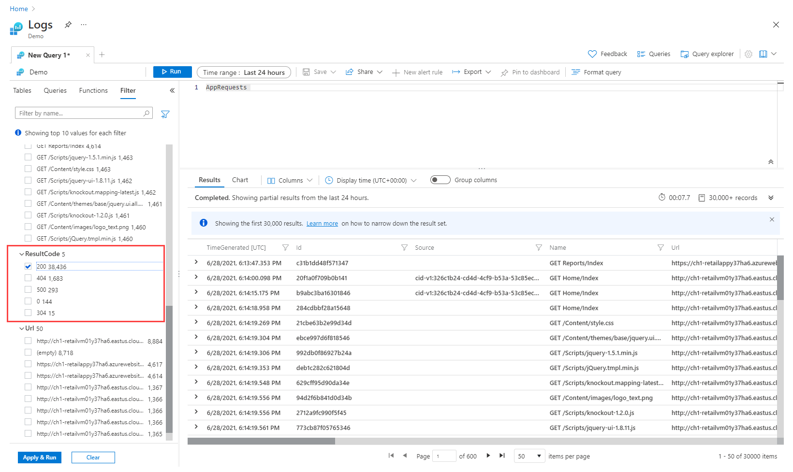](media/log-analytics-tutorial/query-pane.png#lightbox)

A **where** statement is added to the query with the value you selected. The results now include only those records with that value so you can see that the record count is reduced.

[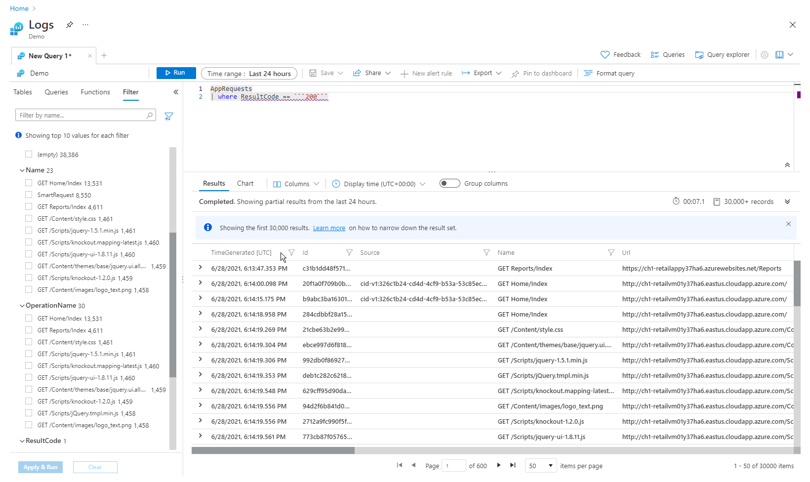](media/log-analytics-tutorial/query-results-filter-01.png#lightbox)

## Time range
All tables in a Log Analytics workspace have a column called **TimeGenerated** which is the time that the record was created. All queries have a time range that limits the results to records with a **TimeGenerated** value within that range. The time range can either be set in the query or with the selector at the top of the screen.

By default, the query will return records form the last 24 hours. Select the **Time range** dropdown and change it to **7 days**. Click **Run** again to return the results. You can see that results are returned, but we have a message here that we're not seeing all of the results. This is because Log Analytics can return a maximum of 10,000 records, and our query returned more records than that. 

## Multiple query conditions
Let's reduce our results further by adding another filter condition. A query can include any number of filters to target exactly the set of records that you want. Select **Success** under **ActivityStatusValue** and click **Apply & Run**. 

[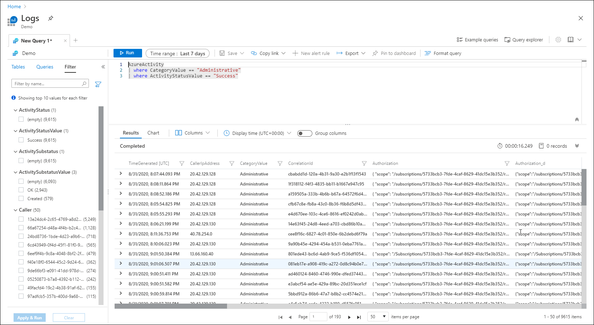](media/log-analytics-tutorial/query-results-filter-02.png#lightbox)

## Analyze results
In addition to helping you write and run queries, Log Analytics provides features for working with the results. Start by expanding a record to view the values for all of its columns.

[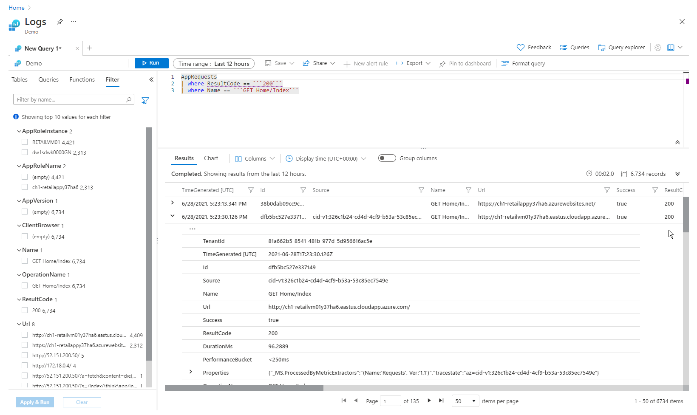](media/log-analytics-tutorial/expand-record.png#lightbox)

Click on the name of any column to sort the results by that column. Click on the filter icon next to it to provide a filter condition. This is similar to adding a filter condition to the query itself except that this filter is cleared if the query is run again. Use this method if you want to quickly analyze a set of records as part of interactive analysis.

For example, set a filter on the **CallerIpAddress** column to limit the records to a single caller. 

[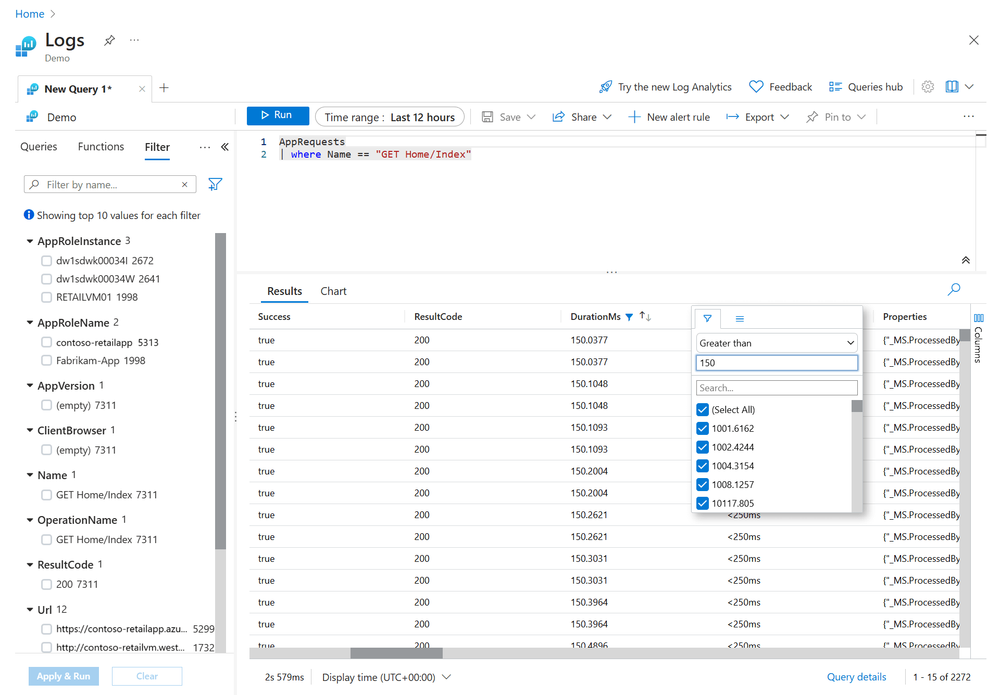](media/log-analytics-tutorial/query-results-filter.png#lightbox)

Instead of filtering the results, you can group records by a particular column. Clear the filter that you just created and then turn on the **Group columns** slider. 

[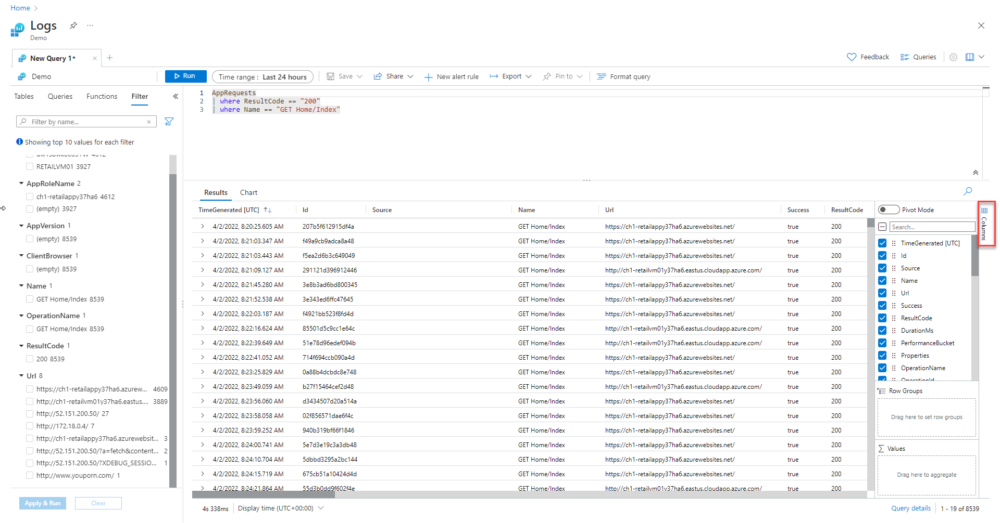](media/log-analytics-tutorial/query-results-group-columns.png#lightbox)

Now drag the **CallerIpAddress** column into the grouping row. Results are now organized by that column, and you can collapse each group to help you with your analysis.

[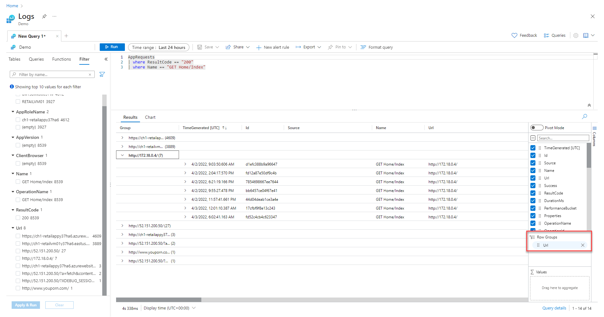](media/log-analytics-tutorial/query-results-grouped.png#lightbox)

## Work with charts
Let's have a look at a query that uses numerical data that we can view in a chart. Instead of building a query, we'll select an example query.

Click on **Queries** in the left pane. This pane includes example queries that you can add to the query window. If you're using your own workspace, you should have a variety of queries in multiple categories, but if you're using the demo environment, you may only see a single **Log Analytics workspaces** category. Expand that to view the queries in the category.

Click on the query called **Request Count by ResponseCode**. This will add the query to the query window. Notice that the new query is separated from the other by a blank line. A query in KQL ends when it encounters a blank line, so these are seen as separate queries. 

[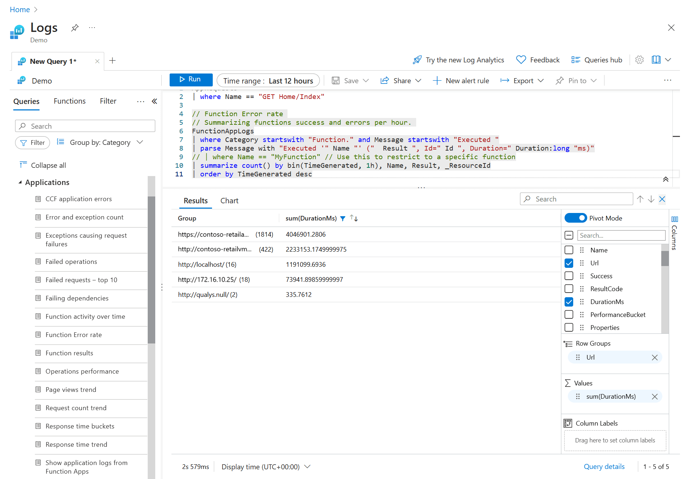](media/log-analytics-tutorial/example-query.png#lightbox)

The current query is the one that the cursor is positioned on. You can see that the first query is highlighted indicating it's the current query. Click anywhere in the new query to select it and then click the **Run** button to run it.

Notice that this output is a chart instead of a table like the last query. That's because the example query uses a [render](/azure/data-explorer/kusto/query/renderoperator?pivots=azuremonitor) command at the end. Notice that there are various options for working with the chart such as changing it to another type.

Try selecting **Results** to view the output of the query as a table. 

[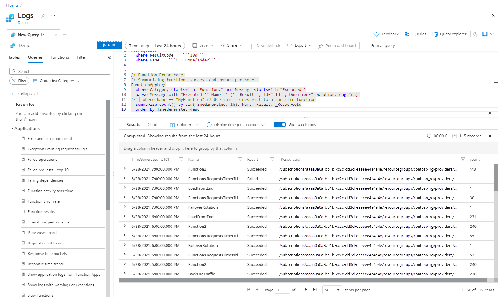](media/log-analytics-tutorial/example-query-output-table.png#lightbox)

## Next steps

Now that you know how to use Log Analytics, complete the tutorial on using log queries.
> [!div class="nextstepaction"]
> [Write Azure Monitor log queries](get-started-queries.md)