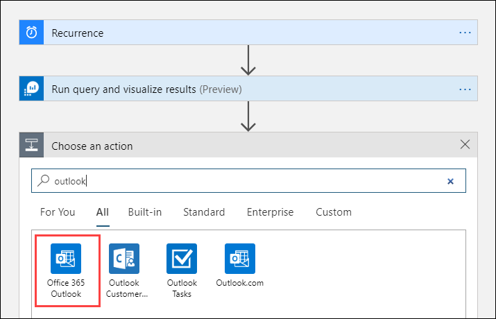
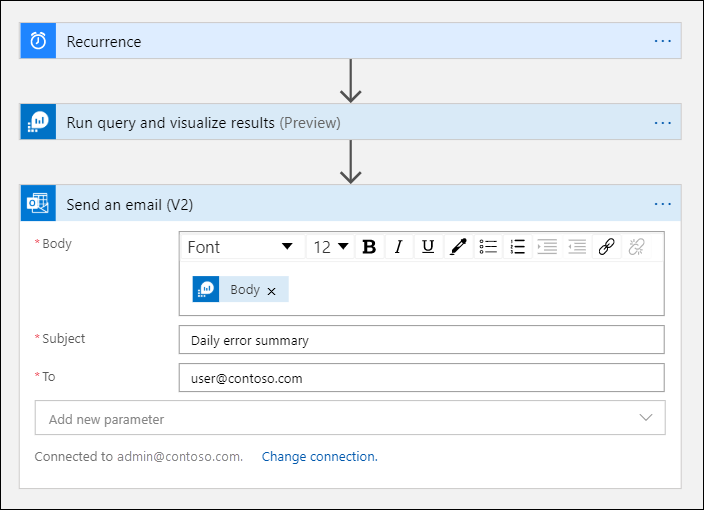

# Azure Monitor Logs connector for Logic Apps and Power Automate
[Azure Logic Apps](../../logic-apps/index.yml) and [Power Automate](https://flow.microsoft.com) allow you to create automated workflows using hundreds of actions for various services. The Azure Monitor Logs connector allows you to build workflows that retrieve data from a Log Analytics workspace or an Application Insights application in Azure Monitor. This article describes the actions included with the connector and provides a walkthrough to build a workflow using this data.

For example, you can create a logic app to use Azure Monitor log data in an email notification from Office 365, create a bug in Azure DevOps, or post a Slack message.  You can trigger a workflow by a simple schedule or from some action in a connected service such as when a mail or a tweet is received. 

## Connector limits
The Azure Monitor Logs connector has these limits:
* Max query response size: ~16.7 MB (16 MiB). The connector infrastructure dictates that size limit is set lower than query API limit.
* Max number of records: 500,000.
* Max connector timeout: 110 seconds.
* Max query timeout: 100 seconds.
* Visualizations in the Logs page and the connector use different charting libraries and some functionality isn't available in the connector currently.

The connector may reach limits depending on the query you use and the size of the results. You can often avoid such cases by adjusting the flow recurrence to run more frequent on smaller time range, or aggregate data to reduce the results size. Frequent queries with lower intervals than 120 seconds aren’t recommended due to caching.

## Actions
The following table describes the actions included with the Azure Monitor Logs connector. Both allow you to run a log query against a Log Analytics workspace or Application Insights application. The difference is in the way the data is returned.

> [!NOTE]
> The Azure Monitor Logs connector replaces the [Azure Log Analytics connector](/connectors/azureloganalytics/) and the [Azure Application Insights connector](/connectors/applicationinsights/). This connector provides the same functionality as the others and is the preferred method for running a query against a Log Analytics workspace or an Application Insights application.


| Action | Description |
|:---|:---|
| [Run query and and list results](/connectors/azuremonitorlogs/#run-query-and-list-results) | Returns each row as its own object. Use this action when you want to work with each row separately in the rest of the workflow. The action is typically followed by a [For each activity](../../logic-apps/logic-apps-control-flow-loops.md#foreach-loop). |
| [Run query and and visualize results](/connectors/azuremonitorlogs/#run-query-and-visualize-results) | Returns a JPG file that depicts the query result set. This action lets you use the result set in the rest of the workflow by sending the results in an email, for example. The action only returns a JPG file if the query returns results.|

## Walkthroughs
The following tutorial illustrates the use of the Azure Monitor Logs connector in Azure Logic Apps. You can perform the same tutorial with Power Automate, the only difference being how you create the initial workflow and run it when complete. You configure the workflow and actions in the same way for both Logic Apps and Power Automate. See [Create a flow from a template in Power Automate](/power-automate/get-started-logic-template) to get started.


### Create a Logic App

1. Go to **Logic Apps** in the Azure portal and select **Add**. 
1. Select a **Subscription**, **Resource group**, and **Region** to store the new logic app and then give it a unique name. You can turn on the **Log Analytics** setting to collect information about runtime data and events as described in [Set up Azure Monitor logs and collect diagnostics data for Azure Logic Apps](../../logic-apps/monitor-logic-apps-log-analytics.md). This setting isn't required for using the Azure Monitor Logs connector.

    


1. Select **Review + create** > **Create**. 
1. When the deployment is complete, select **Go to resource** to open the **Logic Apps Designer**.

### Create a trigger for the logic app
1. Under **Start with a common trigger**, select **Recurrence**. 

    This creates a logic app that automatically runs at a regular interval. 

1. In the **Frequency** box of the action, select **Day** and in the **Interval** box, enter **1** to run the workflow once per day.

    

## Walkthrough: Mail visualized results
This tutorial shows how to create a logic app that sends the results of an Azure Monitor log query by email. 

### Add Azure Monitor Logs action
1. Select **+ New step** to add an action that runs after the recurrence action. 
1. Under **Choose an action**, type **azure monitor** and then select **Azure Monitor Logs**.

    

1. Select **Azure Log Analytics – Run query and visualize results**.

    

### Add Azure Monitor Logs action

1. Select the **Subscription** and **Resource Group** for your Log Analytics workspace. 
1. Select *Log Analytics Workspace* for the **Resource Type** and then select the workspace's name under **Resource Name**.
1. Add the following log query to the **Query** window.  

    ```Kusto
    Event
    | where EventLevelName == "Error" 
    | where TimeGenerated > ago(1day)
    | summarize TotalErrors=count() by Computer
    | sort by Computer asc   
    ```

1. Select *Set in query* for the **Time Range** and **HTML Table** for the **Chart Type**.
   
    
    
    The account associated with the current connection sends the email. To specify another account, select **Change connection**.
    
### Add email action

1. Select **+ New step** > **+ Add an action**. 
1. Under **Choose an action**, type **outlook** and then select **Office 365 Outlook**.

    

1. Select **Send an email (V2)**.

    

1. Click anywhere in the **Body** box to open a **Dynamic content** window opens with values from the previous actions in the logic app. 
1. Select **See more** and then **Body** which is the results of the query in the Log Analytics action.

    

1. Specify the email address of a recipient in the **To** window and a subject for the email in **Subject**. 

    

### Save and test your logic app
1. Select **Save** and then **Run** to perform a test run of the logic app.

    


    When the logic app completes, check the mail of the recipient that you specified.  You should receive a mail with a body similar to the following:

    

    > [!NOTE]
    > The log app generates an email with a JPG file that depicts the query result set. If your query doesn't return results, the logic app won't create a JPG file.  

## Next steps

- Learn more about [log queries in Azure Monitor](./log-query-overview.md).
- Learn more about [Logic Apps](../../logic-apps/index.yml)
- Learn more about [Power Automate](https://flow.microsoft.com).
