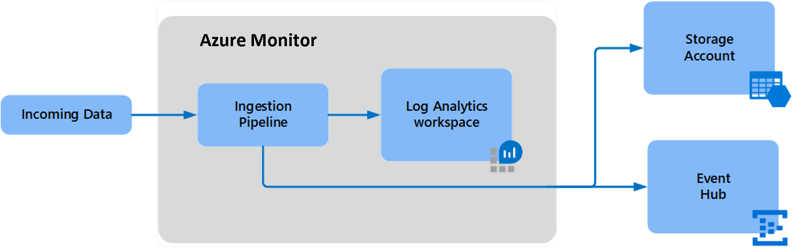
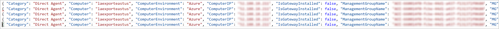
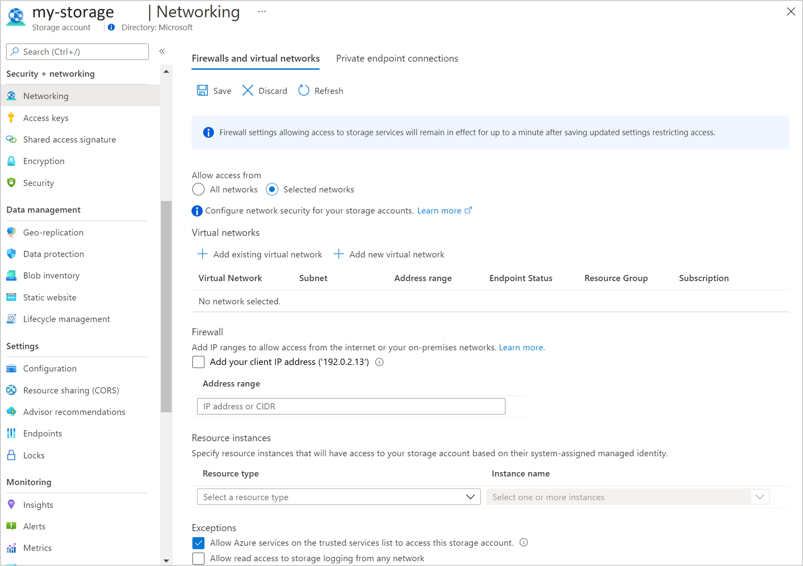
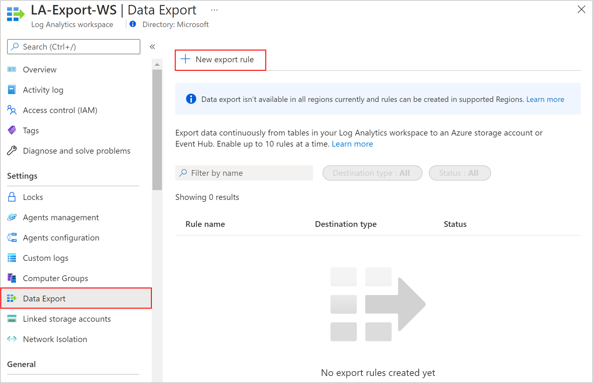
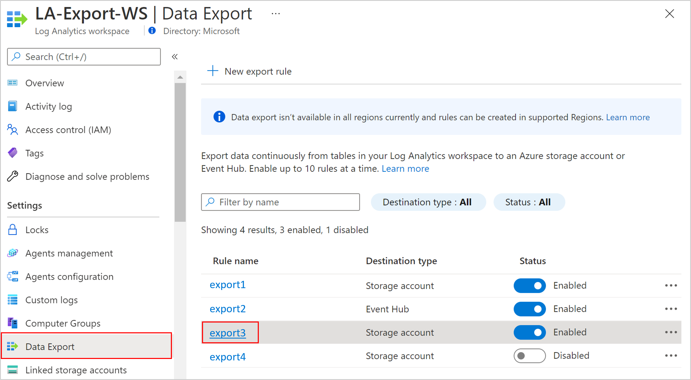
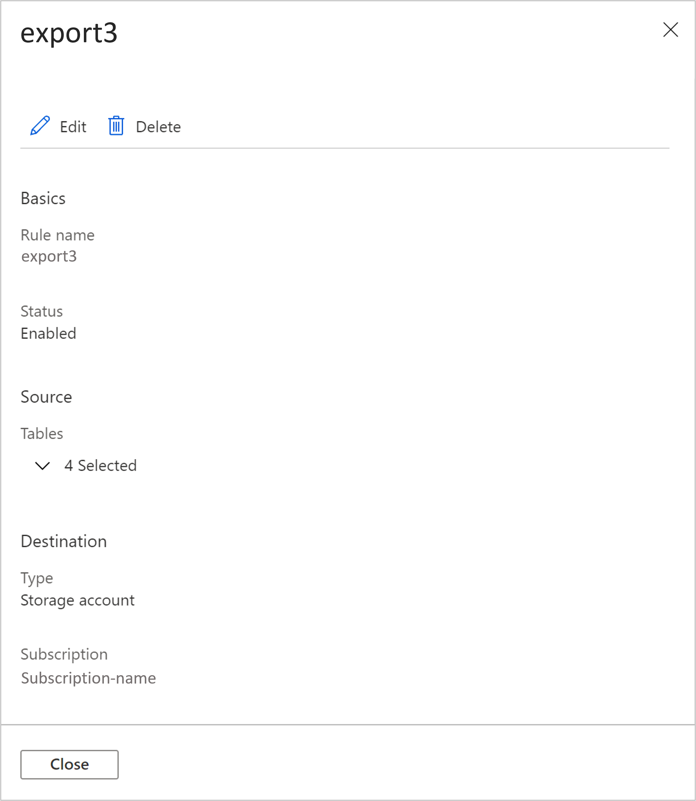
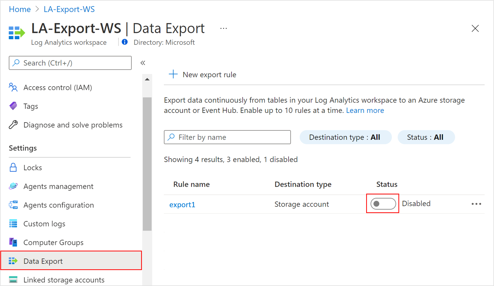
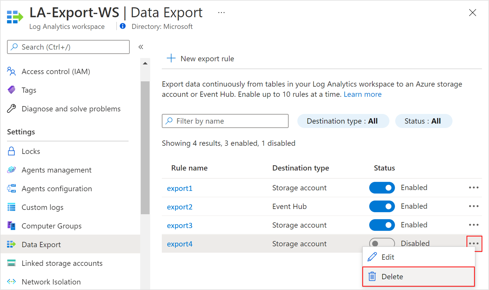
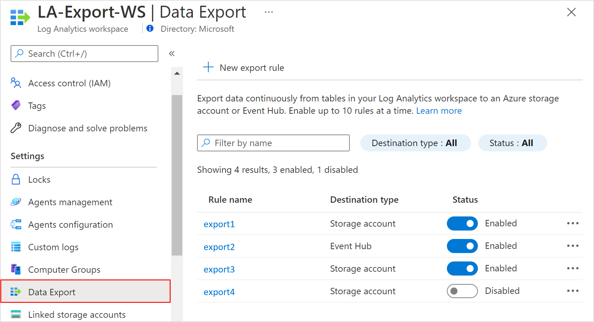

# Log Analytics workspace data export in Azure Monitor
Data export in a Log Analytics workspace lets you continuously export data per selected tables in your workspace. You can export to an Azure Storage account or Azure Event Hubs as the data arrives to an Azure Monitor pipeline. This article provides details on this feature and steps to configure data export in your workspaces.

## Overview
Data in Log Analytics is available for the retention period defined in your workspace. It's used in various experiences provided in Azure Monitor and Azure services. There are cases where you need to use other tools:

* **Tamper-protected store compliance:** Data can't be altered in Log Analytics after it's ingested, but it can be purged. Export to a storage account set with [immutability policies](../../storage/blobs/immutable-policy-configure-version-scope.md) to keep data tamper protected.
* **Integration with Azure services and other tools:** Export to event hubs as data arrives and is processed in Azure Monitor.
* **Long-term retention of audit and security data:** Export to a storage account in the workspace's region. Or you can replicate data to other regions by using any of the [Azure Storage redundancy options](../../storage/common/storage-redundancy.md#redundancy-in-a-secondary-region) including GRS and GZRS.

After you've configured data export rules in a Log Analytics workspace, new data for tables in rules is exported from the Azure Monitor pipeline to your storage account or event hubs as it arrives.

[](media/logs-data-export/data-export-overview.png#lightbox)

Data is exported without a filter. For example, when you configure a data export rule for a *SecurityEvent* table, all data sent to the *SecurityEvent* table is exported starting from the configuration time. Alternatively, you can filter or modify exported data by configuring [transformations](./../essentials/data-collection-transformations.md) in your workspace, which apply to incoming data, before it's sent to your Log Analytics workspaces and to export destinations.

## Other export options
Log Analytics workspace data export continuously exports data that's sent to your Log Analytics workspace. There are other options to export data for particular scenarios:

- Configure diagnostic settings in Azure resources. Logs are sent to a destination directly. This approach has lower latency compared to data export in Log Analytics.
- Schedule export of data based on a log query you define with the [Log Analytics query API](/rest/api/loganalytics/dataaccess/query/execute). Use Azure Data Factory, Azure Functions, or Azure Logic Apps to orchestrate queries in your workspace and export data to a destination. This method is similar to the data export feature, but you can use it to export historical data from your workspace by using filters and aggregation. This method is subject to [log query limits](../service-limits.md#log-analytics-workspaces) and isn't intended for scale. For more information, see [Export data from a Log Analytics workspace to a storage account by using Logic Apps](logs-export-logic-app.md).
- One-time export to a local machine by using a PowerShell script. For more information, see [Invoke-AzOperationalInsightsQueryExport](https://www.powershellgallery.com/packages/Invoke-AzOperationalInsightsQueryExport).

## Limitations

- Custom logs created using the [HTTP Data Collector API](./data-collector-api.md) and the dataSources API can't be exported. This includes text logs consumed by Log Analytics agent. You can export custom logs created using [data collection rules](./logs-ingestion-api-overview.md), including text-based logs.
- Data export will gradually support more tables, but is currently limited to the tables specified in the [supported tables](#supported-tables) section.
- You can define up to 10 enabled rules in your workspace, each can include multiple tables. You can create more rules in workspace in disabled state. 
- Destinations must be in the same region as the Log Analytics workspace.
- The storage account must be unique across rules in the workspace.
- Table names can be 60 characters long when you're exporting to a storage account. They can be 47 characters when you're exporting to event hubs. Tables with longer names won't be exported.
- Currently, data export isn't supported in China.

## Data completeness
Data export is optimized to move large data volumes to your destinations. The export operation might fail if the destination doesn't have sufficient capacity or is unavailable. In the event of failure, the retry process continues for up to 12 hours. For more information about destination limits and recommended alerts, see [Create or update a data export rule](#create-or-update-a-data-export-rule). If the destinations are still unavailable after the retry period, the data is discarded. In certain cases, retry can cause duplication of a fraction of the exported records.

## Pricing model
Data export charges are based on the volume of data exported measured in bytes. The size of data exported by Log Analytics Data Export is the number of bytes in the exported JSON-formatted data. Data volume is measured in GB (10^9 bytes).

For more information, including the data export billing timeline, see [Azure Monitor pricing](https://azure.microsoft.com/pricing/details/monitor/).

## Export destinations

The data export destination must be available before you create export rules in your workspace. Destinations don't have to be in the same subscription as your workspace. When you use Azure Lighthouse, it's also possible to send data to destinations in another Azure Active Directory tenant.

You need to have write permissions to both workspace and destination to configure a data export rule on any table in a workspace. The shared access policy for the Event Hubs namespace defines the permissions that the streaming mechanism has. Streaming to event hubs requires manage, send, and listen permissions. To update the export rule, you must have the ListKey permission on that event hubs authorization rule.

### Storage account

Don't use an existing storage account that has other non-monitoring data to better control access to the data and prevent reaching storage ingress rate limit, failures, and latency.

To send data to an immutable storage account, set the immutable policy for the storage account as described in [Set and manage immutability policies for Azure Blob Storage](../../storage/blobs/immutable-policy-configure-version-scope.md). You must follow all steps in this article, including enabling protected append blobs writes.

The storage account must be StorageV1 or later and in the same region as your workspace. If you need to replicate your data to other storage accounts in other regions, you can use any of the [Azure Storage redundancy options](../../storage/common/storage-redundancy.md#redundancy-in-a-secondary-region), including GRS and GZRS.

Data is sent to storage accounts as it reaches Azure Monitor and exported to destinations located in a workspace region. A container is created for each table in the storage account with the name *am-* followed by the name of the table. For example, the table *SecurityEvent* would send to a container named *am-SecurityEvent*.

Blobs are stored in 5-minute folders in the following path structure: *WorkspaceResourceId=/subscriptions/subscription-id/resourcegroups/\<resource-group\>/providers/microsoft.operationalinsights/workspaces/\<workspace\>/y=\<four-digit numeric year\>/m=\<two-digit numeric month\>/d=\<two-digit numeric day\>/h=\<two-digit 24-hour clock hour\>/m=\<two-digit 60-minute clock minute\>/PT05M.json*. Appends to blobs are limited to 50-K writes. More blobs will be added in the folder as *PT05M_#.json**, where # is the incremental blob count.

The format of blobs in a storage account is in [JSON lines](/previous-versions/azure/azure-monitor/essentials/resource-logs-blob-format), where each record is delimited by a new line, with no outer records array and no commas between JSON records.

[](media/logs-data-export/storage-data-expand.png#lightbox)

### Event hubs

Don't use an existing event hub that has non-monitoring data to prevent reaching the Event Hubs namespace ingress rate limit, failures, and latency.

Data is sent to your event hub as it reaches Azure Monitor and is exported to destinations located in a workspace region. You can create multiple export rules to the same Event Hubs namespace by providing a different `event hub name` in the rule. When an `event hub name` isn't provided, a default event hub is created for tables that you export with the name *am-* followed by the name of the table. For example, the table *SecurityEvent* would be sent to an event hub named *am-SecurityEvent*.

The [number of supported event hubs in Basic and Standard namespace tiers is 10](../../event-hubs/event-hubs-quotas.md#common-limits-for-all-tiers). When you're exporting more than 10 tables to these tiers, either split the tables between several export rules to different Event Hubs namespaces or provide an event hub name to export all tables to it.

> [!NOTE]
> - The Basic Event Hubs namespace tier is limited. It supports [lower event size](../../event-hubs/event-hubs-quotas.md#basic-vs-standard-vs-premium-vs-dedicated-tiers) and no [Auto-inflate](../../event-hubs/event-hubs-auto-inflate.md) option to automatically scale up and increase the number of throughput units. Because data volume to your workspace increases over time and as a consequence event hub scaling is required, use Standard, Premium, or Dedicated Event Hubs tiers with the **Auto-inflate** feature enabled. For more information, see [Automatically scale up Azure Event Hubs throughput units](../../event-hubs/event-hubs-auto-inflate.md).
> - Data export can't reach Event Hubs resources when virtual networks are enabled. You have to select the **Allow Azure services on the trusted services list to access this storage account** checkbox to bypass this firewall setting in an event hub to grant access to your event hubs.

## Query exported data

Exporting data from workspaces to Storage Accounts help satisfy various scenarios mentioned in [overview](#overview), and can be consumed by tools that can read blobs from Storage Accounts. The following methods let you query data using Log Analytics query language, which is the same for Azure Data Explorer.
1. Use Azure Data Explorer to [query data in Azure Data Lake](/azure/data-explorer/data-lake-query-data).
2. Use Azure Data Explorer to [ingest data from a Storage Account](/azure/data-explorer/ingest-from-container).
3. Use Log Analytics workspace to query [ingested data using Logs Ingestion API ](./logs-ingestion-api-overview.md). Ingested data is to a custom log table and not to the original table.
   

## Enable data export
The following steps must be performed to enable Log Analytics data export. For more information on each, see the following sections:

- Register the resource provider
- Allow trusted Microsoft services
- Create or update a data export rule

### Register the resource provider
The Azure resource provider **Microsoft.Insights** needs to be registered in your subscription to enable Log Analytics data export.

This resource provider is probably already registered for most Azure Monitor users. To verify, go to **Subscriptions** in the Azure portal. Select your subscription and then select **Resource providers** under the **Settings** section of the menu. Locate **Microsoft.Insights**. If its status is **Registered**, then it's already registered. If not, select **Register** to register it.

You can also use any of the available methods to register a resource provider as described in [Azure resource providers and types](../../azure-resource-manager/management/resource-providers-and-types.md). The following sample command uses the Azure CLI:

```azurecli
az provider register --namespace 'Microsoft.insights'
```

The following sample command uses PowerShell:

```PowerShell
Register-AzResourceProvider -ProviderNamespace Microsoft.insights
```

### Allow trusted Microsoft services
If you've configured your storage account to allow access from selected networks, you need to add an exception to allow Azure Monitor to write to the account. From **Firewalls and virtual networks** for your storage account, select **Allow Azure services on the trusted services list to access this storage account**.

[](media/logs-data-export/storage-account-network.png#lightbox)

### Monitor destinations

> [!IMPORTANT]
> Export destinations have limits and should be monitored to minimize throttling, failures, and latency. For more information, see [Storage account scalability](../../storage/common/scalability-targets-standard-account.md#scale-targets-for-standard-storage-accounts) and [Event Hubs namespace quotas](../../event-hubs/event-hubs-quotas.md).

#### Monitor a storage account

1. Use a separate storage account for export.
1. Configure an alert on the metric:

    | Scope | Metric namespace | Metric | Aggregation | Threshold |
    |:---|:---|:---|:---|:---|
    | storage-name | Account | Ingress | Sum | 80% of maximum ingress per alert evaluation period. For example, the limit is 60 Gbps for general-purpose v2 in West US. The alert threshold is 1676 GiB per 5-minute evaluation period. |
  
1. Alert remediation actions:
    - Use a separate storage account for export that isn't shared with non-monitoring data.
    - Azure Storage Standard accounts support higher ingress limit by request. To request an increase, contact [Azure Support](https://azure.microsoft.com/support/faq/).
    - Split tables between more storage accounts.

#### Monitor event hubs

1. Configure alerts on the [metrics](../../event-hubs/monitor-event-hubs-reference.md):
  
    | Scope | Metric namespace | Metric | Aggregation | Threshold |
    |:---|:---|:---|:---|:---|
    | namespaces-name | Event Hubs standard metrics | Incoming bytes | Sum | 80% of maximum ingress per alert evaluation period. For example, the limit is 1 MB/s per unit (TU or PU) and five units used. The threshold is 228 MiB per 5-minute evaluation period. |
    | namespaces-name | Event Hubs standard metrics | Incoming requests | Count | 80% of maximum events per alert evaluation period. For example, the limit is 1,000/s per unit (TU or PU) and five units used. The threshold is 1,200,000 per 5-minute evaluation period. |
    | namespaces-name | Event Hubs standard metrics | Quota exceeded errors | Count | Between 1% of request. For example, requests per 5 minutes is 600,000. The threshold is 6,000 per 5-minute evaluation period. |

1. Alert remediation actions:
   - Use a separate Event Hubs namespace for export that isn't shared with non-monitoring data.
   - Configure the [Auto-inflate](../../event-hubs/event-hubs-auto-inflate.md) feature to automatically scale up and increase the number of throughput units to meet usage needs.
   - Verify the increase of throughput units to accommodate data volume.
   - Split tables between more namespaces.
   - Use Premium or Dedicated tiers for higher throughput.

### Create or update a data export rule
A data export rule defines the destination and tables for which data is exported. You can create 10 rules in the **Enabled** state in your workspace. More rules are allowed in the **Disabled** state. The storage account must be unique across rules in the workspace. Multiple rules can use the same Event Hubs namespace when you're sending to separate event hubs.

> [!NOTE]
> - You can include tables that aren't yet supported in rules, but no data will be exported for them until the tables are supported.
> - Export to a storage account: A separate container is created in the storage account for each table.
> - Export to event hubs: If an event hub name isn't provided, a separate event hub is created for each table. The [number of supported event hubs in Basic and Standard namespace tiers is 10](../../event-hubs/event-hubs-quotas.md#common-limits-for-all-tiers). When you're exporting more than 10 tables to these tiers, either split the tables between several export rules to different Event Hubs namespaces or provide an event hub name in the rule to export all tables to it.

# [Azure portal](#tab/portal)

1. On the **Log Analytics workspace** menu in the Azure portal, select **Data Export** under the **Settings** section. Select **New export rule** at the top of the pane.

   [](media/logs-data-export/export-create-1.png#lightbox)

1. Follow the steps, and then select **Create**.

   

# [PowerShell](#tab/powershell)

Use the following command to create a data export rule to a storage account by using PowerShell. A separate container is created for each table.

```powershell
$storageAccountResourceId = '/subscriptions/subscription-id/resourceGroups/resource-group-name/providers/Microsoft.Storage/storageAccounts/storage-account-name'
New-AzOperationalInsightsDataExport -ResourceGroupName resourceGroupName -WorkspaceName workspaceName -DataExportName 'ruleName' -TableName 'SecurityEvent,Heartbeat' -ResourceId $storageAccountResourceId
```

Use the following command to create a data export rule to a specific event hub by using PowerShell. All tables are exported to the provided event hub name and can be filtered by the **Type** field to separate tables.

```powershell
$eventHubResourceId = '/subscriptions/subscription-id/resourceGroups/resource-group-name/providers/Microsoft.EventHub/namespaces/namespaces-name/eventhubs/eventhub-name'
New-AzOperationalInsightsDataExport -ResourceGroupName resourceGroupName -WorkspaceName workspaceName -DataExportName 'ruleName' -TableName 'SecurityEvent,Heartbeat' -ResourceId $eventHubResourceId -EventHubName EventhubName
```

Use the following command to create a data export rule to an event hub by using PowerShell. When a specific event hub name isn't provided, a separate container is created for each table, up to the [number of event hubs supported in each Event Hubs tier](../../event-hubs/event-hubs-quotas.md#common-limits-for-all-tiers). To export more tables, provide an event hub name in the rule. Or you can set another rule and export the remaining tables to another Event Hubs namespace.

```powershell
$eventHubResourceId = '/subscriptions/subscription-id/resourceGroups/resource-group-name/providers/Microsoft.EventHub/namespaces/namespaces-name'
New-AzOperationalInsightsDataExport -ResourceGroupName resourceGroupName -WorkspaceName workspaceName -DataExportName 'ruleName' -TableName 'SecurityEvent,Heartbeat' -ResourceId $eventHubResourceId
```

# [Azure CLI](#tab/azure-cli)

Use the following command to create a data export rule to a storage account by using the CLI. A separate container is created for each table.

```azurecli
$storageAccountResourceId = '/subscriptions/subscription-id/resourceGroups/resource-group-name/providers/Microsoft.Storage/storageAccounts/storage-account-name'
az monitor log-analytics workspace data-export create --resource-group resourceGroupName --workspace-name workspaceName --name ruleName --tables SecurityEvent Heartbeat --destination $storageAccountResourceId
```

Use the following command to create a data export rule to a specific event hub by using the CLI. All tables are exported to the provided event hub name and can be filtered by the **Type** field to separate tables.

```azurecli
$eventHubResourceId = '/subscriptions/subscription-id/resourceGroups/resource-group-name/providers/Microsoft.EventHub/namespaces/namespaces-name/eventhubs/eventhub-name'
az monitor log-analytics workspace data-export create --resource-group resourceGroupName --workspace-name workspaceName --name ruleName --tables SecurityEvent Heartbeat --destination $eventHubResourceId
```

Use the following command to create a data export rule to an event hub by using the CLI. When a specific event hub name isn't provided, a separate container is created for each table up to the [number of supported event hubs for your Event Hubs tier](../../event-hubs/event-hubs-quotas.md#common-limits-for-all-tiers). If you have more tables to export, provide an event hub name to export any number of tables. Or you can set another rule to export the remaining tables to another Event Hubs namespace.

```azurecli
$eventHubsNamespacesResourceId = '/subscriptions/subscription-id/resourceGroups/resource-group-name/providers/Microsoft.EventHub/namespaces/namespaces-name'
az monitor log-analytics workspace data-export create --resource-group resourceGroupName --workspace-name workspaceName --name ruleName --tables SecurityEvent Heartbeat --destination $eventHubsNamespacesResourceId
```

# [REST](#tab/rest)

Use the following request to create a data export rule to a storage account by using the REST API. A separate container is created for each table. The request should use bearer token authorization and content type application/json.

```rest
PUT https://management.azure.com/subscriptions/<subscription-id>/resourcegroups/<resource-group-name>/providers/Microsoft.operationalInsights/workspaces/<workspace-name>/dataexports/<data-export-name>?api-version=2020-08-01
```

The body of the request specifies the table's destination. The following example is a sample body for the REST request.

```json
{
    "properties": {
        "destination": {
            "resourceId": "/subscriptions/subscription-id/resourcegroups/resource-group-name/providers/Microsoft.Storage/storageAccounts/storage-account-name"
        },
        "tablenames": [
            "table1",
            "table2" 
        ],
        "enable": true
    }
}
```

The following example is a sample body for the REST request for an event hub.

```json
{
    "properties": {
        "destination": {
            "resourceId": "/subscriptions/subscription-id/resourcegroups/resource-group-name/providers/Microsoft.EventHub/namespaces/eventhub-namespaces-name"
        },
        "tablenames": [
            "table1",
            "table2"
        ],
        "enable": true
    }
}
```

The following example is a sample body for the REST request for an event hub where the event hub name is provided. In this case, all exported data is sent to it.

```json
{
    "properties": {
        "destination": {
            "resourceId": "/subscriptions/subscription-id/resourcegroups/resource-group-name/providers/Microsoft.EventHub/namespaces/eventhub-namespaces-name",
            "metaData": {
                "EventHubName": "eventhub-name"
        },
        "tablenames": [
            "table1",
            "table2"
        ],
        "enable": true
    }
  }
}
```

# [Template](#tab/json)

Use the following command to create a data export rule to a storage account by using an Azure Resource Manager template.

```
{
    "$schema": "https://schema.management.azure.com/schemas/2015-01-01/deploymentTemplate.json#",
    "contentVersion": "1.0.0.0",
    "parameters": {
        "workspaceName": {
            "defaultValue": "workspace-name",
            "type": "String"
        },
        "workspaceLocation": {
            "defaultValue": "workspace-region",
            "type": "string"
        },
        "storageAccountRuleName": {
            "defaultValue": "storage-account-rule-name",
            "type": "string"
        },
        "storageAccountResourceId": {
            "defaultValue": "/subscriptions/00000000-0000-0000-0000-000000000000/resourceGroups/resource-group-name/providers/Microsoft.Storage/storageAccounts/storage-account-name",
            "type": "String"
        }
    },
    "variables": {},
    "resources": [
        {
            "type": "microsoft.operationalinsights/workspaces",
            "apiVersion": "2020-08-01",
            "name": "[parameters('workspaceName')]",
            "location": "[parameters('workspaceLocation')]",
            "resources": [
                {
                  "type": "microsoft.operationalinsights/workspaces/dataexports",
                  "apiVersion": "2020-08-01",
                  "name": "[concat(parameters('workspaceName'), '/' , parameters('storageAccountRuleName'))]",
                  "dependsOn": [
                      "[resourceId('microsoft.operationalinsights/workspaces', parameters('workspaceName'))]"
                  ],
                  "properties": {
                      "destination": {
                          "resourceId": "[parameters('storageAccountResourceId')]"
                      },
                      "tableNames": [
                          "Heartbeat",
                          "InsightsMetrics",
                          "VMConnection",
                          "Usage"
                      ],
                      "enable": true
                  }
              }
            ]
        }
    ]
}
```

Use the following command to create a data export rule to an event hub by using a Resource Manager template. A separate event hub is created for each table.

```
{
    "$schema": "https://schema.management.azure.com/schemas/2015-01-01/deploymentTemplate.json#",
    "contentVersion": "1.0.0.0",
    "parameters": {
        "workspaceName": {
            "defaultValue": "workspace-name",
            "type": "String"
        },
        "workspaceLocation": {
            "defaultValue": "workspace-region",
            "type": "string"
        },
        "eventhubRuleName": {
            "defaultValue": "event-hub-rule-name",
            "type": "string"
        },
        "namespacesResourceId": {
            "defaultValue": "/subscriptions/00000000-0000-0000-0000-000000000000/resourceGroups/resource-group-name/providers/microsoft.eventhub/namespaces/namespaces-name",
            "type": "String"
        }
    },
    "variables": {},
    "resources": [
        {
            "type": "microsoft.operationalinsights/workspaces",
            "apiVersion": "2020-08-01",
            "name": "[parameters('workspaceName')]",
            "location": "[parameters('workspaceLocation')]",
            "resources": [
              {
                  "type": "microsoft.operationalinsights/workspaces/dataexports",
                  "apiVersion": "2020-08-01",
                  "name": "[concat(parameters('workspaceName'), '/', parameters('eventhubRuleName'))]",
                  "dependsOn": [
                      "[resourceId('microsoft.operationalinsights/workspaces', parameters('workspaceName'))]"
                  ],
                  "properties": {
                      "destination": {
                          "resourceId": "[parameters('namespacesResourceId')]"
                      },
                      "tableNames": [
                          "Usage",
                          "Heartbeat"
                      ],
                      "enable": true
                  }
              }
            ]
        }
    ]
}
```

Use the following command to create a data export rule to a specific event hub by using a Resource Manager template. All tables are exported to it.

```
{
    "$schema": "https://schema.management.azure.com/schemas/2015-01-01/deploymentTemplate.json#",
    "contentVersion": "1.0.0.0",
    "parameters": {
        "workspaceName": {
            "defaultValue": "workspace-name",
            "type": "String"
        },
        "workspaceLocation": {
            "defaultValue": "workspace-region",
            "type": "string"
        },
        "eventhubRuleName": {
            "defaultValue": "event-hub-rule-name",
            "type": "string"
        },
        "namespacesResourceId": {
            "defaultValue": "/subscriptions/00000000-0000-0000-0000-000000000000/resourceGroups/resource-group-name/providers/microsoft.eventhub/namespaces/namespaces-name",
            "type": "String"
        },
        "eventhubName": {
            "defaultValue": "event-hub-name",
            "type": "string"
        }
    },
    "variables": {},
    "resources": [
        {
            "type": "microsoft.operationalinsights/workspaces",
            "apiVersion": "2020-08-01",
            "name": "[parameters('workspaceName')]",
            "location": "[parameters('workspaceLocation')]",
            "resources": [
              {
                  "type": "microsoft.operationalinsights/workspaces/dataexports",
                  "apiVersion": "2020-08-01",
                  "name": "[concat(parameters('workspaceName'), '/', parameters('eventhubRuleName'))]",
                  "dependsOn": [
                      "[resourceId('microsoft.operationalinsights/workspaces', parameters('workspaceName'))]"
                  ],
                  "properties": {
                      "destination": {
                          "resourceId": "[parameters('namespacesResourceId')]",
                          "metaData": {
                              "eventHubName": "[parameters('eventhubName')]"
                          }
                      },
                      "tableNames": [
                          "Usage",
                          "Heartbeat"
                      ],
                      "enable": true
                  }
              }
            ]
        }
    ]
}
```

---

## View data export rule configuration

# [Azure portal](#tab/portal)

1. On the **Log Analytics workspace** menu in the Azure portal, select **Data Export** under the **Settings** section.

   [](media/logs-data-export/export-view-1.png#lightbox)

1. Select a rule for a configuration view.

   

# [PowerShell](#tab/powershell)

Use the following command to view the configuration of a data export rule by using PowerShell.

```powershell
Get-AzOperationalInsightsDataExport -ResourceGroupName resourceGroupName -WorkspaceName workspaceName -DataExportName 'ruleName'
```

# [Azure CLI](#tab/azure-cli)

Use the following command to view the configuration of a data export rule by using the CLI.

```azurecli
az monitor log-analytics workspace data-export show --resource-group resourceGroupName --workspace-name workspaceName --name ruleName
```

# [REST](#tab/rest)

Use the following request to view the configuration of a data export rule by using the REST API. The request should use bearer token authorization.

```rest
GET https://management.azure.com/subscriptions/<subscription-id>/resourcegroups/<resource-group-name>/providers/Microsoft.operationalInsights/workspaces/<workspace-name>/dataexports/<data-export-name>?api-version=2020-08-01
```

# [Template](#tab/json)

The template option doesn't apply.

---

## Disable or update an export rule

# [Azure portal](#tab/portal)

You can disable export rules to stop the export for a certain period, such as when testing is being held. On the **Log Analytics workspace** menu in the Azure portal, select **Data Export** under the **Settings** section. Select the **Status** toggle to disable or enable the export rule.

[](media/logs-data-export/export-disable.png#lightbox)

# [PowerShell](#tab/powershell)

You can disable export rules to stop the export for a certain period, such as when testing is being held. Use the following command to disable or update rule parameters by using PowerShell.

```powershell
Update-AzOperationalInsightsDataExport -ResourceGroupName resourceGroupName -WorkspaceName workspaceName -DataExportName 'ruleName' -TableName 'SecurityEvent,Heartbeat' -Enable: $false
```

# [Azure CLI](#tab/azure-cli)

You can disable export rules to stop the export for a certain period, such as when testing is being held. Use the following command to disable or update rule parameters by using the CLI.

```azurecli
az monitor log-analytics workspace data-export update --resource-group resourceGroupName --workspace-name workspaceName --name ruleName --tables SecurityEvent Heartbeat --enable false
```

# [REST](#tab/rest)

You can disable export rules to stop the export for a certain period, such as when testing is being held. Use the following command to disable or update rule parameters by using the REST API. The request should use bearer token authorization.

```rest
PUT https://management.azure.com/subscriptions/<subscription-id>/resourcegroups/<resource-group-name>/providers/Microsoft.operationalInsights/workspaces/<workspace-name>/dataexports/<data-export-name>?api-version=2020-08-01
Authorization: Bearer <token>
Content-type: application/json

{
    "properties": {
        "destination": {
            "resourceId": "/subscriptions/subscription-id/resourcegroups/resource-group-name/providers/Microsoft.Storage/storageAccounts/storage-account-name"
        },
        "tablenames": [
"table1",
    "table2" 
        ],
        "enable": false
    }
}
```

# [Template](#tab/json)

You can disable export rules to stop export when testing is performed and you don't need data sent to a destination. Set ```"enable": false``` in the template to disable a data export.

---

## Delete an export rule

# [Azure portal](#tab/portal)

On the **Log Analytics workspace** menu in the Azure portal, select **Data Export** under the **Settings** section. Select the ellipsis to the right of the rule and select **Delete**.

[](media/logs-data-export/export-delete.png#lightbox)

# [PowerShell](#tab/powershell)

Use the following command to delete a data export rule by using PowerShell.

```powershell
Remove-AzOperationalInsightsDataExport -ResourceGroupName resourceGroupName -WorkspaceName workspaceName -DataExportName 'ruleName'
```

# [Azure CLI](#tab/azure-cli)

Use the following command to delete a data export rule by using the CLI.

```azurecli
az monitor log-analytics workspace data-export delete --resource-group resourceGroupName --workspace-name workspaceName --name ruleName
```

# [REST](#tab/rest)

Use the following request to delete a data export rule by using the REST API. The request should use bearer token authorization.

```rest
DELETE https://management.azure.com/subscriptions/<subscription-id>/resourcegroups/<resource-group-name>/providers/Microsoft.operationalInsights/workspaces/<workspace-name>/dataexports/<data-export-name>?api-version=2020-08-01
```

# [Template](#tab/json)

The template option doesn't apply.

---

## View all data export rules in a workspace

# [Azure portal](#tab/portal)

On the **Log Analytics workspace** menu in the Azure portal, select **Data Export** under the **Settings** section to view all export rules in the workspace.

[](media/logs-data-export/export-view.png#lightbox)

# [PowerShell](#tab/powershell)

Use the following command to view all the data export rules in a workspace by using PowerShell.

```powershell
Get-AzOperationalInsightsDataExport -ResourceGroupName resourceGroupName -WorkspaceName workspaceName
```

# [Azure CLI](#tab/azure-cli)

Use the following command to view all data export rules in a workspace by using the CLI.

```azurecli
az monitor log-analytics workspace data-export list --resource-group resourceGroupName --workspace-name workspaceName
```

# [REST](#tab/rest)

Use the following request to view all data export rules in a workspace by using the REST API. The request should use bearer token authorization.

```rest
GET https://management.azure.com/subscriptions/<subscription-id>/resourcegroups/<resource-group-name>/providers/Microsoft.operationalInsights/workspaces/<workspace-name>/dataexports?api-version=2020-08-01
```

# [Template](#tab/json)

The template option doesn't apply.

---

## Unsupported tables
If the data export rule includes an unsupported table, the configuration will succeed, but no data will be exported for that table. If the table is later supported, then its data will be exported at that time.

## Supported tables

> [!NOTE]
> We are in a process of adding support for more tables. Please check this article regularly. 

| Table | Limitations |
|:---|:---|
| AACAudit |  |
| AACHttpRequest |  |
| AADB2CRequestLogs |  |
| AADDomainServicesAccountLogon |  |
| AADDomainServicesAccountManagement |  |
| AADDomainServicesDirectoryServiceAccess |  |
| AADDomainServicesLogonLogoff |  |
| AADDomainServicesPolicyChange |  |
| AADDomainServicesPrivilegeUse |  |
| AADManagedIdentitySignInLogs |  |
| AADNonInteractiveUserSignInLogs |  |
| AADProvisioningLogs |  |
| AADRiskyServicePrincipals |  |
| AADRiskyUsers |  |
| AADServicePrincipalRiskEvents |  |
| AADServicePrincipalSignInLogs |  |
| AADUserRiskEvents |  |
| ABSBotRequests |  |
| ACICollaborationAudit |  |
| ACRConnectedClientList |  |
| ACSAuthIncomingOperations |  |
| ACSBillingUsage |  |
| ACSCallAutomationIncomingOperations |  |
| ACSCallDiagnostics |  |
| ACSCallRecordingSummary |  |
| ACSCallSummary |  |
| ACSChatIncomingOperations |  |
| ACSEmailSendMailOperational |  |
| ACSEmailStatusUpdateOperational |  |
| ACSEmailUserEngagementOperational |  |
| ACSNetworkTraversalDiagnostics |  |
| ACSNetworkTraversalIncomingOperations |  |
| ACSRoomsIncomingOperations |  |
| ACSSMSIncomingOperations |  |
| ADAssessmentRecommendation |  |
| ADFActivityRun |  |
| ADFAirflowTaskLogs |  |
| ADFAirflowWorkerLogs |  |
| ADFPipelineRun |  |
| ADFSSignInLogs |  |
| ADFTriggerRun |  |
| ADPAudit |  |
| ADPDiagnostics |  |
| ADPRequests |  |
| ADReplicationResult |  |
| ADSecurityAssessmentRecommendation |  |
| ADTDataHistoryOperation |  |
| ADTDigitalTwinsOperation |  |
| ADTEventRoutesOperation |  |
| ADTModelsOperation |  |
| ADTQueryOperation |  |
| ADXCommand |  |
| ADXQuery |  |
| AegDataPlaneRequests |  |
| AegDeliveryFailureLogs |  |
| AegPublishFailureLogs |  |
| AEWAuditLogs |  |
| AEWComputePipelinesLogs |  |
| AgriFoodApplicationAuditLogs |  |
| AgriFoodFarmManagementLogs |  |
| AgriFoodFarmOperationLogs |  |
| AgriFoodInsightLogs |  |
| AgriFoodJobProcessedLogs |  |
| AgriFoodModelInferenceLogs |  |
| AgriFoodProviderAuthLogs |  |
| AgriFoodSatelliteLogs |  |
| AgriFoodSensorManagementLogs |  |
| AgriFoodWeatherLogs |  |
| AGSGrafanaLoginEvents |  |
| AHDSMedTechDiagnosticLogs |  |
| Alert | Partial support. Data ingestion for Zabbix alerts isn't supported. |
| AlertEvidence |  |
| AlertInfo |  |
| AmlComputeClusterEvent |  |
| AmlComputeCpuGpuUtilization |  |
| AmlComputeInstanceEvent |  |
| AmlComputeJobEvent |  |
| AmlDataSetEvent |  |
| AmlDataStoreEvent |  |
| AmlDeploymentEvent |  |
| AmlEnvironmentEvent |  |
| AmlInferencingEvent |  |
| AmlModelsEvent |  |
| AmlOnlineEndpointConsoleLog |  |
| AmlOnlineEndpointEventLog |  |
| AmlOnlineEndpointTrafficLog |  |
| AmlPipelineEvent |  |
| AmlRunEvent |  |
| AmlRunStatusChangedEvent |  |
| AMSKeyDeliveryRequests |  |
| AMSLiveEventOperations |  |
| AMSMediaAccountHealth |  |
| AMSStreamingEndpointRequests |  |
| ANFFileAccess |  |
| ApiManagementGatewayLogs |  |
| AppAvailabilityResults |  |
| AppBrowserTimings |  |
| AppCenterError |  |
| AppDependencies |  |
| AppEvents |  |
| AppExceptions |  |
| AppMetrics |  |
| AppPageViews |  |
| AppPerformanceCounters |  |
| AppPlatformIngressLogs |  |
| AppPlatformLogsforSpring |  |
| AppPlatformSystemLogs |  |
| AppRequests |  |
| AppServiceAntivirusScanAuditLogs |  |
| AppServiceAppLogs |  |
| AppServiceAuditLogs |  |
| AppServiceConsoleLogs |  |
| AppServiceEnvironmentPlatformLogs |  |
| AppServiceFileAuditLogs |  |
| AppServiceHTTPLogs |  |
| AppServiceIPSecAuditLogs |  |
| AppServicePlatformLogs |  |
| AppServiceServerlessSecurityPluginData |  |
| AppSystemEvents |  |
| AppTraces |  |
| ASCAuditLogs |  |
| ASCDeviceEvents |  |
| ASimDnsActivityLogs |  |
| ASimNetworkSessionLogs |  |
| ASimNetworkSessionLogs,ASimWebSessionLogs |  |
| ASimWebSessionLogs |  |
| ATCExpressRouteCircuitIpfix |  |
| AuditLogs |  |
| AUIEventsAudit |  |
| AUIEventsOperational |  |
| AutoscaleEvaluationsLog |  |
| AutoscaleScaleActionsLog |  |
| AVNMNetworkGroupMembershipChange |  |
| AVSSyslog |  |
| AWSCloudTrail |  |
| AWSCloudWatch |  |
| AWSGuardDuty |  |
| AWSVPCFlow |  |
| AZFWApplicationRule |  |
| AZFWApplicationRuleAggregation |  |
| AZFWDnsQuery |  |
| AZFWFatFlow |  |
| AZFWFlowTrace |  |
| AZFWIdpsSignature |  |
| AZFWInternalFqdnResolutionFailure |  |
| AZFWNatRule |  |
| AZFWNatRuleAggregation |  |
| AZFWNetworkRule |  |
| AZFWNetworkRuleAggregation |  |
| AZFWThreatIntel |  |
| AzureAssessmentRecommendation |  |
| AzureAttestationDiagnostics |  |
| AzureDevOpsAuditing |  |
| AzureLoadTestingOperation |  |
| BehaviorAnalytics |  |
| CassandraAudit |  |
| CassandraLogs |  |
| CCFApplicationLogs |  |
| CDBCassandraRequests |  |
| CDBControlPlaneRequests |  |
| CDBDataPlaneRequests |  |
| CDBGremlinRequests |  |
| CDBMongoRequests |  |
| CDBPartitionKeyRUConsumption |  |
| CDBPartitionKeyStatistics |  |
| CDBQueryRuntimeStatistics |  |
| CIEventsAudit |  |
| CIEventsOperational |  |
| CloudAppEvents |  |
| CommonSecurityLog |  |
| ComputerGroup |  |
| ConfidentialWatchlist |  |
| ConfigurationData | Partial support. Some of the data is ingested through internal services that aren't supported in export. Currently, this portion is missing in export. |
| ContainerAppConsoleLogs |  |
| ContainerAppSystemLogs |  |
| ContainerImageInventory |  |
| ContainerInventory |  |
| ContainerLog |  |
| ContainerLogV2 |  |
| ContainerNodeInventory |  |
| ContainerRegistryLoginEvents |  |
| ContainerRegistryRepositoryEvents |  |
| ContainerServiceLog |  |
| CoreAzureBackup |  |
| DatabricksAccounts |  |
| DatabricksClusters |  |
| DatabricksDBFS |  |
| DatabricksFeatureStore |  |
| DatabricksGenie |  |
| DatabricksGlobalInitScripts |  |
| DatabricksInstancePools |  |
| DatabricksJobs |  |
| DatabricksMLflowAcledArtifact |  |
| DatabricksMLflowExperiment |  |
| DatabricksNotebook |  |
| DatabricksRemoteHistoryService |  |
| DatabricksSecrets |  |
| DatabricksSQLPermissions |  |
| DatabricksSSH |  |
| DatabricksWorkspace |  |
| DevCenterDiagnosticLogs |  |
| DeviceEvents |  |
| DeviceFileCertificateInfo |  |
| DeviceFileEvents |  |
| DeviceImageLoadEvents |  |
| DeviceInfo |  |
| DeviceLogonEvents |  |
| DeviceNetworkEvents |  |
| DeviceNetworkInfo |  |
| DeviceProcessEvents |  |
| DeviceRegistryEvents |  |
| DeviceTvmSecureConfigurationAssessment |  |
| DeviceTvmSecureConfigurationAssessmentKB |  |
| DeviceTvmSoftwareInventory |  |
| DeviceTvmSoftwareVulnerabilities |  |
| DeviceTvmSoftwareVulnerabilitiesKB |  |
| DnsEvents |  |
| DnsInventory |  |
| DSMAzureBlobStorageLogs |  |
| DSMDataClassificationLogs |  |
| DSMDataLabelingLogs |  |
| DynamicEventCollection |  |
| Dynamics365Activity |  |
| DynamicSummary |  |
| EmailAttachmentInfo |  |
| EmailEvents |  |
| EmailPostDeliveryEvents |  |
| EmailUrlInfo |  |
| Event | Partial support. Data arriving from the Log Analytics agent (MMA) or Azure Monitor Agent (AMA) is fully supported in export. Data arriving via the Diagnostics extension agent is collected through storage. This path isn't supported in export. |
| ExchangeAssessmentRecommendation |  |
| ExchangeOnlineAssessmentRecommendation |  |
| FailedIngestion |  |
| FunctionAppLogs |  |
| GCPAuditLogs |  |
| HDInsightAmbariClusterAlerts |  |
| HDInsightAmbariSystemMetrics |  |
| HDInsightGatewayAuditLogs |  |
| HDInsightHadoopAndYarnLogs |  |
| HDInsightHadoopAndYarnMetrics |  |
| HDInsightHBaseLogs |  |
| HDInsightHBaseMetrics |  |
| HDInsightHiveAndLLAPLogs |  |
| HDInsightHiveAndLLAPMetrics |  |
| HDInsightHiveQueryAppStats |  |
| HDInsightHiveTezAppStats |  |
| HDInsightJupyterNotebookEvents |  |
| HDInsightKafkaLogs |  |
| HDInsightKafkaMetrics |  |
| HDInsightOozieLogs |  |
| HDInsightRangerAuditLogs |  |
| HDInsightSecurityLogs |  |
| HDInsightSparkApplicationEvents |  |
| HDInsightSparkBlockManagerEvents |  |
| HDInsightSparkEnvironmentEvents |  |
| HDInsightSparkExecutorEvents |  |
| HDInsightSparkExtraEvents |  |
| HDInsightSparkJobEvents |  |
| HDInsightSparkLogs |  |
| HDInsightSparkSQLExecutionEvents |  |
| HDInsightSparkStageEvents |  |
| HDInsightSparkStageTaskAccumulables |  |
| HDInsightSparkTaskEvents |  |
| HDInsightStormLogs |  |
| HDInsightStormMetrics |  |
| HDInsightStormTopologyMetrics |  |
| HealthStateChangeEvent |  |
| Heartbeat |  |
| HuntingBookmark |  |
| IdentityDirectoryEvents |  |
| IdentityLogonEvents |  |
| IdentityQueryEvents |  |
| InsightsMetrics | Partial support. Some of the data is ingested through internal services that aren't supported in export. Currently, this portion is missing in export. |
| IntuneAuditLogs |  |
| IntuneDevices |  |
| IntuneOperationalLogs |  |
| KubeEvents |  |
| KubeHealth |  |
| KubeMonAgentEvents |  |
| KubeNodeInventory |  |
| KubePodInventory |  |
| KubeServices |  |
| LAQueryLogs |  |
| LogicAppWorkflowRuntime |  |
| McasShadowItReporting |  |
| MCCEventLogs |  |
| MCVPAuditLogs |  |
| MCVPOperationLogs |  |
| MicrosoftAzureBastionAuditLogs |  |
| MicrosoftDataShareReceivedSnapshotLog |  |
| MicrosoftDataShareSentSnapshotLog |  |
| MicrosoftGraphActivityLogs |  |
| MicrosoftHealthcareApisAuditLogs |  |
| MicrosoftPurviewInformationProtection |  |
| NetworkAccessTraffic |  |
| NSPAccessLogs |  |
| NTAIpDetails |  |
| NTANetAnalytics |  |
| NTATopologyDetails |  |
| NWConnectionMonitorDestinationListenerResult |  |
| NWConnectionMonitorPathResult |  |
| NWConnectionMonitorTestResult |  |
| OEPAirFlowTask |  |
| OEPElasticOperator |  |
| OEPElasticsearch |  |
| OfficeActivity |  |
| OLPSupplyChainEntityOperations |  |
| OLPSupplyChainEvents |  |
| Operation | Partial support. Some of the data is ingested through internal services that aren't supported in export. Currently, this portion is missing in export. |
| Perf | Partial support. Only Windows perf data is currently supported. Currently, the Linux perf data is missing in export. |
| PFTitleAuditLogs |  |
| PowerBIActivity |  |
| PowerBIAuditTenant |  |
| PowerBIDatasetsTenant |  |
| PowerBIDatasetsWorkspace |  |
| PowerBIReportUsageWorkspace |  |
| ProjectActivity |  |
| PurviewDataSensitivityLogs |  |
| PurviewScanStatusLogs |  |
| PurviewSecurityLogs |  |
| REDConnectionEvents |  |
| ResourceManagementPublicAccessLogs |  |
| SCCMAssessmentRecommendation |  |
| SCOMAssessmentRecommendation |  |
| SecureScoreControls |  |
| SecureScores |  |
| SecurityAlert |  |
| SecurityBaseline |  |
| SecurityBaselineSummary |  |
| SecurityDetection |  |
| SecurityEvent | Partial support. Data arriving from the Log Analytics agent or Azure Monitor Agent is fully supported in export. Data arriving via the Diagnostics extension agent is collected through storage. This path isn't supported in export. |
| SecurityIncident |  |
| SecurityIoTRawEvent |  |
| SecurityNestedRecommendation |  |
| SecurityRecommendation |  |
| SecurityRegulatoryCompliance |  |
| SentinelAudit |  |
| SentinelHealth |  |
| SfBAssessmentRecommendation |  |
| SfBOnlineAssessmentRecommendation |  |
| SharePointOnlineAssessmentRecommendation |  |
| SignalRServiceDiagnosticLogs |  |
| SigninLogs |  |
| SPAssessmentRecommendation |  |
| SQLAssessmentRecommendation |  |
| SQLSecurityAuditEvents |  |
| SqlVulnerabilityAssessmentScanStatus |  |
| StorageAntimalwareScanResults |  |
| StorageCacheOperationEvents |  |
| StorageCacheUpgradeEvents |  |
| StorageCacheWarningEvents |  |
| StorageMalwareScanningResults |  |
| StorageMoverCopyLogsFailed |  |
| StorageMoverCopyLogsTransferred |  |
| StorageMoverJobRunLogs |  |
| SucceededIngestion |  |
| SynapseBigDataPoolApplicationsEnded |  |
| SynapseBuiltinSqlPoolRequestsEnded |  |
| SynapseDXFailedIngestion |  |
| SynapseDXSucceededIngestion |  |
| SynapseGatewayApiRequests |  |
| SynapseIntegrationActivityRuns |  |
| SynapseIntegrationPipelineRuns |  |
| SynapseIntegrationTriggerRuns |  |
| SynapseLinkEvent |  |
| SynapseRbacOperations |  |
| SynapseScopePoolScopeJobsEnded |  |
| SynapseScopePoolScopeJobsStateChange |  |
| SynapseSqlPoolDmsWorkers |  |
| SynapseSqlPoolExecRequests |  |
| SynapseSqlPoolRequestSteps |  |
| SynapseSqlPoolSqlRequests |  |
| SynapseSqlPoolWaits |  |
| Syslog | Partial support. Data arriving from the Log Analytics agent or Azure Monitor Agent is fully supported in export. Data arriving via the Diagnostics extension agent is collected through storage. This path isn't supported in export. |
| ThreatIntelligenceIndicator |  |
| TSIIngress |  |
| UCClient |  |
| UCDOAggregatedStatus |  |
| UCDOStatus |  |
| Update | Partial support. Some of the data is ingested through internal services that aren't supported in export. Currently, this portion is missing in export. |
| UpdateRunProgress |  |
| UpdateSummary |  |
| UrlClickEvents |  |
| Usage |  |
| UserAccessAnalytics |  |
| UserPeerAnalytics |  |
| VIAudit |  |
| VIIndexing |  |
| WaaSDeploymentStatus |  |
| WaaSInsiderStatus |  |
| WaaSUpdateStatus |  |
| W3CIISLog | Partial support. Data arriving from Log Analytics agent (MMA) or Azure Monitor Agent (AMA) is fully supported in export. Data arriving via Diagnostics extension agent is collected through storage while this path isn’t supported in export. |
| Watchlist |  |
| WebPubSubConnectivity |  |
| WebPubSubHttpRequest |  |
| WebPubSubMessaging |  |
| WindowsClientAssessmentRecommendation |  |
| WindowsEvent |  |
| WindowsFirewall |  |
| WindowsServerAssessmentRecommendation |  |
| WireData | Partial support. Some of the data is ingested through internal services that aren't supported in export. Currently, this portion is missing in export. |
| WorkloadDiagnosticLogs |  |
| WUDOAggregatedStatus |  |
| WUDOStatus |  |
| WVDAgentHealthStatus |  |
| WVDCheckpoints |  |
| WVDConnectionNetworkData |  |
| WVDConnections |  |
| WVDErrors |  |
| WVDFeeds |  |
| WVDHostRegistrations |  |
| WVDManagement |  |

## Next steps

[Query the exported data from Azure Data Explorer](../logs/azure-data-explorer-query-storage.md)
