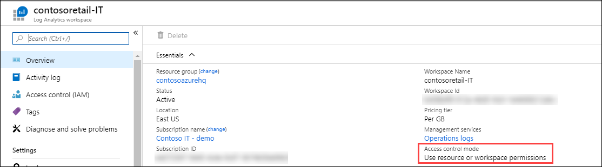
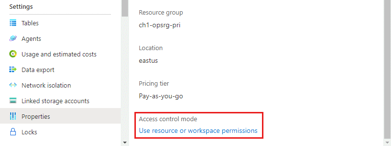

# Manage access to Log Analytics workspaces
 The data in a Log Analytics workspace that a user can access is determined by a combination of factors including settings on the workspace itself, the user's access to resources sending data to the workspace, and the method that the user accesses the workspace. This article describes how access is managed and how to perform any required configuration.

## Overview
The factors that define the data a user can access are briefly described in the following table. Each is further described in the sections below.

| Factor | Description |
|:---|:---|
| [Access mode](#access-mode) | Method the user uses to access the workspace.  Defines the scope of the data available and the access control mode that's applied. |
| [Access control mode](#access-control-mode) | Setting on the workspace that defines whether permissions are applied at the workspace or resource level. |
| [Azure RBAC](#azure-rbac) | Permissions applied to individual or groups of users for the workspace or resource sending data to the workspace. Defines what data the user will have access to. |
| [Table level Azure RBAC](#table-level-azure-rbac) | Optional permissions that defines specific data types in the workspace that a user can access. Apply to all users regardless of their access mode or access control mode.  |


## Access mode
The *access mode* refers to how a user accesses a Log Analytics workspace and defines the data they can access during the current session. The mode is determined according to the [scope](scope.md) you select in Log Analytics.

There are two access modes:

- **Workspace-context**: You can view all logs in the workspace that you have permission to. Queries in this mode are scoped to all data in all tables in the workspace. This is the access mode used when logs are accessed with the workspace as the scope, such as when you select **Logs** from the **Azure Monitor** menu in the Azure portal.

 - **Resource-context**: When you access the workspace for a particular resource, resource group, or subscription, such as when you select **Logs** from a resource menu in the Azure portal, you can view logs for only resources in all tables that you have access to. Queries in this mode are scoped to only data associated with that resource. This mode also enables granular Azure RBAC. Workspaces use a resource-context log model where every log record emitted by an Azure resource, is automatically associated with this resource. 

 
Records are only available in resource-context queries if they are associated with the relevant resource. You can check this association by running a query and verifying that the [_ResourceId](./log-standard-columns.md#_resourceid) column is populated.

There are known limitations with the following resources:

- Computers outside of Azure. Resource-context is only supported with [Azure Arc for Servers](../../azure-arc/servers/index.yml).
- Application Insights. Supported for resource-context only when using [Workspace-based Application Insights resource](../app/create-workspace-resource.md)
- Service Fabric


### Comparing access modes

The following table summarizes the access modes:

| Issue | Workspace-context | Resource-context |
|:---|:---|:---|
| Who is each model intended for? | Central administration.<br>Administrators who need to configure data collection and users who need access to a wide variety of resources. Also currently required for users who need to access logs for resources outside of Azure. | Application teams.<br>Administrators of Azure resources being monitored. Allows them to focus on their resource without filtering. |
| What does a user require to view logs? | Permissions to the workspace.<br>See **Workspace permissions** in [Manage access using workspace permissions](./manage-access.md#azure-rbac). | Read access to the resource.<br>See **Resource permissions** in [Manage access using Azure permissions](./manage-access.md#azure-rbac). Permissions can be inherited from the resource group or subscription or directly assigned to the resource. Permission to the logs for the resource will be automatically assigned. The user doesn't require access to the workspace.|
| What is the scope of permissions? | Workspace.<br>Users with access to the workspace can query all logs in the workspace from tables that they have permissions to. See [Table access control](./manage-access.md#table-level-azure-rbac) | Azure resource.<br>User can query logs for specific resources, resource groups, or subscription they have access to in any workspace but can't query logs for other resources. |
| How can user access logs? | Start **Logs** from **Azure Monitor** menu.<br><br>Start **Logs** from **Log Analytics workspaces**.<br><br>From Azure Monitor [Workbooks](../best-practices-analysis.md#workbooks). | Start **Logs** from the menu for the Azure resource. User will have access to data for that resource.<br><br>Start **Logs** from **Azure Monitor** menu. User will have access to data for all resources they have access to.<br><br>Start **Logs** from **Log Analytics workspaces**. User will have access to data for all resources they have access to.<br><br>From Azure Monitor [Workbooks](../best-practices-analysis.md#workbooks). |

## Access control mode

The *Access control mode* is a setting on each workspace that defines how permissions are determined for the workspace.

* **Require workspace permissions**. This control mode does not allow granular Azure RBAC. For a user to access the workspace, they must be [granted permissions to the workspace](#azure-rbac) or to [specific tables](#table-level-azure-rbac).

    If a user accesses the workspace in [workspace-context mode](#access-mode), they have access to all data in any table they've been granted access to. If a user accesses the workspace in [resource-context mode](#access-mode), they have access to only data for that resource in any table they've been granted access to.

    This is the default setting for all workspaces created before March 2019.

* **Use resource or workspace permissions**. This control mode allows granular Azure RBAC. Users can be granted access to only data associated with resources they can view by assigning Azure `read` permission. 

    When a user accesses the workspace in [workspace-context mode](#access-mode), workspace permissions apply. When a user accesses the workspace in [resource-context mode](#access-mode), only resource permissions are verified, and workspace permissions are ignored. Enable Azure RBAC for a user by removing them from workspace permissions and allowing their resource permissions to be recognized.

    This is the default setting for all workspaces created after March 2019.

    > [!NOTE]
    > If a user has only resource permissions to the workspace, they are only able to access the workspace using resource-context mode assuming the workspace access mode is set to **Use resource or workspace permissions**.

### Configure access control mode for a workspace


# [Azure portal](#tab/portal)

View the current workspace access control mode on the **Overview** page for the workspace in the **Log Analytics workspace** menu.



Change this setting from the **Properties** page of the workspace. Changing the setting will be disabled if you don't have permissions to configure the workspace.



# [PowerShell](#tab/powershell)

Use the following command to view the access control mode for all workspaces in the subscription:

```powershell
Get-AzResource -ResourceType Microsoft.OperationalInsights/workspaces -ExpandProperties | foreach {$_.Name + ": " + $_.Properties.features.enableLogAccessUsingOnlyResourcePermissions}
```

The output should resemble the following:

```
DefaultWorkspace38917: True
DefaultWorkspace21532: False
```

A value of `False` means the workspace is configured with *workspace-context* access mode.  A value of `True` means the workspace is configured with  *resource-context* access mode.

> [!NOTE]
> If a workspace is returned without a boolean value and is blank, this also matches the results of a `False` value.
>

Use the following script to set the access control mode for a specific workspace to *resource-context* permission:

```powershell
$WSName = "my-workspace"
$Workspace = Get-AzResource -Name $WSName -ExpandProperties
if ($Workspace.Properties.features.enableLogAccessUsingOnlyResourcePermissions -eq $null)
    { $Workspace.Properties.features | Add-Member enableLogAccessUsingOnlyResourcePermissions $true -Force }
else
    { $Workspace.Properties.features.enableLogAccessUsingOnlyResourcePermissions = $true }
Set-AzResource -ResourceId $Workspace.ResourceId -Properties $Workspace.Properties -Force
```

Use the following script to set the access control mode for all workspaces in the subscription to *resource-context* permission:

```powershell
Get-AzResource -ResourceType Microsoft.OperationalInsights/workspaces -ExpandProperties | foreach {
if ($_.Properties.features.enableLogAccessUsingOnlyResourcePermissions -eq $null)
    { $_.Properties.features | Add-Member enableLogAccessUsingOnlyResourcePermissions $true -Force }
else
    { $_.Properties.features.enableLogAccessUsingOnlyResourcePermissions = $true }
Set-AzResource -ResourceId $_.ResourceId -Properties $_.Properties -Force
}
```

# [Resource Manager](#tab/arm)

To configure the access mode in an Azure Resource Manager template, set the **enableLogAccessUsingOnlyResourcePermissions** feature flag on the workspace to one of the following values.

* **false**: Set the workspace to *workspace-context* permissions. This is the default setting if the flag isn't set.
* **true**: Set the workspace to *resource-context* permissions.

---

## Azure RBAC
Access to a workspace is managed using [Azure role-based access control (Azure RBAC)](../../role-based-access-control/role-assignments-portal.md). To grant access to the Log Analytics workspace using Azure permissions, follow the steps in [assign Azure roles to manage access to your Azure subscription resources](../../role-based-access-control/role-assignments-portal.md).
### Workspace permissions
Each workspace can have multiple accounts associated with it, and each account can have access to multiple workspaces. The following table lists the Azure permissions for different workspace actions:

|Action |Azure Permissions Needed |Notes |
|-------|-------------------------|------|
| Change the pricing tier | `Microsoft.OperationalInsights/workspaces/*/write` | 
| Creating a workspace in the Azure portal | `Microsoft.Resources/deployments/*` <br> `Microsoft.OperationalInsights/workspaces/*` |
| View workspace basic properties and enter the workspace blade in the portal | `Microsoft.OperationalInsights/workspaces/read` |
| Query logs using any interface | `Microsoft.OperationalInsights/workspaces/query/read` |
| Access all log types using queries | `Microsoft.OperationalInsights/workspaces/query/*/read` |
| Access a specific log table | `Microsoft.OperationalInsights/workspaces/query/<table_name>/read` |
| Read the workspace keys to allow sending logs to this workspace | `Microsoft.OperationalInsights/workspaces/sharedKeys/action` |
| Add and remove monitoring solutions | `Microsoft.Resources/deployments/*` <br> `Microsoft.OperationalInsights/*` <br> `Microsoft.OperationsManagement/*` <br> `Microsoft.Automation/*` <br> `Microsoft.Resources/deployments/*/write`<br><br>These permissions need to be granted at resource group or subscription level. |
| View data in the *Backup* and *Site Recovery* solution tiles | Administrator / Co-administrator<br><br>Accesses resources deployed using the classic deployment model |

### Built-in roles
Assign users to these roles to give them access at different scopes:

* Subscription - Access to all workspaces in the subscription
* Resource Group - Access to all workspace in the resource group
* Resource - Access to only the specified workspace

Create assignments at the resource level (workspace) to assure accurate access control. Use [custom roles](../../role-based-access-control/custom-roles.md) to create roles with the specific permissions needed.

> [!NOTE]
> To add and remove users to a user role, you must to have `Microsoft.Authorization/*/Delete` and `Microsoft.Authorization/*/Write` permission.


#### Log Analytics Reader
Members of the *Log Analytics Reader* role can view all monitoring data and monitoring settings, including the configuration of Azure diagnostics on all Azure resources.

Members of the *Log Analytics Reader* role can:

- View and search all monitoring data
- View monitoring settings, including viewing the configuration of Azure diagnostics on all Azure resources.

*Log Analytics Reader* includes the following Azure actions:

| Type    | Permission | Description |
| ------- | ---------- | ----------- |
| Action | `*/read`   | Ability to view all Azure resources and resource configuration.<br>Includes viewing:<br>- Virtual machine extension status<br>- Configuration of Azure diagnostics on resources<br>- All properties and settings of all resources.<br><br>For workspaces, allows full unrestricted permissions to read the workspace settings and query data. See more granular options above. |
| Action | `Microsoft.Support/*` | Ability to open support cases |
|Not Action | `Microsoft.OperationalInsights/workspaces/sharedKeys/read` | Prevents reading of workspace key required to use the data collection API and to install agents. This prevents the user from adding new resources to the workspace |
| Action | `Microsoft.OperationalInsights/workspaces/analytics/query/action` | Deprecated. |
| Action | `Microsoft.OperationalInsights/workspaces/search/action` | Deprecated. |

#### Log Analytics Contributor
Members of the *Log Analytics Contributor* role can:

- Read all monitoring data granted by the *Log Analytics Reader role*.
- Edit monitoring settings for Azure resources, including
  - Adding the VM extension to VMs
  - Configuring Azure diagnostics on all Azure resources
- Create and configure Automation accounts. Permission needs to be granted at the resource group or subscription level.
- Add and remove management solutions. Permission needs to be granted at the resource group or subscription level.
- Read storage account keys
- Configure the collection of logs from Azure Storage


> [!WARNING]
> You can use the permission to add a virtual machine extension to a virtual machine to gain full control over a virtual machine.

The Log Analytics Contributor role includes the following Azure actions:

| Permission | Description |
| ---------- | ----------- |
| `*/read`     | Ability to view all Azure resources and resource configuration.<br><br>Includes viewing:<br>- Virtual machine extension status<br>- Configuration of Azure diagnostics on resources<br>- All properties and settings of all resources.<br><br>For workspaces, allows full unrestricted permissions to read the workspace settings and query data. See more granular options above. |
| `Microsoft.Automation/automationAccounts/*` | Ability to create and configure Azure Automation accounts, including adding and editing runbooks |
| `Microsoft.ClassicCompute/virtualMachines/extensions/*` <br> `Microsoft.Compute/virtualMachines/extensions/*` | Add, update and remove virtual machine extensions, including the Microsoft Monitoring Agent extension and the OMS Agent for Linux extension |
| `Microsoft.ClassicStorage/storageAccounts/listKeys/action` <br> `Microsoft.Storage/storageAccounts/listKeys/action` | View the storage account key. Required to configure Log Analytics to read logs from Azure storage accounts |
| `Microsoft.Insights/alertRules/*` | Add, update, and remove alert rules |
| `Microsoft.Insights/diagnosticSettings/*` | Add, update, and remove diagnostics settings on Azure resources |
| `Microsoft.OperationalInsights/*` | Add, update, and remove configuration for Log Analytics workspaces. To edit workspace advanced settings, user needs `Microsoft.OperationalInsights/workspaces/write`. |
| `Microsoft.OperationsManagement/*` | Add and remove management solutions |
| `Microsoft.Resources/deployments/*` | Create and delete deployments. Required for adding and removing solutions, workspaces, and automation accounts |
| `Microsoft.Resources/subscriptions/resourcegroups/deployments/*` | Create and delete deployments. Required for adding and removing solutions, workspaces, and automation accounts |


### Resource permissions

When users query logs from a workspace using [resource-context access](#access-mode), they'll have the following permissions on the resource:

| Permission | Description |
| ---------- | ----------- |
| `Microsoft.Insights/logs/<tableName>/read`<br><br>Examples:<br>`Microsoft.Insights/logs/*/read`<br>`Microsoft.Insights/logs/Heartbeat/read` | Ability to view all log data for the resource.  |
| `Microsoft.Insights/diagnosticSettings/write` | Ability to configure diagnostics setting to allow setting up logs for this resource. |

`/read` permission is usually granted from a role that includes _\*/read or_ _\*_ permissions such as the built-in [Reader](../../role-based-access-control/built-in-roles.md#reader) and [Contributor](../../role-based-access-control/built-in-roles.md#contributor) roles. Custom roles that include specific actions or dedicated built-in roles might not include this permission.


### Custom role examples
In addition to using the built-in roles for Log Analytics workspace, you can create custom roles to assign more granular permissions. Following are some common examples.

**Grant a user access to log data from their resources.**

- Configure the workspace access control mode to **use workspace or resource permissions**
- Grant users `*/read` or `Microsoft.Insights/logs/*/read` permissions to their resources. If they are already assigned the [Log Analytics Reader](../../role-based-access-control/built-in-roles.md#reader) role on the workspace, it is sufficient.

**Grant a user access to log data from their resources and configure their resources to send logs to the workspace.**

- Configure the workspace access control mode to **use workspace or resource permissions**
- Grant users the following permissions on the workspace: `Microsoft.OperationalInsights/workspaces/read` and `Microsoft.OperationalInsights/workspaces/sharedKeys/action`. With these permissions, users cannot perform any workspace-level queries. They can only enumerate the workspace and use it as a destination for diagnostic settings or agent configuration.
- Grant users the following permissions to their resources: `Microsoft.Insights/logs/*/read` and `Microsoft.Insights/diagnosticSettings/write`. If they are already assigned the [Log Analytics Contributor](../../role-based-access-control/built-in-roles.md#contributor) role, assigned the Reader role, or granted `*/read` permissions on this resource, it is sufficient.

**Grant a user access to log data from their resources without being able to read security events and send data.**

- Configure the workspace access control mode to **use workspace or resource permissions**
- Grant users the following permissions to their resources: `Microsoft.Insights/logs/*/read`.
- Add the following NonAction to block users from reading the SecurityEvent type: `Microsoft.Insights/logs/SecurityEvent/read`. The NonAction shall be in the same custom role as the action that provides the read permission (`Microsoft.Insights/logs/*/read`). If the user inherent the read action from another role that is assigned to this resource or to the subscription or resource group, they would be able to read all log types. This is also true if they inherit `*/read`, that exist for example, with the Reader or Contributor role.

**Grant a user access to log data from their resources and read all Azure AD sign-in and read Update Management solution log data from the workspace.**

- Configure the workspace access control mode to **use workspace or resource permissions**
- Grant users the following permissions on the workspace: 
  - `Microsoft.OperationalInsights/workspaces/read` – required so the user can enumerate the workspace and open the workspace blade in the Azure portal
  - `Microsoft.OperationalInsights/workspaces/query/read` – required for every user that can execute queries
  - `Microsoft.OperationalInsights/workspaces/query/SigninLogs/read` – to be able to read Azure AD sign-in logs
  - `Microsoft.OperationalInsights/workspaces/query/Update/read` – to be able to read Update Management solution logs
  - `Microsoft.OperationalInsights/workspaces/query/UpdateRunProgress/read` – to be able to read Update Management solution logs
  - `Microsoft.OperationalInsights/workspaces/query/UpdateSummary/read` – to be able to read Update management logs
  - `Microsoft.OperationalInsights/workspaces/query/Heartbeat/read` – required to be able to use Update Management solution
  - `Microsoft.OperationalInsights/workspaces/query/ComputerGroup/read` – required to be able to use Update Management solution
- Grant users the following permissions to their resources: `*/read`, assigned to the Reader role, or `Microsoft.Insights/logs/*/read`. 

## Table level Azure RBAC
Table level Azure RBAC allows you to define more granular control to data in a Log Analytics workspace by defining specific data types that are accessible only to a specific set of users.

Implement table access control with [Azure custom roles](../../role-based-access-control/custom-roles.md) to either grant access to specific [tables](../logs/data-platform-logs.md) in the workspace. These roles are applied to workspaces with either workspace-context or resource-context [access control modes](#access-control-mode) regardless of the user's [access mode](#access-mode).

Create a [custom role](../../role-based-access-control/custom-roles.md) with the following actions to define access to a particular table.

* Include the **Actions** section of the role definition. To subtract access from the allowed **Actions**, include it in the **NotActions** section.
* Use `Microsoft.OperationalInsights/workspaces/query/*` to specify all tables.


### Examples
Following are examples of custom role actions to grant and deny access to specific tables.

**Grant access to the _Heartbeat_ and _AzureActivity_ tables.**

```
"Actions":  [
    "Microsoft.OperationalInsights/workspaces/read",
    "Microsoft.OperationalInsights/workspaces/query/read",
    "Microsoft.OperationalInsights/workspaces/query/Heartbeat/read",
    "Microsoft.OperationalInsights/workspaces/query/AzureActivity/read"
  ],
```

**Grant access to only the _SecurityBaseline_ table.**

```
"Actions":  [
    "Microsoft.OperationalInsights/workspaces/read",
    "Microsoft.OperationalInsights/workspaces/query/read",
    "Microsoft.OperationalInsights/workspaces/query/SecurityBaseline/read"
],
```


**Grant access to all tables except the _SecurityAlert_ table.**

```
"Actions":  [
    "Microsoft.OperationalInsights/workspaces/read",
    "Microsoft.OperationalInsights/workspaces/query/read",
    "Microsoft.OperationalInsights/workspaces/query/*/read"
],
"notActions":  [
    "Microsoft.OperationalInsights/workspaces/query/SecurityAlert/read"
],
```

### Custom logs

 Custom logs are tables created from data sources such as [text logs](../agents/data-sources-custom-logs.md) and [HTTP Data Collector API](data-collector-api.md). The easiest way to identify the type of log is by checking the tables listed under [Custom Logs in the log schema](./log-analytics-tutorial.md#view-table-information).

> [!NOTE]
> Tables created by the [custom logs API](../essentials/../logs/custom-logs-overview.md) does not yet support table level RBAC.

 You can't grant access to individual custom logs tables, but you can grant access to all custom logs. To create a role with access to all custom log tables, create a custom role using the following actions:

```
"Actions":  [
    "Microsoft.OperationalInsights/workspaces/read",
    "Microsoft.OperationalInsights/workspaces/query/read",
    "Microsoft.OperationalInsights/workspaces/query/Tables.Custom/read"
],
```

An alternative approach to manage access to custom logs is to assign them to an Azure resource and manage access using resource-context access control.Include the resource ID by specifying it in the [x-ms-AzureResourceId](../logs/data-collector-api.md#request-headers) header when data is ingested to Log Analytics via the [HTTP Data Collector API](../logs/data-collector-api.md). The resource ID must be valid and have access rules applied to it. After the logs are ingested, they are accessible to users with read access to the resource.

Some custom logs come from sources that are not directly associated to a specific resource. In this case, create a resource group  to manage access to these logs. The resource group does not incur any cost, but gives you a valid resource ID to control access to the custom logs. For example, if a specific firewall is sending custom logs, create a resource group called *MyFireWallLogs* and make sure that the API requests contain the resource ID of *MyFireWallLogs*. The firewall log records are then accessible only to users that were granted access to either MyFireWallLogs or those with full workspace access

### Considerations

- If a user is granted global read permission with the standard Reader or Contributor roles that include the _\*/read_ action, it will override the per-table access control and give them access to all log data.
- If a user is granted per-table access but no other permissions, they would be able to access log data from the API but not from the Azure portal. To provide access from the Azure portal, use Log Analytics Reader as its base role.
- Administrators and owners of the subscription will have access to all data types regardless of any other permission settings.
- Workspace owners are treated like any other user for per-table access control.
- Assign roles to security groups instead of individual users to reduce the number of assignments. This will also help you use existing group management tools to configure and verify access.

## Next steps

* See [Log Analytics agent overview](../agents/log-analytics-agent.md) to gather data from computers in your datacenter or other cloud environment.

* See [Collect data about Azure virtual machines](../vm/monitor-virtual-machine.md) to configure data collection from Azure VMs.
