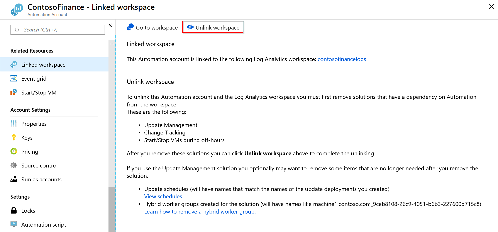
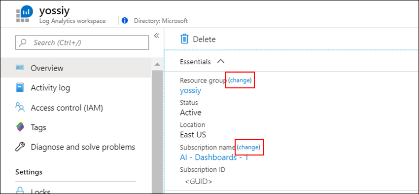

# Move a Log Analytics workspace to a different subscription or resource group

In this article, you'll learn the steps to move a Log Analytics workspace to another resource group or subscription in the same region. To learn more about how to move Azure resources through the Azure portal, PowerShell, the Azure CLI, or the REST API, see [Move resources to a new resource group or subscription](../../azure-resource-manager/management/move-resource-group-and-subscription.md).

> [!IMPORTANT]
> You can't move a workspace to a different region by using this procedure. Follow the steps in the article [Move a Log Analytics workspace to another region](./move-workspace-region.md) to move a workspace across regions.

## Verify the Azure Active Directory tenant
The workspace source and destination subscriptions must exist within the same Azure Active Directory tenant. Use Azure PowerShell to verify that both subscriptions have the same tenant ID.

```powershell
(Get-AzSubscription -SubscriptionName <your-source-subscription>).TenantId
(Get-AzSubscription -SubscriptionName <your-destination-subscription>).TenantId
```

## Workspace move considerations

Consider these points before you move a Log Analytics workspace:

- Managed solutions that are installed in the workspace will be moved in this operation.
- The move operation requires that no services can be linked to the workspace. Solutions that rely on linked services must be removed prior to the move, including an Azure Automation account. These solutions must be removed before you can unlink your Automation account. Data collection for the solutions will stop and their tables will be removed from the UI, but data will remain in the workspace per the table retention period. When you add solutions after the move, ingestion is restored and tables become visible with data. Linked services include:
  - Update management
  - Change tracking
  - Start/Stop VMs during off-hours
  - Microsoft Defender for Cloud
- Workspace keys (both primary and secondary) are regenerated with a workspace move operation. If you keep a copy of your workspace keys in Azure Key Vault, update them with the new keys generated after the workspace is moved.
- Connected [Log Analytics agents](../agents/log-analytics-agent.md) remain connected and keep sending data to the workspace after the move. [Azure Monitor Agent](../agents/azure-monitor-agent-overview.md) will be disconnected via data collection rules during the move and should be reconfigured after the move.

>[!IMPORTANT]
> **Microsoft Sentinel customers**
> - Currently, after Microsoft Sentinel is deployed on a workspace, moving the workspace to another resource group or subscription isn't supported.
> - If you've already moved the workspace, disable all active rules under **Analytics** and reenable them after five minutes. This solution should be effective in most cases, although it's unsupported and undertaken at your own risk.
> - It could take Azure Resource Manager a few hours to complete. Solutions might be unresponsive during the operation.
>
> **Re-create alerts:** All alerts must be re-created because the permissions are based on the workspace resource ID, which changes during a workspace move or resource name change. Alerts in workspaces created after June 1, 2019, or in workspaces that were [upgraded from the legacy Log Analytics Alert API to the scheduledQueryRules API](/previous-versions/azure/azure-monitor/alerts/alerts-log-api-switch) can be exported in templates and deployed after the move. You can [check if the scheduledQueryRules API is used for alerts in your workspace](/previous-versions/azure/azure-monitor/alerts/alerts-log-api-switch#check-switching-status-of-workspace). Alternatively, you can configure alerts manually in the target workspace.
>
> **Update resource paths:** After a workspace move, any Azure or external resources that point to the workspace must be reviewed and updated to point to the new resource target path.
>
>   Examples:
>   - [Azure Monitor alert rules](../alerts/alerts-resource-move.md)
>   - Third-party applications
>   - Custom scripting
>

### Delete solutions in the Azure portal
Use the following procedure to remove solutions by using the Azure portal:

1. Open the menu for the resource group where any solutions are installed.
1. Select the solutions to remove.
1. Select **Delete Resources** and then confirm the resources to be removed by selecting **Delete**.

   [](media/move-workspace/delete-solutions.png#lightbox)

### Delete by using PowerShell

To remove solutions by using PowerShell, use the [Remove-AzResource](/powershell/module/az.resources/remove-azresource) cmdlet as shown in the following example:

```powershell
Remove-AzResource -ResourceType 'Microsoft.OperationsManagement/solutions' -ResourceName "ChangeTracking(<workspace-name>)" -ResourceGroupName <resource-group-name>
Remove-AzResource -ResourceType 'Microsoft.OperationsManagement/solutions' -ResourceName "Updates(<workspace-name>)" -ResourceGroupName <resource-group-name>
Remove-AzResource -ResourceType 'Microsoft.OperationsManagement/solutions' -ResourceName "Start-Stop-VM(<workspace-name>)" -ResourceGroupName <resource-group-name>
```

### Remove alert rules for the Start/Stop VMs solution
To remove the **Start/Stop VMs** solution, you also need to remove the alert rules created by the solution. Use the following procedure in the Azure portal to remove these rules:

1. Open the **Monitor** menu and then select **Alerts**.
1. Select **Manage alert rules**.
1. Select the following three alert rules, and then select **Delete**:

   - AutoStop_VM_Child
   - ScheduledStartStop_Parent
   - SequencedStartStop_Parent

    [](media/move-workspace/delete-rules.png#lightbox)

## Unlink the Automation account
Use the following procedure to unlink the Automation account from the workspace by using the Azure portal:

1. Open the **Automation accounts** menu and then select the account to remove.
1. On the **Related Resources** section of the menu, select **Linked workspace**.
1. Select **Unlink workspace** to unlink the workspace from your Automation account.

    [](media/move-workspace/unlink-workspace.png#lightbox)

## Move your workspace

Move your workspace by using the Azure portal or PowerShell.

### Azure portal
Use the following procedure to move your workspace by using the Azure portal:

1. Open the **Log Analytics workspaces** menu and then select your workspace.
1. On the **Overview** page, select **change** next to either **Resource group** or **Subscription name**.
1. A new page opens with a list of resources related to the workspace. Select the resources to move to the same destination subscription and resource group as the workspace.
1. Select a destination **Subscription** and **Resource group**. If you're moving the workspace to another resource group in the same subscription, you won't see the **Subscription** option.
1. Select **OK** to move the workspace and selected resources.

    [](media/move-workspace/portal.png#lightbox)

### PowerShell
To move your workspace by using PowerShell, use the [Move-AzResource](/powershell/module/AzureRM.Resources/Move-AzureRmResource) cmdlet as shown in the following example:

```powershell
Move-AzResource -ResourceId "/subscriptions/00000000-0000-0000-0000-000000000000/resourceGroups/MyResourceGroup01/providers/Microsoft.OperationalInsights/workspaces/MyWorkspace" -DestinationSubscriptionId "00000000-0000-0000-0000-000000000000" -DestinationResourceGroupName "MyResourceGroup02"
```

> [!IMPORTANT]
> After the move operation, removed solutions and the Automation account link should be reconfigured to bring the workspace back to its previous state.

## Next steps
For a list of which resources support the move operation, see [Move operation support for resources](../../azure-resource-manager/management/move-support-resources.md).
