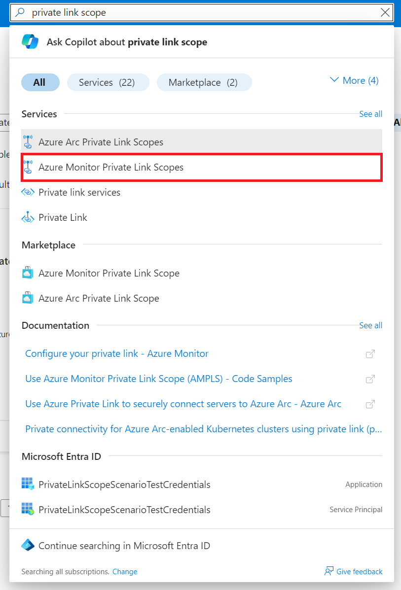
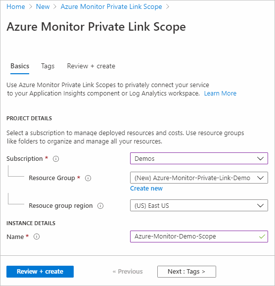
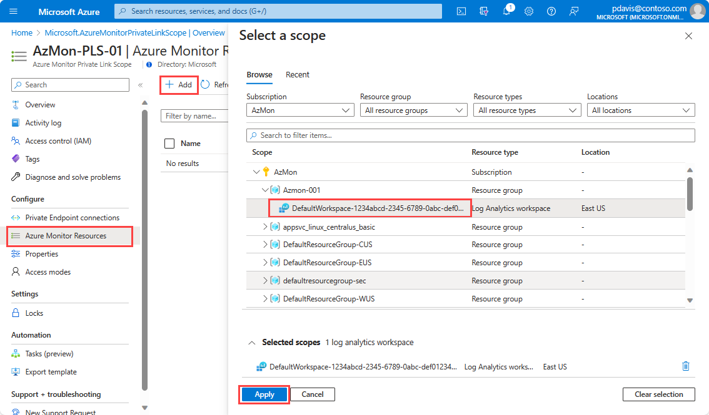
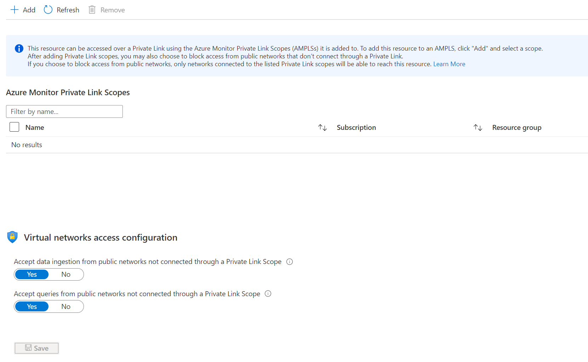
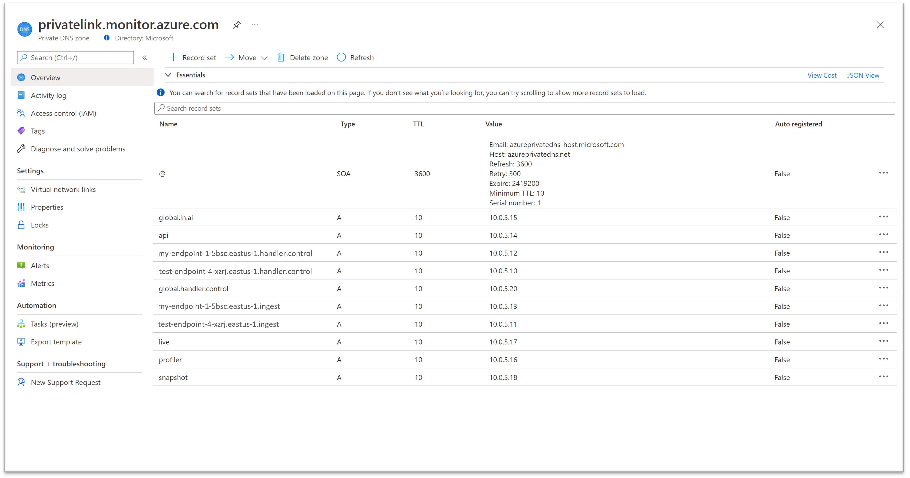
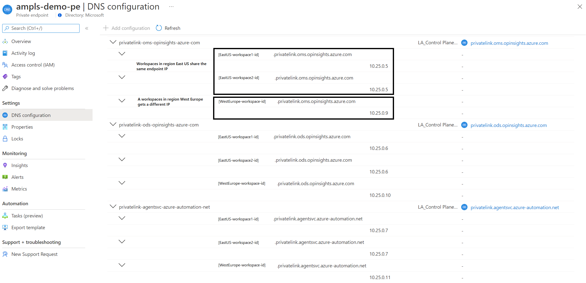

# Configure your private link
Configuring an instance of Azure Private Link requires you to:

* Create an Azure Monitor Private Link Scope (AMPLS) with resources.
* Create a private endpoint on your network and connect it to the scope.
* Configure the required access on your Azure Monitor resources.

This article reviews how configuration is done through the Azure portal. It provides an example Azure Resource Manager template (ARM template) to automate the process.

## Create a private link connection through the Azure portal
In this section, we review the step-by-step process of setting up a private link through the Azure portal. To create and manage a private link by using the command line or an ARM template, see [Use APIs and the command line](#use-apis-and-the-command-line).

### Create an Azure Monitor Private Link Scope

1. Go to **Create a resource** in the Azure portal and search for **Azure Monitor Private Link Scope**.

   

1. Select **Create**.
1. Select a subscription and resource group.
1. Give the AMPLS a name. Use a meaningful and clear name like *AppServerProdTelem*.
1. Select **Review + create**.

   

1. Let the validation pass and select **Create**.

### Connect Azure Monitor resources

Connect Azure Monitor resources like Log Analytics workspaces, Application Insights components, and [data collection endpoints](../essentials/data-collection-endpoint-overview.md)) to your AMPLS.

1. In your AMPLS, select **Azure Monitor Resources** in the menu on the left. Select **Add**.
1. Add the workspace or component. Selecting **Add** opens a dialog where you can select Azure Monitor resources. You can browse through your subscriptions and resource groups. You can also enter their names to filter down to them. Select the workspace or component and select **Apply** to add them to your scope.

    

> [!NOTE]
> Deleting Azure Monitor resources requires that you first disconnect them from any AMPLS objects they're connected to. It's not possible to delete resources connected to an AMPLS.

### Connect to a private endpoint

Now that you have resources connected to your AMPLS, create a private endpoint to connect your network. You can do this task in the [Azure portal Private Link Center](https://portal.azure.com/#blade/Microsoft_Azure_Network/PrivateLinkCenterBlade/privateendpoints) or inside your AMPLS, as done in this example.

1. In your scope resource, select **Private Endpoint connections** from the resource menu on the left. Select **Private Endpoint** to start the endpoint creation process. You can also approve connections that were started in the Private Link Center here by selecting them and selecting **Approve**.

    :::image type="content" source="./media/private-link-security/ampls-select-private-endpoint-connect-3.png" alt-text="Screenshot that shows Private Endpoint connections." lightbox="./media/private-link-security/ampls-select-private-endpoint-connect-3.png":::

1. Select the subscription, resource group, name of the endpoint, and the region it should live in. The region must be the same region as the virtual network to which you connect it.

1. Select **Next: Resource**.

1. On the **Resource** tab:
   1. Select the subscription that contains your Azure Monitor Private Link Scope resource.
   1. For **Resource type**, select **Microsoft.insights/privateLinkScopes**.
   1. From the **Resource** dropdown, select the Private Link Scope you created earlier.
   1. Select **Next: Virtual Network**.

      :::image type="content" source="./media/private-link-security/ampls-select-private-endpoint-create-4.png" alt-text="Screenshot that shows the Create a private endpoint page in the Azure portal with the Resource tab selected." lightbox="./media/private-link-security/ampls-select-private-endpoint-create-4.png":::

1. On the **Virtual Network** tab:
   1. Select the virtual network and subnet that you want to connect to your Azure Monitor resources.
   1. For **Network policy for private endpoints**, select **edit** if you want to apply network security groups or Route tables to the subnet that contains the private endpoint. In **Edit subnet network policy**, select the checkboxes next to **Network security groups** and **Route tables**. Select **Save**.
   
      For more information, see [Manage network policies for private endpoints](../../private-link/disable-private-endpoint-network-policy.md).

   1. For **Private IP configuration**, by default, **Dynamically allocate IP address** is selected. If you want to assign a static IP address, select **Statically allocate IP address**. Then enter a name and private IP.
   1. Optionally, you can select or create an **Application security group**. You can use application security groups to group virtual machines and define network security policies based on those groups.
   1. Select **Next: DNS**.
   
      :::image type="content" source="./media/private-link-security/ampls-select-private-endpoint-create-5.png" alt-text="Screenshot that shows the Create a private endpoint page in the Azure portal with the Virtual Network tab selected." lightbox="./media/private-link-security/ampls-select-private-endpoint-create-5.png":::

1. On the **DNS** tab:
   1. Select **Yes** for **Integrate with private DNS zone**, and let it automatically create a new private DNS zone. The actual DNS zones might be different from what's shown in the following screenshot.

       > [!NOTE]
       > If you select **No** and prefer to manage DNS records manually, first finish setting up your private link. Include this private endpoint and the AMPLS configuration. Then, configure your DNS according to the instructions in [Azure private endpoint DNS configuration](../../private-link/private-endpoint-dns.md). Make sure not to create empty records as preparation for your private link setup. The DNS records you create can override existing settings and affect your connectivity with Azure Monitor.
    1. Select **Review + create**.

       :::image type="content" source="./media/private-link-security/ampls-select-private-endpoint-create-6.png" alt-text="Screenshot that shows the Create a private endpoint page in the Azure portal with the DNS tab selected." lightbox="./media/private-link-security/ampls-select-private-endpoint-create-6.png":::

1. On the **Review + create** tab:
   1. Let validation pass.
   1. Select **Create**.

You've now created a new private endpoint that's connected to this AMPLS.

## Configure access to your resources
So far we've covered the configuration of your network. But you should also consider how you want to configure network access to your monitored resources like Log Analytics workspaces, Application Insights components, and [data collection endpoints](../essentials/data-collection-endpoint-overview.md).

Go to the Azure portal. On your resource's menu, find **Network Isolation** on the left side. This page controls which networks can reach the resource through a private link and whether other networks can reach it or not.



### Connected Azure Monitor Private Link Scopes
Here you can review and configure the resource's connections to an AMPLS. Connecting to an AMPLS allows traffic from the virtual network connected to each AMPLS to reach the resource. It has the same effect as connecting it from the scope as we did in the section [Connect Azure Monitor resources](#connect-azure-monitor-resources).

To add a new connection, select **Add** and select the AMPLS. Select **Apply** to connect it. Your resource can connect to five AMPLS objects, as mentioned in [Consider AMPLS limits](./private-link-design.md#consider-ampls-limits).

### Virtual networks access configuration: Manage access from outside of a Private Link Scope
The settings on the bottom part of this page control access from public networks, meaning networks not connected to the listed scopes.

If you set **Accept data ingestion from public networks not connected through a Private Link Scope** to **No**, clients like machines or SDKs outside of the connected scopes can't upload data or send logs to the resource.

If you set **Accept queries from public networks not connected through a Private Link Scope** to **No**, clients like machines or SDKs outside of the connected scopes can't query data in the resource.

That data includes access to logs, metrics, and the live metrics stream. It also includes experiences built on top such as workbooks, dashboards, query API-based client experiences, and insights in the Azure portal. Experiences running outside the Azure portal and that query Log Analytics data also have to be running within the private-linked virtual network.

## Use APIs and the command line

You can automate the process described earlier by using ARM templates, REST, and command-line interfaces.

### Create and manage Private Link Scopes
To create and manage Private Link Scopes, use the [REST API](/rest/api/monitor/privatelinkscopes(preview)/private%20link%20scoped%20resources%20(preview)) or the [Azure CLI (az monitor private-link-scope)](/cli/azure/monitor/private-link-scope).

#### Create an AMPLS with Open access modes: CLI example
The following CLI command creates a new AMPLS resource named `"my-scope"`, with both query and ingestion access modes set to `Open`.

```
az resource create -g "my-resource-group" --name "my-scope" --api-version "2021-07-01-preview" --resource-type Microsoft.Insights/privateLinkScopes --properties "{\"accessModeSettings\":{\"queryAccessMode\":\"Open\", \"ingestionAccessMode\":\"Open\"}}"
```

#### Create an AMPLS with mixed access modes: PowerShell example
The following PowerShell script creates a new AMPLS resource named `"my-scope"`, with the query access mode set to `Open` but the ingestion access modes set to `PrivateOnly`. This setting means it will allow ingestion only to resources in the AMPLS.

```
# scope details
$scopeSubscriptionId = "ab1800bd-ceac-48cd-...-..."
$scopeResourceGroup = "my-resource-group"
$scopeName = "my-scope"
$scopeProperties = @{
    accessModeSettings = @{
        queryAccessMode     = "Open"; 
        ingestionAccessMode = "PrivateOnly"
    } 
}

# login
Connect-AzAccount

# select subscription
Select-AzSubscription -SubscriptionId $scopeSubscriptionId

# create private link scope resource
$scope = New-AzResource -Location "Global" -Properties $scopeProperties -ResourceName $scopeName -ResourceType "Microsoft.Insights/privateLinkScopes" -ResourceGroupName $scopeResourceGroup -ApiVersion "2021-07-01-preview" -Force
```

#### Create an AMPLS: ARM template
The following ARM template creates:

* An AMPLS named `"my-scope"`, with query and ingestion access modes set to `Open`.
* A Log Analytics workspace named `"my-workspace"`.
* And adds a scoped resource to the `"my-scope"` AMPLS named `"my-workspace-connection"`.

> [!NOTE]
> Make sure you use a new API version (2021-07-01-preview or later) for the creation of the AMPLS object (type `microsoft.insights/privatelinkscopes` as follows). The ARM template documented in the past used an old API version, which results in an AMPLS set with `QueryAccessMode="Open"` and `IngestionAccessMode="PrivateOnly"`.

```
{
    "$schema": https://schema.management.azure.com/schemas/2019-04-01/deploymentTemplate.json#,
    "contentVersion": "1.0.0.0",
    "parameters": {
        "private_link_scope_name": {
            "defaultValue": "my-scope",
            "type": "String"
        },
        "workspace_name": {
            "defaultValue": "my-workspace",
            "type": "String"
        }
    },
    "variables": {},
    "resources": [
        {
            "type": "microsoft.insights/privatelinkscopes",
            "apiVersion": "2021-07-01-preview",
            "name": "[parameters('private_link_scope_name')]",
            "location": "global",
            "properties": {
                "accessModeSettings":{
                    "queryAccessMode":"Open",
                    "ingestionAccessMode":"Open"
                }
            }
        },
        {
            "type": "microsoft.operationalinsights/workspaces",
            "apiVersion": "2020-10-01",
            "name": "[parameters('workspace_name')]",
            "location": "westeurope",
            "properties": {
                "sku": {
                    "name": "pergb2018"
                },
                "publicNetworkAccessForIngestion": "Enabled",
                "publicNetworkAccessForQuery": "Enabled"
            }
        },
        {
            "type": "microsoft.insights/privatelinkscopes/scopedresources",
            "apiVersion": "2019-10-17-preview",
            "name": "[concat(parameters('private_link_scope_name'), '/', concat(parameters('workspace_name'), '-connection'))]",
            "dependsOn": [
                "[resourceId('microsoft.insights/privatelinkscopes', parameters('private_link_scope_name'))]",
                "[resourceId('microsoft.operationalinsights/workspaces', parameters('workspace_name'))]"
            ],
            "properties": {
                "linkedResourceId": "[resourceId('microsoft.operationalinsights/workspaces', parameters('workspace_name'))]"
            }
        }
    ]
}
```

### Set AMPLS access modes: PowerShell example
To set the access mode flags on your AMPLS, you can use the following PowerShell script. The following script sets the flags to `Open`. To use the Private Only mode, use the value `"PrivateOnly"`.

Allow about 10 minutes for the AMPLS access modes update to take effect.

```
# scope details
$scopeSubscriptionId = "ab1800bd-ceac-48cd-...-..."
$scopeResourceGroup = "my-resource-group-name"
$scopeName = "my-scope"

# login
Connect-AzAccount

# select subscription
Select-AzSubscription -SubscriptionId $scopeSubscriptionId

# get private link scope resource
$scope = Get-AzResource -ResourceType Microsoft.Insights/privateLinkScopes -ResourceGroupName $scopeResourceGroup -ResourceName $scopeName -ApiVersion "2021-07-01-preview"

# set access mode settings
$scope.Properties.AccessModeSettings.QueryAccessMode = "Open";
$scope.Properties.AccessModeSettings.IngestionAccessMode = "Open";
$scope | Set-AzResource -Force
```

### Set resource access flags
To manage the workspace or component access flags, use the flags `[--ingestion-access {Disabled, Enabled}]` and `[--query-access {Disabled, Enabled}]`on [az monitor log-analytics workspace](/cli/azure/monitor/log-analytics/workspace) or [az monitor app-insights component](/cli/azure/monitor/app-insights/component).

## Review and validate your private link setup

Follow the steps in this section to review and validate your private link setup.

### Review your endpoint's DNS settings
The private endpoint you created should now have five DNS zones configured:

* `privatelink-monitor-azure-com`
* `privatelink-oms-opinsights-azure-com`
* `privatelink-ods-opinsights-azure-com`
* `privatelink-agentsvc-azure-automation-net`
* `privatelink-blob-core-windows-net`

Each of these zones maps specific Azure Monitor endpoints to private IPs from the virtual network's pool of IPs. The IP addresses shown in the following images are only examples. Your configuration should instead show private IPs from your own network.

> [!IMPORTANT]
> AMPLS and private endpoint resources created starting December 1, 2021, use a mechanism called Endpoint Compression. Now resource-specific endpoints, such as the OMS, ODS, and AgentSVC endpoints, share the same IP address, per region and per DNS zone. This mechanism means fewer IPs are taken from the virtual network's IP pool, and many more resources can be added to the AMPLS.

#### Privatelink-monitor-azure-com
This zone covers the global endpoints used by Azure Monitor, which means endpoints serve requests globally/regionally and not resource-specific requests. This zone should have endpoints mapped for:

* **in.ai**: Application Insights ingestion endpoint (both a global and a regional entry).
* **api**: Application Insights and Log Analytics API endpoint.
* **live**: Application Insights live metrics endpoint.
* **profiler**: Application Insights profiler endpoint.
* **snapshot**: Application Insights snapshot endpoint.
* **diagservices-query**: Application Insights Profiler and Snapshot Debugger (used when accessing profiler/debugger results in the Azure portal).

This zone also covers the resource-specific endpoints for [data collection endpoints (DCEs)](../essentials/data-collection-endpoint-overview.md):

* `<unique-dce-identifier>.<regionname>.handler.control`: Private configuration endpoint, part of a DCE resource.
* `<unique-dce-identifier>.<regionname>.ingest`: Private ingestion endpoint, part of a DCE resource.

[](./media/private-link-security/dns-zone-privatelink-monitor-azure-com-expanded-with-endpoint.png#lightbox)

#### Log Analytics endpoints
> [!IMPORTANT]
> AMPLSs and private endpoints created starting December 1, 2021, use a mechanism called Endpoint Compression. Now each resource-specific endpoint, such as OMS, ODS, and AgentSVC, uses a single IP address, per region and per DNS zone, for all workspaces in that region. This mechanism means fewer IPs are taken from the virtual network's IP pool, and many more resources can be added to the AMPLS.

Log Analytics uses four DNS zones:

* **privatelink-oms-opinsights-azure-com**: Covers workspace-specific mapping to OMS endpoints. You should see an entry for each workspace linked to the AMPLS connected with this private endpoint.
* **privatelink-ods-opinsights-azure-com**: Covers workspace-specific mapping to ODS endpoints, which are the ingestion endpoints of Log Analytics. You should see an entry for each workspace linked to the AMPLS connected with this private endpoint.
* **privatelink-agentsvc-azure-automation-net**: Covers workspace-specific mapping to the agent service automation endpoints. You should see an entry for each workspace linked to the AMPLS connected with this private endpoint.
* **privatelink-blob-core-windows-net**: Configures connectivity to the global agents' solution packs storage account. Through it, agents can download new or updated solution packs, which are also known as management packs. Only one entry is required to handle all Log Analytics agents, no matter how many workspaces are used. This entry is only added to private link setups created at or after April 19, 2021 (or starting June 2021 on Azure sovereign clouds).

The following screenshot shows endpoints mapped for an AMPLS with two workspaces in East US and one workspace in West Europe. Notice the East US workspaces share the IP addresses. The West Europe workspace endpoint is mapped to a different IP address. The blob endpoint doesn't appear in this image but it's configured.

[](./media/private-link-security/dns-zone-privatelink-compressed-endpoints.png#lightbox)

### Validate that you're communicating over a private link

Make sure that your private link is in good working order:

* To validate that your requests are now sent through the private endpoint, you can review them with a network tracking tool or even your browser. For example, when you attempt to query your workspace or application, make sure the request is sent to the private IP mapped to the API endpoint. In this example, it's *172.17.0.9*.

  > [!Note]
  > Some browsers might use other DNS settings. For more information, see [Browser DNS settings](./private-link-design.md#browser-dns-settings). Make sure your DNS settings apply.

* To make sure your workspaces or components aren't receiving requests from public networks (not connected through AMPLS), set the resource's public ingestion and query flags to **No** as explained in [Configure access to your resources](#configure-access-to-your-resources).
* From a client on your protected network, use `nslookup` to any of the endpoints listed in your DNS zones. It should be resolved by your DNS server to the mapped private IPs instead of the public IPs used by default.

## Next steps

- Learn about [private storage](private-storage.md) for custom logs and customer-managed keys.
- Learn about [Private Link for Azure Automation](../../automation/how-to/private-link-security.md).
- Learn about the new [data collection endpoints](../essentials/data-collection-endpoint-overview.md).
