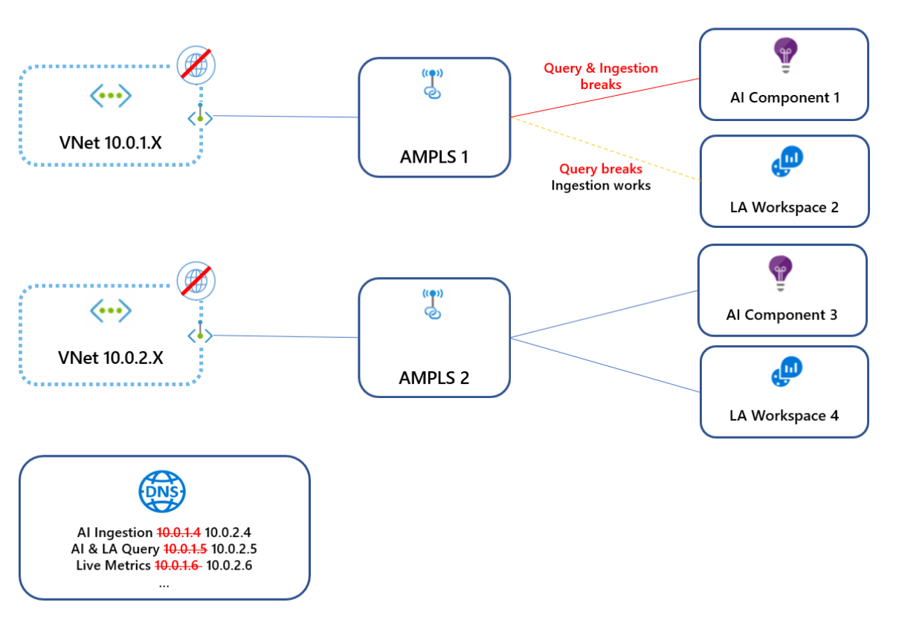
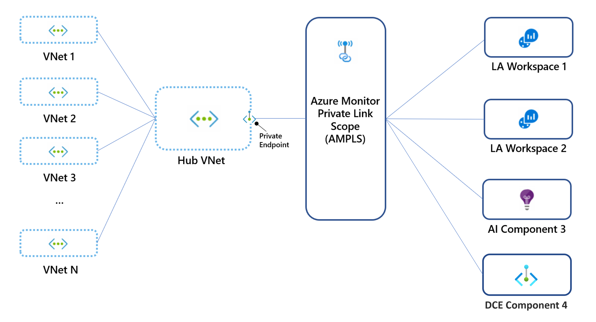
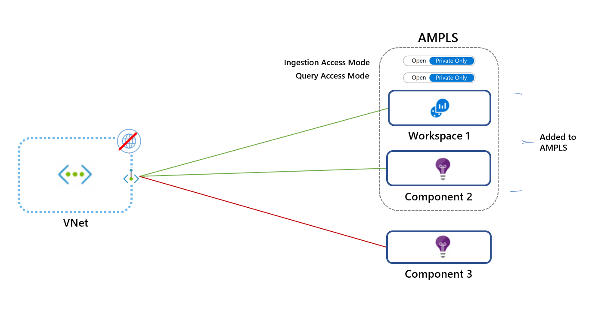
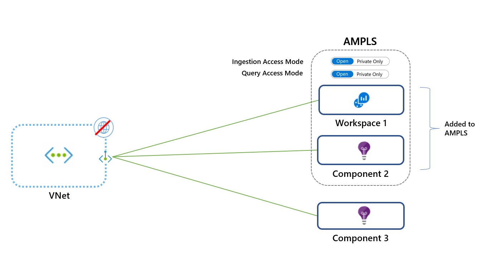
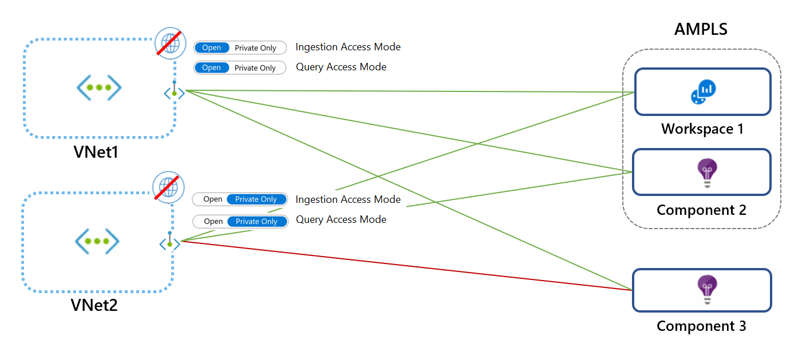
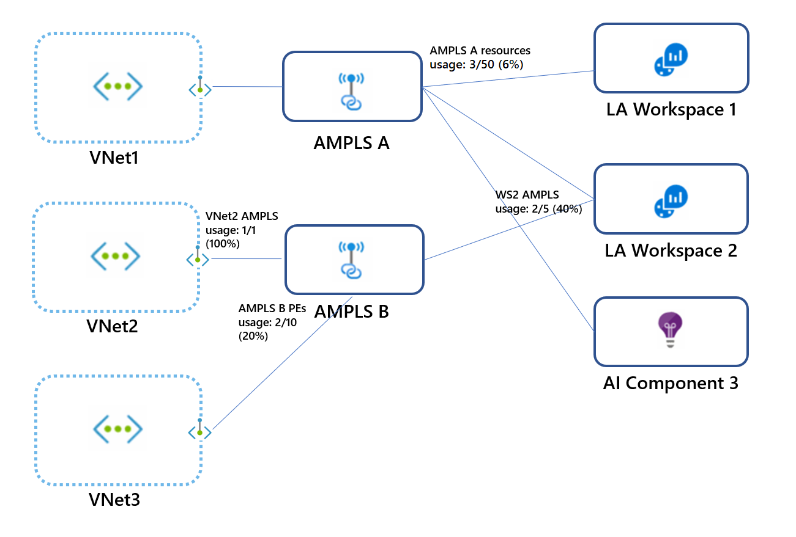

# Design your Azure Private Link setup

Before you set up your instance of Azure Private Link, consider your network topology and your DNS routing topology.

As discussed in [Use Azure Private Link to connect networks to Azure Monitor](private-link-security.md), setting up a private link affects traffic to all Azure Monitor resources. That's especially true for Application Insights resources. It also affects not only the network connected to the private endpoint but also all other networks that share the same DNS.

The simplest and most secure approach:
1. Create a single private link connection, with a single private endpoint and a single Azure Monitor Private Link Scope (AMPLS). If your networks are peered, create the private link connection on the shared (or hub) virtual network.
1. Add *all* Azure Monitor resources like Application Insights components, Log Analytics workspaces, and [data collection endpoints](../essentials/data-collection-endpoint-overview.md) to the AMPLS.
1. Block network egress traffic as much as possible.

If you can't add all Azure Monitor resources to your AMPLS, you can still apply your private link to some resources, as explained in [Control how private links apply to your networks](./private-link-design.md#control-how-private-links-apply-to-your-networks). We don't recommend this approach because it doesn't prevent data exfiltration.

## Plan by network topology

Consider network topology in your planning process.

### Guiding principle: Avoid DNS overrides by using a single AMPLS
Some networks are composed of multiple virtual networks or other connected networks. If these networks share the same DNS, setting up a private link on any of them would update the DNS and affect traffic across all networks.

In the following diagram, virtual network 10.0.1.x connects to AMPLS1, which creates DNS entries that map Azure Monitor endpoints to IPs from range 10.0.1.x. Later, virtual network 10.0.2.x connects to AMPLS2, which overrides the same DNS entries by mapping *the same global/regional endpoints* to IPs from the range 10.0.2.x. Because these virtual networks aren't peered, the first virtual network now fails to reach these endpoints.

To avoid this conflict, create only a single AMPLS object per DNS.



### Hub-and-spoke networks
Hub-and-spoke networks should use a single private link connection set on the hub (main) network, and not on each spoke virtual network.



> [!NOTE]
> You might prefer to create separate private links for your spoke virtual networks, for example, to allow each virtual network to access a limited set of monitoring resources. In such cases, you can create a dedicated private endpoint and AMPLS for each virtual network. *You must also verify they don't share the same DNS zones to avoid DNS overrides*.

### Peered networks
Network peering is used in various topologies, other than hub and spoke. Such networks can share each other's IP addresses, and most likely share the same DNS. In such cases, create a single private link on a network that's accessible to your other networks. Avoid creating multiple private endpoints and AMPLS objects because ultimately only the last one set in the DNS applies.

### Isolated networks
If your networks aren't peered, *you must also separate their DNS to use private links*. After that's done, create a separate private endpoint for each network, and a separate AMPLS object. Your AMPLS objects can link to the same workspaces/components or to different ones.

### Testing locally: Edit your machine's hosts file instead of the DNS
To test private links locally without affecting other clients on your network, make sure not to update your DNS when you create your private endpoint. Instead, edit the hosts file on your machine so that it will send requests to the private link endpoints:

* Set up a private link, but when you connect to a private endpoint, choose *not* to auto-integrate with the DNS (step 5b).
* Configure the relevant endpoints on your machines' hosts files. To review the Azure Monitor endpoints that need mapping, see [Review your endpoint's DNS settings](./private-link-configure.md#review-your-endpoints-dns-settings).

We don't recommend that approach for production environments.

## Control how private links apply to your networks
By using private link access modes, you can control how private links affect your network traffic. These settings can apply to your AMPLS object (to affect all connected networks) or to specific networks connected to it.

Choosing the proper access mode is critical to ensuring continuous, uninterrupted network traffic. Each of these modes can be set for ingestion and queries, separately:

* **Private Only**: Allows the virtual network to reach only private link resources (resources in the AMPLS). That's the most secure mode of work. It prevents data exfiltration by blocking traffic out of the AMPLS to Azure Monitor resources.

* **Open**: Allows the virtual network to reach both private link resources and resources not in the AMPLS (if they [accept traffic from public networks](./private-link-design.md#control-network-access-to-your-resources)). The Open access mode doesn't prevent data exfiltration, but it still offers the other benefits of private links. Traffic to private link resources is sent through private endpoints, validated, and sent over the Microsoft backbone. The Open mode is useful for a mixed mode of work (accessing some resources publicly and others over a private link) or during a gradual onboarding process.

Access modes are set separately for ingestion and queries. For example, you can set the Private Only mode for ingestion and the Open mode for queries.

Apply caution when you select your access mode. Using the Private Only access mode will block traffic to resources not in the AMPLS across all networks that share the same DNS, regardless of subscription or tenant. The exception is Log Analytics ingestion requests, which is explained. If you can't add all Azure Monitor resources to the AMPLS, start by adding select resources and applying the Open access mode. Switch to the Private Only mode for maximum security *only after you've added all Azure Monitor resources to your AMPLS*.

For configuration details and examples, see [Use APIs and the command line](./private-link-configure.md#use-apis-and-the-command-line).

> [!NOTE]
> Log Analytics ingestion uses resource-specific endpoints. As such, it doesn't adhere to AMPLS access modes. To assure Log Analytics ingestion requests can't access workspaces out of the AMPLS, set the network firewall to block traffic to public endpoints, regardless of the AMPLS access modes.

### Set access modes for specific networks
The access modes set on the AMPLS resource affect all networks, but you can override these settings for specific networks.

In the following diagram, VNet1 uses the Open mode and VNet2 uses the Private Only mode. Requests from VNet1 can reach Workspace 1 and Component 2 over a private link. Requests can reach Component 3 only if it [accepts traffic from public networks](./private-link-design.md#control-network-access-to-your-resources). VNet2 requests can't reach Component 3.


## Consider AMPLS limits
The AMPLS object has the following limits:
* A virtual network can connect to only *one* AMPLS object. That means the AMPLS object must provide access to all the Azure Monitor resources to which the virtual network should have access.
* An AMPLS object can connect to 300 Log Analytics workspaces and 1,000 Application Insights components at most.
* An Azure Monitor resource (workspace or Application Insights component or [data collection endpoint](../essentials/data-collection-endpoint-overview.md)) can connect to five AMPLSs at most.
* An AMPLS object can connect to 10 private endpoints at most.

> [!NOTE]
> AMPLS resources created before December 1, 2021, support only 50 resources.

In the following diagram:
* Each virtual network connects to only *one* AMPLS object.
* AMPLS A connects to two workspaces and one Application Insight component by using two of the possible 300 Log Analytics workspaces and one of the possible 1,000 Application Insights components it can connect to.
* Workspace 2 connects to AMPLS A and AMPLS B by using two of the five possible AMPLS connections.
* AMPLS B is connected to private endpoints of two virtual networks (VNet2 and VNet3) by using two of the 10 possible private endpoint connections.



## Control network access to your resources
Your Log Analytics workspaces or Application Insights components can be set to:
* Accept or block ingestion from public networks (networks not connected to the resource AMPLS).
* Accept or block queries from public networks (networks not connected to the resource AMPLS).

That granularity allows you to set access according to your needs, per workspace. For example, you might accept ingestion only through private link-connected networks (meaning specific virtual networks) but still choose to accept queries from all networks, public and private.

Blocking queries from public networks means clients like machines and SDKs outside of the connected AMPLSs can't query data in the resource. That data includes logs, metrics, and the live metrics stream. Blocking queries from public networks affects all experiences that run these queries, such as workbooks, dashboards, insights in the Azure portal, and queries run from outside the Azure portal.

Your [data collection endpoints](../essentials/data-collection-endpoint-overview.md) can be set to accept or block access from public networks (networks not connected to the resource AMPLS).

For configuration information, see [Set resource access flags](./private-link-configure.md#set-resource-access-flags).

### Exceptions

Note the following exceptions.

#### Diagnostic logs
Logs and metrics uploaded to a workspace via [diagnostic settings](../essentials/diagnostic-settings.md) go over a secure private Microsoft channel and aren't controlled by these settings.

#### Custom metrics or Azure Monitor guest metrics
[Custom metrics (preview)](../essentials/metrics-custom-overview.md) collected and uploaded via Azure Monitor Agent aren't controlled by data collection endpoints. They can't be configured over private links.

#### Azure Resource Manager
Restricting access as previously explained applies to data in the resource. However, configuration changes like turning these access settings on or off are managed by Azure Resource Manager. To control these settings, restrict access to resources by using the appropriate roles, permissions, network controls, and auditing. For more information, see [Azure Monitor roles, permissions, and security](../roles-permissions-security.md).

> [!NOTE]
> Queries sent through the Resource Manager API can't use Azure Monitor private links. These queries can only go through if the target resource allows queries from public networks (set through the **Network Isolation** pane or [by using the CLI](./private-link-configure.md#set-resource-access-flags)).
>
> The following experiences are known to run queries through the Resource Manager API:
> * LogicApp connector
> * Update Management solution
> * Change Tracking solution
> * VM Insights
> * Container Insights
> * Log Analytics **Workspace Summary (deprecated)** pane (that shows the solutions dashboard)

## Application Insights considerations
* You'll need to add resources hosting the monitored workloads to a private link. For example, see [Using private endpoints for Azure Web App](../../app-service/networking/private-endpoint.md).
* Non-portal consumption experiences must also run on the private-linked virtual network that includes the monitored workloads.
* To support private links for the Profiler and Debugger, you'll need to [provide your own storage account](../app/profiler-bring-your-own-storage.md).

> [!NOTE]
> To fully secure workspace-based Application Insights, you need to lock down access to the Application Insights resource and the underlying Log Analytics workspace.

## Log Analytics considerations

Note the following Log Analytics considerations.

### Log Analytics solution packs download
Log Analytics agents need to access a global storage account to download solution packs. Private link setups created at or after April 19, 2021 (or starting June 2021 on Azure sovereign clouds) can reach the agents' solution packs storage over the private link. This capability is made possible through a DNS zone created for `blob.core.windows.net`.

If your private link setup was created before April 19, 2021, it won't reach the solution packs storage over a private link. To handle that, you can either:
* Re-create your AMPLS and the private endpoint connected to it.
* Allow your agents to reach the storage account through its public endpoint by adding the following rules to your firewall allowlist:

    | Cloud environment | Agent resource | Ports | Direction |
    |:--|:--|:--|:--|
    |Azure Public     | scadvisorcontent.blob.core.windows.net         | 443 | Outbound
    |Azure Government | usbn1oicore.blob.core.usgovcloudapi.net | 443 |  Outbound
    |Microsoft Azure operated by 21Vianet      | mceast2oicore.blob.core.chinacloudapi.cn| 443 | Outbound

### Collect custom logs and IIS log over a private link
Storage accounts are used in the ingestion process of custom logs. By default, service-managed storage accounts are used. To ingest custom logs on private links, you must use your own storage accounts and associate them with Log Analytics workspaces.

For more information on how to connect your own storage account, see [Customer-owned storage accounts for log ingestion](private-storage.md) and specifically [Use private links](private-storage.md#private-links) and [Link storage accounts to your Log Analytics workspace](private-storage.md#link-storage-accounts-to-your-log-analytics-workspace).

### Automation
If you use Log Analytics solutions that require an Azure Automation account (such as Update Management, Change Tracking, or Inventory), you should also create a private link for your Automation account. For more information, see [Use Azure Private Link to securely connect networks to Azure Automation](../../automation/how-to/private-link-security.md).

> [!NOTE]
> Some products and Azure portal experiences query data through Resource Manager. In this case, they won't be able to query data over a private link unless private link settings are applied to Resource Manager too. To overcome this restriction, you can configure your resources to accept queries from public networks as explained in [Controlling network access to your resources](./private-link-design.md#control-network-access-to-your-resources). (Ingestion can remain limited to private link networks.)
We've identified the following products and experiences query workspaces through Resource Manager:
> * LogicApp connector
> * Update Management solution
> * Change Tracking solution
> * The **Workspace Summary (deprecated)** pane in the portal (that shows the solutions dashboard)
> * VM Insights
> * Container Insights

## Managed Prometheus considerations
* Private Link ingestion settings are made using AMPLS and settings on the Data Collection Endpoints (DCEs) that reference the Azure Monitor workspace used to store your Prometheus metrics.
* Private Link query settings are made directly on the Azure Monitor workspace used to store your Prometheus metrics and aren't handled via AMPLS.

## Requirements

Note the following requirements.

### Network subnet size
The smallest supported IPv4 subnet is /27 (using CIDR subnet definitions). Although Azure virtual networks [can be as small as /29](../../virtual-network/virtual-networks-faq.md#how-small-and-how-large-can-vnets-and-subnets-be), Azure [reserves five IP addresses](../../virtual-network/virtual-networks-faq.md#are-there-any-restrictions-on-using-ip-addresses-within-these-subnets). The Azure Monitor private link setup requires at least 11 more IP addresses, even if you're connecting to a single workspace. [Review your endpoint's DNS settings](./private-link-configure.md#review-your-endpoints-dns-settings) for the list of Azure Monitor private link endpoints.

### Agents
The latest versions of the Windows and Linux agents must be used to support secure ingestion to Log Analytics workspaces. Older versions can't upload monitoring data over a private network.

#### Azure Monitor Windows agents

Azure Monitor Windows agent version 1.1.1.0 or higher (by using [data collection endpoints](../essentials/data-collection-endpoint-overview.md)).

#### Azure Monitor Linux agents

Azure Monitor Windows agent version 1.10.5.0 or higher (by using [data collection endpoints](../essentials/data-collection-endpoint-overview.md)).

#### Log Analytics Windows agent (on deprecation path)

Use the Log Analytics agent version 10.20.18038.0 or later.

#### Log Analytics Linux agent (on deprecation path)

Use agent version 1.12.25 or later. If you can't, run the following commands on your VM:

```cmd
$ sudo /opt/microsoft/omsagent/bin/omsadmin.sh -X
$ sudo /opt/microsoft/omsagent/bin/omsadmin.sh -w <workspace id> -s <workspace key>
```

### Azure portal
To use Azure Monitor portal experiences such as Application Insights, Log Analytics, and [data collection endpoints](../essentials/data-collection-endpoint-overview.md), you need to allow the Azure portal and Azure Monitor extensions to be accessible on the private networks. Add **AzureActiveDirectory**, **AzureResourceManager**, **AzureFrontDoor.FirstParty**, and **AzureFrontdoor.Frontend** [service tags](../../firewall/service-tags.md) to your network security group.

### Programmatic access
To use the REST API, the Azure [CLI](/cli/azure/monitor), or PowerShell with Azure Monitor on private networks, add the [service tags](../../virtual-network/service-tags-overview.md) **AzureActiveDirectory** and **AzureResourceManager** to your firewall.

### Application Insights SDK downloads from a content delivery network
Bundle the JavaScript code in your script so that the browser doesn't attempt to download code from a CDN. An example is provided on [GitHub](https://github.com/microsoft/ApplicationInsights-JS#npm-setup-ignore-if-using-snippet-setup).

### Browser DNS settings
If you're connecting to your Azure Monitor resources over a private link, traffic to these resources must go through the private endpoint that's configured on your network. To enable the private endpoint, update your DNS settings as explained in [Connect to a private endpoint](./private-link-configure.md#connect-to-a-private-endpoint). Some browsers use their own DNS settings instead of the ones you set. The browser might attempt to connect to Azure Monitor public endpoints and bypass the private link entirely. Verify that your browser settings don't override or cache old DNS settings.

### Querying limitation: externaldata operator
* The [`externaldata` operator](/azure/data-explorer/kusto/query/externaldata-operator?pivots=azuremonitor) isn't supported over a private link because it reads data from storage accounts but doesn't guarantee the storage is accessed privately.
* The [Azure Data Explorer proxy (ADX proxy)](azure-monitor-data-explorer-proxy.md) allows log queries to query Azure Data Explorer. The ADX proxy isn't supported over a private link because it doesn't guarantee the targeted resource is accessed privately. 

## Next steps
- Learn how to [configure your private link](private-link-configure.md).
- Learn about [private storage](private-storage.md) for custom logs and customer-managed keys.
- Learn about [Private Link for Automation](../../automation/how-to/private-link-security.md).
